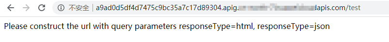

# 示例2：创建函数和APIG触发器获取静态页面<a name="ZH-CN_TOPIC_0251707989"></a>

## 场景描述<a name="section11773144817815"></a>

本章节以Python 2.7为例，指导您通过API创建FunctionGraph函数和APIG触发器，并且通过APIG触发器调用API，获取静态页面。

API的调用方法请参见[如何调用API](如何调用API.md)。

## 前提条件<a name="section1835181812285"></a>

已在API网关服务中创建API分组，并记录API分组的ID和分配的子域名。

## 总体思路<a name="section780392783814"></a>

创建FunctionGraph函数和APIG触发器，并且通过APIG触发器触发API获取静态页面，步骤如下：

1.  [创建函数](创建函数.md)：创建一个返回的静态页面函数。
2.  [创建触发器](创建触发器.md)：创建APIG触发器。
3.  通过APIG触发器调用API，获取静态页面。

## 步骤1：创建一个返回的静态页面函数<a name="section5121646125111"></a>

URI：POST /v2/\{project\_id\}/fgs/functions

API文档详情请参见：[创建函数](创建函数.md)

-   请求示例

    ```
    POST  https://{Endpoint}/v2/{project_id}/fgs/functions
    {
     "code_filename": "index.zip",
     "code_type": "inline",
     "func_code": {
      "file": "UEsDBAoAAAAIABY7vFD7lxPkAgMAALoHAAAIAAAAaW5kZXgucHndVdtu00AQfc9XrMKDExQ7zqW50VYqFZRKIFUQhFBVobU9iU1tr9mdbRKqSHwNH8aXMLtxrgoS8ISIosg7c+bszNnjzRPmPnVZKKIkn440TtyBCVQcx6mMY2ATkaZiRjmWKMZzdnFzfcXgAXJkYsI4UzwrUoLpPMRE5B77KDQLCYigkGFMVescCxZMQQq0IDokcl4kruVyEYiGI5TU66VXqTxWGKvGiMUbwFhE1RGrXr0YVxsmXHCMTaBpNmvGQK1uEzdc8gwQpCKIYTFxKeYLU7HCUnBp8V80yMU7lNTYsbKcIqaKfjclMfBoDzR3FfKpxZl2bCMUfiXomWIz7GU5tNXw3oM5hBrBpfE9rdwZod22xzP+VeR8prxQZOvq9wqkezElTQxHqrkrCb1wjSBN32v5rPZa8zrLp/NPlG22fN8fbJsMRGTH/fHtO31X2kigaRVeihxhjtv+j3Zfgq+t7lHU7XT6nV479NthP+r328Mh9Af9QSuAoBu01kU016qg2wq6J8A7bt8PTtxWC3pu0A8itzcMTjiHgEiGZbNL67gkK4QkZ6n102cl8vVzwBX0upVKBBMW8zxKQdasXRpkXztMfWQbKOgckTl02CEoxcoZ2ESKzFiOvCeT6RSkU7FwlItVnfmQvIXIFYwXBbCzlR1vnaP+cO5unV24c2dZYB5Cgb9kdKh9rlMsN08mBwBCxJilzpbALN+WGCJ43CTMx6FjQ60uRQTOiLV9v7GfTtRzK9uLnF5xiAgzlhoOQKWXndEBuT1NaxTzilJ7K3vM6V2jnp6xMOZSAZ7Za6O6V7o82MI4kfhXZ+gFvS7YhmrOqaE6P41b5x8gJecDQ8E0TfqyvDauJC/i0yYBTu225059y73ckRm1zK1hvEhnhart6lZfqQ3pMb1NzY7eZvkP6c2LIk1CbqRomtb+UufH6j3Yu+CBpxqqy99VcVeNjYoKtnKVfv7fHXqTAmXMTaNQ6hDtH5iWKZslGDN7QbBiczfsmezMEDT2Q0bWP/TzgdD1n1BLAQIeAwoAAAAIABY7vFD7lxPkAgMAALoHAAAIAAAAAAAAAAAAAADzAgAAAABpbmRleC5weVBLBQYAAAAAAQABADYAAAAoAwAAAAA="
     },
     "func_name": "get_html",
     "handler": "index.handler",
     "memory_size": 256,
     "package": "default",
     "runtime": "Python2.7",
     "timeout": 5
    }
    ```

-   响应示例

    ```
    {
     "func_urn": "urn:fss:{project_name}:{project_id}:function:default:get_html:latest",
     "func_name": "get_html",
     "domain_id": "89fexxxd636",
     "namespace": "{project_id}",
     "project_name": "xxx",
     "package": "default",
     "runtime": "Python2.7",
     "timeout": 5,
     "handler": "index.handler",
     "memory_size": 256,
     "cpu": 400,
     "code_type": "inline",
     "code_filename": "index.zip",
     "code_size": 884,
     "digest": "b08fef5e97dd130037978db07f0e9109aa43a191517cd1196bcab822f17dddcf37f7506a15691177962f9803ba6d170a1c87aafb4fa1b9f0d07f9415642b26d2",
     "version": "latest",
     "image_name": "latest-200604105808@we0qo",
     "last_modified": "2020-06-04T10:58:08+08:00",
     "strategy_config": {
      "concurrency": -1
     },
     "StrategyConfig": {},
     "enterprise_project_id": "0"
    }
    ```

    记录函数的URN，即响应示例中的“func\_urn”信息。


## 步骤2：创建APIG触发器<a name="section117522481318"></a>

URI：POST /v2/\{project\_id\}/fgs/triggers/\{function\_urn\}

API文档详情请参见：[创建触发器](创建触发器.md)

-   请求示例

    ```
    POST  https://{Endpoint}/v2/{project_id}/fgs/triggers/{function_urn}
    {
     "event_data": {
      "group_id": "a9ad0d5df4d7475c9bc35a7c17d89304",
      "env_id": "DEFAULT_ENVIRONMENT_RELEASE_ID",
      "auth": "NONE",
      "protocol": "HTTP",
      "name": "API_GetHtml",
      "path": "/test",
      "match_mode": "SWA",
      "req_method": "ANY",
      "backend_type": "FUNCTION",
      "sl_domain": "a9ad0d5df4d7475c9bc35a7c17d89304.apig.xxx.xxxapis.com",
      "type": 1,
      "env_name": "RELEASE"
     },
     "event_type_code": "APICreated",
     "trigger_status": "ACTIVE",
     "trigger_type_code": "APIG"
    }
    ```

    function\_urn为[步骤1：创建一个返回的静态页面函数](#section5121646125111)中记录的函数URN，group\_id为API分组的ID，sl\_domain为APIG给API分组分配的子域名。

-   响应示例

    ```
    {
     "trigger_id": "1b3ec74b86454aa39001a9f89cc70ee2",
     "trigger_type_code": "APIG",
     "trigger_status": "ACTIVE",
     "event_data": {
      "api_id": "cbc698153d1f4265bdd8384b5cf6e581",
      "api_name": "API_GetHtml",
      "auth": "NONE",
      "env_id": "",
      "env_name": "",
      "func_info": {
       "function_urn": "urn:fss:{project_name}:{project_id}:function:default:get_html",
       "invocation_type": "sync",
       "timeout": 5000,
       "version": "latest"
      },
      "group_id": "a9ad0d5df4d7475c9bc35a7c17d89304",
      "group_name": "APIGroup_gethtml",
      "invoke_url": "http://a9ad0d5df4d7475c9bc35a7c17d89304.apig.xxx.xxxapis.com/test",
      "match_mode": "SWA",
      "name": "API_GetHtml",
      "path": "/test",
      "protocol": "HTTP",
      "req_method": "ANY",
      "triggerid": "1b3ec74b86454aa39001a9f89cc70ee2",
      "type": 1
     },
     "last_updated_time": "2020-06-04T17:14:32+08:00",
     "created_time": "2020-06-04T17:14:32+08:00"
    }
    ```

    记录“invoke\_url”的值。


## 步骤3：通过APIG触发器调用API，获取静态页面<a name="section1540622851115"></a>

在浏览器输入“invoke\_url”的值，调用API，获取静态页面。

**图 1**  调用API<a name="fig19568175732310"></a>  


