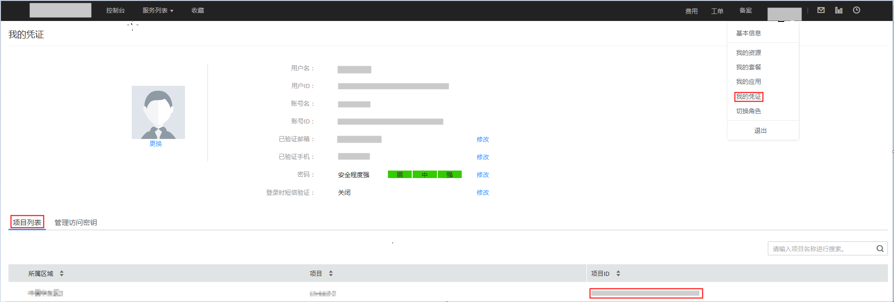

# 获取项目编号

在调用接口的时候，部分URL中需要填入项目编号（project\_id或者tenant\_id，本文中project\_id和tenant\_id含义一样），所以需要先在管理控制台上获取到项目编号。项目编号获取步骤如下：

1.  注册并登录管理控制台。
2.  单击用户名，在下拉列表中单击“我的凭证”，查看项目ID。

    **图 1**  查看项目ID  
    

