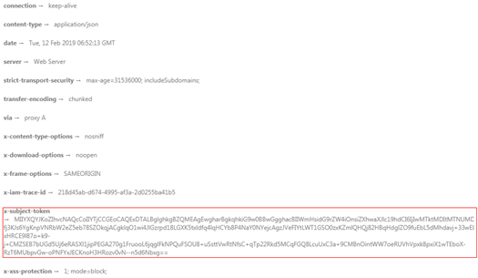

# 返回结果<a name="ZH-CN_TOPIC_0115410439"></a>

## 状态码<a name="section107916468177"></a>

请求发送以后，您会收到响应，包含状态码、响应消息头和消息体。

状态码是一组从1xx到5xx的数字代码，状态码表示了请求响应的状态，完整的状态码列表请参见[状态码](状态码.md)。

对于[获取用户Token](https://support.huaweicloud.com/api-iam/iam_30_0001.html)接口，如果调用后返回状态码为“201”，则表示请求成功。

## 响应消息头<a name="section379914611710"></a>

对应请求消息头，响应同样也有消息头，如“Content-type”。

对于[获取用户Token](https://support.huaweicloud.com/api-iam/iam_30_0001.html)接口，返回如[图1](#fig1999718469177)所示的消息头，其中“x-subject-token”就是需要获取的用户Token。有了Token之后，您就可以使用Token认证调用其他API。

**图 1**  获取用户Token响应消息头<a name="fig1999718469177"></a>  


## 响应消息体<a name="section7817946101717"></a>

响应消息体通常以结构化格式返回，与响应消息头中Content-type对应，传递除响应消息头之外的内容。

对于[获取用户Token](https://support.huaweicloud.com/api-iam/iam_30_0001.html)接口，返回如下消息体。为篇幅起见，这里只展示部分内容。

```
{ 
    "token": { 
        "expires_at": "2019-02-13T06:52:13.855000Z", 
        "methods": [ 
            "password" 
        ], 
        "catalog": [ 
            { 
                "endpoints": [ 
                    { 
                        "region_id": "XXXXXXXX", 
......

```

当接口调用出错时，会返回错误码及错误信息说明，错误响应的Body体格式如下所示。

```
{
  "error_code": "FGS.0111",
  "error_msg": "xxxxxxxxx"
} 
```

其中，error\_code表示错误码，error\_msg表示错误描述信息。

