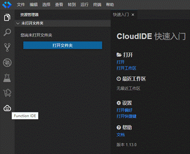

# CloudIDE在线管理函数

用户通过CloudIDE在线管理函数，调试方便，界面友好，帮忙用户快速创建函数。CloudIDE工具支持以下功能：

1.  用户在FunctionGraph控制台创建函数后，将函数下载到CloudIDE在线进行编辑，编辑完成后，再将修改好的函数推送到FunctionGraph控制台。
2.  用户在CloudIDE创建函数并完成编辑，再将函数推送到FunctionGraph控制台。

> **说明：** 
>-   该功能当前仅“西南-贵阳一”和“华北-北京四”区域支持。
>-   当前仅Node.js语言支持CloudIDE在线管理函数。

## 前提条件

1.  已经在FunctionGraph控制台创建函数，创建过程请参见[创建并初始化函数](https://support.huaweicloud.com/usermanual-functiongraph/functiongraph_01_0201.html)。

## 操作方法1

用户在FunctionGraph控制台创建函数后，将函数下载到CloudIDE在线进行编辑，编辑完成后，再将修改好的函数推送到FunctionGraph控制台。

1.  登录FunctionGraph控制台，在左侧导航栏选择“函数 \> 函数列表”。
2.  支持两种打开方式，根据实际情况选择：
    1.  创建函数完成后，在“代码”页签，单击“在CloudIDE中打开”或者直接在线编辑。

        **图 1**  在CloudIDE中打开或直接在线编辑  
        

    2.  函数创建完成后，在对应函数列表的“操作”列，单击“在CloudIDE中打开”。

        **图 2**  在CloudIDE中打开  
        

3.  在新打开的“选择实例”页面，单击“新建实例”。

    **图 3**  新建实例  
    

4.  输入实例名称，单击“确定”。

    **图 4**  输入实例名称  
    

5.  进入CloudIDE在线编辑页面。

    > **说明：** 
    >首次进入CloudIDE在线编辑页面，提示选择切换为中文语言。

6.  在编辑页面左侧导航栏单击Function IDE插件后，左侧编辑框中的REMOTE FUNCTION文件中即可看到在FunctionGraph控制台创建好的所有函数和应用。

    > **说明：** 
    >选择从哪个函数进入CloudIDE在线编辑页面的，在LOCAL FUNCTION文件就会显示该函数。

    **图 5**  单击Function IDE插件  
    

    **图 6**  查看函数及应用  
    

7.  在LOCAL FUNCTION文件中，右键选择打开文件，即可在右侧编辑框调试函数。

    **图 7**  在编辑框调试函数  
    

8.  或者在REMOTE FUNCTION文件中添加需要编辑的函数，并下载到CloudIDE进行在线编辑。

    > **说明：** 
    >以下示例仅供参考，具体请以实际创建函数为准。

    **图 8**  下载需要编辑的函数  
    

9.  下载成功后，右侧输出控制台提示下载成功。

    **图 9**  下载成功提示  
    

10. 进行函数调试。

    **图 10**  进行函数调试  
    

11. 进入函数调试页面，选择测试事件，点击“调试”。

    > **说明：** 
    >配置测试事件和测试函数请参考[测试管理](测试管理.md)。

    **图 11**  选择测试事件进行调试  
    

12. 修改函数代码后，将函数推送至FunctionGraph控制台。

    **图 12**  推送函数至FunctionGraph控制台  
    

13. 页面下方输出控制台提示推送成功。

    **图 13**  输出控制台提示推送成功  
    

14. 返回FunctionGraph控制台，查看函数，确认已合入修改的内容。

    **图 14**  确认合入内容  
    

## 操作方法2

用户在CloudIDE本地创建函数并完成编辑，再将函数推送到FunctionGraph控制台。以下示例仅供参考，具体请以实际创建函数为准。

1.  在CloudIDE编辑框的LOCAL FUNCTION打开创建函数。

    **图 15**  打开创建函数  
    

2.  选择模板，创建函数。

    **图 16**  选择模板进行函数创建  
    

3.  例如选择空模板创建，填写参数，选择文件夹只能选“home/functio/user”，单击“创建函数”。

    **图 17**  示例选择  
    

4.  创建成功后，左侧编辑框即可看到刚创建的函数。

    **图 18**  查看已创建的函数  
    

5.  编辑函数完成后，右键选择推送函数，将函数推送至FunctionGraph控制台。
6.  返回FunctionGraph控制台，查看函数，确认已合入修改的内容。

    **图 19**  确认已合入修改的内容  
    

