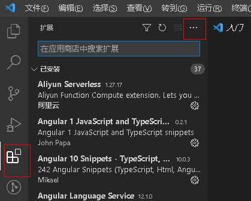
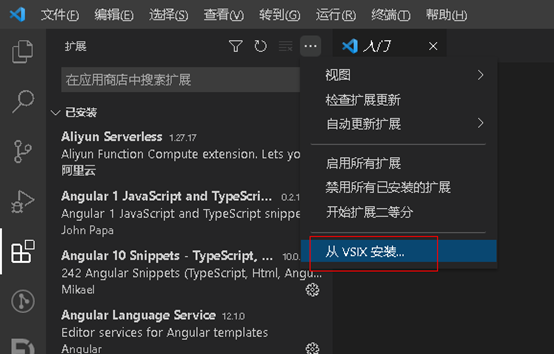
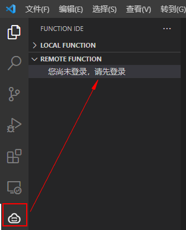

# CloudIDE本地管理函数

支持用户在本地通过Visual Studio Code工具管理函数，例如创建函数，再将函数推送到FunctionGraph控制台，或者将函数从FunctionGraph控制台下载到本地进行编辑。

> **说明：** 
>该功能当前仅“西南-贵阳一”和“华北-北京四”区域支持。

## 前提条件

下载[Visual Studio Code](https://function-community.obs.cn-north-1.myhuaweicloud.com/sdk/function-0.0.1.vsix)并安装。

## 操作步骤

1.  安装Visual Studio Code开发工具。
2.  打开Visual Studio Code工具，选择左侧导航栏的扩展功能。

    **图 1**  选择扩展功能  
    

3.  单击扩展面板右侧的“...”，选择从VSIX安装，在打开的页面中，导入准备好的Function IDE插件。

    **图 2**  从VSIX安装  
    

4.  安装成功后，在左侧导航栏看到Function IDE插件。
5.  单击Function IDE插件，使用华为云账号登录，根据页面提示输入帐号信息，选择region。

    > **说明：** 
    >该功能当前仅“西南-贵阳一”和“华北-北京四”区域支持。

    **图 3**  登陆帐号  
    

6.  登录成功后，左侧编辑框中的REMOTE FUNCTION文件中即可看到在FunctionGraph控制台创建好的所有函数和应用。

    > **说明：** 
    >在Visual Studio Code工具本地管理函数的方法与在线管理函数方法一样，详细操作方法请参考[CloudIDE在线管理函数](CloudIDE在线管理函数.md)。

