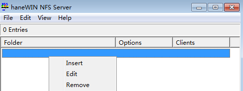

# ECS创建nfs共享目录<a name="ZH-CN_TOPIC_0183840069"></a>

## Linux系统<a name="section12684134534"></a>

-   CentOS、SUSE、Euler OS、Fedora或OpenSUSE等系统
    1.  使用如下命令安装nfs-utils

        ```
        yum install nfs-utils
        ```

    2.  设置共享文件夹

        打开/etc/exports，比如要把/sharedata目录设置为共享目录，可以填入如下内容：

        /sharedata  192.168.0.0/24\(rw,sync,no\_root\_squash\)

        > **说明：** 
        >上述内容的含义是：把/sharedata这个目录共享给192.168.0.0/24这个子网段的其他服务器。

    3.  使用如下命令启动nfs server

        ```
        systemctl start rpcbind
        service nfs start
        ```

    4.  修改共享目录

        比如需要新增/home/myself/download到共享目录，可以在/etc/exports中新增如下内容。

        /home/myself/download  192.168.0.0/24\(rw,sync,no\_root\_squash\)

        然后重启nfs服务。

        ```
        service nfs restart
        ```

        或者用如下命令，无需重启nfs服务。

        ```
        exportfs -rv
        ```

    5.  设置rpcbind开机启动（可选）

        如果需要设置rpcbind服务开机启动，可执行如下命令。

        ```
        systemctl enable rpcbind
        ```


-   Ubuntu系统
    1.  使用如下命令安装nfs-kernel-server

        ```
        sudo apt-get update
        sudo apt install nfs-kernel-server
        ```

    2.  设置共享文件夹

        打开/etc/exports，比如要把/sharedata目录设置为共享目录，可以填入如下内容。

        /sharedata  192.168.0.0/24\(rw,sync,no\_root\_squash\)

        > **说明：** 
        >上述内容的含义是：把/sharedata这个目录共享给192.168.0.0/24这个子网段的其他服务器。

    3.  启动nfs服务

        ```
        service nfs-kernel-server restart
        ```

    4.  修改共享目录

        比如需要新增/home/myself/download到共享目录，可以在/etc/exports中新增如下内容：

        /home/myself/download  192.168.0.0/24\(rw,sync,no\_root\_squash\)

        然后重启nfs服务

        ```
        service nfs restart
        ```

        或者用如下命令，无需重启nfs服务：

        ```
        exportfs -rv
        ```


## Windows系统<a name="section7177174215319"></a>

1.  安装nfs server软件

    目前可用的收费软件有：hanewin nfs server，可到对应官网下载。

    免费的有：FreeNFS、winnfsd等，可到sourceforge上下载。

2.  打开nfs功能
    -   如果是winnfsd，可参考：[https://github.com/winnfsd/winnfsd](https://github.com/winnfsd/winnfsd)。
    -   如果是hanewin nfs server，可以参考如下步骤。
        1.  以管理员身份运行nfsctl.exe
        2.  在空白处右键，然后Insert，完成设置

            **图 1**  Insert<a name="fig2013045445112"></a>  
            


