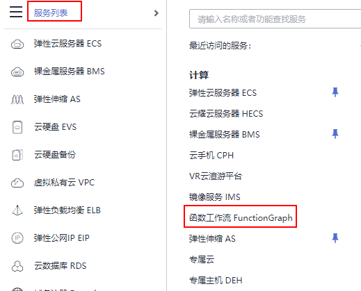
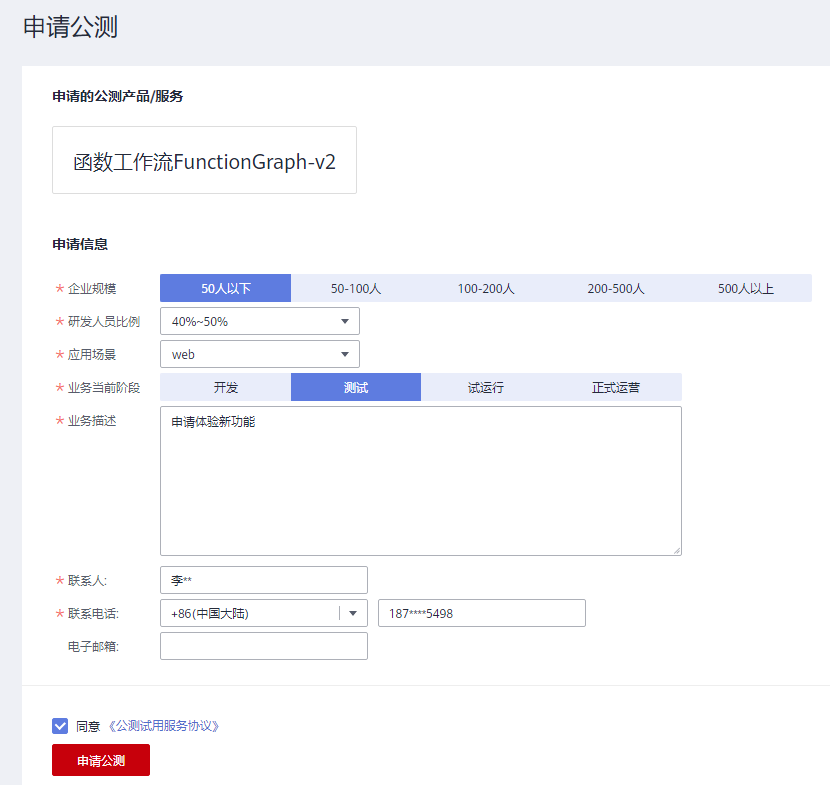

# FunctionGraph2.0申请公测

FunctionGraph2.0版本公测阶段，新增函数流、CloudIDE在线编辑函数、开通云日志服务（LTS）、加密配置、超长运行函数、单函数实例支持多并发等新功能。**当前仅“西南-贵阳一”和“华北-北京四”区域支持申请公测。**

> **说明：** 
>公测期间免费使用FunctionGraph2.0函数，2021-10-30截止公测。

## 申请步骤

1.  请[注册华为云帐号](https://support.huaweicloud.com/usermanual-account/account_id_001.html)并完成[实名认证](https://support.huaweicloud.com/usermanual-account/zh-cn_topic_0071343161.html)。
2.  登录华为云管理控制台。
3.  选择“服务列表 \> 计算 \> 函数工作流 FunctionGraph”进入函数服务控制台。

    **图 1**  进入控制台  
    

4.  在函数服务控制台，页面顶端选择“**西南-贵阳一**”或和“**华北-北京四**”区域，进入申请公测页面。
5.  单击“立即申请”。

    **图 2**  立即申请页面  
    

6.  在申请公测页面，根据页面提示，填写信息完成后，勾选同意“公测试用服务协议”。

    **图 3**  申请公测页面  
    

7.  单击“申请公测”，弹出页面提示提交成功。

    **图 4**  提交成功  
    

8.  单击“前往我的公测”页面，查看申请记录。

    **图 5**  查看申请记录  
    

9.  审批通过后，即可在操作列单击“前往控制台”。

    **图 6**  审批通过  
    

10. 进入创建函数页面，如何创建函数请参见[创建并初始化函数](创建并初始化函数.md)。

    > **说明：** 
    >新增函数流编排功能，请参见[函数流管理](函数流管理.md)。

11. 函数创建成功后，支持CloudIDE在线编辑函数，详细请参见[使用CloudIDE管理函数](使用CloudIDE管理函数.md)。

