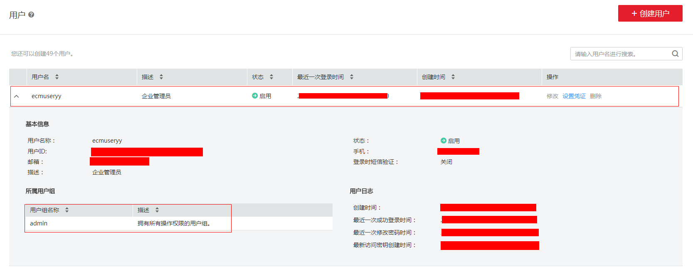
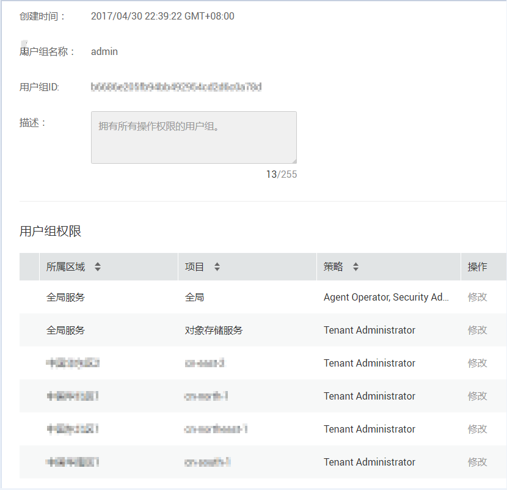
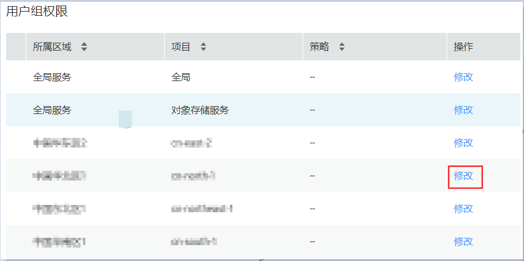
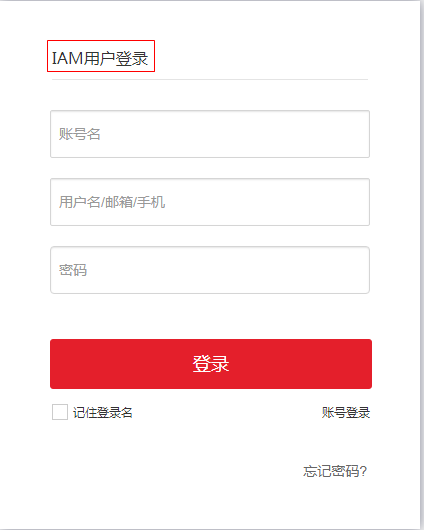

# FunctionGraph权限说明

## 帐户和子用户

用户在注册华为云帐户后，进入"统一身份认证服务\>用户"界面，在帐户下创建用户，通过给用户组分配权限，设置用户所属用户组实现权限控制，如[图1](#fig11364911163819)所示。

**图 1**  权限控制  

## 用户组权限说明

注册华为云帐户后，系统会自动生成admin用户组，进入"统一身份认证服务\>用户"界面，如[图2](#fig490852310713)所示。admin用户组具有所有区域所有服务的管理员权限，并且具有用户管理的权限，如[图3](#fig1119213115214)所示。

**图 2**  管理员  

**图 3**  admin用户组  

除了admin用户组，登录账号进入"统一身份认证服务\>用户"界面，新建用户组，选择所属区域，修改权限集，如[图4](#fig17218162671016)所示。权限集说明如[表1](#table105311228172114)所示。

**图 4**  修改用户组权限  

**表 1**  权限集说明

<table><thead align="left"><tr id="row17532152812118"><th class="cellrowborder" valign="top" width="33.333333333333336%" id="mcps1.2.4.1.1">
所属云服务

</th>
<th class="cellrowborder" valign="top" width="33.333333333333336%" id="mcps1.2.4.1.2">
权限集

</th>
<th class="cellrowborder" valign="top" width="33.333333333333336%" id="mcps1.2.4.1.3">
权限集描述

</th>
</tr>
</thead>
<tbody><tr id="row953322810211"><td class="cellrowborder" valign="top" width="33.333333333333336%" headers="mcps1.2.4.1.1 ">
FGS

</td>
<td class="cellrowborder" valign="top" width="33.333333333333336%" headers="mcps1.2.4.1.2 ">
FunctionGraph Administrator

</td>
<td class="cellrowborder" valign="top" width="33.333333333333336%" headers="mcps1.2.4.1.3 ">
可以控制函数、工作流和触发器的管理（增删改查）和触发。

</td>
</tr>
<tr id="row45342028102113"><td class="cellrowborder" valign="top" width="33.333333333333336%" headers="mcps1.2.4.1.1 ">
FGS

</td>
<td class="cellrowborder" valign="top" width="33.333333333333336%" headers="mcps1.2.4.1.2 ">
FunctionGraph Invoker

</td>
<td class="cellrowborder" valign="top" width="33.333333333333336%" headers="mcps1.2.4.1.3 ">
可以控制函数、工作流和触发器的查询，以及函数和工作流的触发。

</td>
</tr>
<tr id="row153515284217"><td class="cellrowborder" valign="top" width="33.333333333333336%" headers="mcps1.2.4.1.1 ">
基本

</td>
<td class="cellrowborder" valign="top" width="33.333333333333336%" headers="mcps1.2.4.1.2 ">
Tenant Administrator

</td>
<td class="cellrowborder" valign="top" width="33.333333333333336%" headers="mcps1.2.4.1.3 ">
具备该区域内所有服务的管理员权限。

</td>
</tr>
<tr id="row15536102822114"><td class="cellrowborder" valign="top" width="33.333333333333336%" headers="mcps1.2.4.1.1 ">
基本

</td>
<td class="cellrowborder" valign="top" width="33.333333333333336%" headers="mcps1.2.4.1.2 ">
Server Administrator

</td>
<td class="cellrowborder" valign="top" width="33.333333333333336%" headers="mcps1.2.4.1.3 ">
具备该区域内所有Server服务（ECS、EVS、VPC）的管理员权限。

</td>
</tr>
<tr id="row95371528102116"><td class="cellrowborder" valign="top" width="33.333333333333336%" headers="mcps1.2.4.1.1 ">
基本

</td>
<td class="cellrowborder" valign="top" width="33.333333333333336%" headers="mcps1.2.4.1.2 ">
Tenant Guest

</td>
<td class="cellrowborder" valign="top" width="33.333333333333336%" headers="mcps1.2.4.1.3 ">
具备该区域内所有服务的查看权限。

</td>
</tr>
</tbody>
</table>

## 操作权限矩阵

**函数操作权限**

函数操作权限如[表2](#table2979182216211)所示。

**表 2**  函数操作权限

<table><thead align="left"><tr id="row1798013220215"><th class="cellrowborder" valign="top" width="20%" id="mcps1.2.6.1.1">
操作

</th>
<th class="cellrowborder" valign="top" width="20%" id="mcps1.2.6.1.2">
本区域Tenant Administrator

</th>
<th class="cellrowborder" valign="top" width="20%" id="mcps1.2.6.1.3">
本区域FunctionGraph Administrator

</th>
<th class="cellrowborder" valign="top" width="20%" id="mcps1.2.6.1.4">
本区域FunctionGraph Invoker

</th>
<th class="cellrowborder" valign="top" width="20%" id="mcps1.2.6.1.5">
本区域Tenant Guest

</th>
</tr>
</thead>
<tbody><tr id="row89801522192116"><td class="cellrowborder" valign="top" width="20%" headers="mcps1.2.6.1.1 ">
创建函数

</td>
<td class="cellrowborder" valign="top" width="20%" headers="mcps1.2.6.1.2 ">
√

</td>
<td class="cellrowborder" valign="top" width="20%" headers="mcps1.2.6.1.3 ">
√

</td>
<td class="cellrowborder" valign="top" width="20%" headers="mcps1.2.6.1.4 ">
×

</td>
<td class="cellrowborder" valign="top" width="20%" headers="mcps1.2.6.1.5 ">
×

</td>
</tr>
<tr id="row1798018225216"><td class="cellrowborder" valign="top" width="20%" headers="mcps1.2.6.1.1 ">
查询函数

</td>
<td class="cellrowborder" valign="top" width="20%" headers="mcps1.2.6.1.2 ">
√

</td>
<td class="cellrowborder" valign="top" width="20%" headers="mcps1.2.6.1.3 ">
√

</td>
<td class="cellrowborder" valign="top" width="20%" headers="mcps1.2.6.1.4 ">
√

</td>
<td class="cellrowborder" valign="top" width="20%" headers="mcps1.2.6.1.5 ">
√

</td>
</tr>
<tr id="row13980132252113"><td class="cellrowborder" valign="top" width="20%" headers="mcps1.2.6.1.1 ">
修改函数

</td>
<td class="cellrowborder" valign="top" width="20%" headers="mcps1.2.6.1.2 ">
√

</td>
<td class="cellrowborder" valign="top" width="20%" headers="mcps1.2.6.1.3 ">
√

</td>
<td class="cellrowborder" valign="top" width="20%" headers="mcps1.2.6.1.4 ">
×

</td>
<td class="cellrowborder" valign="top" width="20%" headers="mcps1.2.6.1.5 ">
×

</td>
</tr>
<tr id="row398032262112"><td class="cellrowborder" valign="top" width="20%" headers="mcps1.2.6.1.1 ">
删除函数

</td>
<td class="cellrowborder" valign="top" width="20%" headers="mcps1.2.6.1.2 ">
√

</td>
<td class="cellrowborder" valign="top" width="20%" headers="mcps1.2.6.1.3 ">
√

</td>
<td class="cellrowborder" valign="top" width="20%" headers="mcps1.2.6.1.4 ">
×

</td>
<td class="cellrowborder" valign="top" width="20%" headers="mcps1.2.6.1.5 ">
×

</td>
</tr>
<tr id="row198110220215"><td class="cellrowborder" valign="top" width="20%" headers="mcps1.2.6.1.1 ">
调用函数

</td>
<td class="cellrowborder" valign="top" width="20%" headers="mcps1.2.6.1.2 ">
√

</td>
<td class="cellrowborder" valign="top" width="20%" headers="mcps1.2.6.1.3 ">
√

</td>
<td class="cellrowborder" valign="top" width="20%" headers="mcps1.2.6.1.4 ">
√

</td>
<td class="cellrowborder" valign="top" width="20%" headers="mcps1.2.6.1.5 ">
×

</td>
</tr>
<tr id="row11981122242119"><td class="cellrowborder" valign="top" width="20%" headers="mcps1.2.6.1.1 ">
查看函数日志

</td>
<td class="cellrowborder" valign="top" width="20%" headers="mcps1.2.6.1.2 ">
√

</td>
<td class="cellrowborder" valign="top" width="20%" headers="mcps1.2.6.1.3 ">
×

</td>
<td class="cellrowborder" valign="top" width="20%" headers="mcps1.2.6.1.4 ">
×

</td>
<td class="cellrowborder" valign="top" width="20%" headers="mcps1.2.6.1.5 ">
√

</td>
</tr>
<tr id="row12981102212214"><td class="cellrowborder" valign="top" width="20%" headers="mcps1.2.6.1.1 ">
查看函数指标数据

</td>
<td class="cellrowborder" valign="top" width="20%" headers="mcps1.2.6.1.2 ">
√

</td>
<td class="cellrowborder" valign="top" width="20%" headers="mcps1.2.6.1.3 ">
×

</td>
<td class="cellrowborder" valign="top" width="20%" headers="mcps1.2.6.1.4 ">
×

</td>
<td class="cellrowborder" valign="top" width="20%" headers="mcps1.2.6.1.5 ">
√

</td>
</tr>
</tbody>
</table>

> **说明：**   
>-   “√”：子用户被赋予此权限可执行对应操作。  
>-   “×”：子用户被赋予此权限不可执行对应操作。  

**触发器使用权限**

-   DMS触发器
    1.  租户或拥有本区域Tenant Guest及以上权限的子用户。
    2.  创建委托（需要租户或者拥有“全局服务\>全局\>Security Administrator”权限的子用户），委托FunctionGraph访问DMS服务并配置到函数的委托配置中。

-   DIS触发器
    1.  租户或拥有本区域DIS Administrator及以上权限的子用户。
    2.  创建委托（需要租户或者拥有“全局服务\>全局\>Security Administrator”权限的子用户），委托FunctionGraph访问DIS服务并配置到函数的委托配置中。

-   OBS触发器

    租户或拥有“全局服务\>对象存储服务\>OBS Administrator”权限的子用户。

-   SMN触发器

    租户或拥有本区域SMN Administrator及以上权限的子用户。

-   APIG触发器

    租户或拥有本区域Tenant Administrator权限的子用户。

-   定时触发器

    租户或拥有本区域Tenant Administrator权限的子用户。

## 用户登录

帐户登录界面如[图5](#fig1131013254515)所示。需要输入帐户名和密码。

**图 5**  帐户登录  

子帐户登录界面如[图6](#fig99416427518)所示。需要输入帐户名、用户名和密码。

**图 6**  IAM用户登录  

