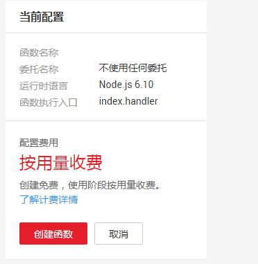

# 代码上传方式创建HelloWorld函数<a name="functiongraph_01_0201"></a>

本节以HelloWorld函数为例，介绍函数的创建及测试过程。

## 创建函数<a name="section88018534613"></a>

1.  登录FunctionGraph，进入“函数”界面。
2.  在“函数”界面，选择“函数列表”，单击“创建函数”，进入“创建函数”界面。
3.  在“创建方式“栏选择“代码上传“。
4.  在“创建函数”界面填写函数信息。
    1.  填写基础配置信息，如[表1](#table46600572105838)所示，带\*参数为必填项。

        **表 1**  函数基础配置信息表

        <a name="table46600572105838"></a>
        <table><thead align="left"><tr id="row2549532105838"><th class="cellrowborder" valign="top" width="50%" id="mcps1.2.3.1.1"><p id="p64741929105852"><a name="p64741929105852"></a><a name="p64741929105852"></a>参数</p>
        </th>
        <th class="cellrowborder" valign="top" width="50%" id="mcps1.2.3.1.2"><p id="p9604890105852"><a name="p9604890105852"></a><a name="p9604890105852"></a>说明</p>
        </th>
        </tr>
        </thead>
        <tbody><tr id="row2253408115491"><td class="cellrowborder" valign="top" width="50%" headers="mcps1.2.3.1.1 "><p id="p148014315491"><a name="p148014315491"></a><a name="p148014315491"></a>模板</p>
        </td>
        <td class="cellrowborder" valign="top" width="50%" headers="mcps1.2.3.1.2 "><p id="p147674710023"><a name="p147674710023"></a><a name="p147674710023"></a>本例使用空白模板。</p>
        <p id="p5278279215491"><a name="p5278279215491"></a><a name="p5278279215491"></a>如果使用已有模板，请参考<a href="使用函数模板.md">使用函数模板</a>。</p>
        </td>
        </tr>
        <tr id="row65180644105838"><td class="cellrowborder" valign="top" width="50%" headers="mcps1.2.3.1.1 "><p id="p2460416105852"><a name="p2460416105852"></a><a name="p2460416105852"></a>*函数名称</p>
        </td>
        <td class="cellrowborder" valign="top" width="50%" headers="mcps1.2.3.1.2 "><p id="p60539047162350"><a name="p60539047162350"></a><a name="p60539047162350"></a>函数名称，命名规则如下：</p>
        <a name="ul38620597162358"></a><a name="ul38620597162358"></a><ul id="ul38620597162358"><li>可包含字母、数字、下划线和中划线，长度不超过60个字符。</li><li>以大/小写字母开头，以字母或数字结尾。</li></ul>
        <p id="p65076039105852"><a name="p65076039105852"></a><a name="p65076039105852"></a>输入HelloWorld。</p>
        </td>
        </tr>
        <tr id="row0169155411577"><td class="cellrowborder" valign="top" width="50%" headers="mcps1.2.3.1.1 "><p id="p3433337131414"><a name="p3433337131414"></a><a name="p3433337131414"></a>*所属应用</p>
        </td>
        <td class="cellrowborder" valign="top" width="50%" headers="mcps1.2.3.1.2 "><p id="p114331937191415"><a name="p114331937191415"></a><a name="p114331937191415"></a>用户创建函数时可以进行分组，每个函数应用下面可以创建多个函数，在函数创建时可以指定其归属于某个函数应用。命名规则如下：</p>
        <a name="ul519219971112"></a><a name="ul519219971112"></a><ul id="ul519219971112"><li>可包含字母、数字、下划线和中划线，长度不超过60个字符。</li><li>以大/小写字母开头，以字母或数字结尾。</li></ul>
        <p id="p31951981117"><a name="p31951981117"></a><a name="p31951981117"></a>选择默认的“default”应用。</p>
        </td>
        </tr>
        <tr id="row739856015520"><td class="cellrowborder" valign="top" width="50%" headers="mcps1.2.3.1.1 "><p id="p6415490615526"><a name="p6415490615526"></a><a name="p6415490615526"></a>委托名称</p>
        </td>
        <td class="cellrowborder" valign="top" width="50%" headers="mcps1.2.3.1.2 "><p id="p51977548155332"><a name="p51977548155332"></a><a name="p51977548155332"></a>用户委托函数工作流服务去访问其他的云服务，则需要提供权限委托，创建委托，请参考<a href="创建委托.md">创建委托</a>。</p>
        <p id="p2916491315526"><a name="p2916491315526"></a><a name="p2916491315526"></a>如果用户函数不访问任何云服务，则不用提供委托名称。</p>
        <p id="p6115763215526"><a name="p6115763215526"></a><a name="p6115763215526"></a>本例选择“不使用任何委托”。</p>
        </td>
        </tr>
        <tr id="row40639954185143"><td class="cellrowborder" valign="top" width="50%" headers="mcps1.2.3.1.1 "><p id="p45175680185150"><a name="p45175680185150"></a><a name="p45175680185150"></a>函数描述</p>
        </td>
        <td class="cellrowborder" valign="top" width="50%" headers="mcps1.2.3.1.2 "><p id="p35351426185150"><a name="p35351426185150"></a><a name="p35351426185150"></a>对函数的描述，不超过512个字符。输入test。</p>
        </td>
        </tr>
        </tbody>
        </table>

    2.  填写代码配置信息，如[表2](#table13867334105936)所示，带\*参数为必填项。

        **表 2**  函数代码配置信息表

        <a name="table13867334105936"></a>
        <table><thead align="left"><tr id="row42840307105936"><th class="cellrowborder" valign="top" width="50%" id="mcps1.2.3.1.1"><p id="p35537554105946"><a name="p35537554105946"></a><a name="p35537554105946"></a>参数</p>
        </th>
        <th class="cellrowborder" valign="top" width="50%" id="mcps1.2.3.1.2"><p id="p59969596105946"><a name="p59969596105946"></a><a name="p59969596105946"></a>说明</p>
        </th>
        </tr>
        </thead>
        <tbody><tr id="row11343074105936"><td class="cellrowborder" valign="top" width="50%" headers="mcps1.2.3.1.1 "><p id="p1251582105946"><a name="p1251582105946"></a><a name="p1251582105946"></a>运行时语言</p>
        </td>
        <td class="cellrowborder" valign="top" width="50%" headers="mcps1.2.3.1.2 "><p id="p6847085155413"><a name="p6847085155413"></a><a name="p6847085155413"></a>目前支持Python 2.7、Python 3.6、Node.js 6.10、Node.js 8.10、Java 8、Go 1.8、C#(.NET Core 2.0)、C#(.NET Core 2.1)。</p>
        <p id="p34269285105946"><a name="p34269285105946"></a><a name="p34269285105946"></a>本例选择“Node.js 6.10”。</p>
        </td>
        </tr>
        <tr id="row50739855105936"><td class="cellrowborder" valign="top" width="50%" headers="mcps1.2.3.1.1 "><p id="p17811905105946"><a name="p17811905105946"></a><a name="p17811905105946"></a>*函数执行入口</p>
        </td>
        <td class="cellrowborder" valign="top" width="50%" headers="mcps1.2.3.1.2 "><p id="p41173769162557"><a name="p41173769162557"></a><a name="p41173769162557"></a>对于Node.js函数，命名规则：[文件名].[函数名]，必须包含“. ”。</p>
        <p id="p33478175105946"><a name="p33478175105946"></a><a name="p33478175105946"></a>填写index.handler，表示函数的文件名为index.js，执行的入口函数名为handler。</p>
        </td>
        </tr>
        <tr id="row62480415105936"><td class="cellrowborder" valign="top" width="50%" headers="mcps1.2.3.1.1 "><p id="p45072001105946"><a name="p45072001105946"></a><a name="p45072001105946"></a>代码上传方式</p>
        </td>
        <td class="cellrowborder" valign="top" width="50%" headers="mcps1.2.3.1.2 "><p id="p26953455105946"><a name="p26953455105946"></a><a name="p26953455105946"></a>选择“在线编辑”。使用系统生成的样例代码。</p>
        </td>
        </tr>
        </tbody>
        </table>

        > **注意：**   
        >用python语言写代码时，自己创建的包名不能与python标准库同名，否组会提示module加载失败。例如”json“、“lib”，“os”等。  

        > **警告：**   
        >使用在线编辑代码时，系统会明文展示所有输入信息，请不要输入敏感信息（如账户密码等），以防止信息泄露。  

        > **说明：**   
        >样例代码实现的功能是：获取测试事件，打印测试事件信息，代码如下。  
        >```  
        >exports.handler = function (event, context, callback) {  
        >    const error = null;  
        >    const output = `Hello message: ${JSON.stringify(event)}`;  
        >    callback(error, output);  
        >}  
        >```  


5.  在页面右侧查看函数配置及计费信息，确认无误后，单击“创建函数”，完成函数创建。如[图1](#fig5778171761119)所示。

    **图 1**  创建函数<a name="fig5778171761119"></a>  
    

    > **说明：**   
    >函数创建成功后，函数内存配置为128MB，超时时间设置为3秒，如果需要修改配置，请参考[修改函数配置](函数管理.md#section1560314348363)。  


## 测试函数<a name="section72232178461"></a>

1.  登录FunctionGraph，进入“函数”界面。
2.  在“函数”界面，选择“函数列表”，单击HelloWorld函数名称，进入函数详情页。
3.  在HelloWorld函数详情页，选择函数版本，单击“请选择测试事件\>配置测试事件”，如[图2](#fig112033514369)所示，弹出“配置测试事件”页。

    **图 2**  配置函数测试事件<a name="fig112033514369"></a>  
    

4.  在“配置测试事件”界面填写如[表3](#table187784018405)所示测试信息后单击“保存”，带\*参数为必填项。

    **表 3**  测试信息

    <a name="table187784018405"></a>
    <table><thead align="left"><tr id="row3778200154019"><th class="cellrowborder" valign="top" width="28.000000000000004%" id="mcps1.2.3.1.1"><p id="p87782008402"><a name="p87782008402"></a><a name="p87782008402"></a>参数</p>
    </th>
    <th class="cellrowborder" valign="top" width="72%" id="mcps1.2.3.1.2"><p id="p15786100114015"><a name="p15786100114015"></a><a name="p15786100114015"></a>说明</p>
    </th>
    </tr>
    </thead>
    <tbody><tr id="row578616044017"><td class="cellrowborder" valign="top" width="28.000000000000004%" headers="mcps1.2.3.1.1 "><p id="p1078618012405"><a name="p1078618012405"></a><a name="p1078618012405"></a>配置测试事件</p>
    </td>
    <td class="cellrowborder" valign="top" width="72%" headers="mcps1.2.3.1.2 "><p id="p147869004017"><a name="p147869004017"></a><a name="p147869004017"></a>可创建新的测试事件也可编辑已有的测试事件。</p>
    <p id="p1447113114443"><a name="p1447113114443"></a><a name="p1447113114443"></a>选择默认值：“创建新的测试事件”。</p>
    </td>
    </tr>
    <tr id="row2786110174012"><td class="cellrowborder" valign="top" width="28.000000000000004%" headers="mcps1.2.3.1.1 "><p id="p9786190134013"><a name="p9786190134013"></a><a name="p9786190134013"></a>事件模板</p>
    </td>
    <td class="cellrowborder" valign="top" width="72%" headers="mcps1.2.3.1.2 "><p id="p9706184319468"><a name="p9706184319468"></a><a name="p9706184319468"></a>使用空白模板需要编辑测试事件。</p>
    <p id="p97862011404"><a name="p97862011404"></a><a name="p97862011404"></a>使用已有模板会自动加载相对应的测试事件。</p>
    <p id="p7417185903720"><a name="p7417185903720"></a><a name="p7417185903720"></a>本例使用空白模板</p>
    </td>
    </tr>
    <tr id="row37861105408"><td class="cellrowborder" valign="top" width="28.000000000000004%" headers="mcps1.2.3.1.1 "><p id="p13786405402"><a name="p13786405402"></a><a name="p13786405402"></a>*事件名称</p>
    </td>
    <td class="cellrowborder" valign="top" width="72%" headers="mcps1.2.3.1.2 "><p id="p18786140204010"><a name="p18786140204010"></a><a name="p18786140204010"></a>事件名称必须仅包含字母和数字，且最大长度为 25 个字符。</p>
    <p id="p15503151114381"><a name="p15503151114381"></a><a name="p15503151114381"></a>输入“test”。</p>
    </td>
    </tr>
    <tr id="row1773914911554"><td class="cellrowborder" valign="top" width="28.000000000000004%" headers="mcps1.2.3.1.1 "><p id="p157391497558"><a name="p157391497558"></a><a name="p157391497558"></a>测试事件</p>
    </td>
    <td class="cellrowborder" valign="top" width="72%" headers="mcps1.2.3.1.2 "><p id="p1354154185610"><a name="p1354154185610"></a><a name="p1354154185610"></a>输入测试事件。</p>
    <pre class="codeblock" id="codeblock46584649185551"><a name="codeblock46584649185551"></a><a name="codeblock46584649185551"></a>{"message": "hello"}</pre>
    </td>
    </tr>
    </tbody>
    </table>

5.  单击“测试”，可以得到函数运行结果，如[图3](#fig17467116568)所示。

    **图 3**  HelloWorld函数测试结果<a name="fig17467116568"></a>  
    


