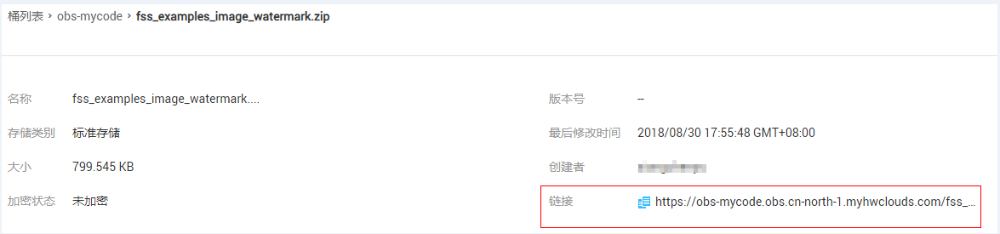
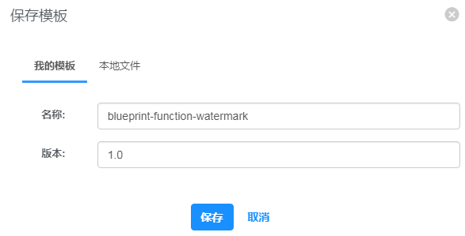
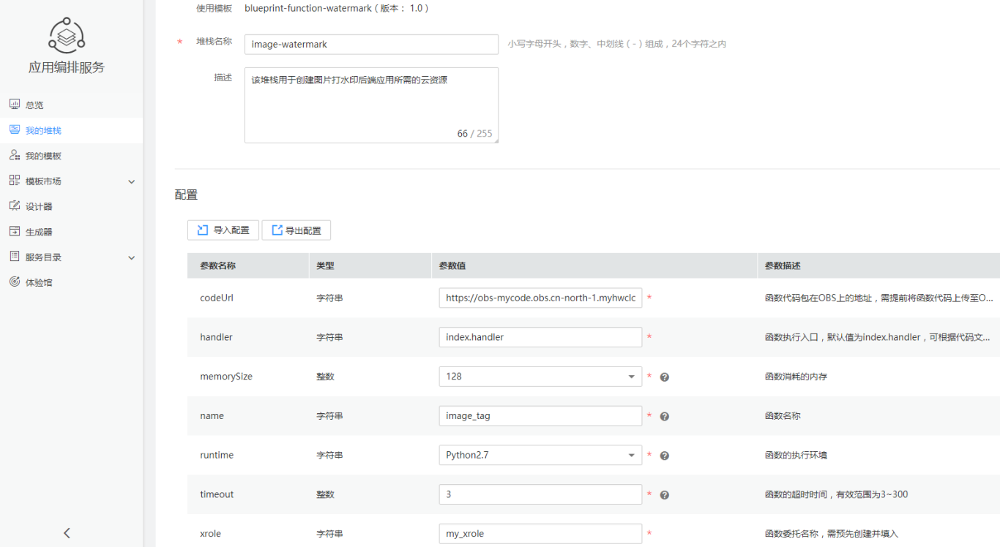
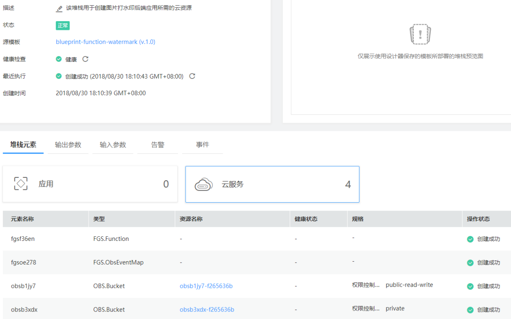
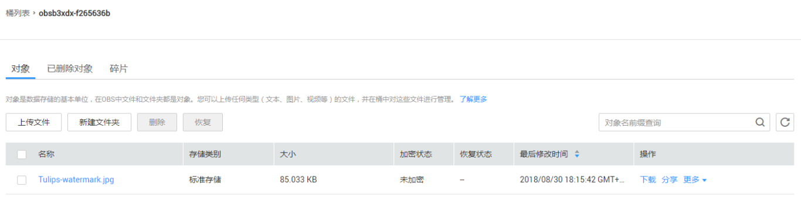

# 使用AOS编排函数工作流资源

应用编排服务（Application Orchestration Service，简称AOS）可以帮助您将应用一键式部署到华为云上，简化相关云服务管理操作。AOS通过模板来描述和编排应用及相关云服务，实现自动化部署应用、创建云服务，提供E2E应用全生命周期运维管控能力。

FunctionGraph工作流实现了华为应用编排服务AOS的对接，可以通过AOS编排服务将云资源一键式部署到华为云上，实现业务流程自动化。

使用AOS编排服务编排FunctionGraph资源，可以实现以下功能：

-   通过AOS模板创建堆栈来管理函数资源。
-   通过AOS模板创建堆栈来管理触发器资源。
-   结合其他华为云服务，编排复杂云资源集合。

## 场景介绍

本案例所示图片处理后端应用是基于函数工作流FunctionGraph实现图片打水印功能的无服务系统。通过OBS触发器，对每个上传到OBS桶中的图片打水印，再将水印图片存储到另一个OBS桶中。

本案例通过AOS编排服务的设计器编排部署图片处理后端应用所需的FunctionGraph资源和OBS桶资源，实现快速构建图片处理后端应用。设计器编排完成后，可以生成一个模板，基于该模板可一键创建多个图片处理后端应用。

创建图片处理后端应用，需要编排的云资源包括：

-   FunctionGraph工作流函数资源
-   FunctionGraph工作流OBS触发器资源
-   OBS桶资源

## 准备

AOS编排函数资源，函数的代码上传支持在线编辑和OBS上传文件两种方式，本案例以OBS上传文件方式为例，先将函数代码上传至OBS桶，并获取代码在OBS桶中的地址。

1、创建OBS桶

用户登录华为云控制台，进入“[对象存储服务](https://storage.huaweicloud.com/obs/)”，单击“创建桶”，进入“创建桶”界面。

在“创建桶”界面，填写存储桶信息，如[图1](#fig1774412644714)所示。

区域选择：“华北-北京一”

桶名称输入：“obs-mycode”

存储别选择：“标准存储”

桶策略选择："私有"

**图 1**  创建桶  

单击“立即创建“，完成桶的创建。

2、上传函数代码至OBS桶

选择上一步骤创建的OBS桶，将ZIP格式的[函数代码](https://functionstage-examples.obs.myhwclouds.com/fss_examples_image_watermark.zip)上传至该OBS桶中，记录下函数代码在OBS桶中的地址。本例ZIP格式的函数代码文件名称为“fss\_examples\_image\_watermark.zip”。

**图 2**  上传函数代码  

**图 3**  OBS桶中函数代码的地址  

3、配置函数委托

因为函数需要访问OBS服务，所以需要给予函数访问OBS的权限，为函数设置OBS的委托。同样，在函数中需要获取IAM提供的用户AK、SK，所以也需要设置IAM的委托，配置的委托名称需填入后续配置模板参数中。具体操作请参考[创建委托](https://support.huaweicloud.com/bestpractice-functiongraph/functiongraph_05_0401.html)。

## 导入AOS模板

建议通过导入现有的AOS模板来编排函数工作流服务资源。我们将提供一些典型应用场景的AOS公共模板来帮助您快速创建堆栈，您可将AOS模板直接导入AOS设计器，然后根据业务情况修改AOS模板的具体配置。如您需要自行通过AOS设计器设计AOS模板，可参考AOS服务[帮助文档](https://support.huaweicloud.com/usermanual-aos/aos_01_0000.html)。

本例的完整AOS模板可[点此下载](https://functionstage-examples.obs.cn-north-1.myhwclouds.com/blueprint-function-watermark.yaml)，在AOS设计器中点击页面顶部的“打开”按钮，将下载的AOS模板导入AOS设计器，然后单击设计器页面顶部的“保存”按钮，输入以下参数，单击“保存”。

> **说明：**   
>-   保存模板前，您可单击进行模板校验。若模板正确，在“操作日志”中会提示校验模板成功。  
>-   模板名称：自定义模板名称，需确保全局唯一，例如设置为blueprint-function-watermark。  
>-   版本：1.0，保持默认。  

**图 4**  保存AOS模板  

## 部署云资源

1.  单击设计器页面右上侧的，进入AOS控制台首页。
2.  在左侧导航栏中，选择“我的模板”。在模板列表中可查看到保存成功的模板blueprint-function-watermark。
3.  单击blueprint-function-watermark模板后的“部署堆栈”。
4.  设置堆栈信息。
    -   堆栈名称：输入堆栈名称，例如**image-watermark**，需确保该值唯一。
    -   描述：可选。
    -   配置输入参数，如[表1](#table14183337372)。

        **表 1**  配置输入参数

        
        <table><thead align="left"><tr id="row171801934375"><th class="cellrowborder" valign="top" width="24%" id="mcps1.2.3.1.1">
<strong id="b181803316379">参数</strong>

        </th>
        <th class="cellrowborder" valign="top" width="76%" id="mcps1.2.3.1.2">
<strong id="b1180234379">说明</strong>

        </th>
        </tr>
        </thead>
        <tbody><tr id="row818020353714"><td class="cellrowborder" valign="top" width="24%" headers="mcps1.2.3.1.1 ">
codeUrl

        </td>
        <td class="cellrowborder" valign="top" width="76%" headers="mcps1.2.3.1.2 ">
函数代码包在OBS上的地址，需手动输入

        </td>
        </tr>
        <tr id="row1018053153717"><td class="cellrowborder" valign="top" width="24%" headers="mcps1.2.3.1.1 ">
handler

        </td>
        <td class="cellrowborder" valign="top" width="76%" headers="mcps1.2.3.1.2 ">
函数执行入口，采用默认值index.handler即可

        </td>
        </tr>
        <tr id="row1418033163717"><td class="cellrowborder" valign="top" width="24%" headers="mcps1.2.3.1.1 ">
memorySize

        </td>
        <td class="cellrowborder" valign="top" width="76%" headers="mcps1.2.3.1.2 ">
函数消耗的内存，默认128MB

        </td>
        </tr>
        <tr id="row19180834373"><td class="cellrowborder" valign="top" width="24%" headers="mcps1.2.3.1.1 ">
name

        </td>
        <td class="cellrowborder" valign="top" width="76%" headers="mcps1.2.3.1.2 ">
函数名称，默认image_watermark，可自行配置

        </td>
        </tr>
        <tr id="row141823383714"><td class="cellrowborder" valign="top" width="24%" headers="mcps1.2.3.1.1 ">
runtime

        </td>
        <td class="cellrowborder" valign="top" width="76%" headers="mcps1.2.3.1.2 ">
函数的执行环境，选择Python2.7

        </td>
        </tr>
        <tr id="row618214315371"><td class="cellrowborder" valign="top" width="24%" headers="mcps1.2.3.1.1 ">
xrole

        </td>
        <td class="cellrowborder" valign="top" width="76%" headers="mcps1.2.3.1.2 ">
函数委托名称，输入前面步骤创建的委托名称

        </td>
        </tr>
        <tr id="row20182638377"><td class="cellrowborder" valign="top" width="24%" headers="mcps1.2.3.1.1 ">
timeout

        </td>
        <td class="cellrowborder" valign="top" width="76%" headers="mcps1.2.3.1.2 ">
函数的超时时间，默认3秒

        </td>
        </tr>
        </tbody>
        </table>

        **图 5**  堆栈参数配置  
        

5.  单击“下一步”，查看堆栈信息，确认无误后，单击“创建堆栈”。

    系统自动跳转到堆栈详情页面，可查看到当前堆栈为创建中。此处创建了函数、OBS触发器和两个OBS桶。

6.  待堆栈状态为“正常”时，可查看到堆栈元素中已有三个云服务资源。函数、OBS触发器以及OBS桶创建成功。

    **图 6**  堆栈已创建成功  
    

7.  查看已创建的云服务。
    1.  登录华为云控制台。
    2.  选择“计算 \> 函数工作流FunctionGraph”，可查看到已创建成功一个带OBS触发器的函数。
    3.  选择“存储 \> 对象存储服务OBS”，可查看到自动创建的两个OBS桶。

## 验证

1、进入OBS页面，向前面步骤创建的用于存储待处理图片的OBS桶中上传图片，本例中上传一张郁金香花的图片。

**图 7**  待上传的图片  

**图 8**  上传待处理的图片至OBS桶  

2、上传完成后，进入存储水印图片的OBS桶，查看图片打水印的结果。

**图 9**  处理后的带水印图片  

**图 10**  处理后OBS桶  

