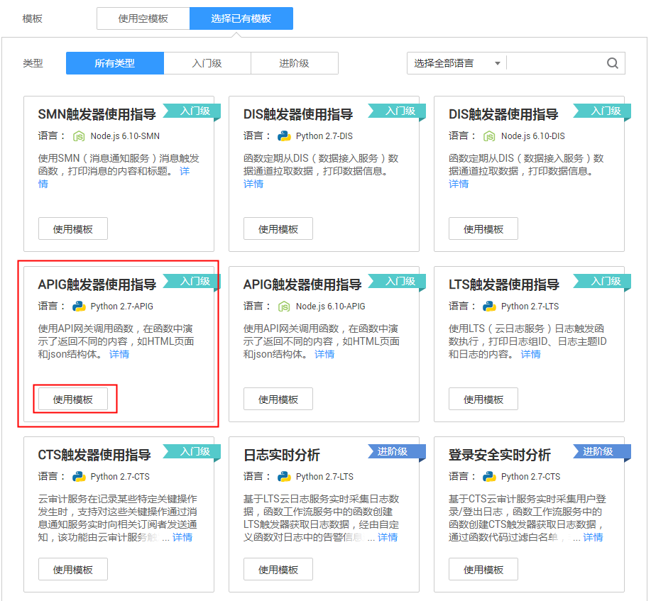
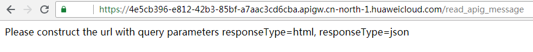

# 使用APIG触发器

本节介绍创建APIG触发器，使用API调用函数运行。供用户了解APIG触发器的使用方法。

关于APIG触发器事件源具体介绍请参见[支持的事件源](http://support.huaweicloud.com/devg-functiongraph/functiongraph_02_0102.html)。

## 前提条件

进行操作之前，需要做好以下准备。

已经创建API分组，此处以function分组为例，创建过程请参考[创建API分组](https://support.huaweicloud.com/usermanual-apig/apig-zh-ug-180307015.html)。

## 创建APIG触发器

1.  用户登录FunctionGraph控制台，进入“函数”界面。
2.  在“函数”界面，选择“函数列表”，单击“创建函数”，进入“创建函数”界面。
3.  在“创建函数”界面填写函数信息。
    1.  模板选择“已有模板”。
    2.  选择“APIG触发器使用指导”模板，单击“使用此模板”，加载函数代码及配置信息。
    3.  输入函数名称：read\_apig\_message。

        **图 1**  APIG触发器使用指导模板  
        

    4.  输入APIG触发器配置信息，带\*参数为必填项。

        **表 1**  触发器信息表

        
        <table><thead align="left"><tr id="row6452289411123"><th class="cellrowborder" valign="top" width="50%" id="mcps1.2.3.1.1">
字段

        </th>
        <th class="cellrowborder" valign="top" width="50%" id="mcps1.2.3.1.2">
填写说明

        </th>
        </tr>
        </thead>
        <tbody><tr id="row3775359111123"><td class="cellrowborder" valign="top" width="50%" headers="mcps1.2.3.1.1 ">
*API名称

        </td>
        <td class="cellrowborder" valign="top" width="50%" headers="mcps1.2.3.1.2 ">
支持汉字，英文，数字，下划线，且只能以英文和汉字开头，3-24字符。

        
输入read_apig_message。

        </td>
        </tr>
        <tr id="row1040996411123"><td class="cellrowborder" valign="top" width="50%" headers="mcps1.2.3.1.1 ">
*分组

        </td>
        <td class="cellrowborder" valign="top" width="50%" headers="mcps1.2.3.1.2 ">
API分组相当于一个API集合，API提供方以API分组为单位，管理分组内的所有API。

        
选择创建的function。

        </td>
        </tr>
        <tr id="row593612298329"><td class="cellrowborder" valign="top" width="50%" headers="mcps1.2.3.1.1 ">
*发布环境

        </td>
        <td class="cellrowborder" valign="top" width="50%" headers="mcps1.2.3.1.2 ">
API可以同时提供给不同的场景调用，如生产、测试或开发。API网关服务提供环境管理，在不同的环境定义不同的API调用路径。

        
选择Release，才能调用。

        </td>
        </tr>
        <tr id="row15723165312323"><td class="cellrowborder" valign="top" width="50%" headers="mcps1.2.3.1.1 ">
*安全认证

        </td>
        <td class="cellrowborder" valign="top" width="50%" headers="mcps1.2.3.1.2 ">
API认证方式：

        
APP： 采用Appkey&amp;Appsecret认证，安全级别高，推荐使用，详情请参考<a href="https://support.huaweicloud.com/devg-apig/apig-zh-dev-180307002.html" target="_blank" rel="noopener noreferrer">APP认证</a>。

        
IAM： IAM认证，只允许公有云用户能访问，安全级别中等，详情请参考<a href="https://support.huaweicloud.com/devg-apig/apig-zh-dev-180307020.html" target="_blank" rel="noopener noreferrer">IAM认证</a>。

        
None： 无认证模式，所有用户均可访问。

        
选择None。

        </td>
        </tr>
        <tr id="row5329068911123"><td class="cellrowborder" valign="top" width="50%" headers="mcps1.2.3.1.1 ">
*请求协议

        </td>
        <td class="cellrowborder" valign="top" width="50%" headers="mcps1.2.3.1.2 ">
分为两种类型：

        <ul id="ul10342591866"><li>HTTP</li><li>HTTPS</li></ul>
        
选择HTTPS。

        </td>
        </tr>
        <tr id="row185036265474"><td class="cellrowborder" valign="top" width="50%" headers="mcps1.2.3.1.1 ">
*后端超时(毫秒)

        </td>
        <td class="cellrowborder" valign="top" width="50%" headers="mcps1.2.3.1.2 ">
输入“5000”。

        </td>
        </tr>
        </tbody>
        </table>

        > **说明：**   
        >发布环境选择Release，创建触发器时，会在API网关生成API，并且将生成的API发布，可以直接调用。  

4.  单击“创建函数”，创建函数及触发器。

    **图 2**  APIG触发器  
    

    > **说明：**   
    >1.  APIG触发器调用地址：https://4e5cb396-e812-42b3-85bf-a7aac3cd6cba.apigw.xx-xxxx-1.xxxxxxxxx.com/read\_apig\_message。  
    >2.  API触发器创建完成后，会在API网关生成名为read\_apig\_message的API，单击API名称，跳转至API网关服务。  

## 调用函数

1.  打开浏览器，将APIG触发器调用地址输入地址栏，如[图3](#fig42713216569)所示。

    **图 3**  调用函数  
    

2.  根据提示，补充responseType为html，将以下地址输入浏览器地址栏。

    https://4e5cb396-e812-42b3-85bf-a7aac3cd6cba.apigw.xxxx-xxxxx-1.xxxxxxcloud.com/read\_apig\_message?responseType=html。

3.  函数执行完毕，得到返回结果，如[图4 返回结果](#fig640414181488)所示。

    **图 4**  返回结果  
    

## 查看函数运行结果

1.  登录FunctionGraph控制台，进入“函数”界面。
2.  在“函数”界面，选择“函数列表”，单击read\_apig\_message函数名称，进入read\_apig\_message函数详情界面。
3.  在read\_apig\_message函数详情界面，单击“日志”页签，查询函数运行日志。
4.  单击操作栏的“查看上下文”，查看日志详细信息。

