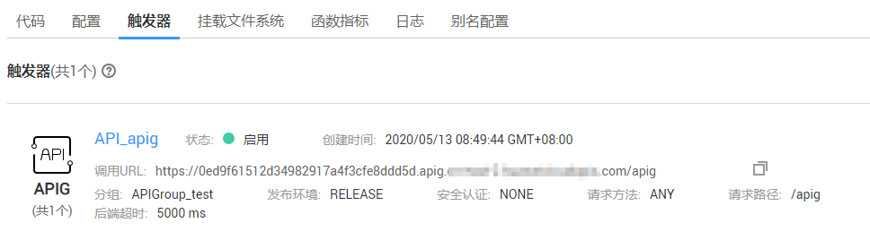

# 使用APIG触发器<a name="ZH-CN_TOPIC_0149027363"></a>

本节介绍创建APIG触发器，使用API调用函数运行。供用户了解APIG触发器的使用方法。

关于APIG触发器事件源具体介绍请参见[支持的事件源](https://support.huaweicloud.com/devg-functiongraph/functiongraph_02_0102.html)。

## 前提条件<a name="section76949209512"></a>

已经创建API分组，此处以APIGroup\_test分组为例，创建过程请参考[创建API分组](https://support.huaweicloud.com/usermanual-apig/apig-ug-180307015.html)。

## 创建APIG触发器<a name="section0341823105810"></a>

1.  登录FunctionGraph控制台，在左侧导航栏选择“函数 \> 函数列表”，进入函数列表界面。
2.  单击“创建函数”，进入“创建函数”界面。
3.  设置以下函数信息。
    -   模板：选择“使用空模板”。
    -   函数名称：输入您自定义的函数名称，例如：apig。
    -   所属应用：选择“default”。
    -   委托名称：选择“不使用任何委托”。
    -   描述：输入对函数的补充信息，可以不填。
    -   运行时语言：选择“Python 2.7”。
    -   函数执行入口：输入“index.handler”。
    -   代码上传方式：选择“在线编辑”，并输入如下所示的代码。

        ```
        # -*- coding:utf-8 -*-
        import json
        def handler (event, context):
            body = "<html><title>Functiongraph Demo</title><body><p>Hello, FunctionGraph!</p></body></html>"
            print(body)
            return {
                "statusCode":200,
                "body":body,
                "headers": {
                    "Content-Type": "text/html",
                },        
                "isBase64Encoded": False
            }
        ```

4.  单击“创建函数”，完成函数的创建。
5.  在“触发器”页签，单击“创建触发器”。
6.  设置以下触发器信息。

    **表 1**  触发器信息

    <a name="table105751048184510"></a>
    <table><thead align="left"><tr id="row3571144884513"><th class="cellrowborder" valign="top" width="24.54%" id="mcps1.2.3.1.1"><p id="p1857154834518"><a name="p1857154834518"></a><a name="p1857154834518"></a>字段</p>
    </th>
    <th class="cellrowborder" valign="top" width="75.46000000000001%" id="mcps1.2.3.1.2"><p id="p155717480456"><a name="p155717480456"></a><a name="p155717480456"></a>填写说明</p>
    </th>
    </tr>
    </thead>
    <tbody><tr id="row837561774612"><td class="cellrowborder" valign="top" width="24.54%" headers="mcps1.2.3.1.1 "><p id="p2037691716466"><a name="p2037691716466"></a><a name="p2037691716466"></a>触发器类型</p>
    </td>
    <td class="cellrowborder" valign="top" width="75.46000000000001%" headers="mcps1.2.3.1.2 "><p id="p0376121720461"><a name="p0376121720461"></a><a name="p0376121720461"></a>选择“API Gateway服务 (APIG)”。</p>
    </td>
    </tr>
    <tr id="row6573144824520"><td class="cellrowborder" valign="top" width="24.54%" headers="mcps1.2.3.1.1 "><p id="p10573164817453"><a name="p10573164817453"></a><a name="p10573164817453"></a>API名称</p>
    </td>
    <td class="cellrowborder" valign="top" width="75.46000000000001%" headers="mcps1.2.3.1.2 "><p id="p3573848104513"><a name="p3573848104513"></a><a name="p3573848104513"></a>您自定义的API名称，例如：API_apig。</p>
    </td>
    </tr>
    <tr id="row057320489459"><td class="cellrowborder" valign="top" width="24.54%" headers="mcps1.2.3.1.1 "><p id="p17573114864515"><a name="p17573114864515"></a><a name="p17573114864515"></a>分组</p>
    </td>
    <td class="cellrowborder" valign="top" width="75.46000000000001%" headers="mcps1.2.3.1.2 "><p id="p16573448174511"><a name="p16573448174511"></a><a name="p16573448174511"></a>API分组相当于一个API集合，API提供方以API分组为单位，管理分组内的所有API。</p>
    <p id="p186541972215"><a name="p186541972215"></a><a name="p186541972215"></a>选择“APIGroup_test”。</p>
    </td>
    </tr>
    <tr id="row15573174819456"><td class="cellrowborder" valign="top" width="24.54%" headers="mcps1.2.3.1.1 "><p id="p557354812457"><a name="p557354812457"></a><a name="p557354812457"></a>发布环境</p>
    </td>
    <td class="cellrowborder" valign="top" width="75.46000000000001%" headers="mcps1.2.3.1.2 "><p id="p12573184817454"><a name="p12573184817454"></a><a name="p12573184817454"></a>API可以同时提供给不同的场景调用，如生产、测试或开发。API网关服务提供环境管理，在不同的环境定义不同的API调用路径。</p>
    <p id="p25731485459"><a name="p25731485459"></a><a name="p25731485459"></a>选择“RELEASE”，才能调用。</p>
    </td>
    </tr>
    <tr id="row5573104815454"><td class="cellrowborder" valign="top" width="24.54%" headers="mcps1.2.3.1.1 "><p id="p6573164824514"><a name="p6573164824514"></a><a name="p6573164824514"></a>安全认证</p>
    </td>
    <td class="cellrowborder" valign="top" width="75.46000000000001%" headers="mcps1.2.3.1.2 "><p id="p4573174816457"><a name="p4573174816457"></a><a name="p4573174816457"></a>API认证方式：</p>
    <a name="ul29539535471"></a><a name="ul29539535471"></a><ul id="ul29539535471"><li>App： 采用Appkey&amp;Appsecret认证，安全级别高，推荐使用，详情请参考<a href="https://support.huaweicloud.com/devg-apig/apig-dev-180307002.html" target="_blank" rel="noopener noreferrer">APP认证</a>。</li><li>IAM： IAM认证，只允许公有云用户能访问，安全级别中等，详情请参考<a href="https://support.huaweicloud.com/devg-apig/apig-dev-180307020.html" target="_blank" rel="noopener noreferrer">IAM认证</a>。</li><li>None： 无认证模式，所有用户均可访问。</li></ul>
    <p id="p657314810455"><a name="p657314810455"></a><a name="p657314810455"></a>选择“None”。</p>
    </td>
    </tr>
    <tr id="row1157418484459"><td class="cellrowborder" valign="top" width="24.54%" headers="mcps1.2.3.1.1 "><p id="p13574114854512"><a name="p13574114854512"></a><a name="p13574114854512"></a>请求协议</p>
    </td>
    <td class="cellrowborder" valign="top" width="75.46000000000001%" headers="mcps1.2.3.1.2 "><p id="p145741948194514"><a name="p145741948194514"></a><a name="p145741948194514"></a>分为两种类型：</p>
    <a name="ul19574948124513"></a><a name="ul19574948124513"></a><ul id="ul19574948124513"><li>HTTP</li><li>HTTPS</li></ul>
    <p id="p11574204816456"><a name="p11574204816456"></a><a name="p11574204816456"></a>选择“HTTPS”。</p>
    </td>
    </tr>
    <tr id="row5574174815454"><td class="cellrowborder" valign="top" width="24.54%" headers="mcps1.2.3.1.1 "><p id="p85746485456"><a name="p85746485456"></a><a name="p85746485456"></a>后端超时(毫秒)</p>
    </td>
    <td class="cellrowborder" valign="top" width="75.46000000000001%" headers="mcps1.2.3.1.2 "><p id="p15574174817456"><a name="p15574174817456"></a><a name="p15574174817456"></a>输入“5000”。</p>
    </td>
    </tr>
    </tbody>
    </table>

7.  单击“确定”，完成触发器的创建。

    **图 1**  APIG触发器<a name="fig99182432558"></a>  
    

    > **说明：** 
    >1.  APIG触发器调用地址：https://0ed9f61512d34982917a4f3cfe8ddd5d.apig.xxx.xxx.com/apig。
    >2.  API触发器创建完成后，会在API网关生成名为API\_apig的API，单击API名称，跳转至API网关服务。


## 调用函数<a name="section5526738175817"></a>

1.  在浏览器地址栏输入APIG触发器的调用地址，如[图2](#fig42713216569)所示，按“Enter”。

    **图 2**  APIG触发器调用地址<a name="fig42713216569"></a>  
    

2.  函数执行完毕，得到返回结果，如[图4 返回结果](#fig640414181488)所示。

    **图 3**  返回结果<a name="fig640414181488"></a>  
    


## 查看函数运行结果<a name="section4315195519585"></a>

1.  登录FunctionGraph控制台，进入“函数 \> 函数列表”界面。
2.  单击“apig”函数名称，进入apig函数详情界面。
3.  在apig函数详情界面，单击“日志”页签，查询函数运行日志。
4.  单击操作栏的“查看上下文”，查看日志详细信息。

