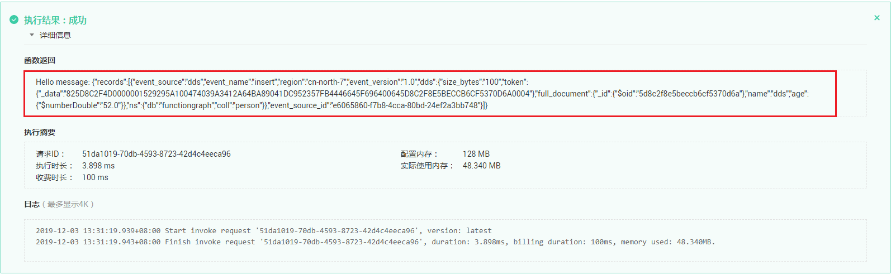

# 使用DDS触发器<a name="ZH-CN_TOPIC_0194945287"></a>

本节介绍创建DDS触发器，供用户了解DDS触发器的使用方法。

使用DDS触发器，每次更新数据库中的表时，都可以触发FunctionGraph函数以执行额外的工作，关于DDS触发器事件源具体介绍请参见[支持的事件源](https://support.huaweicloud.com/devg-functiongraph/functiongraph_02_0102.html)。

## 前提条件<a name="section134592267445"></a>

进行操作之前，需要做好以下准备。

-   已经创建函数，创建过程请参考[创建并初始化函数](创建并初始化函数.md)。
-   创建DDS触发器，必须开启函数工作流VPC访问，请参考[函数配置VPC](函数配置VPC.md)。
-   已经创建DDS文档数据库实例，创建过程请参考[购买文档数据库实例](https://support.huaweicloud.com/qs-dds/zh-cn_topic_0044018333.html)。
-   已经创建DDS文档数据库，请参考[新建数据库](https://support.huaweicloud.com/usermanual-das/das_07_0004.html)。

## 创建DDS触发器<a name="section3956183013126"></a>

1.  登录FunctionGraph控制台，进入“函数”界面。
2.  在“函数”界面，选择“函数列表”，单击HelloWorld函数名称，进入HelloWorld函数详情界面。
3.  在HelloWorld函数详情界面，单击“触发器”页签。
4.  在“触发器”页签，单击“创建触发器”，弹出“创建触发器”对话框。
5.  设置以下信息。
    -   触发器类型：选择“文件数据库服务（DDS）”。
    -   文档数据库实例：选择已创建的DDS实例。
    -   密码：DDS数据库实例管理员rwuser的密码。
    -   数据库名称：输入DDS实例数据库名称。admin、local、config为保留数据库，不能使用。
    -   集合名称：数据库集合名称。
    -   批处理大小：每批从数据库读取的记录的数量。

6.  单击“确定“，完成DDS触发器的创建。

## 配置DDS事件触发函数<a name="section8958730121211"></a>

1.  登录FunctionGraph控制台，进入“函数”界面。
2.  在“函数”界面，选择“函数列表”，单击HelloWorld函数名称，进入HelloWorld函数详情界面。
3.  在HelloWorld函数详情页，选择函数版本，单击“请选择测试事件 \> 配置测试事件”，弹出“配置测试事件”对话框。
4.  填写如[表1](#table15199135171812)所示测试信息后，单击“保存”。

    **表 1**  测试信息

    <a name="table15199135171812"></a>
    <table><thead align="left"><tr id="row31976510182"><th class="cellrowborder" valign="top" width="28.000000000000004%" id="mcps1.2.3.1.1"><p id="p71977514187"><a name="p71977514187"></a><a name="p71977514187"></a>参数</p>
    </th>
    <th class="cellrowborder" valign="top" width="72%" id="mcps1.2.3.1.2"><p id="p8197165171812"><a name="p8197165171812"></a><a name="p8197165171812"></a>说明</p>
    </th>
    </tr>
    </thead>
    <tbody><tr id="row219735171814"><td class="cellrowborder" valign="top" width="28.000000000000004%" headers="mcps1.2.3.1.1 "><p id="p3197850189"><a name="p3197850189"></a><a name="p3197850189"></a>配置测试事件</p>
    </td>
    <td class="cellrowborder" valign="top" width="72%" headers="mcps1.2.3.1.2 "><p id="p819718513189"><a name="p819718513189"></a><a name="p819718513189"></a>可创建新的测试事件也可编辑已有的测试事件。</p>
    <p id="p019785141810"><a name="p019785141810"></a><a name="p019785141810"></a>选择默认值：“创建新的测试事件”。</p>
    </td>
    </tr>
    <tr id="row019845151817"><td class="cellrowborder" valign="top" width="28.000000000000004%" headers="mcps1.2.3.1.1 "><p id="p1619715519182"><a name="p1619715519182"></a><a name="p1619715519182"></a>事件模板</p>
    </td>
    <td class="cellrowborder" valign="top" width="72%" headers="mcps1.2.3.1.2 "><p id="p519812511182"><a name="p519812511182"></a><a name="p519812511182"></a>选择"dds-event-template"模板，使用系统内置dds事件模板。</p>
    </td>
    </tr>
    <tr id="row01981653188"><td class="cellrowborder" valign="top" width="28.000000000000004%" headers="mcps1.2.3.1.1 "><p id="p619865201814"><a name="p619865201814"></a><a name="p619865201814"></a>事件名称</p>
    </td>
    <td class="cellrowborder" valign="top" width="72%" headers="mcps1.2.3.1.2 "><p id="p171981253182"><a name="p171981253182"></a><a name="p171981253182"></a>事件名称必须以大写或小写字母开头，支持字母（大写或小写），数字和下划线“_”（或中划线“-”），并以字母或数字结尾，长度为1-25个字符，例如dds-123test。</p>
    </td>
    </tr>
    <tr id="row71991752189"><td class="cellrowborder" valign="top" width="28.000000000000004%" headers="mcps1.2.3.1.1 "><p id="p81983518186"><a name="p81983518186"></a><a name="p81983518186"></a>测试事件</p>
    </td>
    <td class="cellrowborder" valign="top" width="72%" headers="mcps1.2.3.1.2 "><p id="p1419810515185"><a name="p1419810515185"></a><a name="p1419810515185"></a>自动加载系统内置dds事件模板，本例不做修改。</p>
    </td>
    </tr>
    </tbody>
    </table>

    > **说明：** 
    >测试事件模板示例如下：
    >```
    >{
    >	"records": [
    >		{
    >			"event_source": "dds",
    >			"event_name": "insert",
    >			"region": "xx-xxxxx-1",
    >			"event_version": "1.0",
    >			"dds": {
    >				"size_bytes": "100",
    >				"token": {
    >                    "_data": "825D8C2F4D0000001529295A100474039A3412A64BA89041DC952357FB4446645F696400645D8C2F8E5BECCB6CF5370D6A0004"
    >                },
    >				"full_document": {
    >					"_id": {
    >						"$oid": "5d8c2f8e5beccb6cf5370d6a"
    >					},
    >					"name": "dds",
    >					"age": {
    >						"$numberDouble": "52.0"
    >					}
    >				},
    >				"ns": {
    >				   "db": "functiongraph",
    >				   "coll": "person"
    >				}
    >			},
    >			"event_source_id": "e6065860-f7b8-4cca-80bd-24ef2a3bb748"
    >		}
    >	]
    >}
    >```

5.  单击“测试”，可以得到函数运行结果，函数会返回输入DDS数据。如[图1](#fig89541826201)所示。

    **图 1**  DDS触发器测试结果<a name="fig89541826201"></a>  
    


