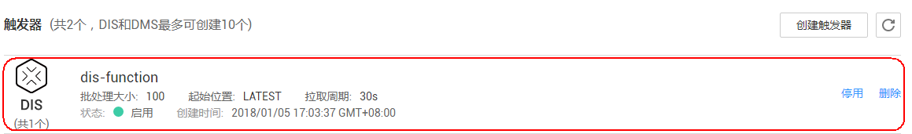
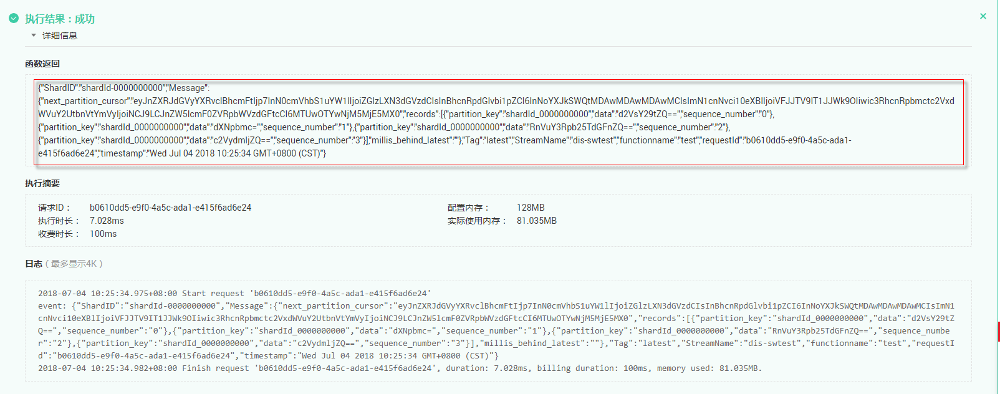

# 使用DIS触发器<a name="ZH-CN_TOPIC_0149027303"></a>

本节介绍创建DIS触发器，使用系统内置的事件模板配置dis事件，触发函数运行。供用户了解DIS触发器的使用方法。

关于DIS触发器事件源具体介绍请参见[支持的事件源](http://support.huaweicloud.com/devg-functiongraph/functiongraph_02_0102.html)。

## 前提条件<a name="section76949209512"></a>

进行操作之前，需要做好以下准备。

-   已经在函数工作流服务创建函数，创建过程请参考[代码上传方式创建运行和初始化函数](代码上传方式创建运行和初始化函数.md)。
-   已经创建接入通道，此处以dis-function为例，创建过程请参考[创建DIS通道](https://support.huaweicloud.com/usermanual-dis/dis_01_0601.html)。

## 设置函数委托<a name="section04468211232"></a>

创建DIS触发器时，需要设置函数委托，委托权限需要包括DIS，委托的创建请参考[创建委托](创建委托.md)。

由于创建HelloWorld函数的时候没有设置委托，所以需要先修改函数委托。

1.  登录FunctionGraph控制台，进入“函数”界面。
2.  在“函数”界面，选择“函数列表”，单击HelloWorld函数名称，进入HelloWorld函数详情界面。
3.  在HelloWorld函数详情页，单击“配置”，进入“配置”页签。
4.  在“配置”页签，修改函数委托，将委托修改为[创建委托](创建委托.md)创建的serverless-trust委托。
5.  单击“保存”，完成委托修改。

## 创建DIS触发器<a name="section680116461234"></a>

1.  登录FunctionGraph控制台，进入“函数”界面。
2.  在“函数”界面，选择“函数列表”，单击HelloWorld函数名称，进入HelloWorld函数详情界面。
3.  在HelloWorld函数详情页，单击“触发器”页签。
4.  在“触发器”页签，单击“创建触发器”，如[图1](#fig19657829242)所示，弹出“创建触发器”界面。

    **图 1**  创建DIS触发器<a name="fig19657829242"></a>  
    

5.  在“创建触发器”界面，触发器类型选择“数据接入服务 \(DIS\)”，填写触发器信息，如[表1](#table4277812911123)所示，带\*参数为必填项。

    **表 1**  DIS触发器信息表

    <a name="table4277812911123"></a>
    <table><thead align="left"><tr id="row6452289411123"><th class="cellrowborder" valign="top" width="50%" id="mcps1.2.3.1.1"><p id="p10222672111212"><a name="p10222672111212"></a><a name="p10222672111212"></a>字段</p>
    </th>
    <th class="cellrowborder" valign="top" width="50%" id="mcps1.2.3.1.2"><p id="p22730128111212"><a name="p22730128111212"></a><a name="p22730128111212"></a>填写说明</p>
    </th>
    </tr>
    </thead>
    <tbody><tr id="row3775359111123"><td class="cellrowborder" valign="top" width="50%" headers="mcps1.2.3.1.1 "><p id="p29066614111212"><a name="p29066614111212"></a><a name="p29066614111212"></a>*通道名称</p>
    </td>
    <td class="cellrowborder" valign="top" width="50%" headers="mcps1.2.3.1.2 "><p id="p31669066105759"><a name="p31669066105759"></a><a name="p31669066105759"></a>选择已创建的DIS通道。</p>
    <p id="p1753551895938"><a name="p1753551895938"></a><a name="p1753551895938"></a>本例选择创建的dis-function通道。</p>
    </td>
    </tr>
    <tr id="row177242162307"><td class="cellrowborder" valign="top" width="50%" headers="mcps1.2.3.1.1 "><p id="p15724121610301"><a name="p15724121610301"></a><a name="p15724121610301"></a>*起始位置</p>
    </td>
    <td class="cellrowborder" valign="top" width="50%" headers="mcps1.2.3.1.2 "><p id="p1072418163303"><a name="p1072418163303"></a><a name="p1072418163303"></a>选择流中开始读取数据的位置。</p>
    <a name="ul194661937141713"></a><a name="ul194661937141713"></a><ul id="ul194661937141713"><li>TRIM_HORIZON：从最早被存储至分区的有效记录开始读取。</li><li>LATEST：从分区中的最新记录开始读取，此设置可以保证你总是读到分区中最新记录。</li></ul>
    <p id="p37552917929"><a name="p37552917929"></a><a name="p37552917929"></a>选择“LATEST”，从DIS数据通道中获取最新数据。</p>
    </td>
    </tr>
    <tr id="row155498451317"><td class="cellrowborder" valign="top" width="50%" headers="mcps1.2.3.1.1 "><p id="p95491345173116"><a name="p95491345173116"></a><a name="p95491345173116"></a>拉取周期(秒)</p>
    </td>
    <td class="cellrowborder" valign="top" width="50%" headers="mcps1.2.3.1.2 "><p id="p37374123144952"><a name="p37374123144952"></a><a name="p37374123144952"></a>设置拉取流数据的周期，拉取周期设置10ms~60s秒的范围内。</p>
    <p id="p1549144518318"><a name="p1549144518318"></a><a name="p1549144518318"></a>输入10。</p>
    </td>
    </tr>
    <tr id="row191206133274"><td class="cellrowborder" valign="top" width="50%" headers="mcps1.2.3.1.1 "><p id="p15121113112715"><a name="p15121113112715"></a><a name="p15121113112715"></a>串行处理数据</p>
    </td>
    <td class="cellrowborder" valign="top" width="50%" headers="mcps1.2.3.1.2 "><p id="p111211913122720"><a name="p111211913122720"></a><a name="p111211913122720"></a>如果开启该选项，取一次数据处理完之后才会取下一次数据；否则只要拉取周期到了就会取数据进行处理。</p>
    <p id="p3634185415312"><a name="p3634185415312"></a><a name="p3634185415312"></a>选择关闭。</p>
    </td>
    </tr>
    </tbody>
    </table>

    > **说明：**   
    >-   本例触发器的功能是：每隔10s，触发器会从dis-function数据通道中获取最新的100条数据，如果数据总数不足100，则全部获取。  
    >-   拉取周期可以选单位，秒和毫秒，范围是10ms\~60s。接口上"polling\_unit"的取值为"s"或"ms"，如果不填则默认为"s"，当"polling\_unit"取值为"ms"时，"polling\_interval"取值范围为10\~60000，当"polling\_unit"取值为"s"时，"polling\_interval"取值范围1\~60。  

6.  单击“确定”，完成触发器创建，如[图2](#fig1340237162420)所示。

    **图 2**  DIS触发器<a name="fig1340237162420"></a>  
    


## 配置dis事件触发函数<a name="section15396107171918"></a>

1.  登录FunctionGraph控制台，进入“函数”界面。
2.  在“函数”界面，选择“函数列表”，单击HelloWorld函数名称，进入函数详情页。
3.  在HelloWorld函数详情页，选择函数版本，单击“请选择测试事件\>配置测试事件”，如[图3](#fig112033514369)所示，弹出“配置测试事件”页。

    **图 3**  配置DIS测试事件<a name="fig112033514369"></a>  
    

4.  在“配置测试事件”界面填写如[表2](#table187784018405)所示测试信息后单击“保存”，带\*参数为必填项。

    **表 2**  测试信息

    <a name="table187784018405"></a>
    <table><thead align="left"><tr id="row3778200154019"><th class="cellrowborder" valign="top" width="34%" id="mcps1.2.3.1.1"><p id="p87782008402"><a name="p87782008402"></a><a name="p87782008402"></a>参数</p>
    </th>
    <th class="cellrowborder" valign="top" width="66%" id="mcps1.2.3.1.2"><p id="p15786100114015"><a name="p15786100114015"></a><a name="p15786100114015"></a>说明</p>
    </th>
    </tr>
    </thead>
    <tbody><tr id="row578616044017"><td class="cellrowborder" valign="top" width="34%" headers="mcps1.2.3.1.1 "><p id="p1078618012405"><a name="p1078618012405"></a><a name="p1078618012405"></a>配置测试事件</p>
    </td>
    <td class="cellrowborder" valign="top" width="66%" headers="mcps1.2.3.1.2 "><p id="p147869004017"><a name="p147869004017"></a><a name="p147869004017"></a>可创建新的测试事件也可编辑已有的测试事件。</p>
    <p id="p1447113114443"><a name="p1447113114443"></a><a name="p1447113114443"></a>选择默认值：“创建新的测试事件”。</p>
    </td>
    </tr>
    <tr id="row2786110174012"><td class="cellrowborder" valign="top" width="34%" headers="mcps1.2.3.1.1 "><p id="p9786190134013"><a name="p9786190134013"></a><a name="p9786190134013"></a>事件模板</p>
    </td>
    <td class="cellrowborder" valign="top" width="66%" headers="mcps1.2.3.1.2 "><p id="p9706184319468"><a name="p9706184319468"></a><a name="p9706184319468"></a>选择"dis-event-template"模板，使用系统内置dis事件模板。</p>
    </td>
    </tr>
    <tr id="row37861105408"><td class="cellrowborder" valign="top" width="34%" headers="mcps1.2.3.1.1 "><p id="p13786405402"><a name="p13786405402"></a><a name="p13786405402"></a>*事件名称</p>
    </td>
    <td class="cellrowborder" valign="top" width="66%" headers="mcps1.2.3.1.2 "><p id="p18786140204010"><a name="p18786140204010"></a><a name="p18786140204010"></a>事件名称必须仅包含字母和数字，且最大长度为 25 个字符。</p>
    <p id="p15503151114381"><a name="p15503151114381"></a><a name="p15503151114381"></a>输入“dis-test”。</p>
    </td>
    </tr>
    <tr id="row1773914911554"><td class="cellrowborder" valign="top" width="34%" headers="mcps1.2.3.1.1 "><p id="p157391497558"><a name="p157391497558"></a><a name="p157391497558"></a>测试事件</p>
    </td>
    <td class="cellrowborder" valign="top" width="66%" headers="mcps1.2.3.1.2 "><p id="p1354154185610"><a name="p1354154185610"></a><a name="p1354154185610"></a>自动加载系统内置dis事件模板，本例不做修改，如下所示。</p>
    </td>
    </tr>
    </tbody>
    </table>

    > **说明：**   
    >测试事件模板示例如下：  
    >```  
    >{  
    >    "ShardID": "shardId-0000000000",  
    >    "Message": {  
    >        "next_partition_cursor": "eyJnZXRJdGVyYXRvclBhcmFtIjp7InN0cmVhbS1uYW1lIjoiZGlzLXN3dGVzdCIsInBhcnRpdGlvbi1pZCI6InNoYXJkSWQtMDAwMDAwMDAwMCIsImN1cnNvci10eXBlIjoiVFJJTV9IT1JJWk9OIiwic3RhcnRpbmctc2VxdWVuY2UtbnVtYmVyIjoiNCJ9LCJnZW5lcmF0ZVRpbWVzdGFtcCI6MTUwOTYwNjM5MjE5MX0",  
    >        "records": [  
    >            {  
    >                "partition_key": "shardId_0000000000",  
    >                "data": "d2VsY29tZQ==",  
    >                "sequence_number": "0"  
    >            },  
    >            {  
    >                "partition_key": "shardId_0000000000",  
    >                "data": "dXNpbmc=",  
    >                "sequence_number": "1"  
    >            },  
    >            {  
    >                "partition_key": "shardId_0000000000",  
    >                "data": "RnVuY3Rpb25TdGFnZQ==",  
    >                "sequence_number": "2"  
    >            },  
    >            {  
    >                "partition_key": "shardId_0000000000",  
    >                "data": "c2VydmljZQ==",  
    >                "sequence_number": "3"  
    >            }  
    >        ],  
    >        "millis_behind_latest": ""  
    >    },  
    >    "Tag": "latest",  
    >    "StreamName": "dis-swtest"  
    >}  
    >```  

5.  单击“测试”，可以得到函数运行结果，函数会返回输入DIS数据。如[图4](#fig17467116568)所示。

    **图 4**  DIS触发器测试结果<a name="fig17467116568"></a>  
    


