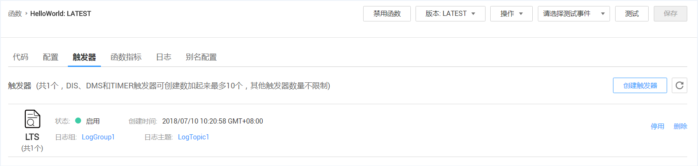
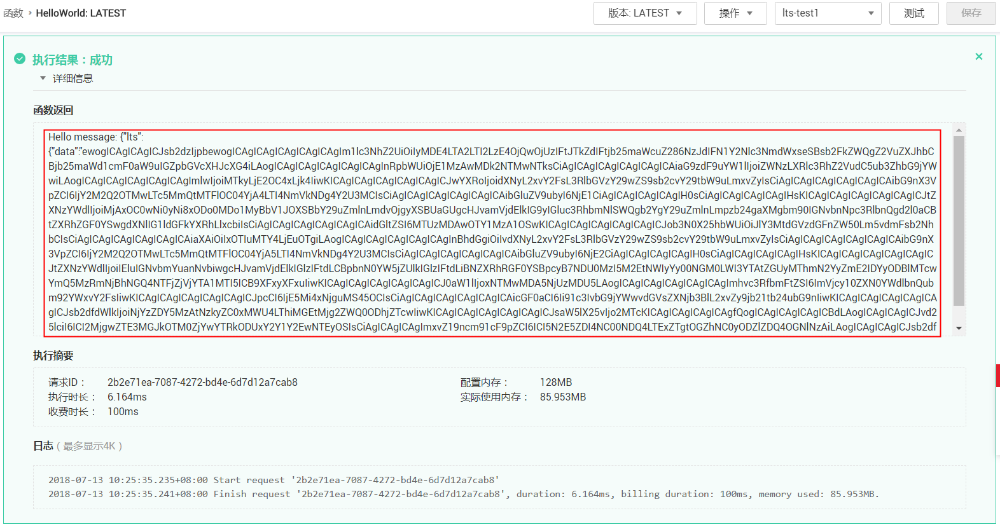

# 使用LTS触发器<a name="functiongraph_01_0208"></a>

本节介绍创建LTS触发器，供用户了解LTS触发器的使用方法。

关于LTS触发器事件源具体介绍请参见[支持的事件源](http://support.huaweicloud.com/devg-functiongraph/functiongraph_02_0102.html)。

## 前提条件<a name="section134592267445"></a>

进行操作之前，需要做好以下准备。

-   已经在函数工作流服务创建函数，创建过程请参考[代码上传方式创建HelloWorld函数](代码上传方式创建HelloWorld函数.md)。
-   已经创建日志组，此处以LogGroup1为例，创建过程请参考[创建日志组](https://support.huaweicloud.com/usermanual-lts/zh-cn_topic_0071259182.html)。
-   已经创建日志主题，此处以LogTopic1为例，创建过程请参考[创建日志主题](https://support.huaweicloud.com/usermanual-lts/zh-cn_topic_0076874392.html)。
-   配置Agent，快速将ECS等服务器上日志采集到指定的日志组，详情请参考[Agent配置](https://support.huaweicloud.com/qs-lts/zh-cn_topic_0078543180.html)。

## 创建LTS触发器<a name="section198021231234"></a>

1.  登录FunctionGraph，进入“函数”界面。
2.  在“函数”界面，选择“函数列表”，单击HelloWorld函数名称，进入HelloWorld函数详情界面。
3.  在HelloWorld函数详情界面，单击“触发器”页签。
4.  在“触发器”页签，单击“创建触发器”，如[图1](#fig1779716147018)所示，弹出“创建触发器”界面。

    **图 1**  创建LTS触发器<a name="fig1779716147018"></a>  
    

5.  在“创建触发器“界面，触发器类型选择“云日志服务（LTS）”填写触发器信息，如[表1](#table1873923610112)所示，带\*参数为必填项。

    **表 1**  LTS触发器信息表

    <a name="table1873923610112"></a>
    <table><thead align="left"><tr id="row1274019362117"><th class="cellrowborder" valign="top" width="50%" id="mcps1.2.3.1.1"><p id="p18740113651120"><a name="p18740113651120"></a><a name="p18740113651120"></a>字段</p>
    </th>
    <th class="cellrowborder" valign="top" width="50%" id="mcps1.2.3.1.2"><p id="p27401536141112"><a name="p27401536141112"></a><a name="p27401536141112"></a>填写说明</p>
    </th>
    </tr>
    </thead>
    <tbody><tr id="row2740113671110"><td class="cellrowborder" valign="top" width="50%" headers="mcps1.2.3.1.1 "><p id="p1474017363115"><a name="p1474017363115"></a><a name="p1474017363115"></a>*日志组</p>
    </td>
    <td class="cellrowborder" valign="top" width="50%" headers="mcps1.2.3.1.2 "><p id="p1174013621120"><a name="p1174013621120"></a><a name="p1174013621120"></a>选择已创建的日志组。</p>
    <p id="p19349113201911"><a name="p19349113201911"></a><a name="p19349113201911"></a>本例选择已创建的LogGroup1。</p>
    </td>
    </tr>
    <tr id="row0740163681119"><td class="cellrowborder" valign="top" width="50%" headers="mcps1.2.3.1.1 "><p id="p147405364119"><a name="p147405364119"></a><a name="p147405364119"></a>*日志主题</p>
    </td>
    <td class="cellrowborder" valign="top" width="50%" headers="mcps1.2.3.1.2 "><p id="p19740133615117"><a name="p19740133615117"></a><a name="p19740133615117"></a>选择已创建的日志主题。</p>
    <p id="p1818672102013"><a name="p1818672102013"></a><a name="p1818672102013"></a>本例选择已创建的LogTopic1。</p>
    </td>
    </tr>
    </tbody>
    </table>

6.  单击“确定“，完成触发器创建，如[图2](#fig912335412256)所示。

    **图 2**  LTS触发器<a name="fig912335412256"></a>  
    


## 配置LTS事件触发函数<a name="section15586193653118"></a>

1.  登录FunctionGraph，进入“函数”界面。
2.  在“函数”界面，选择“函数列表”，单击HelloWorld函数名称，进入HelloWorld函数详情界面。
3.  在HelloWorld函数详情页，选择函数版本，单击“请选择测试事件\>配置测试事件”，如[图3](#fig12868111714416)所示，弹出“配置测试事件”页。

    **图 3**  配置LTS测试事件<a name="fig12868111714416"></a>  
    

4.  在“配置测试事件”界面填写如[表2](#table15199135171812)所示测试信息后单击“保存”，带\*参数为必填项。

    **表 2**  测试信息

    <a name="table15199135171812"></a>
    <table><thead align="left"><tr id="row31976510182"><th class="cellrowborder" valign="top" width="28.000000000000004%" id="mcps1.2.3.1.1"><p id="p71977514187"><a name="p71977514187"></a><a name="p71977514187"></a>参数</p>
    </th>
    <th class="cellrowborder" valign="top" width="72%" id="mcps1.2.3.1.2"><p id="p8197165171812"><a name="p8197165171812"></a><a name="p8197165171812"></a>说明</p>
    </th>
    </tr>
    </thead>
    <tbody><tr id="row219735171814"><td class="cellrowborder" valign="top" width="28.000000000000004%" headers="mcps1.2.3.1.1 "><p id="p3197850189"><a name="p3197850189"></a><a name="p3197850189"></a>配置测试事件</p>
    </td>
    <td class="cellrowborder" valign="top" width="72%" headers="mcps1.2.3.1.2 "><p id="p819718513189"><a name="p819718513189"></a><a name="p819718513189"></a>可创建新的测试事件也可编辑已有的测试事件。</p>
    <p id="p019785141810"><a name="p019785141810"></a><a name="p019785141810"></a>选择默认值：“创建新的测试事件”。</p>
    </td>
    </tr>
    <tr id="row019845151817"><td class="cellrowborder" valign="top" width="28.000000000000004%" headers="mcps1.2.3.1.1 "><p id="p1619715519182"><a name="p1619715519182"></a><a name="p1619715519182"></a>事件模板</p>
    </td>
    <td class="cellrowborder" valign="top" width="72%" headers="mcps1.2.3.1.2 "><p id="p519812511182"><a name="p519812511182"></a><a name="p519812511182"></a>选择"lts-event-template"模板，使用系统内置LTS事件模板。</p>
    </td>
    </tr>
    <tr id="row01981653188"><td class="cellrowborder" valign="top" width="28.000000000000004%" headers="mcps1.2.3.1.1 "><p id="p619865201814"><a name="p619865201814"></a><a name="p619865201814"></a>*事件名称</p>
    </td>
    <td class="cellrowborder" valign="top" width="72%" headers="mcps1.2.3.1.2 "><p id="p2019825121816"><a name="p2019825121816"></a><a name="p2019825121816"></a>事件名称必须仅包含字母和数字，且最大长度为 25 个字符。</p>
    <p id="p171981253182"><a name="p171981253182"></a><a name="p171981253182"></a>输入“lts-test”。</p>
    </td>
    </tr>
    <tr id="row71991752189"><td class="cellrowborder" valign="top" width="28.000000000000004%" headers="mcps1.2.3.1.1 "><p id="p81983518186"><a name="p81983518186"></a><a name="p81983518186"></a>测试事件</p>
    </td>
    <td class="cellrowborder" valign="top" width="72%" headers="mcps1.2.3.1.2 "><p id="p1419810515185"><a name="p1419810515185"></a><a name="p1419810515185"></a>自动加载系统内置lts事件模板，本例不做修改。</p>
    </td>
    </tr>
    </tbody>
    </table>

    > **说明：**   
    >测试事件模板示例如下：  
    >```  
    >{  
    >    "lts": {  
    >        "data": "ewogICAgICAgICJsb2dzIjpbewogICAgICAgICAgICAgICAgIm1lc3NhZ2UiOiIyMDE4LTA2LTI2LzE4OjQwOjUzIFtJTkZdIFtjb25maWcuZ286NzJdIFN1Y2Nlc3NmdWxseSBsb2FkZWQgZ2VuZXJhbCBjb25maWd1cmF0aW9uIGZpbGVcXHJcXG4iLAogICAgICAgICAgICAgICAgInRpbWUiOjE1MzAwMDk2NTMwNTksCiAgICAgICAgICAgICAgICAiaG9zdF9uYW1lIjoiZWNzLXRlc3RhZ2VudC5ub3ZhbG9jYWwiLAogICAgICAgICAgICAgICAgImlwIjoiMTkyLjE2OC4xLjk4IiwKICAgICAgICAgICAgICAgICJwYXRoIjoidXNyL2xvY2FsL3RlbGVzY29wZS9sb2cvY29tbW9uLmxvZyIsCiAgICAgICAgICAgICAgICAibG9nX3VpZCI6IjY2M2Q2OTMwLTc5MmQtMTFlOC04YjA4LTI4NmVkNDg4Y2U3MCIsCiAgICAgICAgICAgICAgICAibGluZV9ubyI6NjE1CiAgICAgICAgICAgIH0sCiAgICAgICAgICAgIHsKICAgICAgICAgICAgICAgICJtZXNzYWdlIjoiMjAxOC0wNi0yNi8xODo0MDo1MyBbV1JOXSBbY29uZmlnLmdvOjgyXSBUaGUgcHJvamVjdElkIG9yIGluc3RhbmNlSWQgb2YgY29uZmlnLmpzb24gaXMgbm90IGNvbnNpc3RlbnQgd2l0aCBtZXRhZGF0YSwgdXNlIG1ldGFkYXRhLlxcbiIsCiAgICAgICAgICAgICAgICAidGltZSI6MTUzMDAwOTY1MzA1OSwKICAgICAgICAgICAgICAgICJob3N0X25hbWUiOiJlY3MtdGVzdGFnZW50Lm5vdmFsb2NhbCIsCiAgICAgICAgICAgICAgICAiaXAiOiIxOTIuMTY4LjEuOTgiLAogICAgICAgICAgICAgICAgInBhdGgiOiIvdXNyL2xvY2FsL3RlbGVzY29wZS9sb2cvY29tbW9uLmxvZyIsCiAgICAgICAgICAgICAgICAibG9nX3VpZCI6IjY2M2Q2OTMwLTc5MmQtMTFlOC04YjA5LTI4NmVkNDg4Y2U3MCIsCiAgICAgICAgICAgICAgICAibGluZV9ubyI6NjE2CiAgICAgICAgICAgIH0sCiAgICAgICAgICAgIHsKICAgICAgICAgICAgICAgICJtZXNzYWdlIjoiIEluIGNvbmYuanNvbiwgcHJvamVjdElkIGlzIFtdLCBpbnN0YW5jZUlkIGlzIFtdLiBNZXRhRGF0YSBpcyB7NDU0MzI5M2EtNWIyYy00NGM0LWI3YTAtZGUyMThmN2YyZmE2IDYyODBlMTcwYmQ5MzRmNjBhNGQ4NTFjZjVjYTA1MTI5ICB9XFxyXFxuIiwKICAgICAgICAgICAgICAgICJ0aW1lIjoxNTMwMDA5NjUzMDU5LAogICAgICAgICAgICAgICAgImhvc3RfbmFtZSI6ImVjcy10ZXN0YWdlbnQubm92YWxvY2FsIiwKICAgICAgICAgICAgICAgICJpcCI6IjE5Mi4xNjguMS45OCIsCiAgICAgICAgICAgICAgICAicGF0aCI6Ii91c3IvbG9jYWwvdGVsZXNjb3BlL2xvZy9jb21tb24ubG9nIiwKICAgICAgICAgICAgICAgICJsb2dfdWlkIjoiNjYzZDY5MzAtNzkyZC0xMWU4LThiMGEtMjg2ZWQ0ODhjZTcwIiwKICAgICAgICAgICAgICAgICJsaW5lX25vIjo2MTcKICAgICAgICAgICAgfQogICAgICAgICAgICBdLAogICAgICAgICJvd25lciI6ICI2MjgwZTE3MGJkOTM0ZjYwYTRkODUxY2Y1Y2EwNTEyOSIsCiAgICAgICAgImxvZ19ncm91cF9pZCI6ICI5N2E5ZDI4NC00NDQ4LTExZTgtOGZhNC0yODZlZDQ4OGNlNzAiLAogICAgICAgICJsb2dfdG9waWNfaWQiOiAiMWE5Njc1YTctNzg0ZC0xMWU4LTlmNzAtMjg2ZWQ0ODhjZTcwIgogICAgICAgIH0="  
    >    }  
    >}  
    >```  

5.  单击“测试”，可以得到函数运行结果，函数会返回输入LTS数据。如[图4](#fig89541826201)所示。

    **图 4**  LTS触发器测试结果<a name="fig89541826201"></a>  
    


