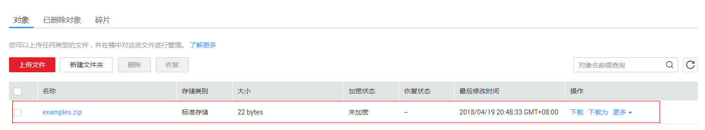

# 使用OBS触发器

本节介绍创建OBS触发器，上传图片压缩包至存储桶，产生事件触发函数运行，供用户了解OBS触发器的使用方法。

关于OBS触发器事件源具体介绍请参见[支持的事件源](http://support.huaweicloud.com/devg-functiongraph/functiongraph_02_0102.html)。

## 前提条件

进行操作之前，需要做好以下准备。

-   已经在函数工作流服务创建函数，创建过程请参考[代码上传方式创建运行和初始化函数](代码上传方式创建运行和初始化函数.md)。
-   已创建OBS存储桶，此处以obs\_cff桶为例。创建过程请参考[创建存储桶](https://support.huaweicloud.com/usermanual-obs/zh-cn_topic_0045829050.html)。

## 创建OBS触发器

1.  登录FunctionGraph控制台，进入“函数”界面。
2.  在“函数”界面，选择“函数列表”，单击HelloWorld函数名称，进入HelloWorld函数详情界面。
3.  在HelloWorld函数详情界面，单击“触发器”页签。
4.  在“触发器”页签，单击“创建触发器”，如[图1](#fig19176131502019)所示，弹出“创建触发器”界面。

    **图 1**  创建OBS触发器  
    

5.  在“创建触发器”界面，触发器类型选择“存储 \(OBS\)”，填写触发器信息，如[表1](#table24155858113256)所示，带\*参数为必填项。

    **表 1**  OBS触发器信息表

    
    <table><thead align="left"><tr id="row24918708113256"><th class="cellrowborder" valign="top" width="50%" id="mcps1.2.3.1.1">
字段

    </th>
    <th class="cellrowborder" valign="top" width="50%" id="mcps1.2.3.1.2">
填写说明

    </th>
    </tr>
    </thead>
    <tbody><tr id="row30021527113256"><td class="cellrowborder" valign="top" width="50%" headers="mcps1.2.3.1.1 ">
*桶

    </td>
    <td class="cellrowborder" valign="top" width="50%" headers="mcps1.2.3.1.2 ">
用作事件源的OBS存储桶。

    
选择创建的obs-cff存储桶。

    </td>
    </tr>
    <tr id="row60516450113256"><td class="cellrowborder" valign="top" width="50%" headers="mcps1.2.3.1.1 ">
*事件

    </td>
    <td class="cellrowborder" valign="top" width="50%" headers="mcps1.2.3.1.2 ">
要使其触发函数的事件。

    
此处以选择“Put”、“Post”和“Delete”为例，当对obs_cff桶中的文件进行更新、上传和删除操作时触发函数运行。

    </td>
    </tr>
    <tr id="row23066815113256"><td class="cellrowborder" valign="top" width="50%" headers="mcps1.2.3.1.1 ">
前缀

    </td>
    <td class="cellrowborder" valign="top" width="50%" headers="mcps1.2.3.1.2 ">
用来限制以此关键字开头的对象的事件通知，该限制可以实现对OBS对象名的过滤，本例不设置。

    </td>
    </tr>
    <tr id="row30912510113256"><td class="cellrowborder" valign="top" width="50%" headers="mcps1.2.3.1.1 ">
后缀

    </td>
    <td class="cellrowborder" valign="top" width="50%" headers="mcps1.2.3.1.2 ">
用来限制以此关键字结尾的对象的事件通知。该限制可以实现对OBS对象名的过滤，本例不设置。

    </td>
    </tr>
    </tbody>
    </table>

6.  单击“确定”，完成触发器创建，如[图2](#fig17618154116211)所示。

    **图 2**  OBS触发器  
    

## 触发函数

1.  用户登录“对象存储服务”，单击“桶列表”中的“obs-cff”存储桶，进入obs-cff桶详情页。
2.  单击左侧的“对象”，进入“obs-cff”存储桶对象页。
3.  在“对象”页签，单击“上传文件”，弹出“上传文件”框。
4.  在“上传文件”框中单击“...” ，选择需要处理的图片ZIP包上传至平台。
5.  单击“确定”，完成上传ZIP包完成，如[图3](#fig17104220153625)所示。

    **图 3**  对象列表  
    

    > **说明：**   
    >上传ZIP文件至“obs-cff”存储桶，会触发HelloWorld函数运行。  

## 查看函数运行结果

1.  登录FunctionGraph控制台，进入“函数”界面。
2.  在“函数”界面，选择“函数列表”，单击HelloWorld函数名称，进入HelloWorld函数详情界面。
3.  在HelloWorld函数详情界面，单击“日志”页签，查询函数运行日志。
4.  单击操作栏的“查看上下文”，查看日志详细信息。

