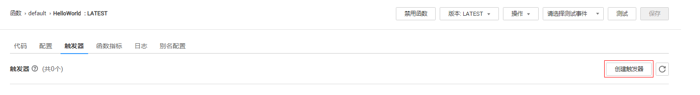

# 使用SMN触发器

本节介绍创建SMN触发器，发布消息，触发函数运行，供用户了解SMN触发器的使用方法。

关于SMN触发器事件源具体介绍请参见[支持的事件源](http://support.huaweicloud.com/devg-functiongraph/functiongraph_02_0102.html)。

## 前提条件

进行操作之前，需要做好以下准备。

-   已经创建SMN消息主题，此处以smn-test为例，创建过程请参考[创建消息主题](https://support.huaweicloud.com/usermanual-smn/zh-cn_topic_0043961401.html)。
-   已经在函数工作流服务创建函数，创建过程请参考[代码上传方式创建运行和初始化函数](代码上传方式创建运行和初始化函数.md)。

## 创建SMN触发器

1.  登录FunctionGraph控制台，进入“函数”界面。
2.  在“函数”界面，选择“函数列表”，单击HelloWorld函数名称，进入HelloWorld函数详情界面。
3.  在HelloWorld函数详情界面，单击“触发器”页签。
4.  在“触发器”页签，单击“创建触发器”，如[图1](#fig1247919241358)所示，弹出“创建触发器”界面。

    **图 1**  创建SMN触发器  
    

5.  在“创建触发器”界面，触发器类型选择“消息队列服务 \(SMN\)”，填写触发器信息，如[表1](#table45001601065)所示，带\*参数为必填项。

    **表 1**  SMN触发器配置

    
    <table><thead align="left"><tr id="row250020865"><th class="cellrowborder" valign="top" width="50%" id="mcps1.2.3.1.1">
字段

    </th>
    <th class="cellrowborder" valign="top" width="50%" id="mcps1.2.3.1.2">
填写说明

    </th>
    </tr>
    </thead>
    <tbody><tr id="row75011109613"><td class="cellrowborder" valign="top" width="50%" headers="mcps1.2.3.1.1 ">
*主题名称

    </td>
    <td class="cellrowborder" valign="top" width="50%" headers="mcps1.2.3.1.2 ">
选择创建的主题：smn-test。

    </td>
    </tr>
    </tbody>
    </table>

6.  单击“确定”，完成触发器创建。

    > **说明：**   
    >SMN触发器生成以后，会在SMN消息主题生成消息订阅。  

## 触发函数运行

1.  登录“消息通知服务”控制台，单击“主题管理\>主题”，进入“主题”界面。
2.  在“主题”界面，单击smn-test消息主题名称，进入“主题详情页”。
3.  在“主题详情页”，单击操作栏的“发布消息”，弹出“发布消息”界面。
4.  在“发布消息”界面，填写发布信息，如[表2](#table833644511032)所示，带\*参数为必填项。

    **表 2**  发布信息表

    
    <table><thead align="left"><tr id="row289324011032"><th class="cellrowborder" valign="top" width="50%" id="mcps1.2.3.1.1">
字段

    </th>
    <th class="cellrowborder" valign="top" width="50%" id="mcps1.2.3.1.2">
填写说明

    </th>
    </tr>
    </thead>
    <tbody><tr id="row5525981111032"><td class="cellrowborder" valign="top" width="50%" headers="mcps1.2.3.1.1 ">
消息标题

    </td>
    <td class="cellrowborder" valign="top" width="50%" headers="mcps1.2.3.1.2 ">
输入“SMN-Test”。

    </td>
    </tr>
    <tr id="row232248711032"><td class="cellrowborder" valign="top" width="50%" headers="mcps1.2.3.1.1 ">
*消息类型

    </td>
    <td class="cellrowborder" valign="top" width="50%" headers="mcps1.2.3.1.2 ">
选择“文本消息”。

    </td>
    </tr>
    <tr id="row2555605011032"><td class="cellrowborder" valign="top" width="50%" headers="mcps1.2.3.1.1 ">
*消息内容

    </td>
    <td class="cellrowborder" valign="top" width="50%" headers="mcps1.2.3.1.2 ">
输入以下内容：{"message":"hello"}。

    </td>
    </tr>
    </tbody>
    </table>

    > **说明：**   
    >消息发布具体参数说明请参见[向主题发布消息](https://support.huaweicloud.com/usermanual-smn/zh-cn_topic_0043961403.html)。  

5.  单击“确定”，完成消息发布。

    > **说明：**   
    >消息发布以后，会自动触发函数运行，具体示例事件请参见[支持的事件源](http://support.huaweicloud.com/devg-functiongraph/functiongraph_02_0102.html)。  

## 查看函数运行结果

1.  登录FunctionGraph控制台，进入“函数”界面。
2.  在“函数”界面，选择“函数列表”，单击HelloWorld函数名称，进入HelloWorld函数详情界面。
3.  在HelloWorld函数详情界面，单击“日志”页签，查询函数运行日志。
4.  单击操作栏的“查看上下文”，查看日志详细信息。

