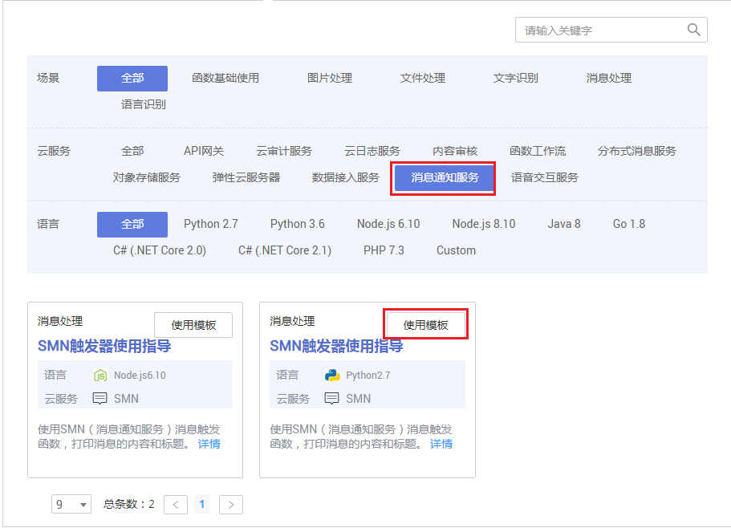
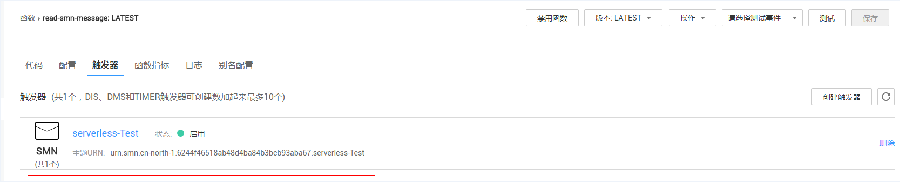
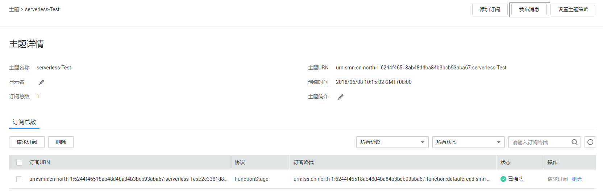

# 使用函数模板

FunctionGraph平台提供了函数模板，在创建函数时选择模板，实现模板代码、触发器、运行环境自动填充，快速构建应用程序。

## 函数模板使用

**创建函数及触发器**

1.  用户登录FunctionGraph控制台，进入“应用模板”界面。
2.  在“应用模板”界面，选择“SMN触发器使用指导”模板，单击“使用此模板”，如[图1](#fig93204100572)所示。
3.  选择函数模板后，会加载模板内置的代码、配置、触发器信息，进入到创建函数界面。
4.  输入函数名称：read-smn-message。
5.  SMN触发器主题名称选择serverless-Test。

    **图 1**  选择函数模板  
    

6.  单击“创建函数”，创建函数及触发器，如[图2](#fig12320161015576)所示。

    **图 2**  SMN触发器  
    

**触发函数**

1.  登录“消息通知服务”，单击“主题管理\>主题”，进入“主题”界面。
2.  在“主题”界面，单击serverless-Test消息主题名称，进入“主题详情页”。
3.  在“主题详情页”，单击操作栏的“发布消息”，如[图3](#fig8101161217)所示，弹出“发布消息”界面。

    **图 3**  发布SMN消息  
    

4.  在“发布消息”界面，填写发布信息，如[表1](#table1910111112116)所示，带\*参数为必填项。

    **表 1**  发布信息表

    
    <table><thead align="left"><tr id="row151011411111"><th class="cellrowborder" valign="top" width="50%" id="mcps1.2.3.1.1">
字段

    </th>
    <th class="cellrowborder" valign="top" width="50%" id="mcps1.2.3.1.2">
填写说明

    </th>
    </tr>
    </thead>
    <tbody><tr id="row121011716114"><td class="cellrowborder" valign="top" width="50%" headers="mcps1.2.3.1.1 ">
消息标题

    </td>
    <td class="cellrowborder" valign="top" width="50%" headers="mcps1.2.3.1.2 ">
输入“SMN-Test”。

    </td>
    </tr>
    <tr id="row3101121719"><td class="cellrowborder" valign="top" width="50%" headers="mcps1.2.3.1.1 ">
*消息类型

    </td>
    <td class="cellrowborder" valign="top" width="50%" headers="mcps1.2.3.1.2 ">
选择“文本消息”。

    </td>
    </tr>
    <tr id="row61016119120"><td class="cellrowborder" valign="top" width="50%" headers="mcps1.2.3.1.1 ">
*消息内容

    </td>
    <td class="cellrowborder" valign="top" width="50%" headers="mcps1.2.3.1.2 ">
输入以下内容：hello。

    </td>
    </tr>
    </tbody>
    </table>

    > **说明：**   
    >消息发布具体参数说明请参见[向主题发布消息](https://support.huaweicloud.com/usermanual-smn/zh-cn_topic_0043961403.html)。  

5.  单击“确定”，完成消息发布。

    > **说明：**   
    >消息发布以后，会自动触发函数运行，具体示例事件请参见[支持的事件源](http://support.huaweicloud.com/devg-functiongraph/functiongraph_02_0102.html)  。  

6.  消息触发函数运行，返回FunctionGraph查看函数日志。

