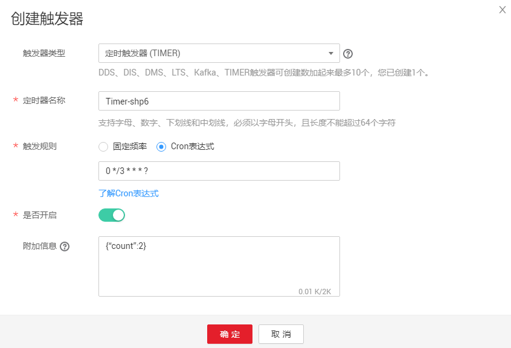
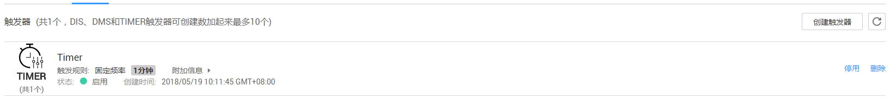

# 使用定时触发器

本节介绍创建定时触发器，按照设置的频率，定期触发函数运行，供用户了解定时触发器的使用方法。

关于定时触发器事件源具体介绍请参见[支持的事件源](http://support.huaweicloud.com/devg-functiongraph/functiongraph_02_0102.html)。

## 前提条件

进行操作之前，需要做好以下准备。

-   已经在函数工作流服务创建函数，创建过程请参考[代码上传方式创建HelloWorld函数](代码上传方式创建HelloWorld函数.md)。

## 创建定时触发器

1.  登录FunctionGraph，进入“函数”界面。
2.  在“函数”界面，选择“函数列表”，单击HelloWorld函数名称，进入HelloWorld函数详情界面。
3.  在HelloWorld函数详情界面，单击“触发器”页签。
4.  在“触发器”页签，单击“创建触发器”，如[图1](#fig19176131502019)所示，弹出“创建触发器”界面。

    **图 1**  创建定时触发器  
    

5.  在“创建触发器”界面，触发器类型选择“定时触发器 \(TIMER\)”，填写触发器信息，如[表1](#table24155858113256)所示，带\*参数为必填项。

    **表 1**  定时触发器信息表

    
    <table><thead align="left"><tr id="row24918708113256"><th class="cellrowborder" valign="top" width="50%" id="mcps1.2.3.1.1">
字段

    </th>
    <th class="cellrowborder" valign="top" width="50%" id="mcps1.2.3.1.2">
填写说明

    </th>
    </tr>
    </thead>
    <tbody><tr id="row30021527113256"><td class="cellrowborder" valign="top" width="50%" headers="mcps1.2.3.1.1 ">
*定时器名称

    </td>
    <td class="cellrowborder" valign="top" width="50%" headers="mcps1.2.3.1.2 ">
输入“Timer”。

    </td>
    </tr>
    <tr id="row60516450113256"><td class="cellrowborder" valign="top" width="50%" headers="mcps1.2.3.1.1 ">
*触发规则

    </td>
    <td class="cellrowborder" valign="top" width="50%" headers="mcps1.2.3.1.2 "><ul id="ul86177526204"><li>固定频率
固定时间间隔触发函数，该类型下支持配置单位为分、时、天，每种类型仅支持整数配置，其中分钟支持范围(0，60]，小时支持范围(0，24]，天支持范围(0，30]。

    </li><li>Cron表达式
可以完成更为复杂的函数执行计划：如周一到周五上午08:30:00执行函数等。请参考<a href="函数定时触发器Cron表达式规则.md">函数定时触发器Cron表达式规则</a>。

    </li></ul>
    
选择固定频率，输入“1”，单位选择“分钟”。

    </td>
    </tr>
    <tr id="row23066815113256"><td class="cellrowborder" valign="top" width="50%" headers="mcps1.2.3.1.1 ">
是否开启

    </td>
    <td class="cellrowborder" valign="top" width="50%" headers="mcps1.2.3.1.2 ">
是否开启定时触发器，使用默认值“开启”。

    </td>
    </tr>
    <tr id="row30912510113256"><td class="cellrowborder" valign="top" width="50%" headers="mcps1.2.3.1.1 ">
附加信息

    </td>
    <td class="cellrowborder" valign="top" width="50%" headers="mcps1.2.3.1.2 ">
如果用户配置了触发事件，会将该事件填写到TIMER事件源的"user_event"字段，详情请参考<a href="http://support.huaweicloud.com/devg-functiongraph/functiongraph_02_0102.html" target="_blank" rel="noopener noreferrer">支持的事件源</a>。

    </td>
    </tr>
    </tbody>
    </table>

6.  单击“确定”，完成触发器创建，如[图2](#fig17618154116211)所示。

    **图 2**  Timer触发器  
    

    > **说明：**   
    >每隔1分钟，触发函数执行一次。  

## 查看函数运行结果

HelloWorld函数的定时触发器创建以后，每隔一分钟执行一次函数，可以查看函数运行日志。

1.  登录FunctionGraph，进入“函数”界面。
2.  在“函数”界面，选择“函数列表”，单击HelloWorld函数名称，进入HelloWorld函数详情界面。
3.  在HelloWorld函数详情界面，单击“日志”页签，查询函数运行日志。
4.  单击操作栏的“查看上下文”，查看日志详细信息。

