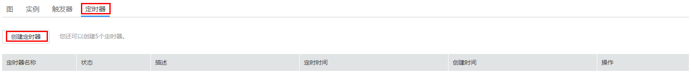
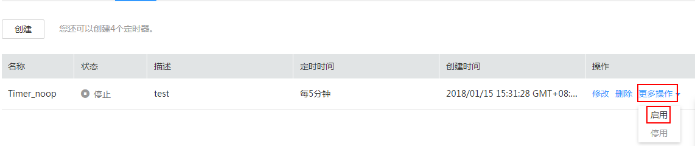
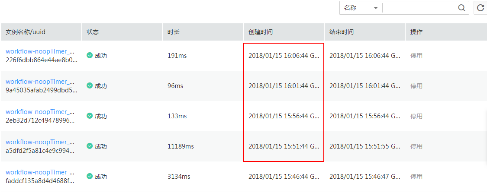

# 使用工作流定时器

本节介绍为工作流创建定时器，启用定时器来定时完成工作流实例的执行。

## 前提条件

已创建HelloWorld工作流，具体创建过程请参见[代码上传方式创建HelloWorld函数](代码上传方式创建HelloWorld函数.md)。

## 创建定时器

1.  用户登录FunctionGraph，选择“工作流\>工作流列表”，进入“工作流列表”界面。
2.  在“工作流列表”界面，单击“workflow-noop”工作流名称，进入工作流详情界面。
3.  在工作流详情界面，单击“定时器”页签，进入定时器界面。
4.  在定时器页签，单击“创建”，如[图1](#fig1770535341712)所示，弹出“创建定时器”界面。

    **图 1**  创建工作流定时器  
    

5.  在“创建定时器”界面，输入如下信息，如[表1](#table377492810199)所示，带\*参数为必填项。

    **表 1**  定时器参数说明

    
    <table><thead align="left"><tr id="row19774102818198"><th class="cellrowborder" valign="top" width="50%" id="mcps1.2.3.1.1">
参数

    </th>
    <th class="cellrowborder" valign="top" width="50%" id="mcps1.2.3.1.2">
说明

    </th>
    </tr>
    </thead>
    <tbody><tr id="row117741328201917"><td class="cellrowborder" valign="top" width="50%" headers="mcps1.2.3.1.1 ">
*定时器名称

    </td>
    <td class="cellrowborder" valign="top" width="50%" headers="mcps1.2.3.1.2 ">
名称必须以字母或数字开头，只能由字母、数字、下划线和中划线组成，长度小于等于32个字符，且同一工作流下不能重名。

    
输入“Timer_noop”。

    </td>
    </tr>
    <tr id="row877417285193"><td class="cellrowborder" valign="top" width="50%" headers="mcps1.2.3.1.1 ">
*定时方式

    </td>
    <td class="cellrowborder" valign="top" width="50%" headers="mcps1.2.3.1.2 ">
固定频率和cron表达式，两者二选一。

    
选择“固定频率”。

    </td>
    </tr>
    <tr id="row117742285199"><td class="cellrowborder" valign="top" width="50%" headers="mcps1.2.3.1.1 ">
*定时时间

    </td>
    <td class="cellrowborder" valign="top" width="50%" headers="mcps1.2.3.1.2 ">
定时时间有两种方式：固定频率和Cron表达式。

    <ul id="ul18461540181612"><li>固定频率，目前支持分钟、小时、天，定时时间需输入整数。</li><li>cron表达式，可以完成更为复杂的工作流执行计划：如每周最后一天、20XX年3月5号执行工作流等，具体规则请参见<a href="函数定时触发器Cron表达式规则.md">函数定时触发器Cron表达式规则</a>。</li></ul>
    
输入“5”，选择“分钟”，即每隔5分钟执行一次工作流。

    </td>
    </tr>
    <tr id="row1477414285193"><td class="cellrowborder" valign="top" width="50%" headers="mcps1.2.3.1.1 ">
描述

    </td>
    <td class="cellrowborder" valign="top" width="50%" headers="mcps1.2.3.1.2 ">
对定时器的描述，输入规则：

    
工作流描述可以为空或者只能包含大写字母、小写字母、数字和特殊字符(,.:-)，长度小于等于256个字符。

    
输入“test”。

    </td>
    </tr>
    </tbody>
    </table>

6.  单击“确定”，完成定时器创建。

## 启用定时器

定时器创建完成后，需要启用定时器后工作流才会按照定时器规则执行。对于固定频率定时器，以启用定时器的时间为基准，计算定时执行时间。

1.  用户登录FunctionGraph，选择“工作流\>工作流列表”，进入“工作流列表”界面。
2.  在“工作流列表”界面，单击“workflow-noop”工作流名称，进入工作流详情界面。
3.  在工作流详情界面，单击“定时器”页签，进入“定时器”界面。
4.  在“定时器”页签，选中定时器，单击操作栏“更多操作\>启用”，启用定时器，如[图2](#fig483106184116)所示。

    **图 2**  启用定时器  
    

5.  在“实例”页签，可以查看定时器启动的实例，如[图3](#fig57511244154512)所示。

    **图 3**  定时器启动示例  
    

6.  在启用定时器后，至少等待5分钟，在“实例”页签可查看工作流根据定时器设置的频率，自动执行生成的实例，如[图4](#fig13711551185)所示。

    **图 4**  自动执行生成示例  
    

    > **说明：**   
    >可以看到，启用定时器后，每隔5分钟，自动执行一次工作流。  

