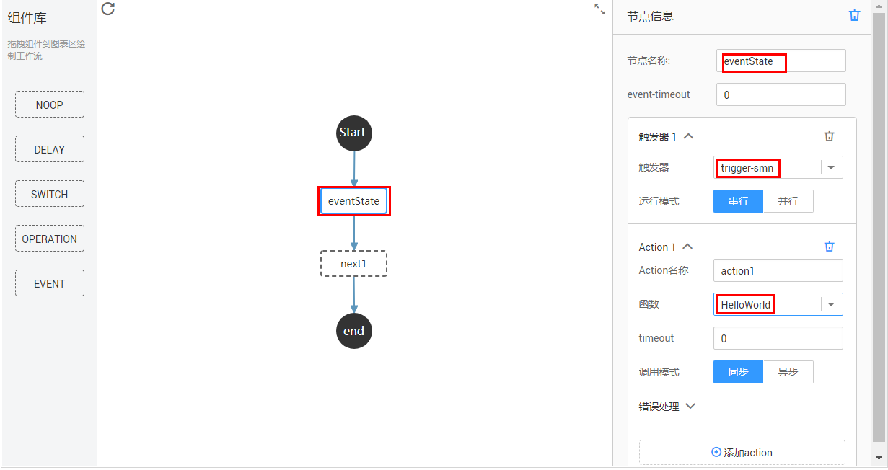

# 使用工作流编排函数

构建函数以后，可以使用触发器触发函数，也可以通过工作流编排函数，把一组函数按照预定的逻辑编排，工作流会将输入传递给函数，触发函数执行，然后处理函数返回结果，作为输入触发下一个函数执行，从而实现复杂的业务功能。

工作流支持图形编排、代码编排两种方式编排函数，如[图1](#fig206771040101614)、[图2](#fig14523121241515)所示。

**图 1**  图形编排函数  

**图 2**  代码编排函数  

此外工作流还内置了5种常用的编排模板，用户可以在此基础上组合使用，如[表1](#table536839433)所示。

**表 1**  工作流模板说明

<table><thead align="left"><tr id="row98803369433"><th class="cellrowborder" valign="top" width="33.33333333333333%" id="mcps1.2.4.1.1">
模板类别

</th>
<th class="cellrowborder" valign="top" width="33.33333333333333%" id="mcps1.2.4.1.2">
模板名称

</th>
<th class="cellrowborder" valign="top" width="33.33333333333333%" id="mcps1.2.4.1.3">
模板说明

</th>
</tr>
</thead>
<tbody><tr id="row400863009433"><td class="cellrowborder" rowspan="5" valign="top" width="33.33333333333333%" headers="mcps1.2.4.1.1 ">
通用模板

</td>
<td class="cellrowborder" valign="top" width="33.33333333333333%" headers="mcps1.2.4.1.2 ">
HelloWorld

</td>
<td class="cellrowborder" valign="top" width="33.33333333333333%" headers="mcps1.2.4.1.3 ">
不做处理，直接将输入作为输出。

</td>
</tr>
<tr id="row299889049433"><td class="cellrowborder" valign="top" headers="mcps1.2.4.1.1 ">
Event

</td>
<td class="cellrowborder" valign="top" headers="mcps1.2.4.1.2 ">
设置一系列等待的事件，当事件触发时做相应处理后，流转到对应的state。

</td>
</tr>
<tr id="row665189139433"><td class="cellrowborder" valign="top" headers="mcps1.2.4.1.1 ">
Operation

</td>
<td class="cellrowborder" valign="top" headers="mcps1.2.4.1.2 ">
设置一个或者多个Action（即FunctionGraph函数）。完成相应的函数功能再继续下一个state。

</td>
</tr>
<tr id="row125071899433"><td class="cellrowborder" valign="top" headers="mcps1.2.4.1.1 ">
Switch

</td>
<td class="cellrowborder" valign="top" headers="mcps1.2.4.1.2 ">
根据值的匹配可以流转到不同的后续state处理。

</td>
</tr>
<tr id="row552871319433"><td class="cellrowborder" valign="top" headers="mcps1.2.4.1.1 ">
Delay

</td>
<td class="cellrowborder" valign="top" headers="mcps1.2.4.1.2 ">
等待一段时间然后继续下一个state。

</td>
</tr>
<tr id="row645554759433"><td class="cellrowborder" valign="top" width="33.33333333333333%" headers="mcps1.2.4.1.1 ">
自定义

</td>
<td class="cellrowborder" valign="top" width="33.33333333333333%" headers="mcps1.2.4.1.2 ">
-

</td>
<td class="cellrowborder" valign="top" width="33.33333333333333%" headers="mcps1.2.4.1.3 ">
根据需要自定义工作流，工作流开发请参考<a href="https://support.huaweicloud.com/devg-functiongraph/functiongraph_02_0101.html" target="_blank" rel="noopener noreferrer">《FunctionGraph开发指南》</a>。

</td>
</tr>
</tbody>
</table>

