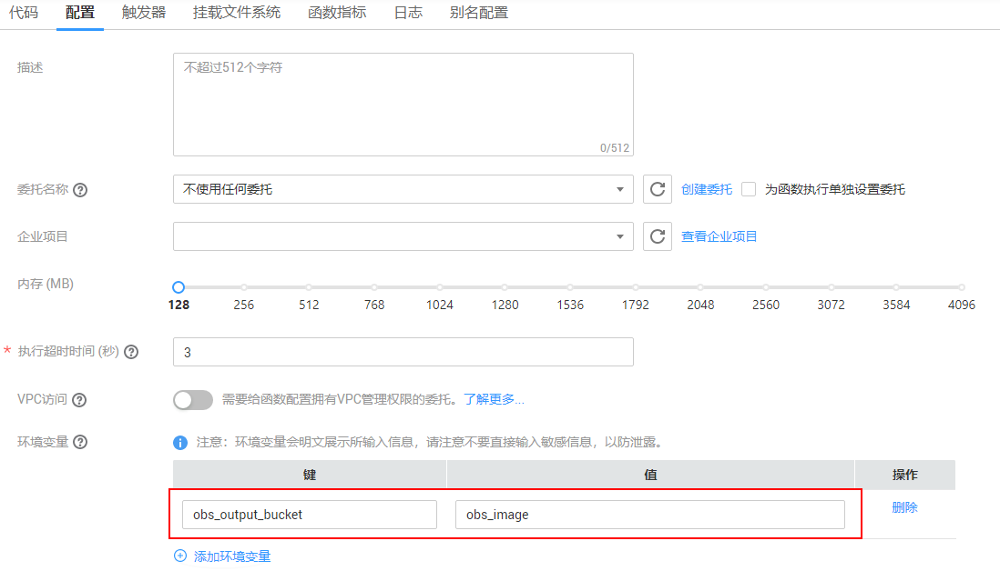

# 使用环境变量<a name="functiongraph_01_0403"></a>

使用环境变量设置以下信息：安装文件的目录、存储输出的位置、存储连接和日志记录设置等。这些设置与应用程序逻辑解耦，在需要变更设置时，无需更新函数代码。

在如下函数代码片段中，参数“obs\_output\_bucket”为图片处理后存储地址。

```
def handler(event, context):
    srcBucket, srcObjName = getObsObjInfo4OBSTrigger(event)
    obs_address = context.getUserData('obs_address')
    outputBucket = context.getUserData('obs_output_bucket')
    if obs_address is None:
        obs_address = '{obs_address_ip}'
    if outputBucket is None:
        outputBucket = 'casebucket-out'
            
    ak = context.getAccessKey()
    sk = context.getSecretKey()

    # download file uploaded by user from obs
    GetObject(obs_address, srcBucket, srcObjName, ak, sk)

    outFile = watermark_image(srcObjName)
    
    # 将转换后的文件上传到新的obs桶中
    PostObject (obs_address, outputBucket, outFile, ak, sk)

    return 'OK'

```

通过设置环境变量obs\_output\_bucket，可以灵活设置存储输出图片的OBS桶，如[图1](#fig42684641913)所示。

**图 1**  环境变量<a name="fig42684641913"></a>  


