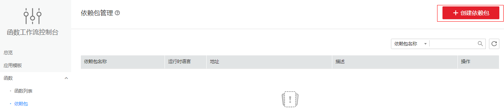
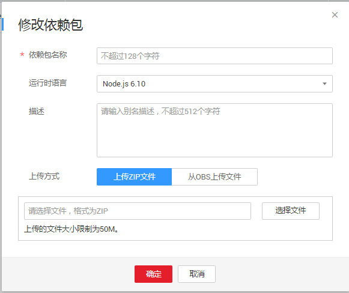
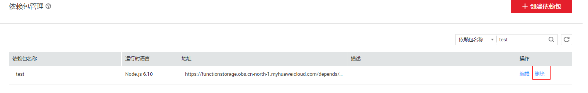

# 依赖包管理

依赖包管理模块统一管理用户所有的依赖包，用户可以通过本地上传和obs地址的形式上传依赖包，并为依赖包命名。

## 创建依赖包

1.  用户登录FunctionGraph，进入“函数”界面。
2.  选择“依赖包”进入依赖包管理界面，点击界面中的“创建依赖包”，如[图1](#fig397504405519)所示。

    **图 1**  依赖包界面  
    

3.  在弹出的“创建依赖包”界面输入依赖包名称等信息，如[图2](#fig24191426102712)所示。

    **图 2**  创建依赖包  
    

    > **说明：**   
    >1.  依赖包名称，命名规则为：  
    >    -   可包含字母、数字、下划线和中划线，长度不超过60个字符。  
    >    -   以大/小写字母开头，以字母或数字结尾。  
    >2.  用户可以通过本地上传和obs地址的形式上传依赖包。  

4.  点击“确定”完成创建。

## 配置函数依赖

1.  用户登录FunctionGraph，进入“函数”界面。
2.  选择“函数列表”，点击函数名称进入函数详情页面。
3.  选择“代码”页签，在“依赖代码包”处点击“添加”。
4.  在弹出的依赖包选择界面中，选择依赖包，点击确定，如[图3](#fig8914144710536)所示。

    **图 3**  选择依赖包  
    

    > **说明：**   
    >-   一个函数最多可添加20个依赖包。  
    >-   除了用户自己创建的依赖包（私有依赖包）以外，FunctionGraph还提供了一些常见的公共依赖包，用户可以直接选择使用。  

## 删除依赖包

1.  用户登录FunctionGraph，进入“函数”界面。
2.  选择“依赖包”，在需要删除的依赖包操作栏点击“删除”。如[图4](#fig17954185805912)所示。

    **图 4**  删除  
    

3.  点击“确定”。

    > **说明：**   
    >如果当前已经有函数使用了该依赖包，则无法删除。  

