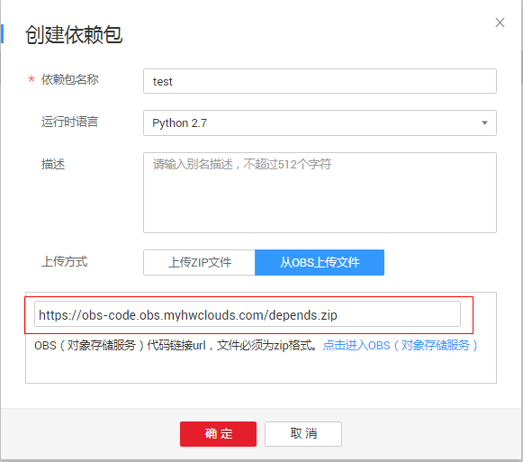
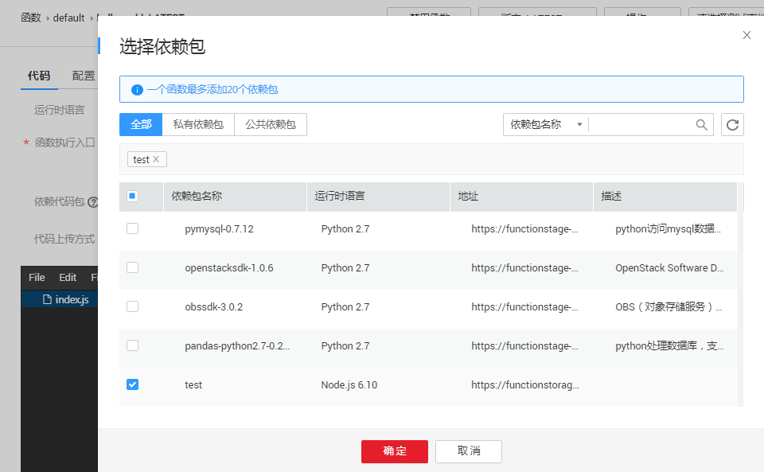

# 依赖包管理<a name="functiongraph_01_0391"></a>

依赖包管理模块统一管理用户所有的依赖包，用户可以通过本地上传和obs地址的形式上传依赖包，并为依赖包命名。

## 创建依赖包<a name="section20663228121820"></a>

1.  用户登录[FunctionGraph](https://auth.huaweicloud.com/authui/login?service=https%3A%2F%2Fconsole.huaweicloud.com%2Ffunctiongraph%2F%3Fregion%3Dcn-north-1%26locale%3Dzh-cn%26activityId%3D3%26cloud_route_state%3D%2Fserverless%2Fdashboard#/login)，进入“函数”界面。
2.  选择“依赖包”进入依赖包管理界面，点击界面中的“创建依赖包”，如[图1](#fig397504405519)所示。

    **图 1**  依赖包界面<a name="fig397504405519"></a>  
    

3.  在弹出的“创建依赖包”界面输入依赖包名称等信息，如[图2](#fig24191426102712)所示。

    **图 2**  创建依赖包<a name="fig24191426102712"></a>  
    

    > **说明：**   
    >1.  依赖包名称，命名规则为：  
    >    -   可包含字母、数字、下划线和中划线，长度不超过60个字符。  
    >    -   以大/小写字母开头，以字母或数字结尾。  
    >2.  用户可以通过本地上传和obs地址的形式上传依赖包。  

4.  点击“确定”完成创建。

## 配置函数依赖<a name="section17207213143810"></a>

1.  用户登录[FunctionGraph](https://auth.huaweicloud.com/authui/login?service=https%3A%2F%2Fconsole.huaweicloud.com%2Ffunctiongraph%2F%3Fregion%3Dcn-north-1%26locale%3Dzh-cn%26activityId%3D3%26cloud_route_state%3D%2Fserverless%2Fdashboard#/login)，进入“函数”界面。
2.  选择“函数列表”，点击函数名称进入函数详情页面。
3.  选择“代码”页签，在“依赖代码包”处点击“添加”。
4.  在弹出的依赖包选择界面中，选择依赖包，点击确定，如[图3](#fig8914144710536)所示。

    **图 3**  选择依赖包<a name="fig8914144710536"></a>  
    

    > **说明：**   
    >-   一个函数最多可添加20个依赖包。  
    >-   除了用户自己创建的依赖包（私有依赖包）以外，FunctionGraph还提供了一些常见的公共依赖包，用户可以直接选择使用。  


## 删除依赖包<a name="section176546567"></a>

1.  用户登录[FunctionGraph](https://auth.huaweicloud.com/authui/login?service=https%3A%2F%2Fconsole.huaweicloud.com%2Ffunctiongraph%2F%3Fregion%3Dcn-north-1%26locale%3Dzh-cn%26activityId%3D3%26cloud_route_state%3D%2Fserverless%2Fdashboard#/login)，进入“函数”界面。
2.  选择“依赖包”，在需要删除的依赖包操作栏点击“删除”。如[图4](#fig17954185805912)所示。

    **图 4**  删除<a name="fig17954185805912"></a>  
    

3.  点击“确定”。

    > **说明：**   
    >如果当前已经有函数使用了该依赖包，则无法删除。  


## 引入依赖库<a name="section15256184918590"></a>

**支持的依赖库说明**

FunctionGraph支持引入标准库及第三方依赖库。

-   标准库

    对于标准库，无论是在线编辑或是线下开发打包上传至FunctionGraph，均可以直接在代码中引入，使用其功能。

-   FunctionGraph支持的非标准库

    FunctionGraph内置一些三方件，如[表1](#table143351951242)、[表2](#table39721459145614)所示。像标准库一样，在编写代码时直接引入，使用其功能。

    **表 1**  Node.js Runtime集成的三方件

    <a name="table143351951242"></a>
    <table><thead align="left"><tr id="row15336557411"><th class="cellrowborder" valign="top" width="28.532853285328528%" id="mcps1.2.4.1.1"><p id="p1033655643"><a name="p1033655643"></a><a name="p1033655643"></a>名称</p>
    </th>
    <th class="cellrowborder" valign="top" width="38.133813381338136%" id="mcps1.2.4.1.2"><p id="p233635143"><a name="p233635143"></a><a name="p233635143"></a>功能</p>
    </th>
    <th class="cellrowborder" valign="top" width="33.33333333333333%" id="mcps1.2.4.1.3"><p id="p1733612515413"><a name="p1733612515413"></a><a name="p1733612515413"></a>版本号</p>
    </th>
    </tr>
    </thead>
    <tbody><tr id="row113361153412"><td class="cellrowborder" valign="top" width="28.532853285328528%" headers="mcps1.2.4.1.1 "><p id="p1336195243"><a name="p1336195243"></a><a name="p1336195243"></a>q</p>
    </td>
    <td class="cellrowborder" valign="top" width="38.133813381338136%" headers="mcps1.2.4.1.2 "><p id="p12336151410"><a name="p12336151410"></a><a name="p12336151410"></a>异步方法封装</p>
    </td>
    <td class="cellrowborder" valign="top" width="33.33333333333333%" headers="mcps1.2.4.1.3 "><p id="p18336851148"><a name="p18336851148"></a><a name="p18336851148"></a>1.5.1</p>
    </td>
    </tr>
    <tr id="row33369511419"><td class="cellrowborder" valign="top" width="28.532853285328528%" headers="mcps1.2.4.1.1 "><p id="p123366511415"><a name="p123366511415"></a><a name="p123366511415"></a>co</p>
    </td>
    <td class="cellrowborder" valign="top" width="38.133813381338136%" headers="mcps1.2.4.1.2 "><p id="p17336751942"><a name="p17336751942"></a><a name="p17336751942"></a>异步流程控制</p>
    </td>
    <td class="cellrowborder" valign="top" width="33.33333333333333%" headers="mcps1.2.4.1.3 "><p id="p173361651142"><a name="p173361651142"></a><a name="p173361651142"></a>4.6.0</p>
    </td>
    </tr>
    <tr id="row103361751945"><td class="cellrowborder" valign="top" width="28.532853285328528%" headers="mcps1.2.4.1.1 "><p id="p833614510419"><a name="p833614510419"></a><a name="p833614510419"></a>lodash</p>
    </td>
    <td class="cellrowborder" valign="top" width="38.133813381338136%" headers="mcps1.2.4.1.2 "><p id="p1633611514410"><a name="p1633611514410"></a><a name="p1633611514410"></a>常用工具方法库</p>
    </td>
    <td class="cellrowborder" valign="top" width="33.33333333333333%" headers="mcps1.2.4.1.3 "><p id="p14336457412"><a name="p14336457412"></a><a name="p14336457412"></a>4.17.10</p>
    </td>
    </tr>
    <tr id="row10336550412"><td class="cellrowborder" valign="top" width="28.532853285328528%" headers="mcps1.2.4.1.1 "><p id="p93361251844"><a name="p93361251844"></a><a name="p93361251844"></a>esdk-obs-nodejs</p>
    </td>
    <td class="cellrowborder" valign="top" width="38.133813381338136%" headers="mcps1.2.4.1.2 "><p id="p143361453415"><a name="p143361453415"></a><a name="p143361453415"></a>OBS sdk</p>
    </td>
    <td class="cellrowborder" valign="top" width="33.33333333333333%" headers="mcps1.2.4.1.3 "><p id="p203383519412"><a name="p203383519412"></a><a name="p203383519412"></a>2.1.5</p>
    </td>
    </tr>
    <tr id="row99017489112"><td class="cellrowborder" valign="top" width="28.532853285328528%" headers="mcps1.2.4.1.1 "><p id="p441934817265"><a name="p441934817265"></a><a name="p441934817265"></a>express</p>
    </td>
    <td class="cellrowborder" valign="top" width="38.133813381338136%" headers="mcps1.2.4.1.2 "><p id="p1141984892615"><a name="p1141984892615"></a><a name="p1141984892615"></a>极简web开发框架</p>
    </td>
    <td class="cellrowborder" valign="top" width="33.33333333333333%" headers="mcps1.2.4.1.3 "><p id="p1341974802613"><a name="p1341974802613"></a><a name="p1341974802613"></a>4.16.4</p>
    </td>
    </tr>
    <tr id="row6439151514"><td class="cellrowborder" valign="top" width="28.532853285328528%" headers="mcps1.2.4.1.1 "><p id="p5572124552610"><a name="p5572124552610"></a><a name="p5572124552610"></a>fgs-express</p>
    </td>
    <td class="cellrowborder" valign="top" width="38.133813381338136%" headers="mcps1.2.4.1.2 "><p id="p17572104515268"><a name="p17572104515268"></a><a name="p17572104515268"></a>在FunctionGraph和API Gateway之上使用现有的Node.js应用程序框架运行无服务器应用程序和REST API 。提供的示例允许您使用Express框架轻松构建无服务器Web应用程序/服务和RESTful API 。</p>
    </td>
    <td class="cellrowborder" valign="top" width="33.33333333333333%" headers="mcps1.2.4.1.3 "><p id="p357334510265"><a name="p357334510265"></a><a name="p357334510265"></a>1.0.1</p>
    </td>
    </tr>
    <tr id="row74216551117"><td class="cellrowborder" valign="top" width="28.532853285328528%" headers="mcps1.2.4.1.1 "><p id="p194242051192617"><a name="p194242051192617"></a><a name="p194242051192617"></a>request</p>
    </td>
    <td class="cellrowborder" valign="top" width="38.133813381338136%" headers="mcps1.2.4.1.2 "><p id="p0424195115262"><a name="p0424195115262"></a><a name="p0424195115262"></a>简化http调用, 支持HTTPS并默认遵循重定向</p>
    </td>
    <td class="cellrowborder" valign="top" width="33.33333333333333%" headers="mcps1.2.4.1.3 "><p id="p1942410516269"><a name="p1942410516269"></a><a name="p1942410516269"></a>2.88.0</p>
    </td>
    </tr>
    </tbody>
    </table>

    **表 2**  Python Runtime支持的非标准库

    <a name="table39721459145614"></a>
    <table><thead align="left"><tr id="row38504252145614"><th class="cellrowborder" valign="top" width="33.33333333333333%" id="mcps1.2.4.1.1"><p id="p18095115145614"><a name="p18095115145614"></a><a name="p18095115145614"></a>模块</p>
    </th>
    <th class="cellrowborder" valign="top" width="33.33333333333333%" id="mcps1.2.4.1.2"><p id="p56418216145614"><a name="p56418216145614"></a><a name="p56418216145614"></a>功能</p>
    </th>
    <th class="cellrowborder" valign="top" width="33.33333333333333%" id="mcps1.2.4.1.3"><p id="p6472802145614"><a name="p6472802145614"></a><a name="p6472802145614"></a>版本号</p>
    </th>
    </tr>
    </thead>
    <tbody><tr id="row27527076145614"><td class="cellrowborder" valign="top" width="33.33333333333333%" headers="mcps1.2.4.1.1 "><p id="p61556839145835"><a name="p61556839145835"></a><a name="p61556839145835"></a>dateutil</p>
    </td>
    <td class="cellrowborder" valign="top" width="33.33333333333333%" headers="mcps1.2.4.1.2 "><p id="p20048058145835"><a name="p20048058145835"></a><a name="p20048058145835"></a>日期/时间处理</p>
    </td>
    <td class="cellrowborder" valign="top" width="33.33333333333333%" headers="mcps1.2.4.1.3 "><p id="p13280010145835"><a name="p13280010145835"></a><a name="p13280010145835"></a>2.6.0</p>
    </td>
    </tr>
    <tr id="row31269908145614"><td class="cellrowborder" valign="top" width="33.33333333333333%" headers="mcps1.2.4.1.1 "><p id="p20787913145835"><a name="p20787913145835"></a><a name="p20787913145835"></a>requests</p>
    </td>
    <td class="cellrowborder" valign="top" width="33.33333333333333%" headers="mcps1.2.4.1.2 "><p id="p6099393145835"><a name="p6099393145835"></a><a name="p6099393145835"></a>http库</p>
    </td>
    <td class="cellrowborder" valign="top" width="33.33333333333333%" headers="mcps1.2.4.1.3 "><p id="p21238847145835"><a name="p21238847145835"></a><a name="p21238847145835"></a>2.7.0</p>
    </td>
    </tr>
    <tr id="row49919776145614"><td class="cellrowborder" valign="top" width="33.33333333333333%" headers="mcps1.2.4.1.1 "><p id="p2253865145835"><a name="p2253865145835"></a><a name="p2253865145835"></a>httplib2</p>
    </td>
    <td class="cellrowborder" valign="top" width="33.33333333333333%" headers="mcps1.2.4.1.2 "><p id="p48345381145835"><a name="p48345381145835"></a><a name="p48345381145835"></a>httpclient</p>
    </td>
    <td class="cellrowborder" valign="top" width="33.33333333333333%" headers="mcps1.2.4.1.3 "><p id="p23661785145835"><a name="p23661785145835"></a><a name="p23661785145835"></a>0.10.3</p>
    </td>
    </tr>
    <tr id="row62147669142314"><td class="cellrowborder" valign="top" width="33.33333333333333%" headers="mcps1.2.4.1.1 "><p id="p37098266142327"><a name="p37098266142327"></a><a name="p37098266142327"></a>numpy</p>
    </td>
    <td class="cellrowborder" valign="top" width="33.33333333333333%" headers="mcps1.2.4.1.2 "><p id="p12907260142336"><a name="p12907260142336"></a><a name="p12907260142336"></a>数学计算</p>
    </td>
    <td class="cellrowborder" valign="top" width="33.33333333333333%" headers="mcps1.2.4.1.3 "><p id="p25505478142347"><a name="p25505478142347"></a><a name="p25505478142347"></a>1.13.1</p>
    </td>
    </tr>
    <tr id="row14959080145614"><td class="cellrowborder" valign="top" width="33.33333333333333%" headers="mcps1.2.4.1.1 "><p id="p56491286145835"><a name="p56491286145835"></a><a name="p56491286145835"></a>redis</p>
    </td>
    <td class="cellrowborder" valign="top" width="33.33333333333333%" headers="mcps1.2.4.1.2 "><p id="p12391471145835"><a name="p12391471145835"></a><a name="p12391471145835"></a>redis客户端</p>
    </td>
    <td class="cellrowborder" valign="top" width="33.33333333333333%" headers="mcps1.2.4.1.3 "><p id="p31607657145835"><a name="p31607657145835"></a><a name="p31607657145835"></a>2.10.5</p>
    </td>
    </tr>
    <tr id="row51131826145614"><td class="cellrowborder" valign="top" width="33.33333333333333%" headers="mcps1.2.4.1.1 "><p id="p35946515145835"><a name="p35946515145835"></a><a name="p35946515145835"></a>obsclient</p>
    </td>
    <td class="cellrowborder" valign="top" width="33.33333333333333%" headers="mcps1.2.4.1.2 "><p id="p25986613145835"><a name="p25986613145835"></a><a name="p25986613145835"></a>OBS客户端</p>
    </td>
    <td class="cellrowborder" valign="top" width="33.33333333333333%" headers="mcps1.2.4.1.3 "><p id="p41658471145835"><a name="p41658471145835"></a><a name="p41658471145835"></a>-</p>
    </td>
    </tr>
    <tr id="row67511052536"><td class="cellrowborder" valign="top" width="33.33333333333333%" headers="mcps1.2.4.1.1 "><p id="p20456111512267"><a name="p20456111512267"></a><a name="p20456111512267"></a>smnsdk</p>
    </td>
    <td class="cellrowborder" valign="top" width="33.33333333333333%" headers="mcps1.2.4.1.2 "><p id="p14527042152416"><a name="p14527042152416"></a><a name="p14527042152416"></a>访问公有云smn服务</p>
    </td>
    <td class="cellrowborder" valign="top" width="33.33333333333333%" headers="mcps1.2.4.1.3 "><p id="p5530154219246"><a name="p5530154219246"></a><a name="p5530154219246"></a>1.0.1</p>
    </td>
    </tr>
    </tbody>
    </table>


-   其他第三方库（FunctionGraph暂没有内置的非标准三方库）

    将依赖的第三方库打包，上传至OBS桶，在创建函数时配置依赖包的OBS存储地址，在函数代码中即可使用其功能。


**引入依赖库示例**

处理图片的函数代码如下。

```
# -*- coding: utf-8 -*-

import json
import sys
import os

from PIL import Image

from com.obs.client.obs_client import ObsClient
from com.obs.models.create_bucket_header import CreateBucketHeader
from com.obs.models.head_permission import HeadPermission
from com.obs.models.grant import Grant,Permission
from com.obs.models.grantee import Grantee,Group
from com.obs.models.owner import Owner
from com.obs.models.acl import ACL
from com.obs.models.versions import Versions
from com.obs.models.rule import Rule
from com.obs.models.lifecycle import Lifecycle
from com.obs.models.expiration import Expiration,NoncurrentVersionExpiration
from com.obs.models.date_time import DateTime
from com.obs.models.condition import Condition
from com.obs.models.redirect import Redirect
from com.obs.models.routing_rule import RoutingRule
from com.obs.models.error_document import ErrorDocument
from com.obs.models.index_document import IndexDocument
from com.obs.models.redirect_all_request_to import RedirectAllRequestTo
from com.obs.models.website_configuration import WebsiteConfiguration
from com.obs.models.tag import TagInfo
from com.obs.models.logging import Logging
from com.obs.models.cors_rule import CorsRule
from com.obs.models.options import Options
from com.obs.models.notification import Notification, FilterRule
from com.obs.models.delete_objects_request import DeleteObjectsRequest,Object
from com.obs.models.restore import TierType
from com.obs.models.complete_multipart_upload_request import CompleteMultipartUploadRequest, CompletePart
from com.obs.models.list_multipart_uploads_request import ListMultipartUploadsRequest
from com.obs.models.put_object_header import PutObjectHeader
from com.obs.models.copy_object_header import CopyObjectHeader
from com.obs.models.get_object_header import GetObjectHeader
from com.obs.models.get_object_request import GetObjectRequest
from com.obs.response.get_result import ObjectStream
from com.obs.models.server_side_encryption import SseKmsHeader,SseCHeader
from com.obs.log.Log import *
```

对于标准库和FunctionGraph支持的非标准库，可以直接引入。

对于FunctionGraph暂没有内置的非标准三方库，通过以下步骤引入。

1.  将依赖的库文件打包（ZIP包），上传至OBS存储桶，获得依赖包的OBS存储链接，如[图5](#fig25831619101417)所示。

    **图 5**  上传依赖包至OBS<a name="fig25831619101417"></a>  
    

2.  在函数界面选择“依赖包”，进入依赖包界面，选择“创建依赖包”，如[图6](#fig17285348185416)所示。

    **图 6**  依赖包管理界面<a name="fig17285348185416"></a>  
    

3.  在创建依赖包界面中输入OBS存储链接，创建依赖代码包，如[图7](#fig19291348174016)所示。

    **图 7**  设置依赖包<a name="fig19291348174016"></a>  
    

4.  进入函数详情页面，选择“代码”页签，在“依赖代码包”处点击“添加”，配置依赖包，如[图8](#fig99985398482)所示。

    **图 8**  添加依赖包<a name="fig99985398482"></a>  
    

5.  在代码中引入依赖库，示例如[图9](#fig1657211475124)所示。

    **图 9**  引入依赖库示例<a name="fig1657211475124"></a>  
    

    > **警告：**   
    >依赖代码包里面的依赖文件不能和代码文件同名，比如依赖包depends.zip，里面有index.py这个文件，如果代码采用在线编辑方式，函数执行入口为index.handler，这样在函数执行的时候会产生一个代码文件index.py，跟依赖包里面的index.py文件同名，两个文件会因覆盖合并而出错。  


