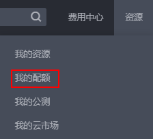

# 关于配额

## 什么是配额？

为防止资源滥用，平台限定了各服务资源的配额，对用户的资源数量和容量做了限制。如您最多可以创建多少台弹性云服务器、多少块云硬盘。

如果当前资源配额限制无法满足使用需要，您可以申请扩大配额。

## 怎样查看我的配额？

1.  登录管理控制台。
2.  在页面右上角，选择“资源 \> 我的配额”。系统进入“服务配额”页面。

    **图 1**  进入服务配额页面  
    

3.  您可以在“服务配额”页面，查看各项资源的总配额及使用情况。

    如果当前配额不能满足业务要求，请参考后续操作，申请扩大配额。

## 如何申请扩大配额？

1.  登录管理控制台。
2.  在页面右上角，选择“资源 \> 我的配额”。系统进入“服务配额”页面。

    **图 2**  进入“服务配额”页面  
    

3.  单击“申请扩大配额”。
4.  在“新建工单”页面，根据您的需求，填写相关参数。

    其中，“问题描述”项请填写需要调整的内容和申请原因。

5.  填写完毕后，勾选协议并单击“提交”。

