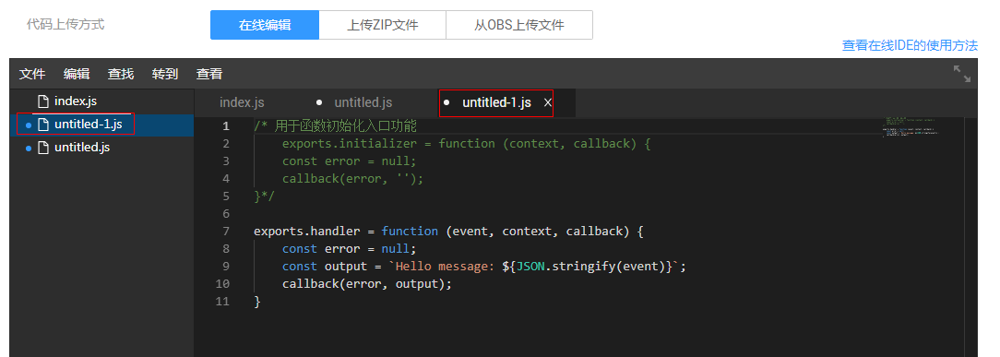
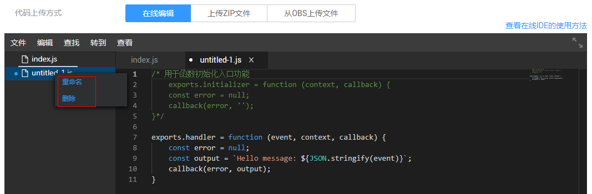
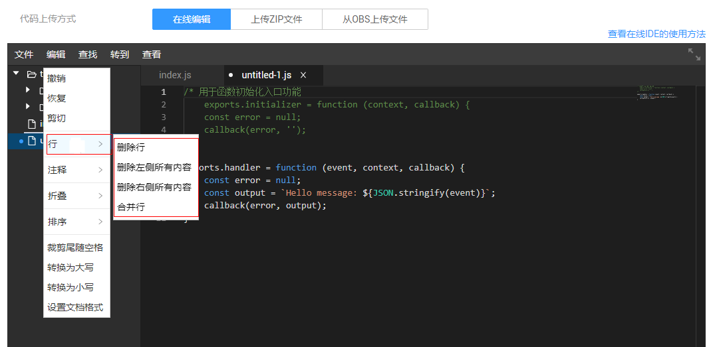
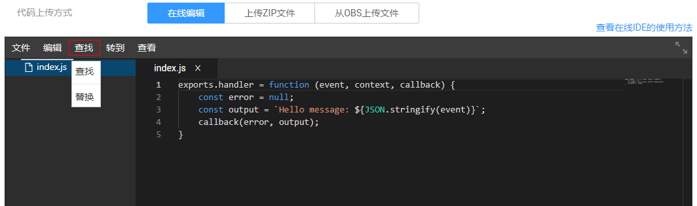

# 函数在线IDE

用户在编辑函数代码时支持类似工程方式的管理，可以创建文件、文件夹并对其进行编辑。使用函数工作流控制台中的在线代码编辑器，可以在线编写函数代码，如果代码是上传zip包的方式，则前端进行相应解压展示，并支持在线编辑修改。

## 目录管理

在编辑器菜单栏中选择“File“，可以管理文件夹目录，如[图1](#fig178581024427)所示。

**图 1**  File  

在展开的下拉菜单中选择“New File“，可以新建文件，并命名，如[图2](#fig149931128166)所示。

**图 2**  新建文件  

在展开的下拉菜单中选择“New File Template“，可以选择模板在线创建函数，如[图3](#fig205241622182211)所示。

**图 3**  选择模板  

选择需要的模板，创建在线函数，并命名，如[图4](#fig7934126183117)所示。

**图 4**  创建文件  

点击右键，选择“Rename“可以对文件和文件夹进行重命名，选择“Delete“可以删除，如[图5](#fig66113363115)所示。

**图 5**  文件重命名  

在左侧“File“下拉菜单中选择“New Folder“，新建文件夹并命名，如[图1](#fig178581024427)中所示。

点击右键，选择“New File“可以在该文件夹目录下新建文件，选择“Rename“可以对文件夹重命名，选择“New Folder“可以新建文件夹，选择“Delete Folder“将此文件夹删除，如[图6](#fig566662975417)所示。

**图 6**  编辑文件夹  

在左侧“File“下拉菜单中选择“Close All File“，将所有打开的文件关闭，如[图1](#fig178581024427)中所示。

## 代码在线编辑

在编辑器菜单栏中选择“Edit“，可以在线编辑代码。在“Edit“下拉菜单中选择“Undo“可以撤销上一步操作，选择“Redo“可以恢复上一步操作，选择“Cut“剪切内容，如[图7](#fig14556546142119)所示。

**图 7**  在线编辑  

在“Edit“下拉菜单中选择“Line“，可以对代码以“行”为单位进行编辑，如[图8](#fig2055691113414)所示。

**图 8**  编辑行  

在“Line“命令的展开菜单中，选择“Delete Line“，可以删除整行代码。选择“Delete All Left“，可以将鼠标光标所在位置左侧的代码删除，选择“Delete All Right“，将右侧代码删除。选择“Join Lines“，将光标所在代码行的下一行代码合入到该行。

在“Edit“下拉菜单中选择“Comment“，可以编辑注释，如[图9](#fig8603826151316)所示。

**图 9**  编辑注释  

在“Comment“命令的展开菜单中，选择“Toggle Line Comment“打开某一行代码的注释，选择“Toggle Block Comment“打开某一块代码的注释，选择“Add Line Comment“增加一行注释，选择“Remove Line Comment“移除一行注释。

在“Edit“下拉菜单中选择Folding，可以展开或折叠代码，如[图10](#fig135351222211)所示。

**图 10**  展开或折叠代码  

选择“Fold/Unfold“可以全部展开或折叠，按层级折叠请选择“Fold Level“。

选择“Sort“对代码行进行排序，如[图11](#fig168960195217)所示。

**图 11**  排序  

## 查找及替换

在编辑器菜单栏中选择“Find“，可以进行查找或替换。如[图12](#fig66217271244)所示。

**图 12**  Find  

在展开的下拉菜单中选择“Find“或“Replace“，输入内容，进行查找或替换代码，如[图13](#fig10516771593)所示。

**图 13**  查找  

## 跳转

在编辑菜单栏中选择“Goto“，可以跳转到相应的代码位置，如[图14](#fig522514818159)所示。

**图 14**  Goto  

在展开的下拉菜单中选择“Go to Line“，可以跳转到对应的代码行，如[图15](#fig1762485815308)所示。

**图 15**  跳转  

当代码比较多时，选择一个反括号“\{”，点击“Go to Bracket“可跳转到相应的括号“\}”位置，当代码中有错误时，点击“Go to Next Problem \(Error,Warning,Info\)“跳转到下一个错误的地方。

## 常用功能

在编辑菜单栏中选择View，选择某个链接，单击“Open Link“可以打开该链接，如[图16](#fig175244452007)所示。

**图 16**  打开链接  

在下拉的菜单栏中选择Theme可以更换编辑器主题，选择Show Command Palette可以查看所有命令，如[图17](#fig154421332458)所示。

**图 17**  查看所有命令  

编辑器具有代码智能提示功能，如[图18](#fig12131171316247)所示。

**图 18**  智能提示  

