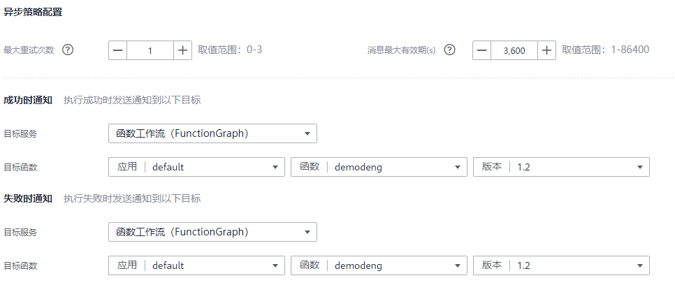

# 函数异步配置<a name="ZH-CN_TOPIC_0000001198575149"></a>

目前仅FunctionGraph v1版本支持异步配置功能，函数创建完成后，支持设置函数异步配置，将函数异步执行结果通知到目标服务。

> **说明：** 
>1.  异步配置通知到目标服务时，需配置具有目标服务操作权限的函数委托。
>2.  当您在配置异步执行通知目标时，请务必保证不要出现循环调用的情况。例如：您为函数A配置了成功调用时的异步通知目标为函数B，为函数B配置了成功调用时的异步通知目标为函数A，当您异步触发函数A并且执行成功后，则可能出现A—\>B—\>A......循环调用的情况。
>3.  创建别名不支持异步配置功能。

## 操作步骤<a name="section184021029175512"></a>

1.  登录FunctionGraph控制台，进入“函数”界面。
2.  在函数界面选择“函数列表”，选择已创建的函数，单击进入函数详情页面。
3.  在“异步配置”页签，单击开始配置。

    **图 1**  开始配置<a name="fig620651515338"></a>  
    

4.  填写配置参数，参考如下[表1](#table16541037131110)，例如设置目前服务为函数工作流（FunctionGraph），参考如下截图：

    **图 2**  填写配置参数<a name="fig107231724173315"></a>  
    

    **表 1**  参数说明

    <a name="table16541037131110"></a>
    <table><thead align="left"><tr id="row185483751110"><th class="cellrowborder" valign="top" width="28.68%" id="mcps1.2.3.1.1"><p id="p85433741112"><a name="p85433741112"></a><a name="p85433741112"></a>类型</p>
    </th>
    <th class="cellrowborder" valign="top" width="71.32%" id="mcps1.2.3.1.2"><p id="p854103781115"><a name="p854103781115"></a><a name="p854103781115"></a>名称</p>
    </th>
    </tr>
    </thead>
    <tbody><tr id="row1454937131118"><td class="cellrowborder" valign="top" width="28.68%" headers="mcps1.2.3.1.1 "><p id="p105433791110"><a name="p105433791110"></a><a name="p105433791110"></a>异步策略配置</p>
    </td>
    <td class="cellrowborder" valign="top" width="71.32%" headers="mcps1.2.3.1.2 "><a name="ul77561876135"></a><a name="ul77561876135"></a><ul id="ul77561876135"><li>最大重试次数：异步调用失败后最大重试次数，默认为1次，取值范围：0-3。</li><li>消息最大有效期：消息最大存活时长，取值范围：1-86400。</li></ul>
    </td>
    </tr>
    <tr id="row659214415718"><td class="cellrowborder" valign="top" width="28.68%" headers="mcps1.2.3.1.1 "><p id="p259264405710"><a name="p259264405710"></a><a name="p259264405710"></a>成功时通知</p>
    </td>
    <td class="cellrowborder" valign="top" width="71.32%" headers="mcps1.2.3.1.2 "><p id="p17851701628"><a name="p17851701628"></a><a name="p17851701628"></a>目前服务：执行成功时发送通知到以下目标服务</p>
    <a name="ol22310366217"></a><a name="ol22310366217"></a><ol id="ol22310366217"><li>函数工作流（FunctionGraph）</li><li>对象存储服务（OBS）</li><li>数据接入服务（DIS）</li><li>消息通知服务（SMN）</li></ol>
    </td>
    </tr>
    <tr id="row83401126175620"><td class="cellrowborder" valign="top" width="28.68%" headers="mcps1.2.3.1.1 "><p id="p554337111112"><a name="p554337111112"></a><a name="p554337111112"></a>失败时通知</p>
    </td>
    <td class="cellrowborder" valign="top" width="71.32%" headers="mcps1.2.3.1.2 "><p id="p115453712119"><a name="p115453712119"></a><a name="p115453712119"></a>目标服务：执行失败时发送通知到以下目标服务</p>
    <a name="ol47216449211"></a><a name="ol47216449211"></a><ol id="ol47216449211"><li>函数工作流（FunctionGraph）</li><li>对象存储服务（OBS）</li><li>数据接入服务（DIS）</li><li>消息通知服务（SMN）</li></ol>
    </td>
    </tr>
    </tbody>
    </table>

5.  填写完成后，单击“创建”即可完成异步配置。

## 配置说明<a name="section7239133811491"></a>

异步调用目标的配置说明参考[表2](#table187072059205)，异步调用目标的事件内容参考如下示例：

```
{
        "timestamp": "2020-08-20T12:00:00.000Z",
	"request_context": {
	        "request_id": "1167bf8c-87b0-43ab-8f5f-26b16c64f252",
	        "function_urn": "urn:fss:cn-north-1:xxxxxxx:function:xxxx:xxxx:latest",
	        "condition": "",
	        "approximate_invoke_count": 0
	 },
	    "request_payload": "",
	    "response_context": {
	        "status_code": 200,
	        "function_error": ""
	  },
	 "response_payload": "hello world!"
}
```

**表 2**  配置参数说明

<a name="table187072059205"></a>
<table><thead align="left"><tr id="row1677295917012"><th class="cellrowborder" valign="top" width="50%" id="mcps1.2.3.1.1"><p id="p8772105916018"><a name="p8772105916018"></a><a name="p8772105916018"></a><strong id="b1477213591016"><a name="b1477213591016"></a><a name="b1477213591016"></a>参数</strong></p>
</th>
<th class="cellrowborder" valign="top" width="50%" id="mcps1.2.3.1.2"><p id="p117723597010"><a name="p117723597010"></a><a name="p117723597010"></a><strong id="b17772185910019"><a name="b17772185910019"></a><a name="b17772185910019"></a>说明</strong></p>
</th>
</tr>
</thead>
<tbody><tr id="row197721259607"><td class="cellrowborder" valign="top" width="50%" headers="mcps1.2.3.1.1 "><p id="p14772259205"><a name="p14772259205"></a><a name="p14772259205"></a>timestamp</p>
</td>
<td class="cellrowborder" valign="top" width="50%" headers="mcps1.2.3.1.2 "><p id="p577210594017"><a name="p577210594017"></a><a name="p577210594017"></a>调用时间戳。</p>
</td>
</tr>
<tr id="row147727592016"><td class="cellrowborder" valign="top" width="50%" headers="mcps1.2.3.1.1 "><p id="p7772359901"><a name="p7772359901"></a><a name="p7772359901"></a>request_context</p>
</td>
<td class="cellrowborder" valign="top" width="50%" headers="mcps1.2.3.1.2 "><p id="p077220596019"><a name="p077220596019"></a><a name="p077220596019"></a>请求上下文。</p>
</td>
</tr>
<tr id="row77721593019"><td class="cellrowborder" valign="top" width="50%" headers="mcps1.2.3.1.1 "><p id="p107724599010"><a name="p107724599010"></a><a name="p107724599010"></a>request_context.request_id</p>
</td>
<td class="cellrowborder" valign="top" width="50%" headers="mcps1.2.3.1.2 "><p id="p8773115917018"><a name="p8773115917018"></a><a name="p8773115917018"></a>异步调用的请求ID。</p>
</td>
</tr>
<tr id="row177733597018"><td class="cellrowborder" valign="top" width="50%" headers="mcps1.2.3.1.1 "><p id="p477314597013"><a name="p477314597013"></a><a name="p477314597013"></a>request_context. function_urn</p>
</td>
<td class="cellrowborder" valign="top" width="50%" headers="mcps1.2.3.1.2 "><p id="p67735596010"><a name="p67735596010"></a><a name="p67735596010"></a>异步执行的函数URN。</p>
</td>
</tr>
<tr id="row4773165917015"><td class="cellrowborder" valign="top" width="50%" headers="mcps1.2.3.1.1 "><p id="p167737591205"><a name="p167737591205"></a><a name="p167737591205"></a>request_context.condition</p>
</td>
<td class="cellrowborder" valign="top" width="50%" headers="mcps1.2.3.1.2 "><p id="p17735598016"><a name="p17735598016"></a><a name="p17735598016"></a>调用错误类别。</p>
</td>
</tr>
<tr id="row4773759809"><td class="cellrowborder" valign="top" width="50%" headers="mcps1.2.3.1.1 "><p id="p57731859306"><a name="p57731859306"></a><a name="p57731859306"></a>request_context. approximate_invoke_count</p>
</td>
<td class="cellrowborder" valign="top" width="50%" headers="mcps1.2.3.1.2 "><p id="p1077315592018"><a name="p1077315592018"></a><a name="p1077315592018"></a>异步调用的执行次数。当该值大于1时，说明函数计算对您的函数进行了重试。</p>
</td>
</tr>
<tr id="row18773165912012"><td class="cellrowborder" valign="top" width="50%" headers="mcps1.2.3.1.1 "><p id="p1577315598016"><a name="p1577315598016"></a><a name="p1577315598016"></a>request_payload</p>
</td>
<td class="cellrowborder" valign="top" width="50%" headers="mcps1.2.3.1.2 "><p id="p1777310594015"><a name="p1777310594015"></a><a name="p1777310594015"></a>请求函数的原始负载。</p>
</td>
</tr>
<tr id="row37738598010"><td class="cellrowborder" valign="top" width="50%" headers="mcps1.2.3.1.1 "><p id="p4773115913016"><a name="p4773115913016"></a><a name="p4773115913016"></a>response_context</p>
</td>
<td class="cellrowborder" valign="top" width="50%" headers="mcps1.2.3.1.2 "><p id="p13773105911010"><a name="p13773105911010"></a><a name="p13773105911010"></a>返回上下文。</p>
</td>
</tr>
<tr id="row127732591608"><td class="cellrowborder" valign="top" width="50%" headers="mcps1.2.3.1.1 "><p id="p67733598014"><a name="p67733598014"></a><a name="p67733598014"></a>response_context.statusCode</p>
</td>
<td class="cellrowborder" valign="top" width="50%" headers="mcps1.2.3.1.2 "><p id="p11773105920012"><a name="p11773105920012"></a><a name="p11773105920012"></a>调用函数的返回码（系统）。当该返回码不为200时，说明出现了系统错误。</p>
</td>
</tr>
<tr id="row16773145913010"><td class="cellrowborder" valign="top" width="50%" headers="mcps1.2.3.1.1 "><p id="p177312595016"><a name="p177312595016"></a><a name="p177312595016"></a>response_context.function_error</p>
</td>
<td class="cellrowborder" valign="top" width="50%" headers="mcps1.2.3.1.2 "><p id="p1477314598010"><a name="p1477314598010"></a><a name="p1477314598010"></a>调用错误信息。</p>
</td>
</tr>
<tr id="row107732591809"><td class="cellrowborder" valign="top" width="50%" headers="mcps1.2.3.1.1 "><p id="p187731859009"><a name="p187731859009"></a><a name="p187731859009"></a>response_payload</p>
</td>
<td class="cellrowborder" valign="top" width="50%" headers="mcps1.2.3.1.2 "><p id="p107731591010"><a name="p107731591010"></a><a name="p107731591010"></a>执行函数返回的原始负载。</p>
</td>
</tr>
</tbody>
</table>

