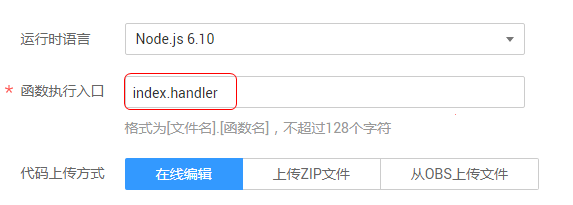
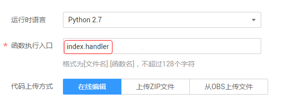
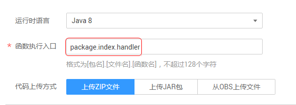
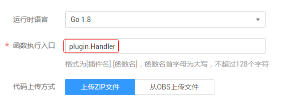
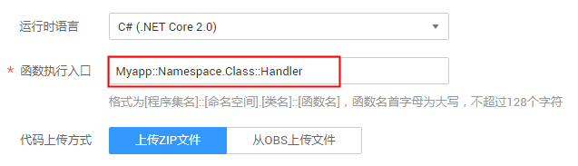

# 函数编程模型

## Node.js编程

-   Node.js 6.10编程规范

    Node.js6.10 函数的接口定义如下所示。

    export.handler = function\(event, context, callback\)

    -   入口函数名（handler）：入口函数名称， 需和函数执行入口处用户自定义的入口函数名称一致。
    -   执行事件（event）：函数执行界面由用户输入的执行事件参数， 格式为JSON对象。
    -   上下文环境（context）：Runtime提供的函数执行上下文，其接口定义在SDK接口说明。
    -   回调函数（callback）：callback方法完整声明为callback\(err, message\)，用户通过此方法可以返回err和message至前台结果显示页面。具体的err或message内容需要用户自己定义，如字符串。
    -   函数执行入口： index.handler

        函数执行入口格式为“\[文件名\].\[函数名\]”。例如创建函数时设置为index.handler，那么函数计算会去加载index.js中定义的handler函数，如[图1](#fig5634113654215)所示。

        **图 1**  Node.js函数执行入口  
        

        有关SDK接口说明和函数开发指导请参考[Node.js函数开发指南](http://support.huaweicloud.com/devg-functiongraph/functiongraph_02_0410.html)。

-   Node.js 8.10编程规范

    Nodejs 8.10 Runtime除了兼容Node.js6.10 Runctime函数的接口定义规范，还支持使用async的异步形式作为函数入口。

    exports.handler = async \(event, context, callback\[可选\]\) =\> \{ return data;\}

    通过通过return进行返回。

## Python编程

对于Python，FunctionGraph运行时目前支持Python2.7、Python3.6版本。Python函数有明确的接口定义，如下所示。

def handler \(event, context\)

-   入口函数名（handler）：入口函数名称，需和函数执行入口处用户自定义的入口函数名称一致。
-   执行事件（event）： 函数执行界面由用户输入的执行事件参数， 格式为JSON对象。
-   上下文环境（Context）：Runtime提供的函数执行上下文，其接口定义在SDK接口说明。
-   函数执行入口： index.handler

    函数执行入口格式为“\[文件名\].\[函数名\]”。例如创建函数时设置为index.handler，那么函数计算会去加载index.py中定义的handler函数，如[图2](#fig42021810124314)所示。

    **图 2**  Python函数执行入口  
    

    有关SDK接口说明和函数开发指导请参考[Python函数开发指南](http://support.huaweicloud.com/devg-functiongraph/functiongraph_02_0420.html)。

## Java编程

Java函数有明确的接口定义，如下。

_作用域+__返回参数+__函数名\(__函数参数,Context__参数\)_

-   作用域：提供给FunctionGraph调用的用户函数必须定义为public。
-   返回参数：用户定义，FunctionGraph负责转换为字符串，作为HTTP Response返回。对于返回参数为对象类型，则HTTP Response为该类型的JSON字符串。
-   函数名：用户定义函数名称。
-   用户定义参数，当前FunctionGraph函数只支持一个用户参数。对于复杂参数，建议定义为对象类型，以JSON字符串提供数据。FunctionGraph调用函数时，解析JSON为对象。
-   Context：runtime提供函数执行上下文，其接口定义在SDK接口说明。
-   在FunctionGraph使用Java创建函数时，函数入口参数需要提供函数完整的名字空间，参数格式为：\[包名\].\[文件名\].\[函数名\]。创建函数时，指定的函数执行入口为package.index.handler，包名为package，文件名为index，函数名为handler，如[图3](#fig13482817134413)所示。

**图 3**  Java函数执行入口  

有关SDK接口说明和函数开发指导请参考[Java函数开发指南](http://support.huaweicloud.com/devg-functiongraph/functiongraph_02_0430.html)。

## Go编程

对于Go，FunctionGraph函数运行时目前只支持Go 1.8.3版本。Go函数有明确的接口定义，如下所示。

func Handler \(payload \[\]byte, ctx context.RuntimeContext\)

-   入口函数名（Handler）：入口函数名称，需和函数执行入口处用户自定义的入口函数名称一致（首字母必须大写）。
-   执行事件体（event）： 函数执行界面由用户输入的执行事件参数， 格式为JSON对象。
-   上下文环境（Context ）：Runtime提供的函数执行上下文，其接口定义在SDK接口说明。
-   函数执行入口： plugin.handler

    函数执行入口格式为“\[文件名\].\[函数名\]”。例如创建函数时设置为plugin.handler，那么函数计算会去加载plugin.so中定义的handler函数，如[图4](#fig1177123124511)所示。

    **图 4**  Go函数执行入口  
    

有关SDK接口说明和函数开发指导请参考[Go函数开发指南](http://support.huaweicloud.com/devg-functiongraph/functiongraph_02_0440.html)。

## C\#编程

对于C\#，FunctionGraph运行时目前支持C\#\(.NET Core 2.0\)、C\#\(.NET Core 2.1\)版本。

_作用域+__返回参数+__函数名\(__函数参数，Context__参数\)_

-   作用域：提供给FunctionGraph调用的用户函数必须定义为public。
-   返回参数：用户定义，FunctionGraph负责转换为字符串，作为HTTP Response返回。
-   函数名：用户自定义函数名称，需要和函数执行入口处用户自定义的入口函数名称一致。
-   执行事件体：函数执行界面由用户输入的执行事件参数。
-   上下文环境（context）：Runtime提供的函数执行上下文，相关属性定义在对象说明中。

    HC.Serverless.Function.Common –部署在FunctionGraph服务中的项目工程需要引入该库，其中包含IFunctionContext对象，详情见context类说明。

    创建csharp函数时，需要定义某个类中的方法作为函数执行入口，该方法可以通过定义IFunctionContext类型的参数来访问当前执行函数的信息。

-   函数执行入口：ASSEMBLY::NAMESPACE.CLASSNAME::METHODNAME，其中：
    1.  ASSEMBLY是应用程序的.NET程序集文件的名称。
    2.  NAMESPACE、CLASSNAME即入口执行函数所在的namespace和class名称。
    3.  METHODNAME即入口执行函数名称。如[图5](#fig117881533124217)所示。

        **图 5**  C\#函数执行入口  
        

        有关SDK接口说明和函数开发指导请参考[C\#函数开发指南](https://support.huaweicloud.com/devg-functiongraph/functiongraph_02_0450.html)。

