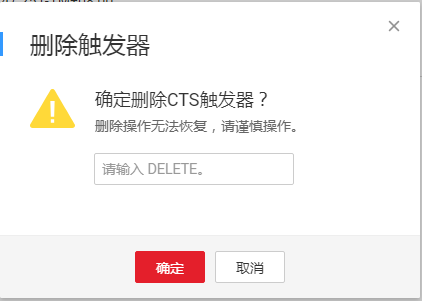

# 函数触发器管理

函数创建以后，通过Trigger触发，自行调度所需资源及环境，实现预期功能。

## 前提条件

1.  创建SMN触发器之前，需要开启消息通知服务，并且在消息通知服务中创建主题。创建过程请参考[创建消息主题](https://support.huaweicloud.com/usermanual-smn/zh-cn_topic_0043961401.html)。
2.  创建DMS触发器之前，需要开启分布式消息服务，并且在分布式消息服务中创建消息队列，在消息队列创建消费组。创建过程请参考[创建队列](https://support.huaweicloud.com/usermanual-dms/zh-cn_topic_0034678324.html)、[创建消费组](https://support.huaweicloud.com/usermanual-dms/zh-cn_topic_0034678327.html)。
3.  创建APIG触发器之前，需要开通API网关服务，并在API网关服务中创建分组。创建过程请参考[创建API分组](https://support.huaweicloud.com/usermanual-apig/apig-zh-ug-180307015.html)。
4.  创建OBS触发器之前，需要开通对象存储服务，并且在对象存储服务中创建存储桶。创建过程请参考[创建存储桶](https://support.huaweicloud.com/usermanual-obs/zh-cn_topic_0045829050.html)。
5.  创建DIS触发器之前，需要开通数据接入服务，并且在数据接入服务中创建接入通道。创建过程请参考[创建DIS通道](https://support.huaweicloud.com/usermanual-dis/zh-cn_topic_0034903799.html)。
6.  创建LTS触发器之前，需要开通云日志服务，并且在云日志服务中创建日志组和日志主题，并配置Agent。请参考[创建日志组](https://support.huaweicloud.com/qs-lts/zh-cn_topic_0067564152.html)、[创建日志主题](https://support.huaweicloud.com/qs-lts/zh-cn_topic_0067564153.html)、[Agent配置](https://support.huaweicloud.com/qs-lts/zh-cn_topic_0078543180.html)。
7.  创建CTS触发器之前，需要开通云审计服务，并且添加云审计服务和操作，服务及操作详情可参考[支持审计的服务及详细操作列表](https://support.huaweicloud.com/usermanual-cts/zh-cn_topic_0100236046.html)。

## 创建触发器

1.  用户登录FunctionGraph，进入“函数”界面。
2.  选择“函数列表”，单击函数名称，进入函数详情界面。
3.  在函数详情界面，选择函数版本或者别名，单击“触发器”页签。
4.  在“触发器”页签，单击“创建触发器”，弹出“创建触发器”界面。
5.  在“创建触发器”界面填写触发器信息，如[表1](#table4277812911123)所示，带\*参数为必填项。

    **表 1**  触发器信息表

    
    <table><thead align="left"><tr id="row6452289411123"><th class="cellrowborder" valign="top" width="20.200000000000003%" id="mcps1.2.4.1.1">
触发器类型

    </th>
    <th class="cellrowborder" valign="top" width="22.220000000000002%" id="mcps1.2.4.1.2">
字段

    </th>
    <th class="cellrowborder" valign="top" width="57.58%" id="mcps1.2.4.1.3">
填写说明

    </th>
    </tr>
    </thead>
    <tbody><tr id="row30343062142259"><td class="cellrowborder" valign="top" width="20.200000000000003%" headers="mcps1.2.4.1.1 ">
SMN

    </td>
    <td class="cellrowborder" valign="top" width="22.220000000000002%" headers="mcps1.2.4.1.2 ">
*主题名称

    </td>
    <td class="cellrowborder" valign="top" width="57.58%" headers="mcps1.2.4.1.3 ">
输入已创建消息主题，消息主题的创建请参考<a href="https://support.huaweicloud.com/usermanual-smn/zh-cn_topic_0043961401.html" target="_blank" rel="noopener noreferrer">创建消息主题</a>。

    </td>
    </tr>
    <tr id="row4856597211123"><td class="cellrowborder" rowspan="3" valign="top" width="20.200000000000003%" headers="mcps1.2.4.1.1 ">
DMS

    </td>
    <td class="cellrowborder" valign="top" width="22.220000000000002%" headers="mcps1.2.4.1.2 ">
*队列

    </td>
    <td class="cellrowborder" valign="top" width="57.58%" headers="mcps1.2.4.1.3 ">
从已创建的DMS队列中选取，DMS队列创建请参考<a href="https://support.huaweicloud.com/usermanual-dms/zh-cn_topic_0034678324.html" target="_blank" rel="noopener noreferrer">创建队列</a>。

    </td>
    </tr>
    <tr id="row5933491111123"><td class="cellrowborder" valign="top" headers="mcps1.2.4.1.1 ">
*消费组

    </td>
    <td class="cellrowborder" valign="top" headers="mcps1.2.4.1.2 ">
从已创建DMS队列对应的消费组中选取。DMS消费组的创建请参考<a href="https://support.huaweicloud.com/usermanual-dms/zh-cn_topic_0034678327.html" target="_blank" rel="noopener noreferrer">创建消费组</a>。

    </td>
    </tr>
    <tr id="row2994931711123"><td class="cellrowborder" valign="top" headers="mcps1.2.4.1.1 ">
拉取周期

    </td>
    <td class="cellrowborder" valign="top" headers="mcps1.2.4.1.2 ">
消费消息拉取周期设置1-60秒的范围内。

    </td>
    </tr>
    <tr id="row1972261712116"><td class="cellrowborder" rowspan="6" valign="top" width="20.200000000000003%" headers="mcps1.2.4.1.1 ">
APIG

    

    </td>
    <td class="cellrowborder" valign="top" width="22.220000000000002%" headers="mcps1.2.4.1.2 ">
*API名称

    </td>
    <td class="cellrowborder" valign="top" width="57.58%" headers="mcps1.2.4.1.3 ">
支持汉字，英文，数字，下划线，且只能以英文和汉字开头，3-24字符。

    </td>
    </tr>
    <tr id="row1772361712118"><td class="cellrowborder" valign="top" headers="mcps1.2.4.1.1 ">
*分组

    </td>
    <td class="cellrowborder" valign="top" headers="mcps1.2.4.1.2 ">
API分组相当于一个API集合，API提供方以API分组为单位，管理分组内的所有API。

    
从已创建的API分组中选择。

    </td>
    </tr>
    <tr id="row27241317181113"><td class="cellrowborder" valign="top" headers="mcps1.2.4.1.1 ">
*发布环境

    </td>
    <td class="cellrowborder" valign="top" headers="mcps1.2.4.1.2 ">
API可以同时提供给不同的场景调用，如生产、测试或开发。API网关服务提供环境管理，在不同的环境定义不同的API调用路径。

    </td>
    </tr>
    <tr id="row155361428101118"><td class="cellrowborder" valign="top" headers="mcps1.2.4.1.1 ">
*安全认证

    </td>
    <td class="cellrowborder" valign="top" headers="mcps1.2.4.1.2 ">
API认证方式有3种类型。

    <ul id="ul41378719143341"><li>APP： 采用Appkey&amp;Appsecret认证，安全级别高，推荐使用，详情请参考<a href="https://support.huaweicloud.com/devg-apig/apig-zh-dev-180307002.html" target="_blank" rel="noopener noreferrer">APP认证</a>。</li><li>IAM： 华为IAM认证，只允许华为云用户能访问，安全级别中等，详情请参考<a href="https://support.huaweicloud.com/devg-apig/apig-zh-dev-180307020.html" target="_blank" rel="noopener noreferrer">IAM认证</a>。</li><li>None： 无认证模式，所有用户均可访问。</li></ul>
    </td>
    </tr>
    <tr id="row139746330117"><td class="cellrowborder" valign="top" headers="mcps1.2.4.1.1 ">
*请求协议

    </td>
    <td class="cellrowborder" valign="top" headers="mcps1.2.4.1.2 ">
分为两种类型：

    <ul id="ul10342591866"><li>HTTP</li><li>HTTPS</li></ul>
    </td>
    </tr>
    <tr id="row2942174214512"><td class="cellrowborder" valign="top" headers="mcps1.2.4.1.1 ">
*后端超时(毫秒)

    </td>
    <td class="cellrowborder" valign="top" headers="mcps1.2.4.1.2 ">
取值范围：1-60000毫秒。

    </td>
    </tr>
    <tr id="row1734255641519"><td class="cellrowborder" rowspan="4" valign="top" width="20.200000000000003%" headers="mcps1.2.4.1.1 ">
OBS

    </td>
    <td class="cellrowborder" valign="top" width="22.220000000000002%" headers="mcps1.2.4.1.2 ">
*桶

    </td>
    <td class="cellrowborder" valign="top" width="57.58%" headers="mcps1.2.4.1.3 "><ul id="ul37345080152115"><li>选择用作事件源的OBS存储桶。</li><li>从已创建OBS存储桶中选择，请选择与函数工作流服务同区的桶。</li><li>OBS存储桶的创建过程请参考<a href="https://support.huaweicloud.com/usermanual-obs/zh-cn_topic_0045829050.html" target="_blank" rel="noopener noreferrer">创建存储桶</a>。</li></ul>
    </td>
    </tr>
    <tr id="row1624161016209"><td class="cellrowborder" valign="top" headers="mcps1.2.4.1.1 ">
*事件

    </td>
    <td class="cellrowborder" valign="top" headers="mcps1.2.4.1.2 ">
选择要使其触发函数的事件。支持的事件类型请参考<a href="#functiongraph_01_0301__table44799992114531">表2</a>。

    </td>
    </tr>
    <tr id="row267201413201"><td class="cellrowborder" valign="top" headers="mcps1.2.4.1.1 ">
前缀

    </td>
    <td class="cellrowborder" valign="top" headers="mcps1.2.4.1.2 ">
用来限制以此关键字开头的对象的事件通知，该限制可以实现对OBS对象名的过滤。

    </td>
    </tr>
    <tr id="row194855184205"><td class="cellrowborder" valign="top" headers="mcps1.2.4.1.1 ">
后缀

    </td>
    <td class="cellrowborder" valign="top" headers="mcps1.2.4.1.2 ">
用来限制以此关键字结尾的对象的事件通知。该限制可以实现对OBS对象名的过滤。

    </td>
    </tr>
    <tr id="row3465930102322"><td class="cellrowborder" rowspan="4" valign="top" width="20.200000000000003%" headers="mcps1.2.4.1.1 ">
DIS

    </td>
    <td class="cellrowborder" valign="top" width="22.220000000000002%" headers="mcps1.2.4.1.2 ">
*通道名称

    </td>
    <td class="cellrowborder" valign="top" width="57.58%" headers="mcps1.2.4.1.3 ">
选择已创建的DIS通道。

    
DIS通道的创建过程请参考<a href="https://support.huaweicloud.com/usermanual-dis/zh-cn_topic_0034903799.html" target="_blank" rel="noopener noreferrer">创建DIS通道</a>。

    </td>
    </tr>
    <tr id="row65646631102322"><td class="cellrowborder" valign="top" headers="mcps1.2.4.1.1 ">
批处理大小

    </td>
    <td class="cellrowborder" valign="top" headers="mcps1.2.4.1.2 ">
设置调用函数时从流检索的记录的最大数目，可输入范围：1-10000

    </td>
    </tr>
    <tr id="row53209872102322"><td class="cellrowborder" valign="top" headers="mcps1.2.4.1.1 ">
*起始位置

    </td>
    <td class="cellrowborder" valign="top" headers="mcps1.2.4.1.2 ">
在流中开始读取数据的位置。

    <ul id="ul6411007515240"><li>RIM_HORIZON：是从数据流的起始位置获取。</li><li>LATEST是获取流中最新的数据。</li></ul>
    </td>
    </tr>
    <tr id="row3686280102322"><td class="cellrowborder" valign="top" headers="mcps1.2.4.1.1 ">
拉取周期

    </td>
    <td class="cellrowborder" valign="top" headers="mcps1.2.4.1.2 ">
设置拉取流数据的周期，拉取周期设置1-60秒的范围内。

    </td>
    </tr>
    <tr id="row684712275488"><td class="cellrowborder" rowspan="4" valign="top" width="20.200000000000003%" headers="mcps1.2.4.1.1 ">
TIMER

    </td>
    <td class="cellrowborder" valign="top" width="22.220000000000002%" headers="mcps1.2.4.1.2 ">
*定时器名称

    </td>
    <td class="cellrowborder" valign="top" width="57.58%" headers="mcps1.2.4.1.3 ">
支持字母、数字、下划线和中划线，必须以字母开头，且长度不能超过64个字符。

    </td>
    </tr>
    <tr id="row9848172774810"><td class="cellrowborder" valign="top" headers="mcps1.2.4.1.1 ">
*触发规则

    </td>
    <td class="cellrowborder" valign="top" headers="mcps1.2.4.1.2 "><ul id="ul86177526204"><li>固定频率
固定时间间隔触发函数，该类型下支持配置单位为分、时、天，每种类型仅支持整数配置，其中分钟支持范围(0，60]，小时支持范围(0，24]，天支持范围(0，30]。

    </li><li>Cron表达式
可以完成更为复杂的函数执行计划：如周一到周五上午08:30:00执行函数等。请参考<a href="函数定时触发器Cron表达式规则.md">函数定时触发器Cron表达式规则</a>。

    </li></ul>
    </td>
    </tr>
    <tr id="row6848172712488"><td class="cellrowborder" valign="top" headers="mcps1.2.4.1.1 ">
是否开启

    </td>
    <td class="cellrowborder" valign="top" headers="mcps1.2.4.1.2 ">
是否开启定时触发器。

    </td>
    </tr>
    <tr id="row1484802719483"><td class="cellrowborder" valign="top" headers="mcps1.2.4.1.1 ">
附加信息

    </td>
    <td class="cellrowborder" valign="top" headers="mcps1.2.4.1.2 ">
如果用户配置了触发事件，会将该事件填写到TIMER事件源的"user_event"字段，详情请参考<a href="http://support.huaweicloud.com/devg-functiongraph/functiongraph_02_0102.html" target="_blank" rel="noopener noreferrer">支持的事件源</a>。

    </td>
    </tr>
    <tr id="row136511516237"><td class="cellrowborder" rowspan="2" valign="top" width="20.200000000000003%" headers="mcps1.2.4.1.1 ">
LTS

    </td>
    <td class="cellrowborder" valign="top" width="22.220000000000002%" headers="mcps1.2.4.1.2 ">
*日志组

    </td>
    <td class="cellrowborder" valign="top" width="57.58%" headers="mcps1.2.4.1.3 ">
日志管理的基本单位，用于日志存储及查询，创建过程请参考<a href="https://support.huaweicloud.com/qs-lts/zh-cn_topic_0067564152.html" target="_blank" rel="noopener noreferrer">创建日志组</a>。

    </td>
    </tr>
    <tr id="row265315102311"><td class="cellrowborder" valign="top" headers="mcps1.2.4.1.1 ">
*日志主题

    </td>
    <td class="cellrowborder" valign="top" headers="mcps1.2.4.1.2 ">
在日志组下创建日志主题，订阅日志信息。创建过程请参考<a href="https://support.huaweicloud.com/qs-lts/zh-cn_topic_0067564153.html" target="_blank" rel="noopener noreferrer">创建日志主题</a>。

    </td>
    </tr>
    <tr id="row14797132711133"><td class="cellrowborder" rowspan="5" valign="top" width="20.200000000000003%" headers="mcps1.2.4.1.1 ">
CTS

    </td>
    <td class="cellrowborder" valign="top" width="22.220000000000002%" headers="mcps1.2.4.1.2 ">
*通知名称

    </td>
    <td class="cellrowborder" valign="top" width="57.58%" headers="mcps1.2.4.1.3 ">
支持汉字、字母、数字和下划线，且长度不能超过64个字符。

    </td>
    </tr>
    <tr id="row832311554144"><td class="cellrowborder" valign="top" headers="mcps1.2.4.1.1 ">
*服务类型

    </td>
    <td class="cellrowborder" valign="top" headers="mcps1.2.4.1.2 ">
选择相应的服务类型。

    </td>
    </tr>
    <tr id="row2046613021516"><td class="cellrowborder" valign="top" headers="mcps1.2.4.1.1 ">
*资源类型

    </td>
    <td class="cellrowborder" valign="top" headers="mcps1.2.4.1.2 ">
所选服务下对应的资源类型。

    </td>
    </tr>
    <tr id="row1958334661720"><td class="cellrowborder" valign="top" headers="mcps1.2.4.1.1 ">
*操作名称

    </td>
    <td class="cellrowborder" valign="top" headers="mcps1.2.4.1.2 ">
所选资源类型下对应的操作。

    </td>
    </tr>
    <tr id="row42221250181812"><td class="cellrowborder" valign="top" headers="mcps1.2.4.1.1 ">
*操作

    </td>
    <td class="cellrowborder" valign="top" headers="mcps1.2.4.1.2 ">
可以进行“删除”的操作。

    </td>
    </tr>
    </tbody>
    </table>

    **表 2**  OBS事件说明

    
    <table><thead align="left"><tr id="row48737262114531"><th class="cellrowborder" valign="top" width="21%" id="mcps1.2.4.1.1">
事件类

    </th>
    <th class="cellrowborder" valign="top" width="32%" id="mcps1.2.4.1.2">
事件

    </th>
    <th class="cellrowborder" valign="top" width="47%" id="mcps1.2.4.1.3">
事件说明

    </th>
    </tr>
    </thead>
    <tbody><tr id="row24495156114531"><td class="cellrowborder" rowspan="5" valign="top" width="21%" headers="mcps1.2.4.1.1 ">
ObjectCreated

    </td>
    <td class="cellrowborder" valign="top" width="32%" headers="mcps1.2.4.1.2 ">
—

    </td>
    <td class="cellrowborder" valign="top" width="47%" headers="mcps1.2.4.1.3 ">
新对象创建事件，选择ObjectCreated时，意味着Put/Post/Copy/CompleteMultipartUpload都被选上。

    </td>
    </tr>
    <tr id="row45368412114531"><td class="cellrowborder" valign="top" headers="mcps1.2.4.1.1 ">
Put

    </td>
    <td class="cellrowborder" valign="top" headers="mcps1.2.4.1.2 ">
更新对象。

    </td>
    </tr>
    <tr id="row4811027114531"><td class="cellrowborder" valign="top" headers="mcps1.2.4.1.1 ">
Post

    </td>
    <td class="cellrowborder" valign="top" headers="mcps1.2.4.1.2 ">
上传对象。

    </td>
    </tr>
    <tr id="row35827286114531"><td class="cellrowborder" valign="top" headers="mcps1.2.4.1.1 ">
Copy

    </td>
    <td class="cellrowborder" valign="top" headers="mcps1.2.4.1.2 ">
复制对象。

    </td>
    </tr>
    <tr id="row63616174114531"><td class="cellrowborder" valign="top" headers="mcps1.2.4.1.1 ">
CompleteMultipartUpload

    </td>
    <td class="cellrowborder" valign="top" headers="mcps1.2.4.1.2 ">
使用多段上传方式上传对象，多个段成功合并时触发。

    </td>
    </tr>
    <tr id="row52672745114531"><td class="cellrowborder" rowspan="3" valign="top" width="21%" headers="mcps1.2.4.1.1 ">
ObjectRemoved

    </td>
    <td class="cellrowborder" valign="top" width="32%" headers="mcps1.2.4.1.2 ">
—

    </td>
    <td class="cellrowborder" valign="top" width="47%" headers="mcps1.2.4.1.3 ">
对象删除事件，选择ObjectRemoved，意味着Delete/DeleteMarkerCreated都被选上。

    </td>
    </tr>
    <tr id="row66285022114531"><td class="cellrowborder" valign="top" headers="mcps1.2.4.1.1 ">
Delete

    </td>
    <td class="cellrowborder" valign="top" headers="mcps1.2.4.1.2 ">
对象删除。

    </td>
    </tr>
    <tr id="row6953132114827"><td class="cellrowborder" valign="top" headers="mcps1.2.4.1.1 ">
DeleteMarkerCreated

    </td>
    <td class="cellrowborder" valign="top" headers="mcps1.2.4.1.2 ">
在OBS服务开启多版本支持后，如果不指定版本号删除对象，OBS会自动为该对象生成删除标记，此时会触发本事件。

    </td>
    </tr>
    </tbody>
    </table>

6.  单击“确定”，完成触发器创建。

## 使用触发器

触发器实现了与对应华为云服务的对接，触发器创建以后，会按照预置的机制运行，本节介绍触发器的使用说明。

**SMN触发器使用说明**

创建SMN触发器有如下两种方法。

-   在消息通知服务消息主题添加FunctionGraph类型消息订阅，详见[添加订阅（创建SMN触发器）](添加订阅（创建SMN触发器）.md)。
-   在FunctionGraph函数详情页触发器栏目创建SMN类型触发器。

SMN触发器创建成功以后，如果订阅主题有消息发布，会触发函数执行，函数触发是异步调用的方式，具体示例事件请参见[支持的事件源](http://support.huaweicloud.com/devg-functiongraph/functiongraph_02_0102.html)。

**DMS触发器使用说明**

1.  创建DMS触发器，必须设置DMS权限委托。
    1.  创建包含DMS的委托，请参考[创建委托](创建委托.md)。
    2.  创建函数过程中设置委托请参考[4.a](函数管理.md#li39649257142215)。
    3.  函数已创建，修改函数委托，请参考[设置函数委托](使用DMS触发器.md#section82781591521)。

2.  如果函数没有设置权限委托或者设置的委托不包含DMS权限，在创建DMS触发器时，FunctionGraph无法加载已经创建的消息队列。
3.  创建触发器时设置的拉取周期，就是轮询DMS消息队列的间隔。如果是10s，触发器创建以后，每隔10s，FunctionGraph会自动拉取消息队列中的消息，触发函数运行，具体示例事件请参见[支持的事件源](http://support.huaweicloud.com/devg-functiongraph/functiongraph_02_0102.html)。

**APIG触发器使用说明**

APIG触发器创建以后，获得调用地址，示例如下。并且在API网关服务中生成对应的API，可以通过API调用函数。

https://49016d58-558a-4d88-ab42-f8e6e6f84bc8.apigw.cn-north-1.huaweicloud.com/read\_apig\_message

-   APP认证类型的API访问说明，请参考[APP认证](https://support.huaweicloud.com/devg-apig/apig-zh-dev-180307002.html)。

-   IAM认证类型的API访问说明，请参考[IAM认证](https://support.huaweicloud.com/devg-apig/apig-zh-dev-180307020.html)。

-   None认证类型的API访问说明，请参考[None认证](https://support.huaweicloud.com/devg-apig/apig-zh-dev-180307024.html)。

**OBS触发器使用说明**

-   创建OBS触发器时，所选择的OBS桶要与函数工作流服务在同一区域。例如函数工作流服务在“华北-北京一”，应该选择“华北-北京一”的存储桶。
-   OBS触发器创建以后，如果OBS对象有对应事件产生（如上传、删除、修改），会自动触发函数运行。
-   用户可以通过设置OBS触发器前缀或者后缀对存储对象进行过滤，示例：如果设置前缀为image，后缀为jpg。只有对类似image0001.jpg的对象操作才会触发函数，对类似im0001.jpg或者image0001.zip的对象操作均不会触发函数。

**DIS触发器使用说明**

1.  创建DIS触发器，必须设置DIS权限委托。
    1.  创建包含DIS权限的委托，请参考[创建委托](创建委托.md)。
    2.  创建函数过程中设置委托请参考[4.a](函数管理.md#li39649257142215)。
    3.  函数已创建，修改函数委托，请参考[设置函数委托](使用DIS触发器.md#section04468211232)。

2.  如果函数没有设置权限委托或者设置的委托不包含DIS权限，在创建DIS触发器时，FunctionGraph无法加载已经创建的DIS消息通道。
3.  创建触发器时设置的拉取周期，就是轮询DIS数据的时间间隔。如果是10s，触发器创建以后，每隔10s，FunctionGraph会自动拉取DIS通道中的数据，触发函数运行，具体示例事件请参见[支持的事件源](http://support.huaweicloud.com/devg-functiongraph/functiongraph_02_0102.html)。

**TIMER触发器使用说明**

定时触发器支持两种触发规则配置。

1.  Rate类型，及固定时间间隔触发，该类型下支持配置单位为分、时、天，每种类型仅支持整数配置，其中分钟支持范围\(0，60\]，小时支持范围\(0，24\]，天支持范围\(0，30\]。
2.  Cron表达式类型，Cron表达式可以完成更为复杂的函数执行计划：如周一到周五上午08:30:00执行函数、每月1，2，3号上午07:45:00执行等。请参考[函数定时触发器Cron表达式规则](函数定时触发器Cron表达式规则.md)。

**LTS触发器使用说明**

LTS触发器实现了与华为云云日志服务的对接。当云日志服务采集到订阅的日志后，可以通过将采集到的日志作为参数传递来自动调用FunctionGraph函数，FunctionGraph函数代码可以对其进行自定义处理、分析或将其加载到其他系统。

**CTS触发器使用说明**

CTS触发器实现了函数与CTS云审计服务的对接。用户创建函数CTS触发器，根据CTS云审计服务类型和操作订阅所需要的事件通知，函数通过CTS触发器实时获取已订阅的CTS云审计服务操作记录。经由自定义函数对日志中的关键信息进行分析和处理，对系统、网络等业务模块进行自动修复，或通过短信、邮件等形式产生告警，通知业务人员进行处理。

## 停用（启用）触发器

已经创建的触发器，可以设置停用（启用），确定触发器的可用状态。其中SMN触发器、OBS触发器、APIG触发器创建以后，不能停止，只能删除。

1.  用户登录FunctionGraph，进入“函数”界面。
2.  选择“函数列表”，单击函数名称，进入函数详情界面。
3.  在函数详情界面，选择函数版本或者别名，单击“触发器”页签。
4.  在“触发器”页签，选择触发器，单击“停用（启用）”，完成触发器停用（启用）操作。

## 删除触发器

对于已经创建的触发器，如果不再使用，可以执行删除操作。

1.  用户登录FunctionGraph，进入“函数”界面。
2.  选择“函数列表”，单击函数名称，进入函数详情界面。
3.  在函数详情界面，选择函数版本或者别名，单击“触发器”页签。
4.  在“触发器”页签，选择待删除触发器，单击“删除”，弹出“删除触发器”界面。
5.  在“删除触发器界面”，输入“DELETE”（大写），单击“确定”，完成触发器删除操作。如[图1](#fig1930095095918)所示。

    **图 1**  删除触发器  
    

