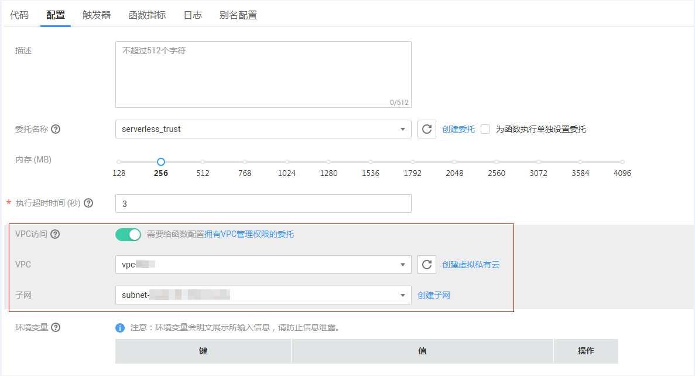
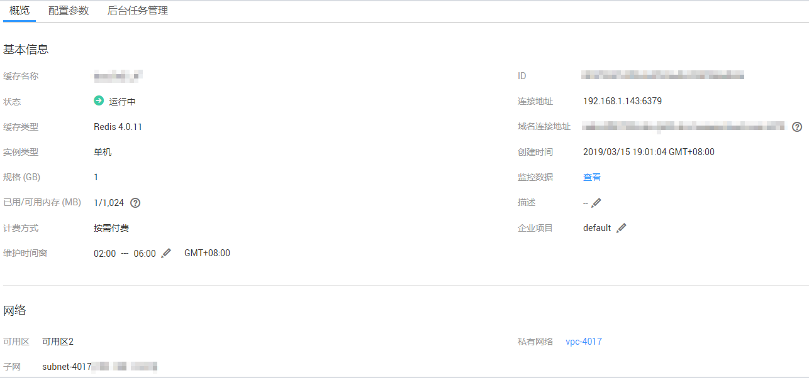
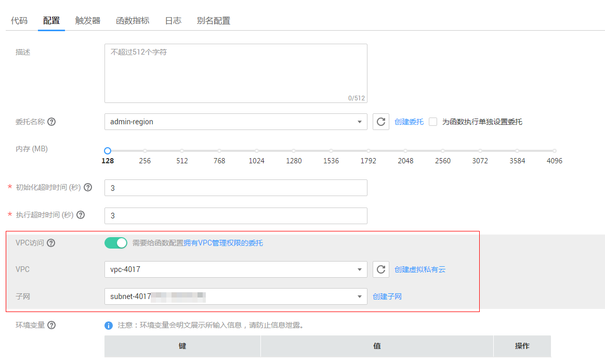
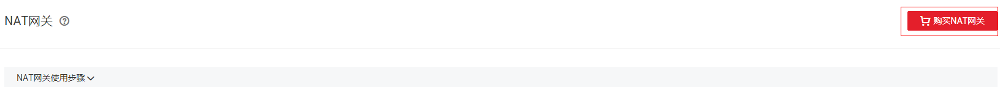
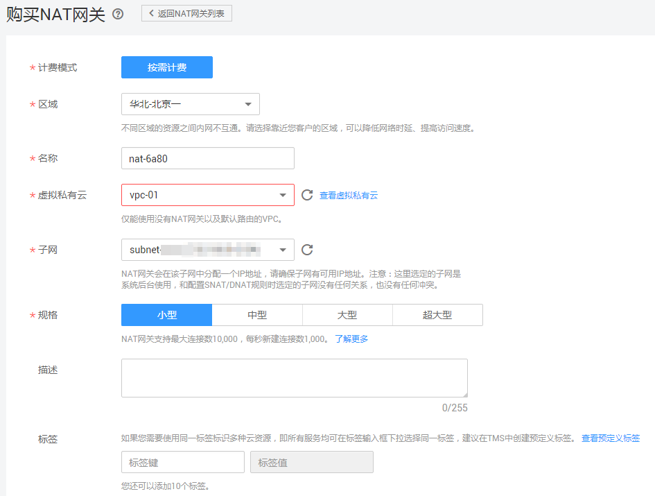
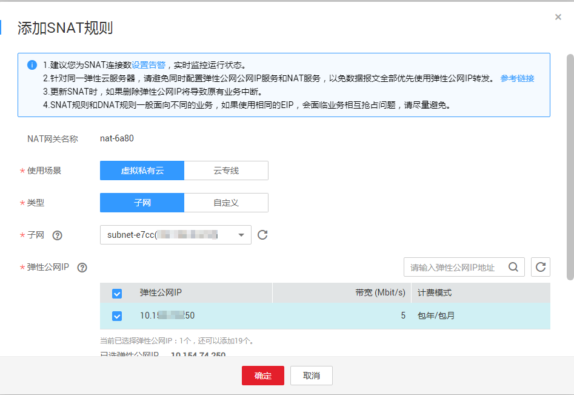

# 函数配置VPC<a name="ZH-CN_TOPIC_0159615971"></a>

函数支持用户创建虚拟私有云（VPC）并访问自己VPC内的资源，同时支持通过SNAT方式绑定EIP访问外网。在编辑函数时，您可以通过配置，为函数增加VPC网络的访问能力。

## 配置VPC<a name="section923421213196"></a>

函数配置VPC访问功能步骤如下：

1.  登录FunctionGraph控制台，进入“函数”界面。
2.  在“函数”界面创建一个目标函数，参考[代码上传方式创建运行和初始化函数](代码上传方式创建运行和初始化函数.md)。
3.  点击已创建的函数名称，进入函数“配置”详情页面。
4.  在配置页面打开“VPC访问”，选择已创建的VPC和子网，如[图1](#fig185346205133)所示。

    **图 1**  配置VPC<a name="fig185346205133"></a>  
    

    > **说明：**   
    >1.  创建虚拟私有云VPC和子网请参考[创建虚拟私有云基本信息及默认子网](https://support.huaweicloud.com/usermanual-vpc/zh-cn_topic_0013935842.html)。  
    >2.  使用跨VPC访问能力时必须配置具备VPC管理权限的委拖，创建委托请参考[创建委托](创建委托.md)。  
    >3.  一个用户在一个项目下所有的函数最多能绑定5个不同的子网（不区分VPC），如果需要多于5个的子网，请提工单修改规格。  

5.  单击“保存”完成VPC配置。

**示例：**

利用VPC配置访问Redis示例如下。

1.  选择已有缓存实例。如果没有实例请先进入分布式缓存服务控制台购买缓存实例。如[图2](#fig621713596122)所示。

    **图 2**  缓存实例<a name="fig621713596122"></a>  
    

2.  在函数配置详情界面配置VPC，选择上个步骤中的私有网络及子网，如[图3](#fig4403154252315)所示。

    **图 3**  函数配置VPC<a name="fig4403154252315"></a>  
    

3.  配置后，使用如下代码访问redis：

    ```
    # -*- coding:utf-8 -*-
    import redis
    
    def handler (event, context):
        r = redis.StrictRedis(host='192.168.1.143', port=6379, db=0)
        r.set('product', 'FunctionGraph')
        print r.keys('*')
        print r.get('product')
    ```


## 函数在VPC网络中访问外网配置<a name="section1888817242319"></a>

部署在VPC中的函数默认是和外网隔离开的，如果您想让函数同时具备内网访问和外网访问能力，您可以选择给VPC添加NAT网关。

**前提条件：**

1.  已创建虚拟私有云和子网，请参考[创建虚拟私有云基本信息及默认子网](https://support.huaweicloud.com/usermanual-vpc/zh-cn_topic_0013935842.html)。
2.  已购买弹性云公网IP，请参考[购买弹性公网IP](https://support.huaweicloud.com/usermanual-vpc/zh-cn_topic_0013748738.html)。

**创建NAT网关步骤如下：**

1.  登录NAT网关控制台，点击“购买NAT网关”，进入购买页面，如[图4](#fig1634816255418)所示。

    **图 4**  购买<a name="fig1634816255418"></a>  
    

2.  在NAT网关购买界面，输入相关信息，选择已创建的虚拟私有云及子网（此处以vpc-01为例），在确认规格信息后提交，完成购买。如[图5](#fig22341019614)所示。

    **图 5**  购买NAT网关<a name="fig22341019614"></a>  
    

3.  购买完成后，点击NAT网关名称进入详情页面，选择“添加SNAT规则”，如[图6](#fig368275723715)所示。

    **图 6**  添加SNAT规则<a name="fig368275723715"></a>  
    

4.  单击“确定”完成配置。

