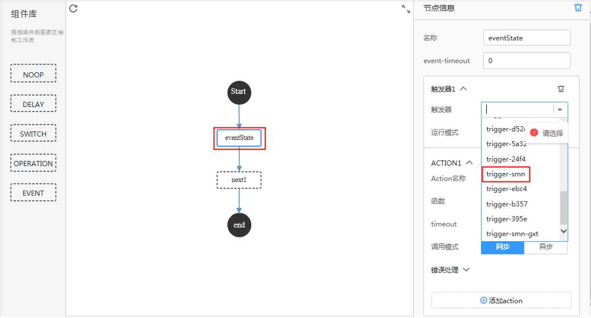
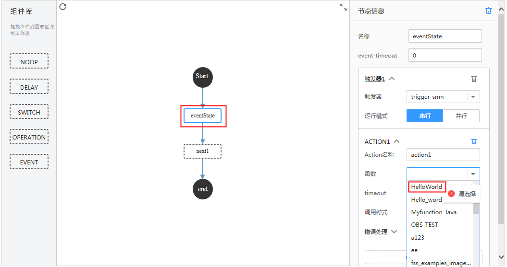
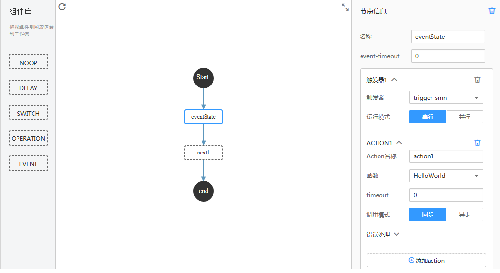
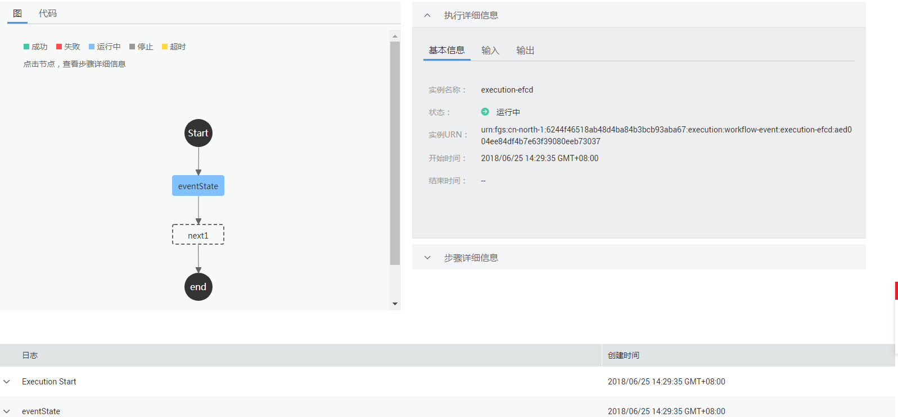
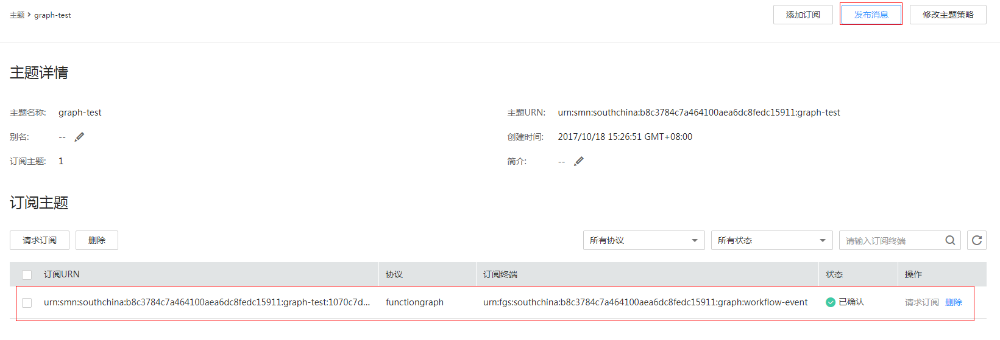
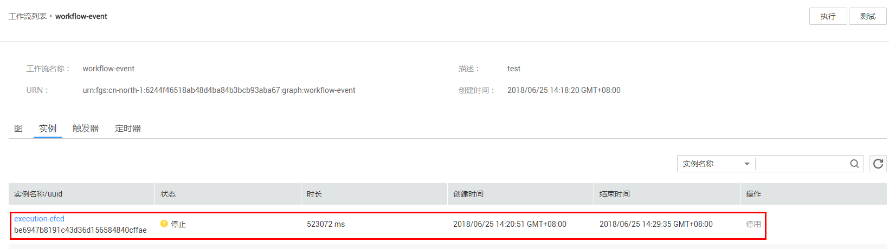

# 创建Event工作流<a name="ZH-CN_TOPIC_0149027311"></a>

本节使用FunctionGraph自带的Event工作流模板，编排已创建的函数和工作流触发器，创建工作流，生成工作流实例，通过SMN消息触发函数运行，获得工作流执行结果。

## 前提条件<a name="section28989356145359"></a>

-   已创建工作流触发器，创建过程请参考[创建工作流触发器](创建工作流触发器.md)。
-   已经创建FunctionGraph函数，创建过程请参考[创建HelloWorld函数](https://support.huaweicloud.com/usermanual-functiongraph/functiongraph_01_0201.html)。

## 创建工作流<a name="section3688239273"></a>

工作流中节点之间的以JSON格式传递数据，如果某个节点返回值不是JSON格式，会导致后续节点input无法解析数据。所以在创建工作流编排函数时，需要保证被编排函数返回值为JSON格式，防止出错。

1.  用户登录FunctionGraph控制台，选择“工作流\>工作流列表”，进入“工作流列表”界面。
2.  在“工作流列表”界面，单击“创建工作流”，进入“创建工作流”界面。
3.  在“创建工作流”界面填写工作流信息。
    1.  填写基础配置信息，如[表1](#table46600572105838)所示，带\*参数为必填项。

        **表 1**  工作流基础配置信息表

        <a name="table46600572105838"></a>
        <table><thead align="left"><tr id="row2549532105838"><th class="cellrowborder" valign="top" width="50%" id="mcps1.2.3.1.1"><p id="p64741929105852"><a name="p64741929105852"></a><a name="p64741929105852"></a>参数</p>
        </th>
        <th class="cellrowborder" valign="top" width="50%" id="mcps1.2.3.1.2"><p id="p9604890105852"><a name="p9604890105852"></a><a name="p9604890105852"></a>说明</p>
        </th>
        </tr>
        </thead>
        <tbody><tr id="row65180644105838"><td class="cellrowborder" valign="top" width="50%" headers="mcps1.2.3.1.1 "><p id="p2460416105852"><a name="p2460416105852"></a><a name="p2460416105852"></a>*名称</p>
        </td>
        <td class="cellrowborder" valign="top" width="50%" headers="mcps1.2.3.1.2 "><p id="p5116395915755"><a name="p5116395915755"></a><a name="p5116395915755"></a>工作流名称命名规则：名称必须以字母或数字开头，只能由字母、数字、下划线和中划线组成，长度小于等于64个字符，且不能重名。</p>
        <p id="p65076039105852"><a name="p65076039105852"></a><a name="p65076039105852"></a>输入“workflow-event”。</p>
        </td>
        </tr>
        <tr id="row40639954185143"><td class="cellrowborder" valign="top" width="50%" headers="mcps1.2.3.1.1 "><p id="p45175680185150"><a name="p45175680185150"></a><a name="p45175680185150"></a>描述</p>
        </td>
        <td class="cellrowborder" valign="top" width="50%" headers="mcps1.2.3.1.2 "><p id="p50335129143212"><a name="p50335129143212"></a><a name="p50335129143212"></a>对工作流的描述，输入规则：工作流描述可以为空或者只能包含大写字母、小写字母、数字和特殊字符(,.:-)，长度小于等于256个字符。</p>
        <p id="p35351426185150"><a name="p35351426185150"></a><a name="p35351426185150"></a>输入“test”。</p>
        </td>
        </tr>
        </tbody>
        </table>

    2.  选择工作流模板，如[表2](#table124082057152410)所示。

        **表 2**  工作流模板配置表

        <a name="table124082057152410"></a>
        <table><thead align="left"><tr id="row8406257182411"><th class="cellrowborder" valign="top" width="50%" id="mcps1.2.3.1.1"><p id="p1440535713243"><a name="p1440535713243"></a><a name="p1440535713243"></a>参数</p>
        </th>
        <th class="cellrowborder" valign="top" width="50%" id="mcps1.2.3.1.2"><p id="p2405357122415"><a name="p2405357122415"></a><a name="p2405357122415"></a>说明</p>
        </th>
        </tr>
        </thead>
        <tbody><tr id="row114064576245"><td class="cellrowborder" valign="top" width="50%" headers="mcps1.2.3.1.1 "><p id="p1340695762410"><a name="p1340695762410"></a><a name="p1340695762410"></a>*模板类型</p>
        </td>
        <td class="cellrowborder" valign="top" width="50%" headers="mcps1.2.3.1.2 "><p id="p124061957162410"><a name="p124061957162410"></a><a name="p124061957162410"></a>选择“通用模板”。</p>
        </td>
        </tr>
        <tr id="row1240755712241"><td class="cellrowborder" valign="top" width="50%" headers="mcps1.2.3.1.1 "><p id="p12407657172411"><a name="p12407657172411"></a><a name="p12407657172411"></a>模板名称</p>
        </td>
        <td class="cellrowborder" valign="top" width="50%" headers="mcps1.2.3.1.2 "><p id="p1640755782410"><a name="p1640755782410"></a><a name="p1640755782410"></a>选择“Event”。</p>
        <p id="p2662535016125"><a name="p2662535016125"></a><a name="p2662535016125"></a>模板实现功能：设置一系列等待的事件，当事件触发时做相应处理后，流转到对应的state。</p>
        </td>
        </tr>
        </tbody>
        </table>

    3.  选中“eventState”节点，在“节点信息”中，单击触发器后的下拉框选择[创建工作流触发器](创建工作流触发器.md)中已创建的触发器trigger\_smn编排触发器。如[图1](#fig26460081162543)所示。

        **图 1**  编排触发器<a name="fig26460081162543"></a>  
        

    4.  选中“eventState”节点，在“节点信息”中，单击函数后的下拉框选择已创建的HelloWorld函数，如[图2](#fig20153773162813)所示。

        **图 2**  编排HelloWorld函数<a name="fig20153773162813"></a>  
        

    5.  完成编排后，代码如下。

        ```
        {
        	"event-defs": {
        		"event1": {
        			"payload-filter-request": "$",
        			"payload-filter-response": "$",
        		"source": "urn:fgs:southchina:b8c3784c7a464100aea6dc8fedc15911:trigger:SMN_trigger_smn_trigger-smna11648fb-ad65-4191-4362-d414cb6a1985_1510631184"
        		}
        	},
        	"states": {
        		"eventState": {
        			"type": "EVENT",
        			"payload-filter-in": "$",
        			"payload-filter-out": "$",
        			"event-timeout": 0,
        			"start": true,
        			"events": [
        				{
        					"event-expression": "event1",
        					"action-mode": "SEQUENTIAL",
        					"actions": [
        						{
        							"action-name": "action1",
        							"function": "urn:fss:southchina:b8c3784c7a464100aea6dc8fedc15911:function:default:HelloWorld",
        							"invocation-mode": "SYNC",
        							"payload-filter": "$",
        							"timeout": 0
        						}
        					],
        					"next-state": "next1"
        				}
        			]
        		},
        		"next1": {
        			"type": "NOOP",
        			"next-state": "end"
        		},
        		"end": {
        			"type": "END"
        		}
        	}
        }
        ```

    6.  查看可视化工作流，如[图3](#fig33224420101854)所示。

        **图 3**  可视化工作流<a name="fig33224420101854"></a>  
        

4.  单击“创建”，完成工作流创建。

## 生成工作流实例<a name="section15581639193018"></a>

1.  用户登录FunctionGraph控制台，选择“工作流\>工作流列表”，进入“工作流列表”界面。
2.  在“工作流列表”界面，单击“workflow-event”工作流名称，进入工作流详情界面。
3.  在工作流详情界面，单击“执行”，如[图4](#fig26608149165049)所示，弹出“执行”界面。

    **图 4**  执行event工作流<a name="fig26608149165049"></a>  
    

4.  在“执行”界面，输入如下信息，如[表3](#table2774280210421)所示，带\*参数为必填项。

    **表 3**  执行信息

    <a name="table2774280210421"></a>
    <table><thead align="left"><tr id="row4646906810421"><th class="cellrowborder" valign="top" width="50%" id="mcps1.2.3.1.1"><p id="p4391008110429"><a name="p4391008110429"></a><a name="p4391008110429"></a>参数</p>
    </th>
    <th class="cellrowborder" valign="top" width="50%" id="mcps1.2.3.1.2"><p id="p6705563610429"><a name="p6705563610429"></a><a name="p6705563610429"></a>说明</p>
    </th>
    </tr>
    </thead>
    <tbody><tr id="row4312774710421"><td class="cellrowborder" valign="top" width="50%" headers="mcps1.2.3.1.1 "><p id="p368659310421"><a name="p368659310421"></a><a name="p368659310421"></a>*实例名称</p>
    </td>
    <td class="cellrowborder" valign="top" width="50%" headers="mcps1.2.3.1.2 "><p id="p3017858310421"><a name="p3017858310421"></a><a name="p3017858310421"></a>名称只能由字母、数字、下划线和中划线组成，且长度小于等于80个字符。</p>
    <p id="p1528765893057"><a name="p1528765893057"></a><a name="p1528765893057"></a>使用系统自动生成的名称，例如：“execution-efcd”。</p>
    </td>
    </tr>
    <tr id="row317179510421"><td class="cellrowborder" valign="top" width="50%" headers="mcps1.2.3.1.1 "><p id="p5558883310421"><a name="p5558883310421"></a><a name="p5558883310421"></a>*执行输入数据</p>
    </td>
    <td class="cellrowborder" valign="top" width="50%" headers="mcps1.2.3.1.2 "><p id="p293976710537"><a name="p293976710537"></a><a name="p293976710537"></a>输入代码{"message":"hello"}。</p>
    </td>
    </tr>
    </tbody>
    </table>

5.  单击“确定”，生成工作流实例，如[图5](#fig3630463015167)所示。

    **图 5**  工作流实例<a name="fig3630463015167"></a>  
    

    > **说明：**   
    >执行工作流后，由于工作流编排有SMN触发器，会在消息通知服务graph-test主题下生成订阅，如[图6](#fig42804707151519)所示。  


## SMN消息触发函数<a name="section13567173911305"></a>

1.  用户登录“消息通知服务”，单击“主题管理\>主题”，进入“主题”界面。
2.  在“主题”界面，单击“graph-test”主题名称，进入主题详情页。
3.  在“主题详情页”，单击操作栏的“发布消息”，如[图6](#fig42804707151519)所示，弹出“发布消息”界面。

    **图 6**  发布消息<a name="fig42804707151519"></a>  
    

4.  在“发布消息”界面，填写发布信息，如[表4](#table666402589505)所示，带\*参数为必填项。

    **表 4**  发布信息表

    <a name="table666402589505"></a>
    <table><thead align="left"><tr id="row261571859505"><th class="cellrowborder" valign="top" width="50%" id="mcps1.2.3.1.1"><p id="p37169149505"><a name="p37169149505"></a><a name="p37169149505"></a>字段</p>
    </th>
    <th class="cellrowborder" valign="top" width="50%" id="mcps1.2.3.1.2"><p id="p326346039505"><a name="p326346039505"></a><a name="p326346039505"></a>填写说明</p>
    </th>
    </tr>
    </thead>
    <tbody><tr id="row34232299505"><td class="cellrowborder" valign="top" width="50%" headers="mcps1.2.3.1.1 "><p id="p383572119505"><a name="p383572119505"></a><a name="p383572119505"></a>消息标题</p>
    </td>
    <td class="cellrowborder" valign="top" width="50%" headers="mcps1.2.3.1.2 "><p id="p199263699505"><a name="p199263699505"></a><a name="p199263699505"></a>输入“SMN-Test”。</p>
    </td>
    </tr>
    <tr id="row63565049505"><td class="cellrowborder" valign="top" width="50%" headers="mcps1.2.3.1.1 "><p id="p308090619505"><a name="p308090619505"></a><a name="p308090619505"></a>*消息类型</p>
    </td>
    <td class="cellrowborder" valign="top" width="50%" headers="mcps1.2.3.1.2 "><p id="p125060429505"><a name="p125060429505"></a><a name="p125060429505"></a>选择“文本消息”。</p>
    </td>
    </tr>
    <tr id="row53386089505"><td class="cellrowborder" valign="top" width="50%" headers="mcps1.2.3.1.1 "><p id="p572085379505"><a name="p572085379505"></a><a name="p572085379505"></a>*消息内容</p>
    </td>
    <td class="cellrowborder" valign="top" width="50%" headers="mcps1.2.3.1.2 "><p id="p33799269505"><a name="p33799269505"></a><a name="p33799269505"></a>输入“graph-test”。</p>
    </td>
    </tr>
    </tbody>
    </table>

5.  单击“确定”，完成消息发布。

    > **说明：**   
    >消息发布以后，会自动触发工作流中的Event事件。  


## 查看运行结果<a name="section1380754193217"></a>

1.  用户登录FunctionGraph控制台，选择“工作流\>工作流列表”，进入“工作流列表”界面。
2.  在“工作流列表”界面，单击“workflow-event”工作流名称，进入工作流详情界面。
3.  在工作流详情界面，单击“实例”页签，如[图7](#fig26202238152132)所示，进入“实例”界面。

    **图 7**  实例列表<a name="fig26202238152132"></a>  
    

4.  在“实例”界面，单击实例名称，进入实例执行界面，查看实例执行信息。
    1.  查看工作流执行状态，如下[图8](#fig57575921152214)所示。

        **图 8**  工作流执行信息<a name="fig57575921152214"></a>  
        

    2.  查看输出结果，示例如下。

        ```
        {"records":[{"event_version":"1.0","smn":{"topic_urn":"urn:smn:southchina:b8c3784c7a464100aea6dc8fedc15911:graph-test","type":"notification","message":"graph-test","timestamp":"2017-10-21T07:13:50Z","subject":"SMN-Test","message_id":"c9d2071a7f104c72825f0275c6872ad7"},"event_source":"SMN","event_subscription_urn":"urn:smn:southchina:b8c3784c7a464100aea6dc8fedc15911:graph-test:1070c7dc83814b129d9e2711b7b75b2c"}],"functionname":"test","requestId":"6e49883e-fa41-4887-8f2b-701bb4d1daf0","timestamp":"Sat Oct 21 2017 15:12:05 GMT+0800 (CST)"}
        ```


