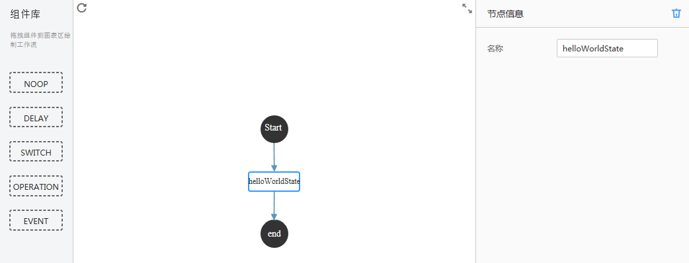
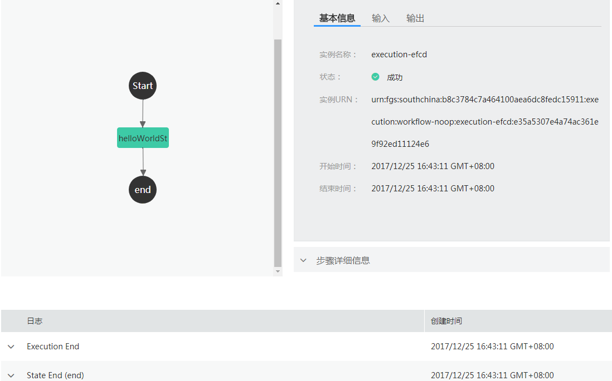

# 创建HelloWorld工作流<a name="ZH-CN_TOPIC_0149027425"></a>

本节使用FunctionGraph自带的HelloWorld工作流模板，创建工作流并执行，获得工作流输出结果，供用户快速体验工作流相关的基本功能。

## 创建工作流<a name="section114891153204119"></a>

1.  用户登录FunctionGraph控制台，选择“工作流\>工作流列表”，进入“工作流列表”界面。
2.  在“工作流列表”界面，单击“创建工作流”，进入“创建工作流”界面。
3.  在“创建工作流”界面填写工作流信息。
    1.  填写基础配置信息，如[表1](#table46600572105838)所示，带\*参数为必填项。

        **表 1**  工作流基础配置信息表

        <a name="table46600572105838"></a>
        <table><thead align="left"><tr id="row2549532105838"><th class="cellrowborder" valign="top" width="50%" id="mcps1.2.3.1.1"><p id="p64741929105852"><a name="p64741929105852"></a><a name="p64741929105852"></a>参数</p>
        </th>
        <th class="cellrowborder" valign="top" width="50%" id="mcps1.2.3.1.2"><p id="p9604890105852"><a name="p9604890105852"></a><a name="p9604890105852"></a>说明</p>
        </th>
        </tr>
        </thead>
        <tbody><tr id="row65180644105838"><td class="cellrowborder" valign="top" width="50%" headers="mcps1.2.3.1.1 "><p id="p2460416105852"><a name="p2460416105852"></a><a name="p2460416105852"></a>*名称</p>
        </td>
        <td class="cellrowborder" valign="top" width="50%" headers="mcps1.2.3.1.2 "><p id="p5116395915755"><a name="p5116395915755"></a><a name="p5116395915755"></a>工作流名称的命名规则为：名称必须以字母或数字开头，只能由字母、数字、下划线和中划线组成，长度小于等于64个字符，且不能重名。</p>
        <p id="p65076039105852"><a name="p65076039105852"></a><a name="p65076039105852"></a>输入“workflow-noop”。</p>
        </td>
        </tr>
        <tr id="row40639954185143"><td class="cellrowborder" valign="top" width="50%" headers="mcps1.2.3.1.1 "><p id="p45175680185150"><a name="p45175680185150"></a><a name="p45175680185150"></a>描述</p>
        </td>
        <td class="cellrowborder" valign="top" width="50%" headers="mcps1.2.3.1.2 "><p id="p50335129143212"><a name="p50335129143212"></a><a name="p50335129143212"></a>对工作流的描述，输入规则：可以为空或者只能包含大写字母、小写字母、数字和特殊字符(,.:-)，长度小于等于256个字符。</p>
        <p id="p35351426185150"><a name="p35351426185150"></a><a name="p35351426185150"></a>输入“test”。</p>
        </td>
        </tr>
        </tbody>
        </table>

    2.  选择工作流模板，如[表2](#table124082057152410)所示，带\*参数为必填项。

        **表 2**  工作流模板配置表

        <a name="table124082057152410"></a>
        <table><thead align="left"><tr id="row8406257182411"><th class="cellrowborder" valign="top" width="50%" id="mcps1.2.3.1.1"><p id="p1440535713243"><a name="p1440535713243"></a><a name="p1440535713243"></a>参数</p>
        </th>
        <th class="cellrowborder" valign="top" width="50%" id="mcps1.2.3.1.2"><p id="p2405357122415"><a name="p2405357122415"></a><a name="p2405357122415"></a>说明</p>
        </th>
        </tr>
        </thead>
        <tbody><tr id="row114064576245"><td class="cellrowborder" valign="top" width="50%" headers="mcps1.2.3.1.1 "><p id="p1340695762410"><a name="p1340695762410"></a><a name="p1340695762410"></a>*模板类型</p>
        </td>
        <td class="cellrowborder" valign="top" width="50%" headers="mcps1.2.3.1.2 "><p id="p124061957162410"><a name="p124061957162410"></a><a name="p124061957162410"></a>选择“通用模板”。</p>
        </td>
        </tr>
        <tr id="row1240755712241"><td class="cellrowborder" valign="top" width="50%" headers="mcps1.2.3.1.1 "><p id="p12407657172411"><a name="p12407657172411"></a><a name="p12407657172411"></a>模板名称</p>
        </td>
        <td class="cellrowborder" valign="top" width="50%" headers="mcps1.2.3.1.2 "><p id="p589132221654"><a name="p589132221654"></a><a name="p589132221654"></a>选择“HelloWorld”。</p>
        <p id="p1640755782410"><a name="p1640755782410"></a><a name="p1640755782410"></a>模板实现功能为：不做处理，直接将输入作为输出。</p>
        </td>
        </tr>
        </tbody>
        </table>

    3.  查看可视化工作流，如[图1](#fig2837364692514)所示。

        **图 1**  HelloWorld可视化工作流<a name="fig2837364692514"></a>  
        

    4.  工作流的代码如下。

        ```
        {
        	"states": {
        		"helloWorldState": {
        			"type": "NOOP",
        			"payload-filter-in": "$",
        			"payload-filter-out": "$",
        			"start": true,
        			"next-state": "end"
        		},
        		"end": {
        			"type": "END"
        		}
        	}
        }
        
        ```

4.  单击“创建”，完成工作流创建。

## 执行工作流<a name="section6492153144111"></a>

1.  用户登录FunctionGraph控制台，选择“工作流\>工作流列表”，进入“工作流列表”界面。
2.  在“工作流列表”界面，单击“workflow-noop”工作流名称，进入工作流详情界面。
3.  在工作流详情界面，单击“执行”，弹出“执行”界面。
4.  在“执行”界面，输入如下信息，如[表3](#table2774280210421)所示，带\*参数为必填项。

    **表 3**  执行信息

    <a name="table2774280210421"></a>
    <table><thead align="left"><tr id="row4646906810421"><th class="cellrowborder" valign="top" width="50%" id="mcps1.2.3.1.1"><p id="p4391008110429"><a name="p4391008110429"></a><a name="p4391008110429"></a>参数</p>
    </th>
    <th class="cellrowborder" valign="top" width="50%" id="mcps1.2.3.1.2"><p id="p6705563610429"><a name="p6705563610429"></a><a name="p6705563610429"></a>说明</p>
    </th>
    </tr>
    </thead>
    <tbody><tr id="row4312774710421"><td class="cellrowborder" valign="top" width="50%" headers="mcps1.2.3.1.1 "><p id="p368659310421"><a name="p368659310421"></a><a name="p368659310421"></a>*实例名称</p>
    </td>
    <td class="cellrowborder" valign="top" width="50%" headers="mcps1.2.3.1.2 "><p id="p3017858310421"><a name="p3017858310421"></a><a name="p3017858310421"></a>实例名称只能由字母、数字、下划线和中划线组成，且长度小于等于80个字符。</p>
    <p id="p1528765893057"><a name="p1528765893057"></a><a name="p1528765893057"></a>使用系统自动生成的名称，如“execution-efcd”。</p>
    </td>
    </tr>
    <tr id="row317179510421"><td class="cellrowborder" valign="top" width="50%" headers="mcps1.2.3.1.1 "><p id="p5558883310421"><a name="p5558883310421"></a><a name="p5558883310421"></a>*执行输入数据</p>
    </td>
    <td class="cellrowborder" valign="top" width="50%" headers="mcps1.2.3.1.2 "><p id="p293976710537"><a name="p293976710537"></a><a name="p293976710537"></a>输入代码{"message":"hello"}。</p>
    </td>
    </tr>
    </tbody>
    </table>

5.  单击“确定”，执行工作流。
6.  查看工作执行结果，如[图2](#fig2567218693449)所示。

    **图 2**  HelloWorld工作流执行结果<a name="fig2567218693449"></a>  
    

7.  工作流执行成功，结果输出如下。

    ```
    {"message":"hello"}
    ```


