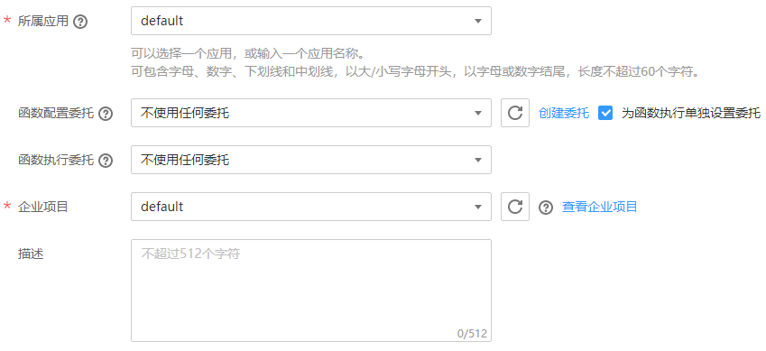

# 创建函数

由于FunctionGraph承担计算资源的管理工作，在函数完成编码以后，需要为函数设置运算资源等信息，目前主要是在FunctionGraph函数控制台完成。

创建函数时可以使用已有模板，也可以使用空模板，说明如下。

## 使用空模板

使用空模板创建函数时，需要设置基础配置信息和代码信息，如[表1](#table46600572105838)、[表2](#table13867334105936)所示，带\*参数为必填项。

函数环境信息使用缺省值，如[表3](#table4028632011654)所示，带\*参数为必填项。函数创建完成后，可以修改，请参考[修改函数配置](函数管理.md#section1560314348363)。

**表 1**  函数基础配置信息表

<table><thead align="left"><tr id="row2549532105838"><th class="cellrowborder" valign="top" width="50%" id="mcps1.2.3.1.1">
参数

</th>
<th class="cellrowborder" valign="top" width="50%" id="mcps1.2.3.1.2">
说明

</th>
</tr>
</thead>
<tbody><tr id="row65180644105838"><td class="cellrowborder" valign="top" width="50%" headers="mcps1.2.3.1.1 ">
*函数名称

</td>
<td class="cellrowborder" valign="top" width="50%" headers="mcps1.2.3.1.2 ">
函数名称，命名规则如下：

<ul id="ul38620597162358"><li>可包含字母、数字、下划线和中划线，长度不超过60个字符。</li><li>以字母开头，以字母或数字结尾。</li></ul>
</td>
</tr>
<tr id="row154321737201413"><td class="cellrowborder" valign="top" width="50%" headers="mcps1.2.3.1.1 ">
*所属应用

</td>
<td class="cellrowborder" valign="top" width="50%" headers="mcps1.2.3.1.2 ">
用户创建函数时可以进行分组，每个函数应用下面可以创建多个函数，在函数创建时可以选择其归属于某个函数应用，或输入函数应用名称进行新建。命名规则如下：

<ul id="ul519219971112"><li>可包含字母、数字、下划线和中划线，长度不超过60个字符。</li><li>以大/小写字母开头，以字母或数字结尾。</li></ul>
</td>
</tr>
<tr id="row837616314468"><td class="cellrowborder" valign="top" width="50%" headers="mcps1.2.3.1.1 ">
委托名称

</td>
<td class="cellrowborder" valign="top" width="50%" headers="mcps1.2.3.1.2 ">
用户委托函数工作流服务去访问其他的云服务，举例：如果用户函数需要访问OBS、DMS等服务，则需要提供权限委托，如果用户函数不访问任何云服务，则不用提供委托名称。

</td>
</tr>
<tr id="row40639954185143"><td class="cellrowborder" valign="top" width="50%" headers="mcps1.2.3.1.1 ">
函数描述

</td>
<td class="cellrowborder" valign="top" width="50%" headers="mcps1.2.3.1.2 ">
对函数的描述，不超过512个字符。

</td>
</tr>
</tbody>
</table>

> **说明：**   
>-   有关创建委托的过程请参考[创建委托](创建委托.md)。  
>-   在创建函数过程中选择委托时，勾选“为函数执行单独设置委拖”时，弹出“触发器委托”栏，函数执行委托与触发器委托可独立设置，这将减小不必要的性能损耗；不勾选，函数执行和触发器将使用同一委托。如[图1](#fig11875175135113)所示。  
>    **图 1**  委托设置    
>      
>    1.  触发器委托，如果函数需要创建DMS或DIS触发器，则需要配置具有DMS或DIS访问权限的委托。  
>    2.  函数执行委托配置后用户可以通过函数执行入口方法中的context参数获取具有委托中权限的token、ak、sk，用于访问其他云服务。  

**表 2**  函数代码配置信息表

<table><thead align="left"><tr id="row42840307105936"><th class="cellrowborder" valign="top" width="50%" id="mcps1.2.3.1.1">
参数

</th>
<th class="cellrowborder" valign="top" width="50%" id="mcps1.2.3.1.2">
说明

</th>
</tr>
</thead>
<tbody><tr id="row11343074105936"><td class="cellrowborder" valign="top" width="50%" headers="mcps1.2.3.1.1 ">
运行时语言

</td>
<td class="cellrowborder" valign="top" width="50%" headers="mcps1.2.3.1.2 ">
目前支持Python 3.6、Python 2.7、Node.js 6.10、Node.js 8.10、Java 8、Go 1.8、C#(.NET Core 2.0)、C#(.NET Core 2.1)。

</td>
</tr>
<tr id="row50739855105936"><td class="cellrowborder" valign="top" width="50%" headers="mcps1.2.3.1.1 ">
*函数执行入口

</td>
<td class="cellrowborder" valign="top" width="50%" headers="mcps1.2.3.1.2 ">
函数执行入口说明，请参考<a href="创建程序包.md">创建程序包</a>。

</td>
</tr>
<tr id="row62480415105936"><td class="cellrowborder" valign="top" width="50%" headers="mcps1.2.3.1.1 ">
代码上传方式

</td>
<td class="cellrowborder" valign="top" width="50%" headers="mcps1.2.3.1.2 ">
代码上传方式请参考<a href="创建程序包.md">创建程序包</a>。

</td>
</tr>
</tbody>
</table>

**表 3**  函数环境信息配置表

<table><thead align="left"><tr id="row6157195811654"><th class="cellrowborder" valign="top" width="50%" id="mcps1.2.3.1.1">
参数

</th>
<th class="cellrowborder" valign="top" width="50%" id="mcps1.2.3.1.2">
说明

</th>
</tr>
</thead>
<tbody><tr id="row5085727611654"><td class="cellrowborder" valign="top" width="50%" headers="mcps1.2.3.1.1 ">
内存（MB）

</td>
<td class="cellrowborder" valign="top" width="50%" headers="mcps1.2.3.1.2 ">
配置函数运行时所需的内存。

缺省值为128MB。

</td>
</tr>
<tr id="row1679086111654"><td class="cellrowborder" valign="top" width="50%" headers="mcps1.2.3.1.1 ">
*超时（秒）

</td>
<td class="cellrowborder" valign="top" width="50%" headers="mcps1.2.3.1.2 ">
函数的超时时间，超时的函数将被强行停止。

超时时间设置3-900秒的范围内。

缺省值为3s。

</td>
</tr>
</tbody>
</table>

> **说明：**   
>FunctionGraph计费是依据函数设置的内存大小及执行时间收费，请根据实际情况合理配置函数内存及超时时间。  

## 使用已有模板

FunctionGraph内置了一些典型场景的函数模板，函数模板包含了代码信息、配置信息、环境信息及触发器信息，选择使用模板，可以加载模板内置的函数信息，快速构建应用程序。详情请参考[使用函数模板](使用函数模板.md)。

