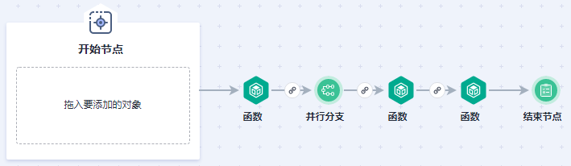
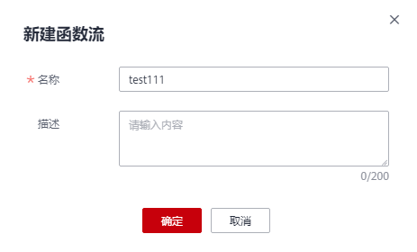

# 创建函数流任务

本文主要介绍如何创建函数流编排函数任务的流程。

## 前提条件

-   已经在FunctionGraph控制台创建函数，创建过程请参见[创建并初始化函数](https://support.huaweicloud.com/usermanual-functiongraph/functiongraph_01_0201.html)。
-   使用函数流功能前，请先了解[组件说明](#section16187191712322)、[表达式运算符说明](表达式运算符说明.md)和[编排规则](#section1365734318316)。

## 组件说明

函数流提供多种类型的组件，用户可以通过拖拽组件、配置组件和连接组件进行可视化编排，实现函数任务流的编排。使用函数流功能，请先了解[表1](#table36889013365)。

**表 1**  组件说明

<table><thead align="left"><tr id="row36888083619"><th class="cellrowborder" valign="top" width="18.921892189218923%" id="mcps1.2.4.1.1">
类型

</th>
<th class="cellrowborder" valign="top" width="26.532653265326527%" id="mcps1.2.4.1.2">
名称

</th>
<th class="cellrowborder" valign="top" width="54.54545454545454%" id="mcps1.2.4.1.3">
说明

</th>
</tr>
</thead>
<tbody><tr id="row86881705368"><td class="cellrowborder" valign="top" width="18.921892189218923%" headers="mcps1.2.4.1.1 ">
触发器

</td>
<td class="cellrowborder" valign="top" width="26.532653265326527%" headers="mcps1.2.4.1.2 ">
APIg触发器

</td>
<td class="cellrowborder" valign="top" width="54.54545454545454%" headers="mcps1.2.4.1.3 ">
可以通过HTTPS调用函数流，使用API Gateway自定义REST API和终端节点来实现。可以将各个API操作（例如GET和PUT）映射到特定的函数流，当向该API终端节点发送HTTPS请求时（APIG示例事件），API Gateway会调用相应的函数流。

 说明： 

由于APIG限制，APIG触发器当前只开放APIG共享版给存量用户使用，新租户目前不支持共享版，因此公测期间暂时无法使用APIG触发器功能。

</td>
</tr>
<tr id="row9688308362"><td class="cellrowborder" valign="top" width="18.921892189218923%" headers="mcps1.2.4.1.1 ">
函数组件

</td>
<td class="cellrowborder" valign="top" width="26.532653265326527%" headers="mcps1.2.4.1.2 ">
函数

</td>
<td class="cellrowborder" valign="top" width="54.54545454545454%" headers="mcps1.2.4.1.3 ">
FunctionGraph函数，如何创建函数请参见<a href="https://support.huaweicloud.com/usermanual-functiongraph/functiongraph_01_0201.html" target="_blank" rel="noopener noreferrer">创建并初始化函数</a>。

</td>
</tr>
<tr id="row1787075173617"><td class="cellrowborder" rowspan="7" valign="top" width="18.921892189218923%" headers="mcps1.2.4.1.1 ">
流程控制器

</td>
<td class="cellrowborder" valign="top" width="26.532653265326527%" headers="mcps1.2.4.1.2 ">
并行分支

</td>
<td class="cellrowborder" valign="top" width="54.54545454545454%" headers="mcps1.2.4.1.3 ">
用于创建多个并行分支的控制器，以便同时执行多个分支任务，并可根据分支执行结束后控制下一步流程。

</td>
</tr>
<tr id="row6593183911519"><td class="cellrowborder" valign="top" headers="mcps1.2.4.1.1 ">
开始节点

</td>
<td class="cellrowborder" valign="top" headers="mcps1.2.4.1.2 ">
只能加入触发器，用于标识流程的开始，一个流程只能有一个开始节点。

</td>
</tr>
<tr id="row378033611517"><td class="cellrowborder" valign="top" headers="mcps1.2.4.1.1 ">
异常处理

</td>
<td class="cellrowborder" valign="top" headers="mcps1.2.4.1.2 ">
用于控制函数执行失败后的下一步流程。

</td>
</tr>
<tr id="row269333524718"><td class="cellrowborder" valign="top" headers="mcps1.2.4.1.1 ">
循环节点

</td>
<td class="cellrowborder" valign="top" headers="mcps1.2.4.1.2 ">
用于对数组中每个元素进行循环处理。每次循环会执行一次循环内部的子流程。

</td>
</tr>
<tr id="row11111174319514"><td class="cellrowborder" valign="top" headers="mcps1.2.4.1.1 ">
时间等待

</td>
<td class="cellrowborder" valign="top" headers="mcps1.2.4.1.2 ">
用于控制当前流程在指定时间延迟后再调用下一个流程。

</td>
</tr>
<tr id="row15606184818616"><td class="cellrowborder" valign="top" headers="mcps1.2.4.1.1 ">
条件分支

</td>
<td class="cellrowborder" valign="top" headers="mcps1.2.4.1.2 ">
用于根据条件判断是否执行下一分支。

</td>
</tr>
<tr id="row11606648569"><td class="cellrowborder" valign="top" headers="mcps1.2.4.1.1 ">
结束节点

</td>
<td class="cellrowborder" valign="top" headers="mcps1.2.4.1.2 ">
用于标识流程的结束。

</td>
</tr>
</tbody>
</table>

## 编排规则

-   设计的函数流必须是一个有向无环图，从开始节点出发，开始节点后续必须且只能连接一个节点（除了异常处理和结束节点）；流程必须在某一个节点结束，结束流程有两种形式：
    1.  流程中存在的节点没有任何后继节点，且后续节点非条件分支，并行分支或开始节点。
    2.  流程中存在结束节点，且结束节点后续无其他节点。

-   组件设计规则

    **表 2**  触发器和函数

    
    <table><thead align="left"><tr id="row512234312481"><th class="cellrowborder" valign="top" width="19.86198619861986%" id="mcps1.2.4.1.1">
参数

    </th>
    <th class="cellrowborder" valign="top" width="46.804680468046804%" id="mcps1.2.4.1.2">
说明

    </th>
    <th class="cellrowborder" valign="top" width="33.33333333333333%" id="mcps1.2.4.1.3">
创建函数流时，是否必选

    </th>
    </tr>
    </thead>
    <tbody><tr id="row21225438489"><td class="cellrowborder" valign="top" width="19.86198619861986%" headers="mcps1.2.4.1.1 ">
触发器

    </td>
    <td class="cellrowborder" valign="top" width="46.804680468046804%" headers="mcps1.2.4.1.2 "><ul id="ul233216590497"><li>当前允许流程中配置0-10个触发器。</li><li>触发器必须配置在开始节点内。</li><li>触发器不允许连接其他任何节点，也不允许被其他节点连接。</li></ul>
    </td>
    <td class="cellrowborder" valign="top" width="33.33333333333333%" headers="mcps1.2.4.1.3 ">
否

    </td>
    </tr>
    <tr id="row184922511498"><td class="cellrowborder" valign="top" width="19.86198619861986%" headers="mcps1.2.4.1.1 ">
函数

    </td>
    <td class="cellrowborder" valign="top" width="46.804680468046804%" headers="mcps1.2.4.1.2 "><ul id="ul940315315010"><li>当前允许流程中配置0-99个函数节点。</li><li>当函数连接异常处理节点时，最多可以再连接一个非开始节点和非异常处理节点。</li><li>当函数不连接异常处理节点时，只能连接一个非开始节点。</li></ul>
    </td>
    <td class="cellrowborder" valign="top" width="33.33333333333333%" headers="mcps1.2.4.1.3 ">
否

    </td>
    </tr>
    </tbody>
    </table>

    **表 3**  流程控制器

    
    <table><thead align="left"><tr id="row53914246503"><th class="cellrowborder" valign="top" width="14.101410141014101%" id="mcps1.2.4.1.1">
参数

    </th>
    <th class="cellrowborder" valign="top" width="73.77737773777378%" id="mcps1.2.4.1.2">
说明

    </th>
    <th class="cellrowborder" valign="top" width="12.121212121212121%" id="mcps1.2.4.1.3">
创建函数流时，是否必选

    </th>
    </tr>
    </thead>
    <tbody><tr id="row339113244503"><td class="cellrowborder" valign="top" width="14.101410141014101%" headers="mcps1.2.4.1.1 ">
并行分支

    </td>
    <td class="cellrowborder" valign="top" width="73.77737773777378%" headers="mcps1.2.4.1.2 "><ul id="ul198412216515"><li>用于标识节点后面的分支会并行执行。</li><li>后继节点允许连接1-20个节点（除了异常处理，开始节点和结束节点），至少连接一个节点。</li></ul>
    </td>
    <td class="cellrowborder" valign="top" width="12.121212121212121%" headers="mcps1.2.4.1.3 ">
否

    </td>
    </tr>
    <tr id="row09298512505"><td class="cellrowborder" valign="top" width="14.101410141014101%" headers="mcps1.2.4.1.1 ">
开始节点

    </td>
    <td class="cellrowborder" valign="top" width="73.77737773777378%" headers="mcps1.2.4.1.2 "><ul id="ul1047610095218"><li>用于标识流程开始，每个流程必须有且只能有一个开始节点。</li><li>开始节点后面必须接1个节点，后续节点类型不能是结束节点或者异常处理。</li></ul>
    </td>
    <td class="cellrowborder" valign="top" width="12.121212121212121%" headers="mcps1.2.4.1.3 ">
必选

    </td>
    </tr>
    <tr id="row13720115619508"><td class="cellrowborder" valign="top" width="14.101410141014101%" headers="mcps1.2.4.1.1 ">
异常处理

    </td>
    <td class="cellrowborder" valign="top" width="73.77737773777378%" headers="mcps1.2.4.1.2 ">
后面可以接0-10个节点，后继节点不能是开始节点，结束节点和异常处理节点。

    </td>
    <td class="cellrowborder" valign="top" width="12.121212121212121%" headers="mcps1.2.4.1.3 ">
否

    </td>
    </tr>
    <tr id="row117371751204714"><td class="cellrowborder" valign="top" width="14.101410141014101%" headers="mcps1.2.4.1.1 ">
循环节点

    </td>
    <td class="cellrowborder" valign="top" width="73.77737773777378%" headers="mcps1.2.4.1.2 ">
用来对数组中每个元素进行循环处理。每次循环会执行一次循环内部的子流程。

    
循环节点内部子流程需要满足如下规则：

    <ol id="ol11110165211314"><li>只能有一个起始节点（没有前驱节点），起始节点只能使用函数，时间等待节点。</li><li>循环节点内部只允许编排函数，时间等待，异常处理节点。</li></ol>
    </td>
    <td class="cellrowborder" valign="top" width="12.121212121212121%" headers="mcps1.2.4.1.3 ">
否

    </td>
    </tr>
    <tr id="row9721956135019"><td class="cellrowborder" valign="top" width="14.101410141014101%" headers="mcps1.2.4.1.1 ">
时间等待

    </td>
    <td class="cellrowborder" valign="top" width="73.77737773777378%" headers="mcps1.2.4.1.2 ">
后面可以连接0个或1个节点，节点类型不能是开始节点和异常处理节点。

    </td>
    <td class="cellrowborder" valign="top" width="12.121212121212121%" headers="mcps1.2.4.1.3 ">
否

    </td>
    </tr>
    <tr id="row114671304511"><td class="cellrowborder" valign="top" width="14.101410141014101%" headers="mcps1.2.4.1.1 ">
条件分支

    </td>
    <td class="cellrowborder" valign="top" width="73.77737773777378%" headers="mcps1.2.4.1.2 ">
后面可以连接2-20个后继节点，后继节点类型不能为开始节点，结束节点和异常处理节点。

    </td>
    <td class="cellrowborder" valign="top" width="12.121212121212121%" headers="mcps1.2.4.1.3 ">
否

    </td>
    </tr>
    <tr id="row546710019514"><td class="cellrowborder" valign="top" width="14.101410141014101%" headers="mcps1.2.4.1.1 ">
结束节点

    </td>
    <td class="cellrowborder" valign="top" width="73.77737773777378%" headers="mcps1.2.4.1.2 ">
后面不能接任何节点。

    </td>
    <td class="cellrowborder" valign="top" width="12.121212121212121%" headers="mcps1.2.4.1.3 ">
否

    </td>
    </tr>
    </tbody>
    </table>

## 操作步骤

1.  登录FunctionGraph控制台，进入“函数流”界面。
2.  在“函数流”界面，单击“函数流设计”，进入新建函数流页面。
3.  编排函数任务，简单介绍并行分支控制器的使用方法，其他流程控制器使用方法类似，请根据实际应用进行函数编排。

    > **说明：** 
    >编排函数时请先了解[编排规则](#section1365734318316)。

    1.  在新建函数流页面左侧导航栏，通过拖拽方式进行流程编排。
    2.  将开始节点、函数、并行分支、结束节点拖入编辑框内，并用连接线连接好，参考如下截图：

        **图 1**  编排函数流  
        

    3.  分别单击编辑框中的每个节点进行编辑。
    4.  配置函数参数，参数说明如[表4](#table15632831144914)所示，带\*参数为必填项。

        > **说明：** 
        >配置函数前确保已创建好函数，请参考[创建并初始化函数](创建并初始化函数.md)创建函数。

        **表 4**  函数参数说明

        
        <table><thead align="left"><tr id="row1563263164919"><th class="cellrowborder" valign="top" width="37.92%" id="mcps1.2.3.1.1">
参数

        </th>
        <th class="cellrowborder" valign="top" width="62.08%" id="mcps1.2.3.1.2">
说明

        </th>
        </tr>
        </thead>
        <tbody><tr id="row146337312492"><td class="cellrowborder" valign="top" width="37.92%" headers="mcps1.2.3.1.1 ">
*应用

        </td>
        <td class="cellrowborder" valign="top" width="62.08%" headers="mcps1.2.3.1.2 ">
函数所属应用，用户创建函数时可以进行分组，每个函数应用下面可以创建多个函数，在函数创建时可以指定其归属于某个函数应用。

        </td>
        </tr>
        <tr id="row963383112492"><td class="cellrowborder" valign="top" width="37.92%" headers="mcps1.2.3.1.1 ">
*函数

        </td>
        <td class="cellrowborder" valign="top" width="62.08%" headers="mcps1.2.3.1.2 ">
FunctionGraph中对应的函数。

        </td>
        </tr>
        <tr id="row1363363174916"><td class="cellrowborder" valign="top" width="37.92%" headers="mcps1.2.3.1.1 ">
*版本

        </td>
        <td class="cellrowborder" valign="top" width="62.08%" headers="mcps1.2.3.1.2 ">
FunctionGraph中函数对应的版本。

        </td>
        </tr>
        <tr id="row156331731104914"><td class="cellrowborder" valign="top" width="37.92%" headers="mcps1.2.3.1.1 ">
函数参数

        </td>
        <td class="cellrowborder" valign="top" width="62.08%" headers="mcps1.2.3.1.2 ">
流程中以json格式作为body参数在执行时传入函数。

        </td>
        </tr>
        <tr id="row19633631154918"><td class="cellrowborder" valign="top" width="37.92%" headers="mcps1.2.3.1.1 ">
输入过滤表达式(JSONPath)

        </td>
        <td class="cellrowborder" valign="top" width="62.08%" headers="mcps1.2.3.1.2 ">
基于上一个流程的json输出参数，可以使用JSONPath格式来选择性的过滤出当前流程的输入参数。

        </td>
        </tr>
        <tr id="row263393116492"><td class="cellrowborder" valign="top" width="37.92%" headers="mcps1.2.3.1.1 ">
输出过滤表达式(JSONPath)

        </td>
        <td class="cellrowborder" valign="top" width="62.08%" headers="mcps1.2.3.1.2 ">
基于当前流程的json输出参数，可以使用JSONPath格式来选择性的过滤出下一流程的输出参数。

        </td>
        </tr>
        </tbody>
        </table>

    5.  配置流程控制器并行分支的参数，参数说明如[表5](#table15586145955215)所示，带\*参数为必填项。

        **表 5**  流程控制器参数说明

        
        <table><thead align="left"><tr id="row1758718595529"><th class="cellrowborder" valign="top" width="20.4%" id="mcps1.2.4.1.1">
类型

        </th>
        <th class="cellrowborder" valign="top" width="31.61%" id="mcps1.2.4.1.2">
参数

        </th>
        <th class="cellrowborder" valign="top" width="47.99%" id="mcps1.2.4.1.3">
说明

        </th>
        </tr>
        </thead>
        <tbody><tr id="row1458714590528"><td class="cellrowborder" rowspan="4" valign="top" width="20.4%" headers="mcps1.2.4.1.1 ">
并行分支

        </td>
        <td class="cellrowborder" valign="top" width="31.61%" headers="mcps1.2.4.1.2 ">
*分支执行完成条件

        </td>
        <td class="cellrowborder" valign="top" width="47.99%" headers="mcps1.2.4.1.3 "><ul id="ul4156140349"><li>所有分子执行完成：2个或2个以上分支时选择该条件</li><li>一个分支执行完成：只有1个分支时选择该条件</li><li>指定数目分支执行完成：2个或2个以上分支时其中某个分支可以选择该条件</li></ul>
        </td>
        </tr>
        <tr id="row105871159185218"><td class="cellrowborder" valign="top" headers="mcps1.2.4.1.1 ">
输入过滤表达式(JSONPath)

        </td>
        <td class="cellrowborder" valign="top" headers="mcps1.2.4.1.2 ">
基于上一个流程的json输出参数，可以使用JSONPath格式来选择性的过滤出当前流程的输入参数。

        </td>
        </tr>
        <tr id="row8587859145211"><td class="cellrowborder" valign="top" headers="mcps1.2.4.1.1 ">
输出过滤表达式(JSONPath)

        </td>
        <td class="cellrowborder" valign="top" headers="mcps1.2.4.1.2 ">
基于当前流程的json输出参数，可以使用JSONPath格式来选择性的过滤出下一流程的输出参数。

        </td>
        </tr>
        <tr id="row6587165910523"><td class="cellrowborder" valign="top" headers="mcps1.2.4.1.1 ">
指定分支执行完成数目

        </td>
        <td class="cellrowborder" valign="top" headers="mcps1.2.4.1.2 ">
当“分支执行完成条件”选择指定数目分支执行完成时，支持自定义执行完成的数目。

        </td>
        </tr>
        <tr id="row115875592520"><td class="cellrowborder" valign="top" width="20.4%" headers="mcps1.2.4.1.1 ">
开始节点

        </td>
        <td class="cellrowborder" valign="top" width="31.61%" headers="mcps1.2.4.1.2 ">
加入触发器

        </td>
        <td class="cellrowborder" valign="top" width="47.99%" headers="mcps1.2.4.1.3 ">
用于标识流程的开始，一个流程只能有一个开始节点。

        </td>
        </tr>
        <tr id="row15587105911529"><td class="cellrowborder" valign="top" width="20.4%" headers="mcps1.2.4.1.1 ">
异常处理

        </td>
        <td class="cellrowborder" valign="top" width="31.61%" headers="mcps1.2.4.1.2 ">
*是否重试

        </td>
        <td class="cellrowborder" valign="top" width="47.99%" headers="mcps1.2.4.1.3 ">
默认关闭，开启后可以控制函数执行失败后的下一步流程。

        </td>
        </tr>
        <tr id="row1326716165153"><td class="cellrowborder" rowspan="6" valign="top" width="20.4%" headers="mcps1.2.4.1.1 ">
循环节点

        </td>
        <td class="cellrowborder" valign="top" width="31.61%" headers="mcps1.2.4.1.2 ">
*遍历数组变量（JSONPath）

        </td>
        <td class="cellrowborder" valign="top" width="47.99%" headers="mcps1.2.4.1.3 ">
需要遍历的数组类型变量地址。

        </td>
        </tr>
        <tr id="row31719354157"><td class="cellrowborder" valign="top" headers="mcps1.2.4.1.1 ">
*迭代参数名称

        </td>
        <td class="cellrowborder" valign="top" headers="mcps1.2.4.1.2 ">
每次循环迭代，引用数组中元素的参数名称。

        </td>
        </tr>
        <tr id="row1928081161718"><td class="cellrowborder" valign="top" headers="mcps1.2.4.1.1 ">
*结果输出位置（JSONPath）

        </td>
        <td class="cellrowborder" valign="top" headers="mcps1.2.4.1.2 ">
指定全部迭代分支执行结果数组的输出位置。

        </td>
        </tr>
        <tr id="row13521733121510"><td class="cellrowborder" valign="top" headers="mcps1.2.4.1.1 ">
并发上限

        </td>
        <td class="cellrowborder" valign="top" headers="mcps1.2.4.1.2 ">
并行运行迭代分支的上限，1代表无并发，取值范围：1-100的整数。

        </td>
        </tr>
        <tr id="row1424593041516"><td class="cellrowborder" valign="top" headers="mcps1.2.4.1.1 ">
输入过滤表达式(JSONPath)

        </td>
        <td class="cellrowborder" valign="top" headers="mcps1.2.4.1.2 ">
基于上一个流程的json输出参数，可以使用JSONPath格式来选择性的过滤出当前流程的输入参数。

        </td>
        </tr>
        <tr id="row12770817141714"><td class="cellrowborder" valign="top" headers="mcps1.2.4.1.1 ">
输出过滤表达式(JSONPath)

        </td>
        <td class="cellrowborder" valign="top" headers="mcps1.2.4.1.2 ">
基于当前流程的json输出参数，可以使用JSONPath格式来选择性的过滤出下一流程的输出参数。

        </td>
        </tr>
        <tr id="row18588759175212"><td class="cellrowborder" valign="top" width="20.4%" headers="mcps1.2.4.1.1 ">
时间等待

        </td>
        <td class="cellrowborder" valign="top" width="31.61%" headers="mcps1.2.4.1.2 ">
*延迟时间（秒）

        </td>
        <td class="cellrowborder" valign="top" width="47.99%" headers="mcps1.2.4.1.3 ">
默认1000秒

        </td>
        </tr>
        <tr id="row858855917527"><td class="cellrowborder" rowspan="3" valign="top" width="20.4%" headers="mcps1.2.4.1.1 ">
条件分支

        </td>
        <td class="cellrowborder" valign="top" width="31.61%" headers="mcps1.2.4.1.2 ">
*条件类型

        </td>
        <td class="cellrowborder" valign="top" width="47.99%" headers="mcps1.2.4.1.3 "><ul id="ul194735675912"><li>满足当前条件时</li><li>不满足其他条件时</li></ul>
        
当一个分支选择满足当前条件时，必须要有一个分支选择不满足其他条件。

        </td>
        </tr>
        <tr id="row0380918590"><td class="cellrowborder" valign="top" headers="mcps1.2.4.1.1 ">
*表达式类型

        </td>
        <td class="cellrowborder" valign="top" headers="mcps1.2.4.1.2 ">
JSONPath表达式。

        </td>
        </tr>
        <tr id="row1558810594524"><td class="cellrowborder" valign="top" headers="mcps1.2.4.1.1 ">
表达式

        </td>
        <td class="cellrowborder" valign="top" headers="mcps1.2.4.1.2 ">
输入表达式。使用方法请参见<a href="表达式运算符说明.md">表达式运算符说明</a>。

        </td>
        </tr>
        <tr id="row195881859185215"><td class="cellrowborder" valign="top" width="20.4%" headers="mcps1.2.4.1.1 ">
结束节点

        </td>
        <td class="cellrowborder" valign="top" width="31.61%" headers="mcps1.2.4.1.2 ">
流程结束的标志

        </td>
        <td class="cellrowborder" valign="top" width="47.99%" headers="mcps1.2.4.1.3 ">
后面不能接任何节点。

        </td>
        </tr>
        </tbody>
        </table>

    6.  流程中的所有节点参数配置完成后，单击右上角的保存按钮。

        > **说明：** 
        >若函数流中的节点改动后，请必须先保存信息，再启动函数流任务。

    7.  在新建函数流页面，输入函数流的名称和需要描述的内容，单击“确定”，函数流保存成功。

        **图 2**  新建函数流  
        

    8.  单击启动任务。
    9.  在弹出的启动执行页面，支持输入定义值或者直接启动。例如选择直接启动。

        > **说明：** 
        >输入定义值必须是JSON格式的内容。

        **图 3**  启动执行页面  
        

    10. 单击“开始执行”，页面提示启动成功。
    11. 单击左上角函数旁边的返回键，返回函数流主页面。
    12. 单击新建好的函数流任务名称，进入函数流任务详情，查看函数流基本和运行日志，操作方法请参见[查看函数流任务](查看函数流任务.md)。

