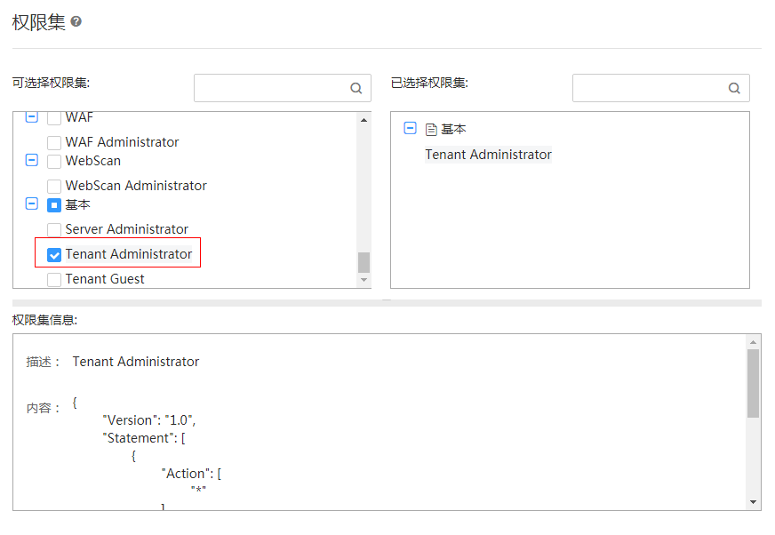

# 创建委托

委托是管理员通过授信的方式创建的与其他帐户之间的一种委托关系。委托关系建立后，被委托方企业管理员就可以通过切换委托的方式替委托方企业管理云资源，实现安全高效的代维工作。

创建委托步骤如下。

1.  登录“统一身份认证服务”，单击“委托”，进入“委托”界面。
2.  在“委托”界面，单击“创建委托”，弹出“创建委托”界面。
3.  在“创建委托”界面，填写委托信息，如[表1](#table6148388517923)所示，带\*参数为必填项。创建委托具体参数请参见[如何创建委托](http://support.huaweicloud.com/usermanual-iam/zh-cn_topic_0046613147.html)。

    **表 1**  创建委托

    
    <table><thead align="left"><tr id="row2011568417923"><th class="cellrowborder" valign="top" width="50%" id="mcps1.2.3.1.1">
参数

    </th>
    <th class="cellrowborder" valign="top" width="50%" id="mcps1.2.3.1.2">
操作

    </th>
    </tr>
    </thead>
    <tbody><tr id="row5872897117923"><td class="cellrowborder" valign="top" width="50%" headers="mcps1.2.3.1.1 ">
*委托名称

    </td>
    <td class="cellrowborder" valign="top" width="50%" headers="mcps1.2.3.1.2 ">
输入“serverless-trust”。

    </td>
    </tr>
    <tr id="row3651316217923"><td class="cellrowborder" valign="top" width="50%" headers="mcps1.2.3.1.1 ">
*委托类型

    </td>
    <td class="cellrowborder" valign="top" width="50%" headers="mcps1.2.3.1.2 ">
选择“云服务”

    </td>
    </tr>
    <tr id="row5924131917923"><td class="cellrowborder" valign="top" width="50%" headers="mcps1.2.3.1.1 ">
*云服务

    </td>
    <td class="cellrowborder" valign="top" width="50%" headers="mcps1.2.3.1.2 ">
操作步骤如下：

    <ol id="ol54936093171138"><li>单击“选择”，弹出“选择云服务”界面。</li><li>在“选择云服务”界面，选择“FunctionGraph”。</li><li>单击“确定”。</li></ol>
    </td>
    </tr>
    <tr id="row2403963317923"><td class="cellrowborder" valign="top" width="50%" headers="mcps1.2.3.1.1 ">
*持续时间

    </td>
    <td class="cellrowborder" valign="top" width="50%" headers="mcps1.2.3.1.2 ">
选择“永久”。

    </td>
    </tr>
    <tr id="row2961164317923"><td class="cellrowborder" valign="top" width="50%" headers="mcps1.2.3.1.1 ">
描述

    </td>
    <td class="cellrowborder" valign="top" width="50%" headers="mcps1.2.3.1.2 ">
本例不设置。

    </td>
    </tr>
    <tr id="row1651146017923"><td class="cellrowborder" valign="top" width="50%" headers="mcps1.2.3.1.1 ">
*权限选择

    </td>
    <td class="cellrowborder" valign="top" width="50%" headers="mcps1.2.3.1.2 ">
操作步骤如下：

    <ol id="ol15735064171852"><li>选择服务所在区域，如“华北-北京一”，单击“修改”，弹出“策略”界面。</li><li>在“策略”界面“可选择权限集”栏，勾选“Tenant Administrator”，如<a href="#fig4729749793214">图1</a>所示。</li><li>单击“确定”。</li></ol>
    </td>
    </tr>
    </tbody>
    </table>

    **图 1**  修改权限  
    

    > **说明：**   
    >Tenant Administrator拥有该权限的用户可以对企业拥有的所有云资源执行任意操作。  

4.  单击“确定”，完成创建委托。

