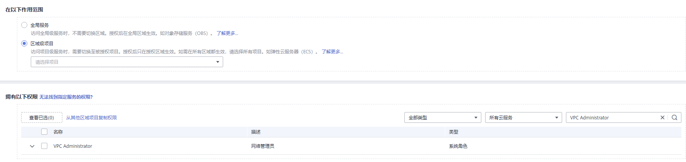

# 创建委托

委托是管理员通过授信的方式创建的与其他帐户之间的一种委托关系。委托关系建立后，被委托方企业管理员就可以通过切换委托的方式替委托方企业管理云资源，实现安全高效的代维工作。

按照如下参数设置委托，创建委托的具体步骤请参考[如何创建委托](https://support.huaweicloud.com/usermanual-iam/iam_06_0002.html)。

-   委托类型：选择“云服务”。
-   云服务：选择“函数工作流 FunctionGraph”。
-   持续时间：选择“永久”。
-   权限选择：根据业务需要选择对应的权限。勾选“区域级项目”，以添加VPC Administrator和DNS ReadOnlyAccess权限为例。

    **图 1**  根据业务需要选择对应的权限  
    

    **表 1**  委托权限示例

    
    <table><thead align="left"><tr id="row862012477503"><th class="cellrowborder" valign="top" width="34.39%" id="mcps1.2.3.1.1">
权限名称

    </th>
    <th class="cellrowborder" valign="top" width="65.61%" id="mcps1.2.3.1.2">
使用描述/场景

    </th>
    </tr>
    </thead>
    <tbody><tr id="row15625204795014"><td class="cellrowborder" valign="top" width="34.39%" headers="mcps1.2.3.1.1 ">
VPC Administrator

    </td>
    <td class="cellrowborder" valign="top" width="65.61%" headers="mcps1.2.3.1.2 ">
拥有VPC Administrator权限的用户可以对VPC内所有资源执行任意操作。

    
例如，在函数配置跨VPC访问时，则函数必须配置具备VPC管理权限的委托。

    </td>
    </tr>
    <tr id="row1625174712506"><td class="cellrowborder" valign="top" width="34.39%" headers="mcps1.2.3.1.1 ">
DNS ReadOnlyAccess

    </td>
    <td class="cellrowborder" valign="top" width="65.61%" headers="mcps1.2.3.1.2 ">
拥有DNS ReadOnlyAccess权限的用户可以读取云解析服务（DNS）的资源。

    
例如，在函数配置调用DNS服务的接口解析内网域名时，则函数必须具备读取DNS资源权限的委托。

    </td>
    </tr>
    </tbody>
    </table>

## 相关操作

修改委托：如果需要修改委托的权限、持续时间、描述等，可以在IAM控制台修改委托。

> **注意：** 
>FunctionGraph相关委托修改后，约10分钟生效（如context.getToken更新）。

