# 创建委托<a name="functiongraph_01_0920"></a>

委托是管理员通过授信的方式创建的与其他帐户之间的一种委托关系。委托关系建立后，被委托方企业管理员就可以通过切换委托的方式替委托方企业管理云资源，实现安全高效的代维工作。

## 函数创建委托<a name="section4731192575516"></a>

函数创建委托步骤如下。

1.  登录“[统一身份认证服务](https://console.huaweicloud.com/iam/?agencyId=5ce49588089946de882e3a1c7908d9c9&region=southchina&locale=zh-cn#/iam/users)”，单击“委托”，进入“委托”界面。
2.  在“委托”界面，单击“创建委托”，弹出“创建委托”界面。
3.  在“创建委托”界面，填写委托信息，如[表1](#table6148388517923)所示，带\*参数为必填项。创建委托具体参数请参见[如何创建委托](http://support.huaweicloud.com/usermanual-iam/zh-cn_topic_0046613147.html)。

    **表 1**  创建委托

    <a name="table6148388517923"></a>
    <table><thead align="left"><tr id="row2011568417923"><th class="cellrowborder" valign="top" width="50%" id="mcps1.2.3.1.1"><p id="p3460158117923"><a name="p3460158117923"></a><a name="p3460158117923"></a>参数</p>
    </th>
    <th class="cellrowborder" valign="top" width="50%" id="mcps1.2.3.1.2"><p id="p5126468317923"><a name="p5126468317923"></a><a name="p5126468317923"></a>操作</p>
    </th>
    </tr>
    </thead>
    <tbody><tr id="row5872897117923"><td class="cellrowborder" valign="top" width="50%" headers="mcps1.2.3.1.1 "><p id="p5942624217923"><a name="p5942624217923"></a><a name="p5942624217923"></a>*委托名称</p>
    </td>
    <td class="cellrowborder" valign="top" width="50%" headers="mcps1.2.3.1.2 "><p id="p4879626017923"><a name="p4879626017923"></a><a name="p4879626017923"></a>输入“serverless-trust”。</p>
    </td>
    </tr>
    <tr id="row3651316217923"><td class="cellrowborder" valign="top" width="50%" headers="mcps1.2.3.1.1 "><p id="p477612217923"><a name="p477612217923"></a><a name="p477612217923"></a>*委托类型</p>
    </td>
    <td class="cellrowborder" valign="top" width="50%" headers="mcps1.2.3.1.2 "><p id="p5132161117923"><a name="p5132161117923"></a><a name="p5132161117923"></a>选择“云服务”</p>
    </td>
    </tr>
    <tr id="row5924131917923"><td class="cellrowborder" valign="top" width="50%" headers="mcps1.2.3.1.1 "><p id="p3381754817923"><a name="p3381754817923"></a><a name="p3381754817923"></a>*云服务</p>
    </td>
    <td class="cellrowborder" valign="top" width="50%" headers="mcps1.2.3.1.2 "><p id="p41475492171124"><a name="p41475492171124"></a><a name="p41475492171124"></a>操作步骤如下：</p>
    <a name="ol54936093171138"></a><a name="ol54936093171138"></a><ol id="ol54936093171138"><li>单击“选择”，弹出“选择云服务”界面。</li><li>在“选择云服务”界面，选择“FunctionGraph”。</li><li>单击“确定”。</li></ol>
    </td>
    </tr>
    <tr id="row2403963317923"><td class="cellrowborder" valign="top" width="50%" headers="mcps1.2.3.1.1 "><p id="p105323617923"><a name="p105323617923"></a><a name="p105323617923"></a>*持续时间</p>
    </td>
    <td class="cellrowborder" valign="top" width="50%" headers="mcps1.2.3.1.2 "><p id="p1820326317923"><a name="p1820326317923"></a><a name="p1820326317923"></a>选择“永久”。</p>
    </td>
    </tr>
    <tr id="row2961164317923"><td class="cellrowborder" valign="top" width="50%" headers="mcps1.2.3.1.1 "><p id="p4973291917923"><a name="p4973291917923"></a><a name="p4973291917923"></a>描述</p>
    </td>
    <td class="cellrowborder" valign="top" width="50%" headers="mcps1.2.3.1.2 "><p id="p183460617923"><a name="p183460617923"></a><a name="p183460617923"></a>本例不设置。</p>
    </td>
    </tr>
    <tr id="row1651146017923"><td class="cellrowborder" valign="top" width="50%" headers="mcps1.2.3.1.1 "><p id="p6235990617923"><a name="p6235990617923"></a><a name="p6235990617923"></a>*权限选择</p>
    </td>
    <td class="cellrowborder" valign="top" width="50%" headers="mcps1.2.3.1.2 "><p id="p44408296171839"><a name="p44408296171839"></a><a name="p44408296171839"></a>操作步骤如下：</p>
    <a name="ol15735064171852"></a><a name="ol15735064171852"></a><ol id="ol15735064171852"><li>选择服务所在区域，如“华北-北京一”，单击“修改”，弹出“策略”界面。</li><li>在“策略”界面“可选择权限集”栏，勾选“Tenant Administrator”，如<a href="#fig4729749793214">图1</a>所示。</li><li>单击“确定”。</li></ol>
    </td>
    </tr>
    </tbody>
    </table>

    **图 1**  修改权限<a name="fig4729749793214"></a>  
    

    > **说明：**   
    >Tenant Administrator拥有该权限的用户可以对企业拥有的所有云资源执行任意操作。  

4.  单击“确定”，完成创建委托。

## 使用示例<a name="section1633245295615"></a>

创建函数，选择包含DMS访问权限的委托，使用华为云的分布式消息服务（DMS）对存储在DMS队列中的消息进行处理，判断消息是否适合发布（有些消息不适合发布，例如政治敏感、广告等），示例如下：

> **说明：**   
>-   创建函数时，上传ZIP包的大小限制为不超过50M，如果超过50M，需要将程序包上传至OBS桶，从OBS桶中引用。本例需要先创建OBS桶用来保存程序包。  
>-   添加事件源时需要选择DMS消息队列和消费组，本例需要先创建DMS消息队列和消费组。  
>-   本例使用DMS服务，需创建DMS触发器，因此需要创建有DMS访问权限的委托，给FunctionGraph函数赋权，确保FunctionGraph函数能够访问到DMS资源。  

## 创建OBS桶<a name="section16643183315211"></a>

1.  用户登录华为云控制台，进入“对象存储服务”，单击“创建桶”，进入“创建桶”界面。
2.  在“创建桶”界面，填写存储桶信息，如[图2](#zh-cn_topic_0115410217_fig187790471576)所示。

    区域选择：“华北-北京一”

    桶名称输入：“obs-mycode”

    存储别选择：“标准存储”

    桶策略选择："私有"

    **图 2**  创建OBS桶<a name="zh-cn_topic_0115410217_fig187790471576"></a>  
    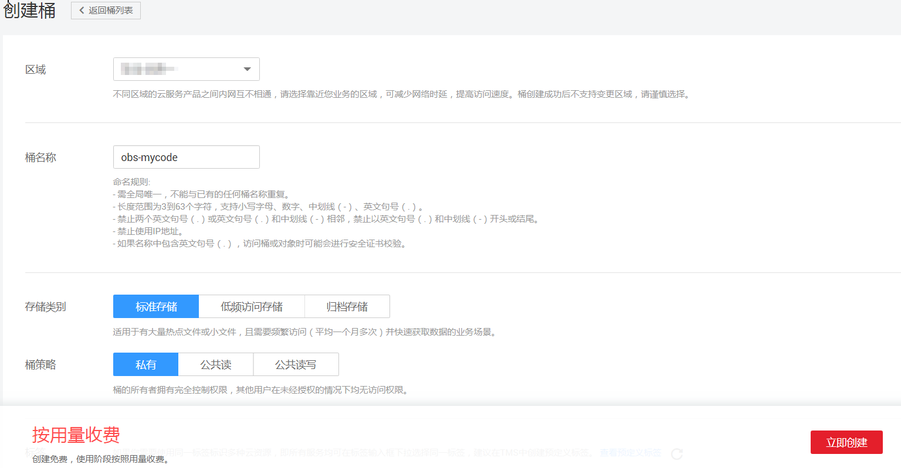

3.  单击“创建桶”，完成桶创建。

## 创建DMS消息队列和消费组<a name="section8397162217542"></a>

**创建队列**

1.  用户登录“分布式消息服务”，进入“队列管理”界面。
2.  在“队列管理”界面，单击“创建队列”，弹出“创建队列”界面。
3.  在“创建队列”界面，填写队列信息，如[表2](#zh-cn_topic_0115410217_table4277812911123)所示，带\*参数为必填项。

    **表 2**  创建队列信息表

    <a name="zh-cn_topic_0115410217_table4277812911123"></a>
    <table><thead align="left"><tr id="zh-cn_topic_0115410217_row6452289411123"><th class="cellrowborder" valign="top" width="50%" id="mcps1.2.3.1.1"><p id="zh-cn_topic_0115410217_p10222672111212"><a name="zh-cn_topic_0115410217_p10222672111212"></a><a name="zh-cn_topic_0115410217_p10222672111212"></a>字段</p>
    </th>
    <th class="cellrowborder" valign="top" width="50%" id="mcps1.2.3.1.2"><p id="zh-cn_topic_0115410217_p22730128111212"><a name="zh-cn_topic_0115410217_p22730128111212"></a><a name="zh-cn_topic_0115410217_p22730128111212"></a>填写说明</p>
    </th>
    </tr>
    </thead>
    <tbody><tr id="zh-cn_topic_0115410217_row3775359111123"><td class="cellrowborder" valign="top" width="50%" headers="mcps1.2.3.1.1 "><p id="zh-cn_topic_0115410217_p29066614111212"><a name="zh-cn_topic_0115410217_p29066614111212"></a><a name="zh-cn_topic_0115410217_p29066614111212"></a>*队列名称</p>
    </td>
    <td class="cellrowborder" valign="top" width="50%" headers="mcps1.2.3.1.2 "><p id="zh-cn_topic_0115410217_p1753551895938"><a name="zh-cn_topic_0115410217_p1753551895938"></a><a name="zh-cn_topic_0115410217_p1753551895938"></a>输入“queue-test”。</p>
    </td>
    </tr>
    <tr id="zh-cn_topic_0115410217_row6985344115126"><td class="cellrowborder" valign="top" width="50%" headers="mcps1.2.3.1.1 "><p id="zh-cn_topic_0115410217_p62868104115126"><a name="zh-cn_topic_0115410217_p62868104115126"></a><a name="zh-cn_topic_0115410217_p62868104115126"></a>队列类型</p>
    </td>
    <td class="cellrowborder" valign="top" width="50%" headers="mcps1.2.3.1.2 "><p id="zh-cn_topic_0115410217_p59151695115126"><a name="zh-cn_topic_0115410217_p59151695115126"></a><a name="zh-cn_topic_0115410217_p59151695115126"></a>使用“普通队列”。</p>
    </td>
    </tr>
    <tr id="zh-cn_topic_0115410217_row4058484111537"><td class="cellrowborder" valign="top" width="50%" headers="mcps1.2.3.1.1 "><p id="zh-cn_topic_0115410217_p2971925111537"><a name="zh-cn_topic_0115410217_p2971925111537"></a><a name="zh-cn_topic_0115410217_p2971925111537"></a>是否开启死信</p>
    </td>
    <td class="cellrowborder" valign="top" width="50%" headers="mcps1.2.3.1.2 "><p id="zh-cn_topic_0115410217_p5844911211537"><a name="zh-cn_topic_0115410217_p5844911211537"></a><a name="zh-cn_topic_0115410217_p5844911211537"></a>使用默认设置，不开启。</p>
    </td>
    </tr>
    <tr id="zh-cn_topic_0115410217_row1040996411123"><td class="cellrowborder" valign="top" width="50%" headers="mcps1.2.3.1.1 "><p id="zh-cn_topic_0115410217_p4604418102450"><a name="zh-cn_topic_0115410217_p4604418102450"></a><a name="zh-cn_topic_0115410217_p4604418102450"></a>描述</p>
    </td>
    <td class="cellrowborder" valign="top" width="50%" headers="mcps1.2.3.1.2 "><p id="zh-cn_topic_0115410217_p3270906795938"><a name="zh-cn_topic_0115410217_p3270906795938"></a><a name="zh-cn_topic_0115410217_p3270906795938"></a>本例不输入描述。</p>
    </td>
    </tr>
    </tbody>
    </table>

    > **说明：**   
    >创建队列参数具体说明请参见[创建队列](http://support.huaweicloud.com/usermanual-dms/zh-cn_topic_0034678324.html)。  

4.  单击“确定”，完成队列创建。

**创建消费组**

1.  用户在“分布式消息服务\>队列管理”界面，单击“queue-test”队列名称，进入队列详情页。
2.  在“queue-test”队列详情界面，单击创建“创建消费组”，如[图3](#zh-cn_topic_0115410217_fig28710698103537)所示，弹出“创建消费组”界面。

    **图 3**  创建消费组<a name="zh-cn_topic_0115410217_fig28710698103537"></a>  
    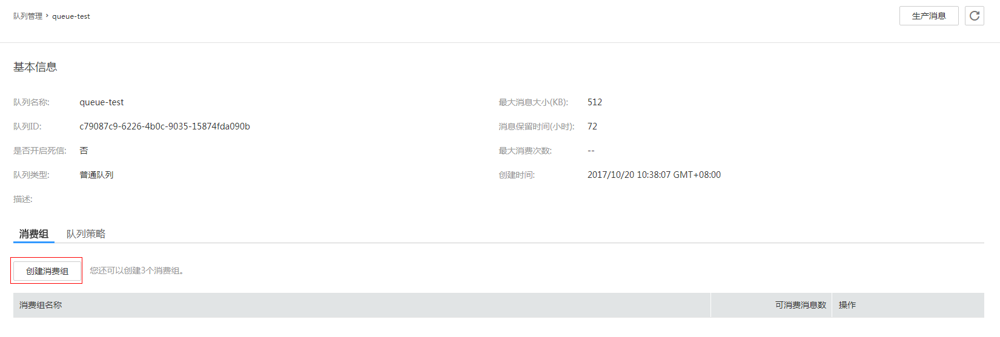

3.  在“创建消费组”界面，填写消费组信息，如[表3](#zh-cn_topic_0115410217_table41195191115544)所示，带\*参数为必填项。

    **表 3**  创建消费组信息表

    <a name="zh-cn_topic_0115410217_table41195191115544"></a>
    <table><thead align="left"><tr id="zh-cn_topic_0115410217_row23182352115544"><th class="cellrowborder" valign="top" width="50%" id="mcps1.2.3.1.1"><p id="zh-cn_topic_0115410217_p65831206115544"><a name="zh-cn_topic_0115410217_p65831206115544"></a><a name="zh-cn_topic_0115410217_p65831206115544"></a>字段</p>
    </th>
    <th class="cellrowborder" valign="top" width="50%" id="mcps1.2.3.1.2"><p id="zh-cn_topic_0115410217_p30727506115544"><a name="zh-cn_topic_0115410217_p30727506115544"></a><a name="zh-cn_topic_0115410217_p30727506115544"></a>填写说明</p>
    </th>
    </tr>
    </thead>
    <tbody><tr id="zh-cn_topic_0115410217_row28507603115544"><td class="cellrowborder" valign="top" width="50%" headers="mcps1.2.3.1.1 "><p id="zh-cn_topic_0115410217_p27414473115544"><a name="zh-cn_topic_0115410217_p27414473115544"></a><a name="zh-cn_topic_0115410217_p27414473115544"></a>*消费组名称</p>
    </td>
    <td class="cellrowborder" valign="top" width="50%" headers="mcps1.2.3.1.2 "><p id="zh-cn_topic_0115410217_p5979840115544"><a name="zh-cn_topic_0115410217_p5979840115544"></a><a name="zh-cn_topic_0115410217_p5979840115544"></a>输入“group-dms”。</p>
    </td>
    </tr>
    </tbody>
    </table>

4.  单击“确定”，完成消费组创建，如[图4](#zh-cn_topic_0115410217_fig1402798110372)所示。

    **图 4**  消费组<a name="zh-cn_topic_0115410217_fig1402798110372"></a>  
    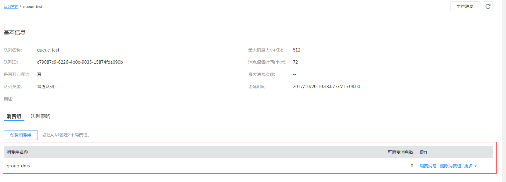


## 创建委托<a name="section61617112559"></a>

1.  用户登录华为云控制台，进入“统一身份认证服务\>委托”界面，单击“创建委托”，弹出“创建委托”界面。
2.  填写委托信息，如[图5](#zh-cn_topic_0115410217_fig09111515389)所示。

    委托名称输入：“serverless\_dms”

    委托类型选择：“云服务”

    云服务选择：“FunctionGraph”

    持续时间选择：“永久”

    权限选择：修改“华北-北京一\>cn-north-1”的权限集，选择“基本\>Tenant Administrator”，如[图6](#zh-cn_topic_0115410217_fig18503121415404)所示。

    **图 5**  创建委托<a name="zh-cn_topic_0115410217_fig09111515389"></a>  
    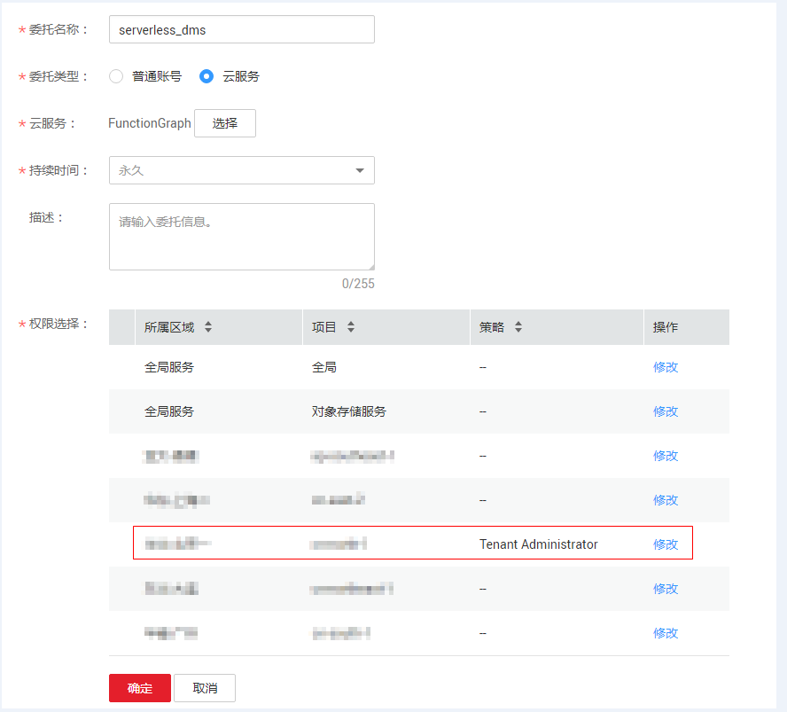

    **图 6**  修改委托权限<a name="zh-cn_topic_0115410217_fig18503121415404"></a>  
    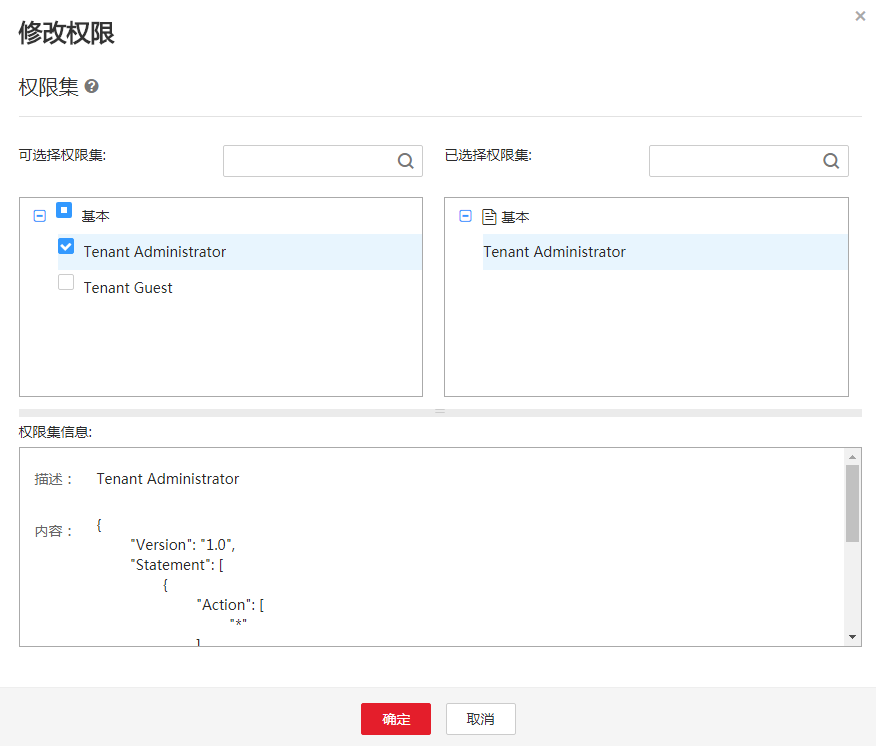

    > **注意：**   
    >所选区域为FunctionGraph所在区域。  

    > **说明：**   
    >Tenant Administrator：拥有该权限的用户可以对本区域内的所有云资源执行任意操作。  

3.  单击“确定”，完成权限委托设置。

## 创建程序包<a name="section9849949105620"></a>

本例使用Python语言实现中文信息过滤的功能，有关函数开发的过程请参考[Python函数开发](http://support.huaweicloud.com/devg-functiongraph/functiongraph_02_0420.html)。本例不再介绍业务功能实现的代码，样例代码目录如[图7](#zh-cn_topic_0115410342_fig372317241014)所示。

**图 7**  样例代码目录<a name="zh-cn_topic_0115410342_fig372317241014"></a>  
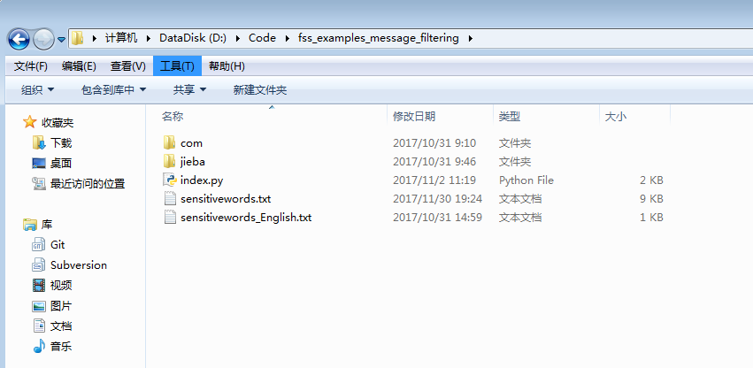

文件目录里的sensitivewords.txt文件存储了本代码的敏感词库，可以自定义敏感词，每个敏感词单独为一行。

因为项目用到了jieba分词包和敏感词库，所以需要将分词包和词库文件同样放在fss\_examples\_message\_filtering文件下面。

index.py为函数执行的入口文件，代码片段如下。

```
# -*- coding:utf-8 -*-
import json
import jieba
import os
import sys

reload(sys)  
sys.setdefaultencoding(´utf-8´)

def is_ok_publish(body, over = 0.1):
    ´´´
    body中敏感词数量超过10%，此消息不能发出
    ´´´
    words = list(jieba.cut(body))   #使用jieba分词包，对传入消息进行分词。example: body：我爱中国 words: ["我","爱","中国"]

    filename = os.environ.get(´RUNTIME_CODE_ROOT´) + ´/sensitivewords.txt´    # 读取敏感信息库的内容，注意文件路径，sensitivewords是用户上传的敏感词列表，随代码一起上传
    with open(filename)as file:
        sensitive_words = file.read().decode(´gbk´).split(´\r\n´)        #注意系统不同，可能换行符也不同，（windows下面亲测有效）
    num = 0     #计算消息中包含的敏感词和词库中敏感词重合的数目
    for each in (set(words) & set(sensitive_words)):
        num = num + 1
    length = len(set(words))
    rate = float(num)/length
    if(rate >= over):      #敏感词数量超过词数的10%，判定该消息敏感，拒绝发布
        return False
    return True    #可以发布

def handler (event, context):

    msg = event[´Messages´]   # 从dms队列中拉取消息
    body = msg[0]["body"]       # 读取消息的正文部分

    flag = is_ok_publish(body) #判断该正文是否敏感

```

## 上传代码至OBS桶<a name="section32243349573"></a>

登录“对象存储服务”，进入obs-mycode桶的对象界面中，上传[样例程序包](https://functionstage-examples.obs.myhwclouds.com/fss_examples_message_filtering.zip)至OBS桶，如[图8](#zh-cn_topic_0115410342_fig10566152316216)所示。

**图 8**  上传程序包<a name="zh-cn_topic_0115410342_fig10566152316216"></a>  
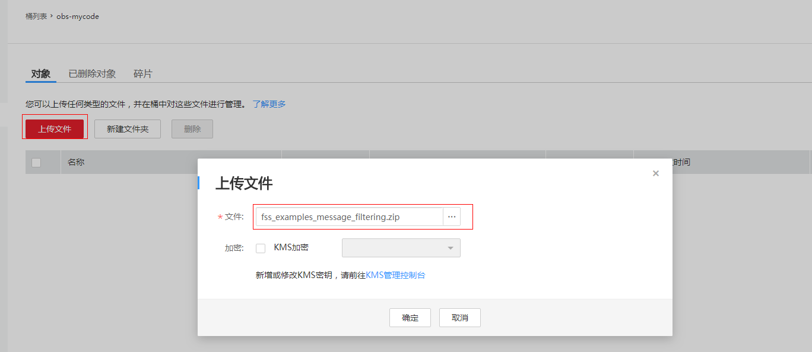

进入fss\_examples\_message\_filtering文件详情页，如[图9](#zh-cn_topic_0115410342_fig13723871330)所示，查看文件链接：https://obs-mycode.obs.myhwclouds.com/fss\_examples\_message\_filtering.zip。

**图 9**  程序包链接<a name="zh-cn_topic_0115410342_fig13723871330"></a>  
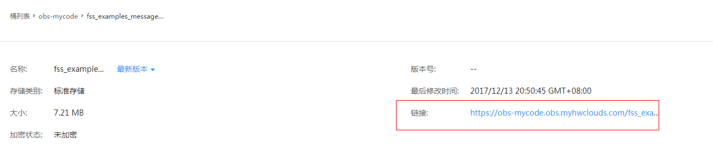

## 创建函数<a name="section514210945814"></a>

创建函数的时候，必须选择委托包含DMS访问权限的委托，否则不能使用DMS服务。

1.  登录华为云控制台，进入“函数工作流服务控制台\>函数”界面，单击“创建函数”，进入创建函数流程。
2.  填写函数配置信息
    1.  输入基础配置信息，如[图10](#zh-cn_topic_0115410342_fig129011574410)所示。

        函数名称输入：“fss\_examples\_message\_filtering”

        所属应用选择默认的“default”。

        描述输入：“中文过滤”

        委托名称选择[创建委托](null.md#section178782176533)中创建的“serverless\_dms”

        **图 10**  基础配置<a name="zh-cn_topic_0115410342_fig129011574410"></a>  
        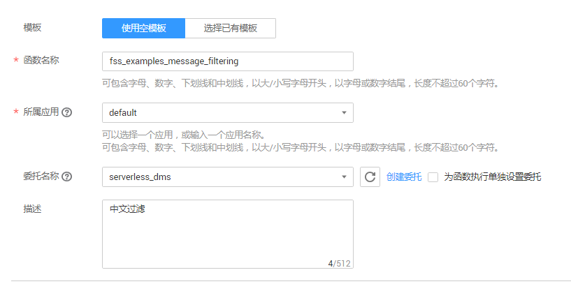

    2.  输入代码信息，如[图11](#zh-cn_topic_0115410342_fig4441192720512)所示。

        运行时语音选择：“Python2.7”

        函数执行入口输入：“index.handler”

        代码选择“从OBS上传文件”，OBS链接URL输入[上传代码至OBS桶](null.md#section1313691113169)中的地址：https://obs-mycode.obs.myhwclouds.com/fss\_examples\_message\_filtering.zip

        **图 11**  代码配置<a name="zh-cn_topic_0115410342_fig4441192720512"></a>  
        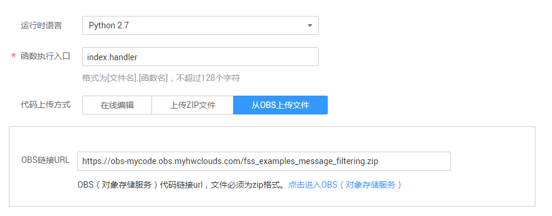

    3.  单击右侧“创建函数”，完成函数创建。

3.  进入fss\_examples\_message\_filtering函数详情页，在“配置”页签，输入环境信息，如[图12](#zh-cn_topic_0115410342_fig64810581274)所示。

    内存选择：“512”

    超时时间输入：“40”

    **图 12**  环境配置<a name="zh-cn_topic_0115410342_fig64810581274"></a>  
    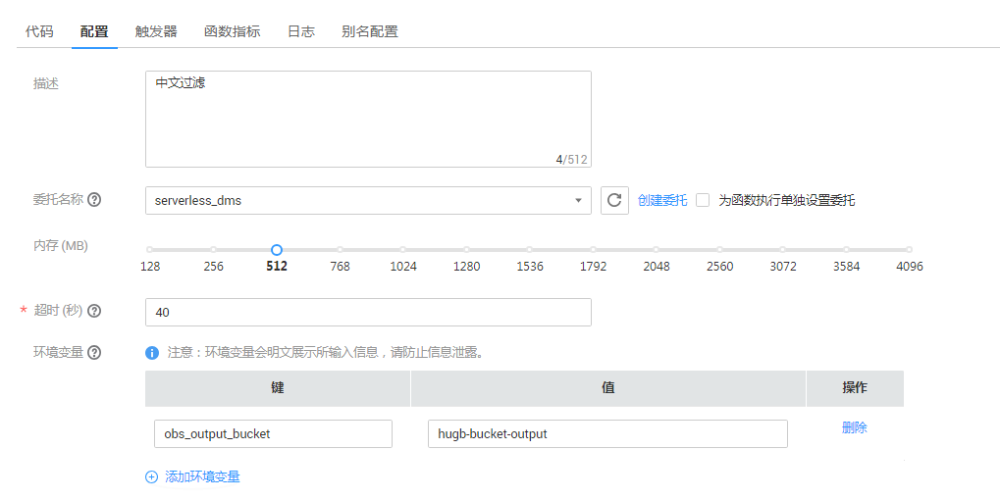

4.  单击页面右上角“保存”，保存配置信息。

## 添加事件源<a name="section1782622165917"></a>

函数创建以后，可以为函数添加事件源，添加DMS事件源是通过创建DMS触发器实现的，步骤如下。

1.  用户进入fss\_examples\_message\_filtering函数详情页，在“触发器”页签，单击“创建触发器”，弹出创建触发器界面。
2.  触发器类型选择“分布式消息服务 \(DMS\)”，填写触发器配置信息，如[图13](#fig924110190552)所示

    队列选择：“queue-test”

    消费组选择：“group-dms”

    拉取周期输入：5

    **图 13**  创建触发器<a name="fig924110190552"></a>  
    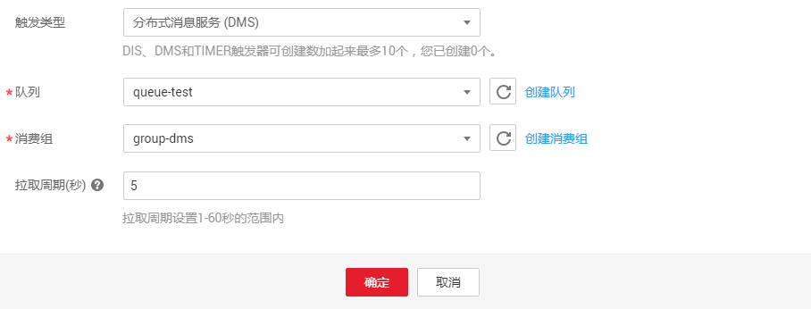

3.  单击“确定”，完成触发器创建，如[图14](#fig048119483)所示。

    **图 14**  DMS触发器<a name="fig048119483"></a>  
    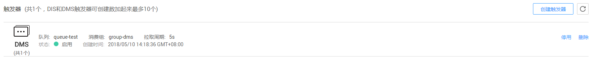

    > **说明：**   
    >DMS触发器创建以后，函数每隔5s去group-dms消费组轮询消息，如果轮询到消息，生成DMS事件，触发函数执行。  


## 过滤中文信息<a name="section19225104425918"></a>

在queue-test队列生产消息，供group-dms消费组消费，待DMS触发器轮询到消息时，会生成事件，触发函数运行，过滤中文消息是否包含敏感信息。

1.  登录分布式消息服务，进入queue-test队列详情页，单击“生产消息”，弹出生产消息界面，配置消息，消息正文输入：广告，淘宝兼职，待遇优厚！如[图15](#fig758673695314)所示。

    **图 15**  配置生产消息<a name="fig758673695314"></a>  
    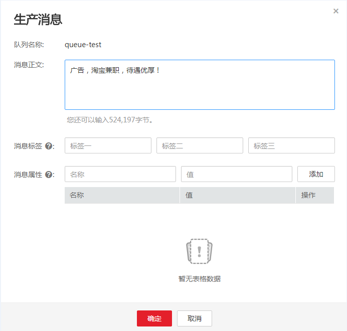

2.  生产消息发布以后，在group-dms消费组可以看到可消费消息，如[图16](#fig973113295019)所示。

    **图 16**  查看可消费消息<a name="fig973113295019"></a>  
    

3.  触发器轮询到可消费消息后，触发函数运行，可以在fss\_examples\_message\_filtering函数详情页日志页签查看函数运行日志，消息中存在太多的敏感词，禁止发布，如[图17](#fig17752174755011)所示。

    **图 17**  日志信息<a name="fig17752174755011"></a>  
    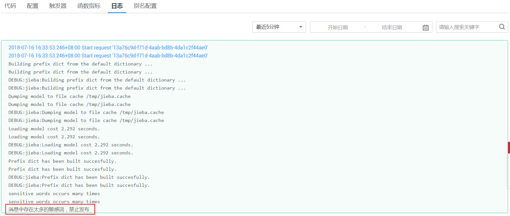


