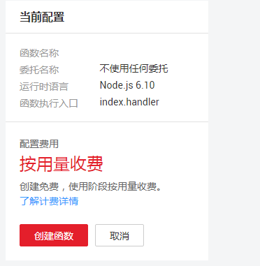
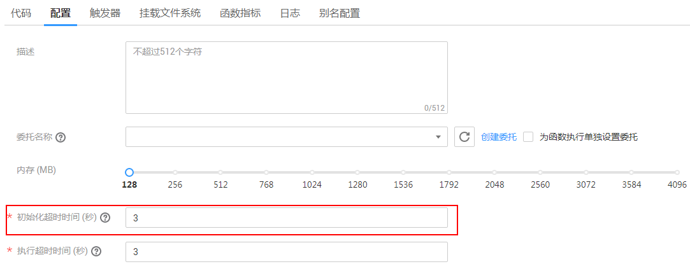

# 创建并初始化函数<a name="ZH-CN_TOPIC_0149027248"></a>

本节以HelloWorld函数为例，介绍函数的创建及测试过程。

## 创建函数<a name="section88018534613"></a>

1.  登录FunctionGraph控制台，进入“函数”界面。
2.  在“函数”界面，选择“函数列表”，单击“创建函数”，进入“创建函数”界面。
3.  在“创建函数”界面填写函数信息。
    1.  填写基础配置信息，如[表1](#table46600572105838)所示，带\*参数为必填项。

        **表 1**  函数基础配置信息表

        <a name="table46600572105838"></a>
        <table><thead align="left"><tr id="row2549532105838"><th class="cellrowborder" valign="top" width="25%" id="mcps1.2.3.1.1"><p id="p64741929105852"><a name="p64741929105852"></a><a name="p64741929105852"></a>参数</p>
        </th>
        <th class="cellrowborder" valign="top" width="75%" id="mcps1.2.3.1.2"><p id="p9604890105852"><a name="p9604890105852"></a><a name="p9604890105852"></a>说明</p>
        </th>
        </tr>
        </thead>
        <tbody><tr id="row2253408115491"><td class="cellrowborder" valign="top" width="25%" headers="mcps1.2.3.1.1 "><p id="p148014315491"><a name="p148014315491"></a><a name="p148014315491"></a>模板</p>
        </td>
        <td class="cellrowborder" valign="top" width="75%" headers="mcps1.2.3.1.2 "><p id="p147674710023"><a name="p147674710023"></a><a name="p147674710023"></a>本例使用空白模板。</p>
        <p id="p5278279215491"><a name="p5278279215491"></a><a name="p5278279215491"></a>如果使用已有模板，请参考<a href="使用函数模板.md">使用函数模板</a>。</p>
        </td>
        </tr>
        <tr id="row65180644105838"><td class="cellrowborder" valign="top" width="25%" headers="mcps1.2.3.1.1 "><p id="p2460416105852"><a name="p2460416105852"></a><a name="p2460416105852"></a>*函数名称</p>
        </td>
        <td class="cellrowborder" valign="top" width="75%" headers="mcps1.2.3.1.2 "><p id="p60539047162350"><a name="p60539047162350"></a><a name="p60539047162350"></a>函数名称，命名规则如下：</p>
        <a name="ul38620597162358"></a><a name="ul38620597162358"></a><ul id="ul38620597162358"><li>可包含字母、数字、下划线和中划线，长度不超过60个字符。</li><li>以大/小写字母开头，以字母或数字结尾。</li></ul>
        <p id="p65076039105852"><a name="p65076039105852"></a><a name="p65076039105852"></a>输入HelloWorld。</p>
        </td>
        </tr>
        <tr id="row1729663082013"><td class="cellrowborder" valign="top" width="25%" headers="mcps1.2.3.1.1 "><p id="p4297230112017"><a name="p4297230112017"></a><a name="p4297230112017"></a>*FunctionGraph版本</p>
        </td>
        <td class="cellrowborder" valign="top" width="75%" headers="mcps1.2.3.1.2 "><p id="p7297230112020"><a name="p7297230112020"></a><a name="p7297230112020"></a>函数版本：FunctionGraph v2。</p>
        <div class="note" id="note15134143202110"><a name="note15134143202110"></a><a name="note15134143202110"></a><span class="notetitle"> 说明： </span><div class="notebody"><p id="p17135331217"><a name="p17135331217"></a><a name="p17135331217"></a>该参数当前仅“西南-贵阳一”和“华北-北京四”区域支持。</p>
        </div></div>
        </td>
        </tr>
        <tr id="row0169155411577"><td class="cellrowborder" valign="top" width="25%" headers="mcps1.2.3.1.1 "><p id="p3433337131414"><a name="p3433337131414"></a><a name="p3433337131414"></a>*所属应用</p>
        </td>
        <td class="cellrowborder" valign="top" width="75%" headers="mcps1.2.3.1.2 "><p id="p114331937191415"><a name="p114331937191415"></a><a name="p114331937191415"></a>用户创建函数时可以进行分组，每个函数应用下面可以创建多个函数，在函数创建时可以指定其归属于某个函数应用。命名规则如下：</p>
        <a name="ul519219971112"></a><a name="ul519219971112"></a><ul id="ul519219971112"><li>可包含字母、数字、下划线和中划线，长度不超过60个字符。</li><li>以大/小写字母开头，以字母或数字结尾。</li></ul>
        <p id="p31951981117"><a name="p31951981117"></a><a name="p31951981117"></a>选择默认的“default”应用。</p>
        </td>
        </tr>
        <tr id="row739856015520"><td class="cellrowborder" valign="top" width="25%" headers="mcps1.2.3.1.1 "><p id="p6415490615526"><a name="p6415490615526"></a><a name="p6415490615526"></a>委托名称</p>
        </td>
        <td class="cellrowborder" valign="top" width="75%" headers="mcps1.2.3.1.2 "><p id="p51977548155332"><a name="p51977548155332"></a><a name="p51977548155332"></a>用户委托函数工作流服务去访问其他的云服务，则需要提供权限委托，创建委托，请参考<a href="创建委托.md">创建委托</a>。</p>
        <p id="p2916491315526"><a name="p2916491315526"></a><a name="p2916491315526"></a>如果用户函数不访问任何云服务，则不用提供委托名称。</p>
        <p id="p6115763215526"><a name="p6115763215526"></a><a name="p6115763215526"></a>本例选择“不使用任何委托”。</p>
        </td>
        </tr>
        <tr id="row131741944181219"><td class="cellrowborder" valign="top" width="25%" headers="mcps1.2.3.1.1 "><p id="p615432411303"><a name="p615432411303"></a><a name="p615432411303"></a>*企业项目</p>
        </td>
        <td class="cellrowborder" valign="top" width="75%" headers="mcps1.2.3.1.2 "><p id="p5953725164715"><a name="p5953725164715"></a><a name="p5953725164715"></a>请选择已创建的企业项目，将函数添加至企业项目中。</p>
        <div class="note" id="note1027118381486"><a name="note1027118381486"></a><a name="note1027118381486"></a><span class="notetitle"> 说明： </span><div class="notebody"><p id="zh-cn_topic_0149027440_p164091642173416"><a name="zh-cn_topic_0149027440_p164091642173416"></a><a name="zh-cn_topic_0149027440_p164091642173416"></a>如果您没有开通企业管理服务，将无法看到企业项目选项。开通方法请参见<a href="https://support.huaweicloud.com/usermanual-em/pm_topic_0002.html" target="_blank" rel="noopener noreferrer">如何开通企业项目</a>。</p>
        </div></div>
        </td>
        </tr>
        <tr id="row40639954185143"><td class="cellrowborder" valign="top" width="25%" headers="mcps1.2.3.1.1 "><p id="p45175680185150"><a name="p45175680185150"></a><a name="p45175680185150"></a>函数描述</p>
        </td>
        <td class="cellrowborder" valign="top" width="75%" headers="mcps1.2.3.1.2 "><p id="p35351426185150"><a name="p35351426185150"></a><a name="p35351426185150"></a>对函数的描述，不超过512个字符。输入test。</p>
        </td>
        </tr>
        </tbody>
        </table>

        > **说明：** 
        >在创建函数过程中选择委托时，勾选“为函数执行单独设置委托”时，弹出“函数配置委托”，函数执行委托与函数配置委托可独立设置，这将减小不必要的性能损耗；不勾选时，函数执行委托和函数配置委托将使用同一委托，即使用同一个选择的委托或不使用任何委托。如[图1](#fig11875175135113)所示。
        >**图 1**  设置委托<a name="fig11875175135113"></a>  
        >
        >-   函数配置委托，如果函数需要创建DMS或DIS触发器，则需要配置具有DMS或DIS访问权限的委托。当没有使用任何函数配置委托或者函数配置委托不存在时，不能创建DMS、DIS触发器。
        >-   函数执行委托配置后用户可以通过函数执行入口方法中的context参数获取具有委托中权限的token、AK、SK，用于访问其他云服务。

    2.  填写代码配置信息，如[表2](#table13867334105936)所示，带\*参数为必填项。

        **表 2**  函数代码配置信息表

        <a name="table13867334105936"></a>
        <table><thead align="left"><tr id="row42840307105936"><th class="cellrowborder" valign="top" width="21.54%" id="mcps1.2.3.1.1"><p id="p35537554105946"><a name="p35537554105946"></a><a name="p35537554105946"></a>参数</p>
        </th>
        <th class="cellrowborder" valign="top" width="78.46%" id="mcps1.2.3.1.2"><p id="p59969596105946"><a name="p59969596105946"></a><a name="p59969596105946"></a>说明</p>
        </th>
        </tr>
        </thead>
        <tbody><tr id="row11343074105936"><td class="cellrowborder" valign="top" width="21.54%" headers="mcps1.2.3.1.1 "><p id="p1251582105946"><a name="p1251582105946"></a><a name="p1251582105946"></a>运行时语言</p>
        </td>
        <td class="cellrowborder" valign="top" width="78.46%" headers="mcps1.2.3.1.2 "><p id="p6847085155413"><a name="p6847085155413"></a><a name="p6847085155413"></a>目前支持Python 2.7、Python 3.6、Node.js 6.10、Node.js 8.10、Node.js 10.16、Node.js 12.13、Java 8、Go 1.8、C#(.NET Core 2.0)、C#(.NET Core 2.1)、C#(.NET Core 3.1)和PHP 7.3。</p>
        <p id="p34269285105946"><a name="p34269285105946"></a><a name="p34269285105946"></a>本例选择“Node.js 6.10”。</p>
        </td>
        </tr>
        <tr id="row50739855105936"><td class="cellrowborder" valign="top" width="21.54%" headers="mcps1.2.3.1.1 "><p id="p17811905105946"><a name="p17811905105946"></a><a name="p17811905105946"></a>*函数执行入口</p>
        </td>
        <td class="cellrowborder" valign="top" width="78.46%" headers="mcps1.2.3.1.2 "><p id="p41173769162557"><a name="p41173769162557"></a><a name="p41173769162557"></a>对于Node.js函数，命名规则：[文件名].[函数名]，必须包含“. ”。</p>
        <p id="p33478175105946"><a name="p33478175105946"></a><a name="p33478175105946"></a>填写index.handler，表示函数的文件名为index.js，执行的入口函数名为handler。</p>
        </td>
        </tr>
        <tr id="row62480415105936"><td class="cellrowborder" valign="top" width="21.54%" headers="mcps1.2.3.1.1 "><p id="p45072001105946"><a name="p45072001105946"></a><a name="p45072001105946"></a>代码上传方式</p>
        </td>
        <td class="cellrowborder" valign="top" width="78.46%" headers="mcps1.2.3.1.2 "><p id="p26953455105946"><a name="p26953455105946"></a><a name="p26953455105946"></a>选择“在线编辑”。使用系统生成的样例代码。</p>
        </td>
        </tr>
        </tbody>
        </table>

        > **须知：** 
        >-   用python语言写代码时，自己创建的包名不能与python标准库同名，否则会提示module加载失败。例如“json”、“lib”，“os”等。
        >-   上传代码时，如果代码中包含敏感信息（如账户密码等），请您自行加密，以防止信息泄露。

        > **说明：** 
        >样例代码实现的功能是：获取测试事件，打印测试事件信息，代码如下。
        >```
        >exports.handler = function (event, context, callback) {
        >    const error = null;
        >    const output = `Hello message: ${JSON.stringify(event)}`;
        >    callback(error, output);
        >}
        >```


4.  在页面右侧查看函数配置及计费信息，确认无误后，单击“创建函数”，完成函数创建。如[图2](#fig5778171761119)所示。。

    **图 2**  创建函数<a name="fig5778171761119"></a>  
    

    > **说明：** 
    >函数创建成功后，函数内存配置为128MB，超时时间设置为3秒，如果需要修改配置，请参考[修改函数配置](函数管理.md#section1560314348363)。


## 初始化函数<a name="section5481134641018"></a>

在函数创建完成后，开启初始化功能初始化函数。在函数初始化场景中，设置了Initializer后，函数计算首先调用Initializer完成函数的初始化，成功后再调用handler处理请求；没有函数初始化的需求则可以跳过Initializer，直接调用handler处理请求。创建函数过程请参考[创建函数](#section88018534613)。

1.  登录FunctionGraph控制台，进入“函数”界面。
2.  在函数界面选择“函数列表”，选择已创建的函数，单击进入函数详情页面。
3.  在函数代码详情页面中，打开“是否配置函数初始化入口”功能按钮，填写代码配置信息，如[图3](#fig75883142819)所示。

    **图 3**  函数初始化入口<a name="fig75883142819"></a>  
    

    > **说明：** 
    >-   开启函数初始化功能后，各runtime的函数初始化入口命名规范与原有函数执行入口保持一致。如Node.js和Python函数，命名规则：\[文件名\].\[初始化函数名\]。
    >-   函数代码配置信息请参考[表2](创建函数.md#table13867334105936)。
    >-   开启函数初始化功能后，新创建的版本，不支持修改以下参数，使用默认值：
    >    在“代码”页签，函数初始化入口和函数执行入口；
    >    在“配置”页签，初始化超时时间（秒）、单函数最大实例数和函数VPC及其子网。（“单函数最大实例数”参数当前仅“西南-贵阳一”和“华北-北京四”区域支持。）

4.  在函数配置详情页面中，设置函数初始化超时时间，如[图4](#fig15990112813380)所示。

    **图 4**  设置函数初始化超时时间<a name="fig15990112813380"></a>  
    

    > **说明：** 
    >-   函数初始化超时时间设置范围为1-300秒。
    >-   函数环境配置信息请参考[表4](创建函数.md#table4028632011654)。

5.  单击右上角“保存”，完成函数的初始化。

## 测试函数<a name="section72232178461"></a>

配置测试事件和测试函数请参考[测试管理](测试管理.md)。

## 别名配置<a name="section1924113502595"></a>

别名配置请参考[版本管理](版本管理.md)。

## 编排函数<a name="section187610126018"></a>

函数创建完成后，可以对函数进行编排管理，详细操作请参见[函数流管理](函数流管理.md)。

