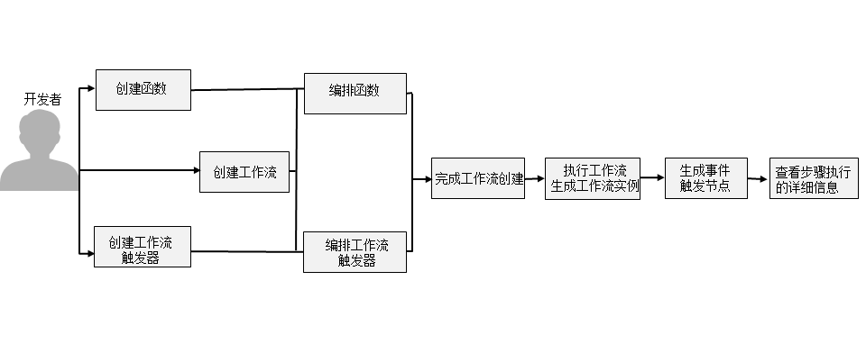
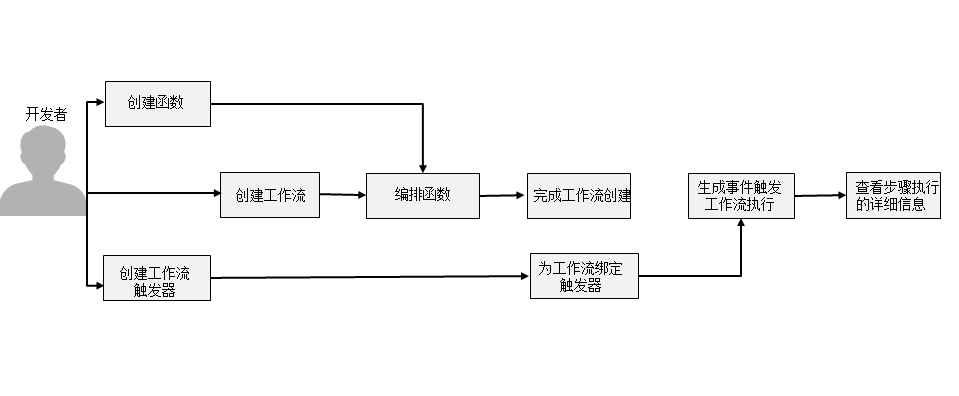

# 如何使用FunctionGraph？

## 函数使用流程

函数使用流程如[图1](#fig27511549111319)所示。

1.  用户编写业务程序代码，打包上传至FunctionGraph函数，添加事件源（如SMN、DMS、OBS、DIS等），完成应用程序构建部署。
2.  通过RESTful API或者云产品事件源触发函数，生成函数实例，实现业务功能，函数在运行过程中的资源调度由FunctionGraph来管理。
3.  用户可以查看函数运行日志和监控信息，按照代码运行情况收费，代码未运行时不产生费用。

**图 1**  函数使用过程  

说明如下：

①用户编写代码，目前支持Node.js、Python、Java、Go、C\#等语言，详情请参考[开发指南](https://support.huaweicloud.com/devg-functiongraph/functiongraph_02_0101.html)。

②上传代码，目前支持在线编辑、上传ZIP包，从OBS引用ZIP包等，详情请参考[表3](函数管理.md#table317242911415)。

③可以通过API和云产品事件源触发函数执行，触发方法请参考[使用SMN触发器](使用SMN触发器.md)、[使用DMS触发器](使用DMS触发器.md)、[使用APIG触发器](使用APIG触发器.md)、[使用OBS触发器](使用OBS触发器.md)、[使用DIS触发器](使用DIS触发器.md)、[使用定时触发器](使用定时触发器.md)、[使用LTS触发器](使用LTS触发器.md)、[使用CTS触发器](使用CTS触发器.md)。

④函数在执行过程中，会根据请求量弹性扩容，支持请求峰值的执行，此过程用户无需配置，由FunctionGraph完成，并发数限制请参考[使用限制](http://support.huaweicloud.com/productdesc-functiongraph/functiongraph_01_0150.html)。

⑤FunctionGraph函数实现了与华为云日志云服务的对接，用户无需配置，即可查看函数运行日志信息，请参考[查询日志](函数监控.md#section1358342733911)。

⑥FunctionGraph函数实现了与华为云监控云服务的对接，用户无需配置，即可查看图形化监控信息，请参考[监控函数](函数监控.md#section10908414121714)。

⑦函数执行结束后，根据函数的实际执行时间按量计费，收费粒度精确到100ms。

## 工作流使用流程

用户可以在Event工作流中编排内部触发器，使用流程如[图2](#fig189849405)所示。也可以为工作流绑定外部触发器，使用流程如[图3](#fig12306143112210)所示。以下为工作流两种比较典型的使用方式，但是并不局限这两种使用方式。

**图 2**  工作流中编排内部触发器  

**图 3**  工作流绑定外部触发器  

