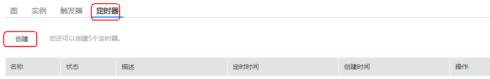
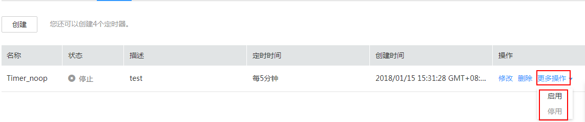

# 定时器管理

定时器用来定时启动用户创建的工作流，来完成用户对需要定时启动的工作流对应的任务。

## 创建定时器

1.  用户登录FunctionGraph，选择“工作流\>工作流列表”，进入“工作流列表”界面。
2.  在“工作流列表”界面，单击工作流名称，进入工作流详情界面。
3.  在工作流详情界面，单击“定时器”页签，进入定时器界面。
4.  单击“创建”，如[图1](#fig65119532045)所示，弹出“创建定时器”界面。

    **图 1**  创建定时器  
    

5.  在“创建定时器”界面，输入如下信息，如[表1](#table205212369246)所示。

    **表 1**  定时器参数说明

    
    <table><thead align="left"><tr id="row0521736162419"><th class="cellrowborder" valign="top" width="50%" id="mcps1.2.3.1.1">
参数

    </th>
    <th class="cellrowborder" valign="top" width="50%" id="mcps1.2.3.1.2">
说明

    </th>
    </tr>
    </thead>
    <tbody><tr id="row76012361249"><td class="cellrowborder" valign="top" width="50%" headers="mcps1.2.3.1.1 ">
*定时器名称

    </td>
    <td class="cellrowborder" valign="top" width="50%" headers="mcps1.2.3.1.2 ">
名称必须以字母或数字开头，只能由字母、数字、下划线和中划线组成，长度小于等于32个字符，且同一工作流下不能重名。

    </td>
    </tr>
    <tr id="row1460153642414"><td class="cellrowborder" valign="top" width="50%" headers="mcps1.2.3.1.1 ">
*定时方式

    </td>
    <td class="cellrowborder" valign="top" width="50%" headers="mcps1.2.3.1.2 ">
固定频率和cron表达式，两者二选一。

    </td>
    </tr>
    <tr id="row1260936142416"><td class="cellrowborder" valign="top" width="50%" headers="mcps1.2.3.1.1 ">
*定时时间

    </td>
    <td class="cellrowborder" valign="top" width="50%" headers="mcps1.2.3.1.2 ">
定时时间有两种方式：固定频率和Cron表达式。

    <ul id="ul18461540181612"><li>固定频率，目前支持分钟、小时、天，定时时间需输入整数。</li><li>cron表达式，可以完成更为复杂的工作流执行计划：如每周最后一天、20XX年3月5号执行工作流等，具体规则请参见<a href="函数定时触发器Cron表达式规则.md">函数定时触发器Cron表达式规则</a>。</li></ul>
    </td>
    </tr>
    <tr id="row116023618246"><td class="cellrowborder" valign="top" width="50%" headers="mcps1.2.3.1.1 ">
描述

    </td>
    <td class="cellrowborder" valign="top" width="50%" headers="mcps1.2.3.1.2 ">
对定时器的描述，输入规则：

    
工作流描述可以为空或者只能包含大写字母、小写字母、数字和特殊字符(,.:-)，长度小于等于256个字符。

    </td>
    </tr>
    </tbody>
    </table>

6.  单击“确定”，完成定时器创建。

## 更新定时器

工作流已有绑定的定时器，且定时器为“停用”状态，才可以更新定时器，停用定时器具体操作请参见[启用/停用定时器](#section377175684716)。

1.  用户登录FunctionGraph，选择“工作流\>工作流列表”，进入“工作流列表”界面。
2.  在“工作流列表”界面，单击工作流名称，进入工作流详情界面。
3.  在工作流详情界面，单击“定时器”页签，进入定时器界面。
4.  在“定时器”页签，选中定时器，单击操作栏下的“修改”，弹出修改定时器界面，如[图2](#fig101891047123112)所示。

    **图 2**  修改定时器  
    

5.  在“修改定时器”界面，输入如下信息，如[表2](#table5422943123312)所示。

    **表 2**  定时器参数说明

    
    <table><thead align="left"><tr id="row3430104313330"><th class="cellrowborder" valign="top" width="50%" id="mcps1.2.3.1.1">
参数

    </th>
    <th class="cellrowborder" valign="top" width="50%" id="mcps1.2.3.1.2">
说明

    </th>
    </tr>
    </thead>
    <tbody><tr id="row17430543183319"><td class="cellrowborder" valign="top" width="50%" headers="mcps1.2.3.1.1 ">
*定时方式

    </td>
    <td class="cellrowborder" valign="top" width="50%" headers="mcps1.2.3.1.2 ">
固定频率和cron表达式，两者二选一。

    </td>
    </tr>
    <tr id="row243064393315"><td class="cellrowborder" valign="top" width="50%" headers="mcps1.2.3.1.1 ">
*定时时间

    </td>
    <td class="cellrowborder" valign="top" width="50%" headers="mcps1.2.3.1.2 ">
定时时间有两种方式：固定频率和Cron表达式。

    <ul id="ul1114073618515"><li>固定频率，目前支持分钟、小时、天，定时时间需输入整数。</li><li>cron表达式，可以完成更为复杂的工作流执行计划：如每周最后一天、20XX年3月5号执行工作流等，具体规则请参见<a href="函数定时触发器Cron表达式规则.md">函数定时触发器Cron表达式规则</a>。</li></ul>
    </td>
    </tr>
    <tr id="row0430144314339"><td class="cellrowborder" valign="top" width="50%" headers="mcps1.2.3.1.1 ">
描述

    </td>
    <td class="cellrowborder" valign="top" width="50%" headers="mcps1.2.3.1.2 ">
对定时器的描述，输入规则：

    
工作流描述可以为空或者只能包含大写字母、小写字母、数字和特殊字符(,.:-)，长度小于等于256个字符。

    </td>
    </tr>
    </tbody>
    </table>

6.  单击“确定”，完成定时器修改。

## 启用/停用定时器

定时器创建完成后，需要启用定时器后工作流才会按照定时器规则执行。对于固定频率定时器，以启用定时器的时间为基准，计算定时执行时间。

1.  用户登录FunctionGraph，选择“工作流\>工作流列表”，进入“工作流列表”界面。
2.  在“工作流列表”界面，单击工作流名称，进入工作流详情界面。
3.  在工作流详情界面，单击“定时器”页签，进入“定时器”界面。
4.  在“定时器”页签，选中定时器，单击操作栏下的“更多操作”，选择“启用/停用”，定时器即进行对应执行。如[图3](#fig203121145163619)所示。

    **图 3**  启用/停用定时器  
    

5.  在“实例”界面，可以查看定时器启动的实例，如[图4](#fig35834023810)所示。

    **图 4**  定时启动示例  
    

## 删除定时器

1.  用户登录FunctionGraph，选择“工作流\>工作流列表”，进入“工作流列表”界面。
2.  在“工作流列表”界面，单击工作流名称，进入工作流详情界面。
3.  在工作流详情界面，单击“定时器”页签，进入“定时器”界面。
4.  在“定时器”页签，选中要删除的定时器，单击操作栏下的“删除”，如[图5](#fig1131271219445)所示，弹出“删除定时器”界面。

    **图 5**  删除定时器  
    

5.  在“删除定时器”界面，单击“确定”，完成定时器删除。

