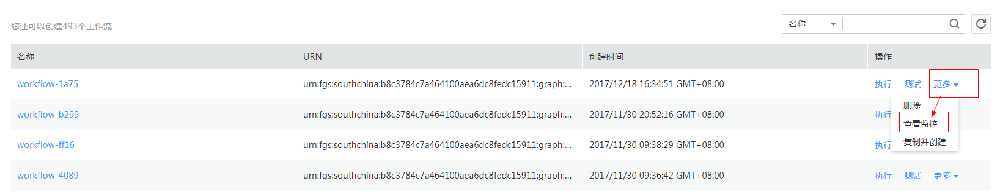
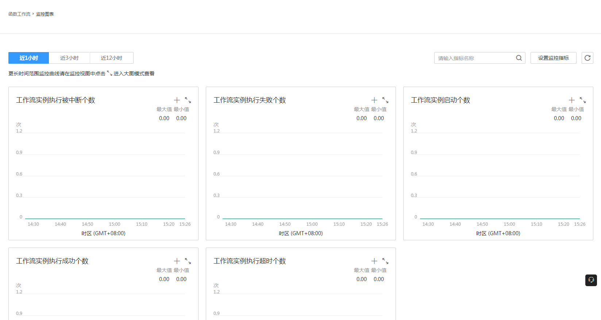

# 工作流监控

FunctionGraph实现了与华为云监控服务的对接，可以实时监控工作流执行信息。

## 工作流监控指标

云监控支持的工作流监控指标说明如[表1](#table5631830019232)所示。  

**表 1**  监控指标

<table><thead align="left"><tr id="row4866014219232"><th class="cellrowborder" valign="top" width="25%" id="mcps1.2.5.1.1">
指标名称

</th>
<th class="cellrowborder" valign="top" width="25%" id="mcps1.2.5.1.2">
含义

</th>
<th class="cellrowborder" valign="top" width="25%" id="mcps1.2.5.1.3">
取值范围

</th>
<th class="cellrowborder" valign="top" width="25%" id="mcps1.2.5.1.4">
备注

</th>
</tr>
</thead>
<tbody><tr id="row3737820519232"><td class="cellrowborder" valign="top" width="25%" headers="mcps1.2.5.1.1 ">
工作流实例启动个数

</td>
<td class="cellrowborder" valign="top" width="25%" headers="mcps1.2.5.1.2 ">
该指标用于统计用户工作流实例开始运行的实例个数

</td>
<td class="cellrowborder" valign="top" width="25%" headers="mcps1.2.5.1.3 ">
0~∞

</td>
<td class="cellrowborder" valign="top" width="25%" headers="mcps1.2.5.1.4 ">
测量对象：工作流

</td>
</tr>
<tr id="row6631424319232"><td class="cellrowborder" valign="top" width="25%" headers="mcps1.2.5.1.1 ">
工作流实例执行成功个数

</td>
<td class="cellrowborder" valign="top" width="25%" headers="mcps1.2.5.1.2 ">
该指标用于统计用户工作流实例成功运行完成的实例个数

</td>
<td class="cellrowborder" valign="top" width="25%" headers="mcps1.2.5.1.3 ">
0~∞

</td>
<td class="cellrowborder" valign="top" width="25%" headers="mcps1.2.5.1.4 ">
测量对象：工作流

</td>
</tr>
<tr id="row4551668919232"><td class="cellrowborder" valign="top" width="25%" headers="mcps1.2.5.1.1 ">
工作流实例执行失败个数

</td>
<td class="cellrowborder" valign="top" width="25%" headers="mcps1.2.5.1.2 ">
该指标用于统计用户工作流实例运行失败的实例个数

</td>
<td class="cellrowborder" valign="top" width="25%" headers="mcps1.2.5.1.3 ">
0~∞

</td>
<td class="cellrowborder" valign="top" width="25%" headers="mcps1.2.5.1.4 ">
测量对象：工作流

</td>
</tr>
<tr id="row4107111419232"><td class="cellrowborder" valign="top" width="25%" headers="mcps1.2.5.1.1 ">
工作流实例执行被中断个数

</td>
<td class="cellrowborder" valign="top" width="25%" headers="mcps1.2.5.1.2 ">
该指标用于统计用户工作流实例被终止运行的个数

</td>
<td class="cellrowborder" valign="top" width="25%" headers="mcps1.2.5.1.3 ">
0~∞

</td>
<td class="cellrowborder" valign="top" width="25%" headers="mcps1.2.5.1.4 ">
测量对象：工作流

</td>
</tr>
<tr id="row6153330519232"><td class="cellrowborder" valign="top" width="25%" headers="mcps1.2.5.1.1 ">
工作流实例执行超时个数

</td>
<td class="cellrowborder" valign="top" width="25%" headers="mcps1.2.5.1.2 ">
该指标用于统计用户工作流实例超时运行的个数

</td>
<td class="cellrowborder" valign="top" width="25%" headers="mcps1.2.5.1.3 ">
0~∞

</td>
<td class="cellrowborder" valign="top" width="25%" headers="mcps1.2.5.1.4 ">
测量对象：工作流

</td>
</tr>
</tbody>
</table>

## 设置告警

云监控提供的创建自定义告警功能，旨在帮助用户对单个或多个相同云服务的单个监控指标创建告警规则，便于用户对该类服务的某一指标进行统一监控。

操作步骤请参考[创建告警规则](https://support.huaweicloud.com/usermanual-ces/zh-cn_topic_0084572213.html)。

## 工作流监控

1.  用户登录FunctionGraph，选择“工作流\>工作流列表”，进入“工作流列表”界面。
2.  选中工作流，单击操作栏“更多\>查看监控”，如[图1](#fig2982116354)所示。

    **图 1**  查看监控  
    

3.  进入“云监控\>函数工作流\>监控图表”界面，查看工作流监控信息，如[图2](#fig8659191314298)所示。

    **图 2**  监控图表  
    

