# 工作流管理<a name="ZH-CN_TOPIC_0149027281"></a>

工作流（Workflow）是由不同的节点组成，并且每个节点都可以执行特定任务。工作流在节点之间传递数据，并决定应用程序操作中的后续步骤，实现预期功能。

## 创建工作流<a name="section126410311462"></a>

创建工作流的核心是按照既定的逻辑定义工作流，FunctionGraph提供了5种常用的工作流模板，用户可以在这些模板的基础上增删、组合，实现所需的业务逻辑。

1.  用户登录FunctionGraph控制台，选择“工作流\>工作流列表”，进入“工作流列表”界面。
2.  在“工作流列表”界面，单击“创建工作流”，进入“创建工作流”界面。
3.  在“创建工作流”界面填写工作流信息。

    1.  填写基础配置信息，如[表1](#table46600572105838)所示，带\*参数为必填项。

        **表 1**  工作流基础配置信息表

        <a name="table46600572105838"></a>
        <table><thead align="left"><tr id="row2549532105838"><th class="cellrowborder" valign="top" width="50%" id="mcps1.2.3.1.1"><p id="p64741929105852"><a name="p64741929105852"></a><a name="p64741929105852"></a>参数</p>
        </th>
        <th class="cellrowborder" valign="top" width="50%" id="mcps1.2.3.1.2"><p id="p9604890105852"><a name="p9604890105852"></a><a name="p9604890105852"></a>说明</p>
        </th>
        </tr>
        </thead>
        <tbody><tr id="row65180644105838"><td class="cellrowborder" valign="top" width="50%" headers="mcps1.2.3.1.1 "><p id="p2460416105852"><a name="p2460416105852"></a><a name="p2460416105852"></a>*名称</p>
        </td>
        <td class="cellrowborder" valign="top" width="50%" headers="mcps1.2.3.1.2 "><p id="p4332103173447"><a name="p4332103173447"></a><a name="p4332103173447"></a>名称必须以字母或数字开头，只能由字母、数字、下划线和中划线组成，长度小于等于64个字符，且不能重名。</p>
        </td>
        </tr>
        <tr id="row40639954185143"><td class="cellrowborder" valign="top" width="50%" headers="mcps1.2.3.1.1 "><p id="p45175680185150"><a name="p45175680185150"></a><a name="p45175680185150"></a>描述</p>
        </td>
        <td class="cellrowborder" valign="top" width="50%" headers="mcps1.2.3.1.2 "><p id="p50335129143212"><a name="p50335129143212"></a><a name="p50335129143212"></a>对工作流的描述，输入规则：</p>
        <p id="p5118480816114"><a name="p5118480816114"></a><a name="p5118480816114"></a>工作流描述可以为空或者只能包含大写字母、小写字母、数字和特殊字符(,.:-)，长度小于等于256个字符。</p>
        </td>
        </tr>
        </tbody>
        </table>

    2.  选择工作流模板，如[表2](#table536839433)所示。

        **表 2**  工作流模板说明

        <a name="table536839433"></a>
        <table><thead align="left"><tr id="row98803369433"><th class="cellrowborder" valign="top" width="33.33333333333333%" id="mcps1.2.4.1.1"><p id="p195312449453"><a name="p195312449453"></a><a name="p195312449453"></a>模板类别</p>
        </th>
        <th class="cellrowborder" valign="top" width="33.33333333333333%" id="mcps1.2.4.1.2"><p id="p466353519433"><a name="p466353519433"></a><a name="p466353519433"></a>模板名称</p>
        </th>
        <th class="cellrowborder" valign="top" width="33.33333333333333%" id="mcps1.2.4.1.3"><p id="p193671149433"><a name="p193671149433"></a><a name="p193671149433"></a>模板说明</p>
        </th>
        </tr>
        </thead>
        <tbody><tr id="row400863009433"><td class="cellrowborder" rowspan="5" valign="top" width="33.33333333333333%" headers="mcps1.2.4.1.1 "><p id="p257648389433"><a name="p257648389433"></a><a name="p257648389433"></a>通用模板</p>
        </td>
        <td class="cellrowborder" valign="top" width="33.33333333333333%" headers="mcps1.2.4.1.2 "><p id="p430147759536"><a name="p430147759536"></a><a name="p430147759536"></a>HelloWorld</p>
        </td>
        <td class="cellrowborder" valign="top" width="33.33333333333333%" headers="mcps1.2.4.1.3 "><p id="p616447579536"><a name="p616447579536"></a><a name="p616447579536"></a>不做处理，直接将输入作为输出。</p>
        </td>
        </tr>
        <tr id="row299889049433"><td class="cellrowborder" valign="top" headers="mcps1.2.4.1.1 "><p id="p431985569536"><a name="p431985569536"></a><a name="p431985569536"></a>Event</p>
        </td>
        <td class="cellrowborder" valign="top" headers="mcps1.2.4.1.2 "><p id="p94221109536"><a name="p94221109536"></a><a name="p94221109536"></a>设置一系列等待的事件，当事件触发时做相应处理后，流转到对应的state。</p>
        </td>
        </tr>
        <tr id="row665189139433"><td class="cellrowborder" valign="top" headers="mcps1.2.4.1.1 "><p id="p236145649536"><a name="p236145649536"></a><a name="p236145649536"></a>Operation</p>
        </td>
        <td class="cellrowborder" valign="top" headers="mcps1.2.4.1.2 "><p id="p337315419536"><a name="p337315419536"></a><a name="p337315419536"></a>设置一个或者多个Action（即FunctionGraph函数）。完成相应的函数功能再继续下一个state。</p>
        </td>
        </tr>
        <tr id="row125071899433"><td class="cellrowborder" valign="top" headers="mcps1.2.4.1.1 "><p id="p284495429536"><a name="p284495429536"></a><a name="p284495429536"></a>Switch</p>
        </td>
        <td class="cellrowborder" valign="top" headers="mcps1.2.4.1.2 "><p id="p227115519536"><a name="p227115519536"></a><a name="p227115519536"></a>根据值的匹配可以流转到不同的后续state处理。</p>
        </td>
        </tr>
        <tr id="row552871319433"><td class="cellrowborder" valign="top" headers="mcps1.2.4.1.1 "><p id="p479404789536"><a name="p479404789536"></a><a name="p479404789536"></a>Delay</p>
        </td>
        <td class="cellrowborder" valign="top" headers="mcps1.2.4.1.2 "><p id="p579734819536"><a name="p579734819536"></a><a name="p579734819536"></a>等待一段时间然后继续下一个state。</p>
        </td>
        </tr>
        <tr id="row645554759433"><td class="cellrowborder" valign="top" width="33.33333333333333%" headers="mcps1.2.4.1.1 "><p id="p616109509433"><a name="p616109509433"></a><a name="p616109509433"></a>自定义</p>
        </td>
        <td class="cellrowborder" valign="top" width="33.33333333333333%" headers="mcps1.2.4.1.2 "><p id="p244310919433"><a name="p244310919433"></a><a name="p244310919433"></a>-</p>
        </td>
        <td class="cellrowborder" valign="top" width="33.33333333333333%" headers="mcps1.2.4.1.3 "><p id="p327613449433"><a name="p327613449433"></a><a name="p327613449433"></a>根据需要自定义工作流，工作流开发请参考<a href="https://support.huaweicloud.com/devg-functiongraph/functiongraph_02_0101.html" target="_blank" rel="noopener noreferrer">《FunctionGraph开发指南》</a>。</p>
        </td>
        </tr>
        </tbody>
        </table>

    3.  <a name="li50323006173533"></a>编排工作流触发器和函数。

        方法一：图形化编排

        1.  添加节点
            1.  从可视化视图左侧“组件库”栏中选择需要添加的节点直接拖曳到视图处，如[图1](#fig1886692917599)所示。

                **图 1**  添加节点<a name="fig1886692917599"></a>  
                

            2.  单击箭头删除节点间的关系。
            3.  连接两个节点重新添加关系箭头。如[图2](#fig19382124319913)所示。

                **图 2**  添加节点关系<a name="fig19382124319913"></a>  
                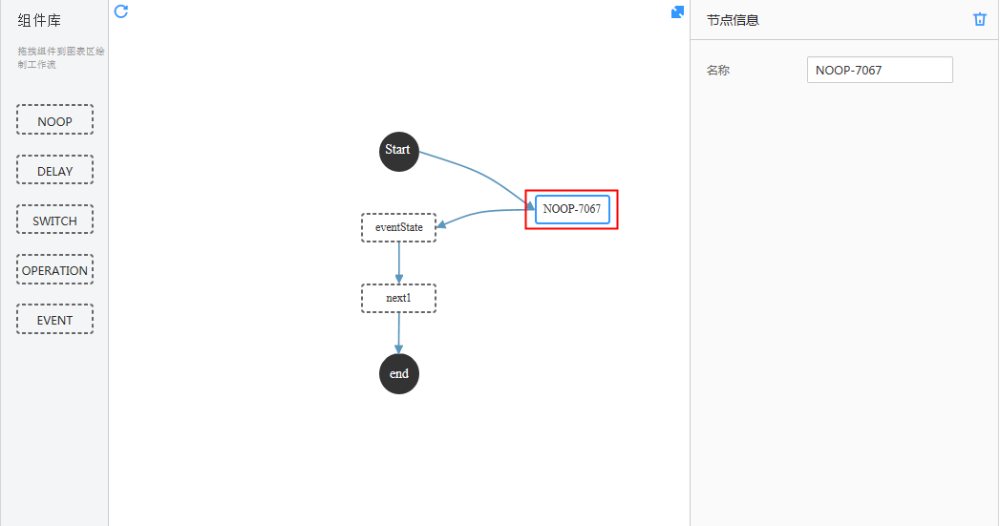

            4.  单击“”刷新视图页面。

        2.  编排节点信息

            选中节点，在可视化视图右侧“节点信息”栏中修改“节点名称”、绑定的“触发器”和被编排的“函数”等信息，如[图3](#fig206771040101614)所示。

            **图 3**  节点信息<a name="fig206771040101614"></a>  
            

        方法二：代码编排。

        单击可视化视图右上角的“”，进入代码页面，鼠标定位在source或者function参数值处，系统会自动加载已创建的工作流触发器和函数，从列表中选择即可。如[图4](#fig194023511593)所示。

        **图 4**  代码编排<a name="fig194023511593"></a>  
        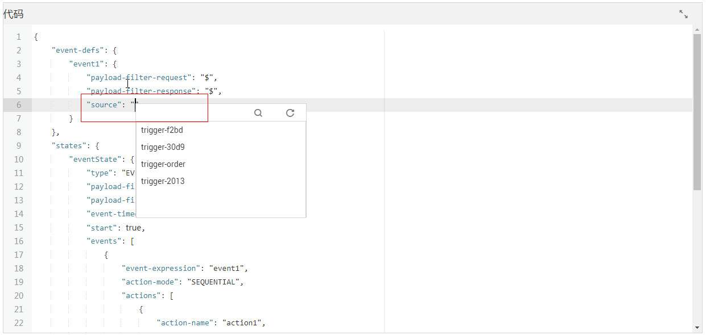

    > **说明：**   
    >工作流中节点之间的以JSON格式传递数据，如果某个节点返回值不是JSON格式，会导致后续节点input无法解析数据。所以在创建工作流编排函数时，需要保证被编排函数返回值为JSON格式，防止出错。  

4.  单击“创建”，完成工作流创建。

## 复制并创建工作流<a name="section113054204712"></a>

1.  用户登录FunctionGraph控制台，选择“工作流\>工作流列表”，进入“工作流列表”界面。
2.  在“工作流列表”界面，选中待复制的工作流，单击操作栏“更多\>复制并创建”，如[复制并创建工作流](#section113054204712)所示。

    **图 5**  复制并创建<a name="fig955125211468"></a>  
    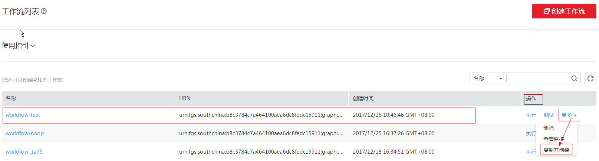

3.  进入创建工作流界面，并复制工作流代码至新的工作流，修改工作流信息。
4.  单击“创建”，完成工作流创建。

## 测试工作流<a name="section198121551164717"></a>

1.  用户登录FunctionGraph，选择“工作流\>工作流列表”，进入“工作流列表”界面。
2.  在“工作流列表”界面，单击工作流名称，进入工作流详情界面。
3.  在工作流详情界面，单击“测试”，如[图6](#fig54329305174145)所示，弹出“测试”界面。

    **图 6**  测试工作流<a name="fig54329305174145"></a>  
    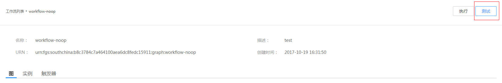

4.  在“测试”界面，输入如下信息，如[表3](#table2774280210421)所示，带\*参数为必填项。

    **表 3**  工作流实例信息

    <a name="table2774280210421"></a>
    <table><thead align="left"><tr id="row4646906810421"><th class="cellrowborder" valign="top" width="50%" id="mcps1.2.3.1.1"><p id="p4391008110429"><a name="p4391008110429"></a><a name="p4391008110429"></a>参数</p>
    </th>
    <th class="cellrowborder" valign="top" width="50%" id="mcps1.2.3.1.2"><p id="p6705563610429"><a name="p6705563610429"></a><a name="p6705563610429"></a>说明</p>
    </th>
    </tr>
    </thead>
    <tbody><tr id="row4312774710421"><td class="cellrowborder" valign="top" width="50%" headers="mcps1.2.3.1.1 "><p id="p368659310421"><a name="p368659310421"></a><a name="p368659310421"></a>*实例名称</p>
    </td>
    <td class="cellrowborder" valign="top" width="50%" headers="mcps1.2.3.1.2 "><p id="p3017858310421"><a name="p3017858310421"></a><a name="p3017858310421"></a>名称只能由字母、数字、下划线和中划线组成，且长度小于等于80个字符。</p>
    </td>
    </tr>
    <tr id="row317179510421"><td class="cellrowborder" valign="top" width="50%" headers="mcps1.2.3.1.1 "><p id="p5558883310421"><a name="p5558883310421"></a><a name="p5558883310421"></a>*执行输入数据</p>
    </td>
    <td class="cellrowborder" valign="top" width="50%" headers="mcps1.2.3.1.2 "><p id="p293976710537"><a name="p293976710537"></a><a name="p293976710537"></a>输入代码。</p>
    </td>
    </tr>
    </tbody>
    </table>

5.  单击“确定”，测试工作流。
6.  查看测试结果。
    1.  查看测试总体信息，如[图7](#fig1222772471217)所示。

        **图 7**  工作流测试结果<a name="fig1222772471217"></a>  
        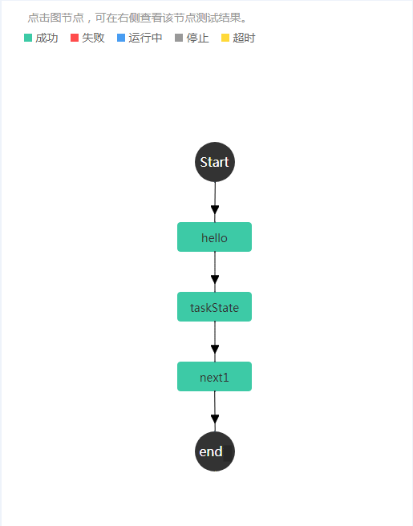

    2.  （可选）测试触发器

        如果工作流的某个节点包含触发器，在可视化工作流图中单击该节点，输入[图8](#fig76076110119)信息，单击“事件触发”，测试触发器。如[图8](#fig76076110119)所示。

        **表 4**  触发器参数

        <a name="table728187710914"></a>
        <table><thead align="left"><tr id="row5585146010914"><th class="cellrowborder" valign="top" width="50%" id="mcps1.2.3.1.1"><p id="p4774341810914"><a name="p4774341810914"></a><a name="p4774341810914"></a>参数</p>
        </th>
        <th class="cellrowborder" valign="top" width="50%" id="mcps1.2.3.1.2"><p id="p4201161610914"><a name="p4201161610914"></a><a name="p4201161610914"></a>说明</p>
        </th>
        </tr>
        </thead>
        <tbody><tr id="row4256022810914"><td class="cellrowborder" valign="top" width="50%" headers="mcps1.2.3.1.1 "><p id="p2482643410914"><a name="p2482643410914"></a><a name="p2482643410914"></a>触发器</p>
        </td>
        <td class="cellrowborder" valign="top" width="50%" headers="mcps1.2.3.1.2 "><p id="p6478414110914"><a name="p6478414110914"></a><a name="p6478414110914"></a>从下拉列表中选择。</p>
        </td>
        </tr>
        <tr id="row4618635810914"><td class="cellrowborder" valign="top" width="50%" headers="mcps1.2.3.1.1 "><p id="p5010753510914"><a name="p5010753510914"></a><a name="p5010753510914"></a>触发器参数</p>
        </td>
        <td class="cellrowborder" valign="top" width="50%" headers="mcps1.2.3.1.2 "><p id="p3217850410914"><a name="p3217850410914"></a><a name="p3217850410914"></a>输入测试参数。</p>
        </td>
        </tr>
        </tbody>
        </table>

        **图 8**  测试触发器<a name="fig76076110119"></a>  
        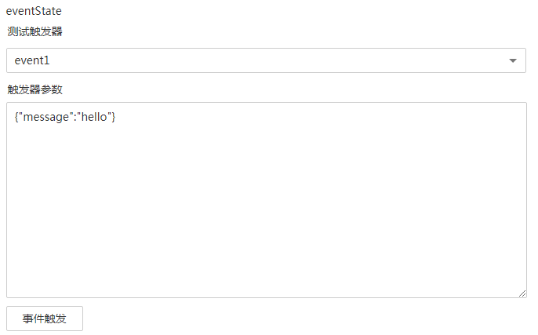

    3.  测试结果如下。

        ```
        hello: input:
         
        {"message":"hello"} ,
         
        output:
         
        {"message":"hello"}
        ---------------------------------------------------------------------------------------------------
        taskState: input:
         
        {"message":"hello"} ,
         
        output:
        {"message":"hello","functionname":"test","requestId":"375f921f-9b50-43ce-b286-196376cb8665","timestamp":"Tue Dec 26 2017 03:40:15 GMT+0000 (UTC)"}
        ---------------------------------------------------------------------------------------------------
        next1: input:
         
        {"message":"hello","functionname":"test","requestId":"375f921f-9b50-43ce-b286-196376cb8665","timestamp":"Tue Dec 26 2017 03:40:15 GMT+0000 (UTC)"} ,
         
        output:
        {"message":"hello","functionname":"test","requestId":"375f921f-9b50-43ce-b286-196376cb8665","timestamp":"Tue Dec 26 2017 03:40:15 GMT+0000 (UTC)"}
        ---------------------------------------------------------------------------------------------------
        end: input:
         
        {"message":"hello","functionname":"test","requestId":"375f921f-9b50-43ce-b286-196376cb8665","timestamp":"Tue Dec 26 2017 03:40:15 GMT+0000 (UTC)"} ,
         
        output:
        {"message":"hello","functionname":"test","requestId":"375f921f-9b50-43ce-b286-196376cb8665","timestamp":"Tue Dec 26 2017 03:40:15 GMT+0000 (UTC)"}
        ```

    4.  查看日志信息，如[图9](#fig551481714014)所示。

        **图 9**  工作流测试日志<a name="fig551481714014"></a>  
        


## 修改工作流<a name="section5691521174719"></a>

工作流即支持通过可视化图形修改也支持通过代码直接修改。

1.  用户登录FunctionGraph控制台，选择“工作流\>工作流列表”，进入“工作流列表”界面。
2.  在“工作流列表”界面，单击工作流名称，进入详情界面。
3.  在“图”页签，单击“  ”，进入修改页面，如[图10](#fig247815212505)所示。

    **图 10**  修改工作流<a name="fig247815212505"></a>  
    

    > **说明：**   
    >修改页面的添加节点和编排节点步骤与创建工作流步骤一致，具体请参考[3.c](#li50323006173533)  

4.  单击“”，进入代码修改页面，如[图11](#fig8797165132416)所示。

    **图 11**  修改代码<a name="fig8797165132416"></a>  
    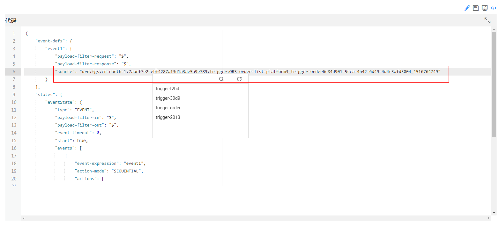

    > **说明：**   
    >修改页面的添加节点和编排节点步骤与创建工作流步骤一致，具体请参考[3.c](#li50323006173533)。  

5.  单击“  ”保存，完成工作流修改。

## 执行工作流<a name="section106943215479"></a>

通过验证之后的工作流，可以通过执行工作流实现实例化。一个工作流可以多次执行，创建多个工作流实例。

1.  用户登录FunctionGraph控制台，选择“工作流\>工作流列表”，进入“工作流列表”界面。
2.  在“工作流列表”界面，单击工作流名称，进入工作流详情界面。
3.  在工作流详情界面，单击“执行”，如[图12](#fig36915932174226)所示，弹出“执行”界面。

    **图 12**  执行工作流<a name="fig36915932174226"></a>  
    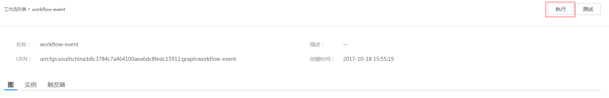

4.  在“执行”界面，输入如下信息，如[表5](#table941523885515)所示。

    **表 5**  执行信息

    <a name="table941523885515"></a>
    <table><thead align="left"><tr id="row24151238125515"><th class="cellrowborder" valign="top" width="50%" id="mcps1.2.3.1.1"><p id="p9415113805511"><a name="p9415113805511"></a><a name="p9415113805511"></a>参数</p>
    </th>
    <th class="cellrowborder" valign="top" width="50%" id="mcps1.2.3.1.2"><p id="p14423338185519"><a name="p14423338185519"></a><a name="p14423338185519"></a>说明</p>
    </th>
    </tr>
    </thead>
    <tbody><tr id="row134231438205512"><td class="cellrowborder" valign="top" width="50%" headers="mcps1.2.3.1.1 "><p id="p042313385550"><a name="p042313385550"></a><a name="p042313385550"></a>*实例名称</p>
    </td>
    <td class="cellrowborder" valign="top" width="50%" headers="mcps1.2.3.1.2 "><p id="p13423183885512"><a name="p13423183885512"></a><a name="p13423183885512"></a>名称只能由字母、数字、下划线和中划线组成，且长度小于等于80个字符。</p>
    </td>
    </tr>
    <tr id="row643117383558"><td class="cellrowborder" valign="top" width="50%" headers="mcps1.2.3.1.1 "><p id="p6431153813556"><a name="p6431153813556"></a><a name="p6431153813556"></a>*执行输入数据</p>
    </td>
    <td class="cellrowborder" valign="top" width="50%" headers="mcps1.2.3.1.2 "><p id="p043112381550"><a name="p043112381550"></a><a name="p043112381550"></a>输入代码。</p>
    </td>
    </tr>
    </tbody>
    </table>

5.  单击“确定”，执行工作流。
6.  查看工作执行结果。
    1.  查看工作流执行状态，如[图13](#fig8167950173822)所示。

        **图 13**  执行信息<a name="fig8167950173822"></a>  
        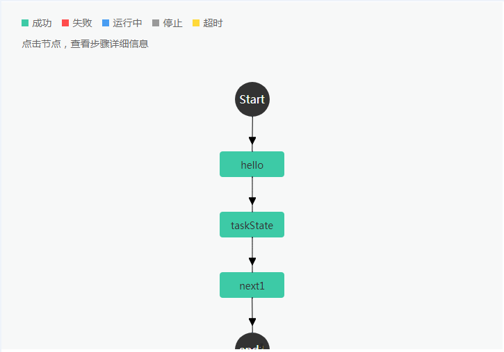

    2.  查看执行详细信息，如[图14](#fig18598599174623)、[图15](#fig47548181174452)、[图16](#fig33804049174420)所示。

        **图 14**  详细执行信息（基本信息）<a name="fig18598599174623"></a>  
        

        **图 15**  详细执行信息（输入）<a name="fig47548181174452"></a>  
        

        **图 16**  详细执行信息（输出）<a name="fig33804049174420"></a>  
        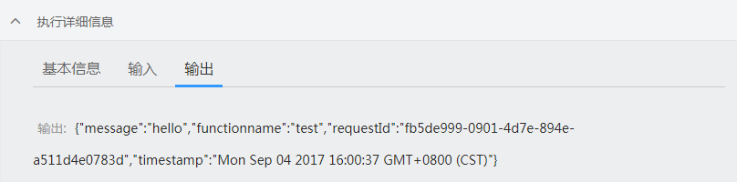

    3.  单击图形化工作流的节点，查看步骤详细信息，如[图17](#fig13851562174319)、[图18](#fig1201842174248)、[图19](#fig855181317426)所示。

        **图 17**  步骤详细信息（基本信息）<a name="fig13851562174319"></a>  
        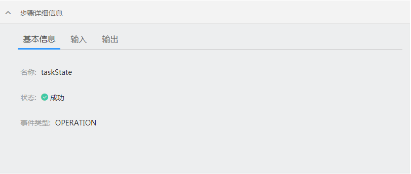

        **图 18**  步骤详细信息（输入）<a name="fig1201842174248"></a>  
        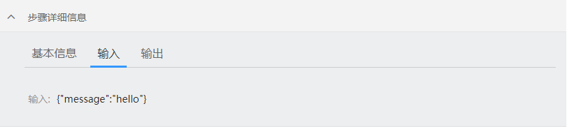

        **图 19**  步骤详细信息（输出）<a name="fig855181317426"></a>  
        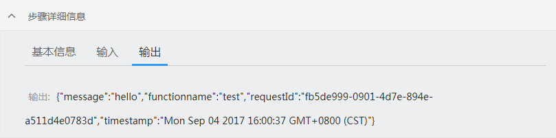

    4.  查看步骤日志信息，如[图20](#fig20556817174135)所示。

        **图 20**  步骤日志信息<a name="fig20556817174135"></a>  
        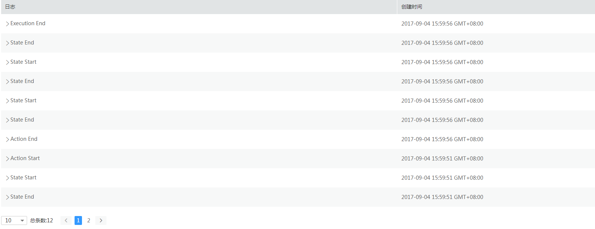


## 工作流实例<a name="section469610218477"></a>

工作流可创建多个实例，多个实例可以同时运行，可以查看每个工作流实例的详细信息。

1.  用户登录FunctionGraph控制台，选择“工作流\>工作流列表”，进入“工作流列表”界面。
2.  在“工作流列表”界面，单击工作流名称，进入工作流详情界面。
3.  在工作流详情界面，单击“实例”页签，进入“实例”界面。
4.  在“实例”界面，单击实例名称，如[图21](#fig892181174344)所示，进入实例执行界面

    **图 21**  工作流实例列表<a name="fig892181174344"></a>  
    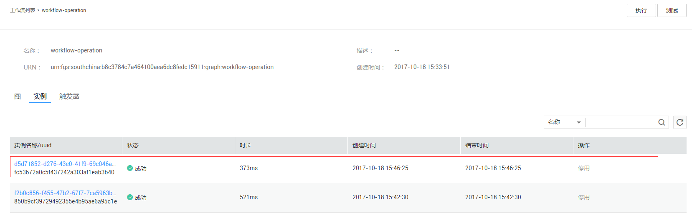

5.  在实例执行界面，查看实例执行信息，如[图22](#fig29134767171025)所示。

    **图 22**  工作流实例执行信息<a name="fig29134767171025"></a>  
    


## 删除工作流<a name="section36975211471"></a>

1.  用户登录FunctionGraph控制台，选择“工作流\>工作流列表”，进入“工作流列表”界面。
2.  在“工作流列表”页，选中待删除的工作流，单击操作栏的“更多”，选择“删除”，如[图23](#fig22639449172340)所示，弹出“删除工作流”界面。

    **图 23**  删除工作流<a name="fig22639449172340"></a>  
    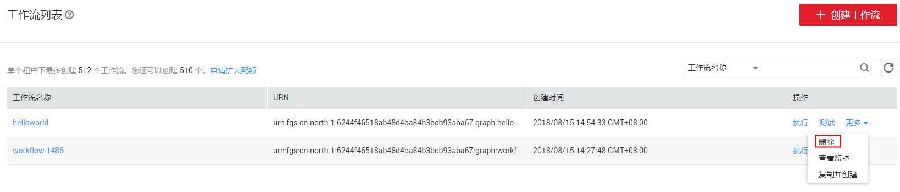

3.  在“删除工作流”界面，输入"DELETE"（大写），单击“确定”，删除工作流。如[图24](#fig12273814719)所示。

    **图 24**  删除工作流确认<a name="fig12273814719"></a>  
    


