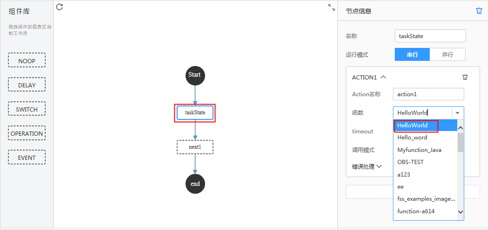
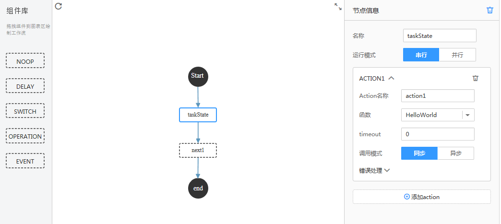
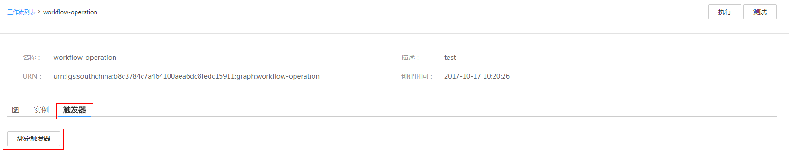
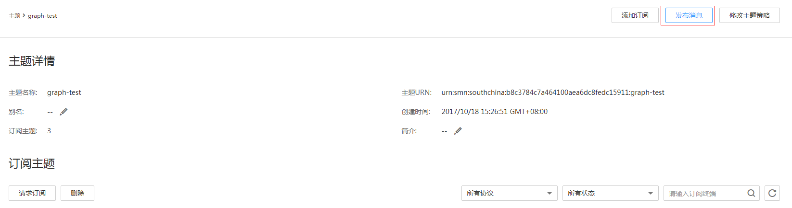
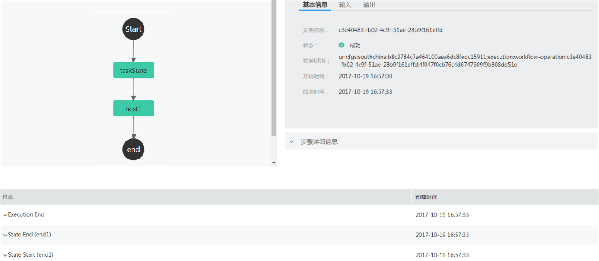
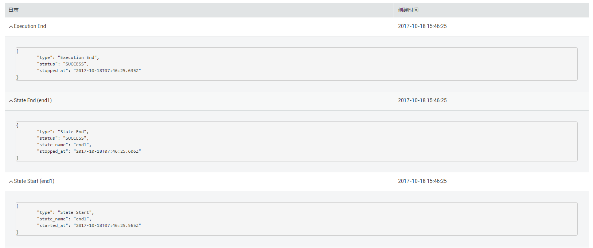

# 工作流绑定外部触发器<a name="functiongraph_01_0250"></a>

本节使用FunctionGraph自带的Operation工作流模板编排已创建的函数，创建工作流，然后绑定工作流触发器，通过SMN消息触发工作流运行，获得工作流执行结果。

## 前提条件<a name="section28989356145359"></a>

已经创建FunctionGraph函数，函数创建过程请参考[创建HelloWorld函数](https://support.huaweicloud.com/usermanual-functiongraph/functiongraph_01_0201.html)。

已创建工作流触发器，此处以trigger\_smn为例，创建过程请参考[创建工作流触发器](创建工作流触发器.md)。

## 创建Operation工作流<a name="section3937035143315"></a>

工作流中节点之间的以JSON格式传递数据，如果某个节点返回值不是JSON格式，会导致后续节点input无法解析数据。所以在创建工作流编排函数时，需要保证被编排函数返回值为JSON格式，防止出错。

1.  用户登录FunctionGraph，选择“工作流\>工作流列表”，进入“工作流列表”界面。
2.  在“工作流列表”界面，单击“创建工作流”，进入“创建工作流”界面。
3.  在“创建工作流”界面填写工作流信息。
    1.  填写基础配置信息，如[表1](#table46600572105838)所示，带\*参数为必填项。

        **表 1**  工作流基础配置信息表

        <a name="table46600572105838"></a>
        <table><thead align="left"><tr id="row2549532105838"><th class="cellrowborder" valign="top" width="50%" id="mcps1.2.3.1.1"><p id="p64741929105852"><a name="p64741929105852"></a><a name="p64741929105852"></a>参数</p>
        </th>
        <th class="cellrowborder" valign="top" width="50%" id="mcps1.2.3.1.2"><p id="p9604890105852"><a name="p9604890105852"></a><a name="p9604890105852"></a>说明</p>
        </th>
        </tr>
        </thead>
        <tbody><tr id="row65180644105838"><td class="cellrowborder" valign="top" width="50%" headers="mcps1.2.3.1.1 "><p id="p2460416105852"><a name="p2460416105852"></a><a name="p2460416105852"></a>*名称</p>
        </td>
        <td class="cellrowborder" valign="top" width="50%" headers="mcps1.2.3.1.2 "><p id="p1627109617040"><a name="p1627109617040"></a><a name="p1627109617040"></a>工作流名称，规则为：名称必须以字母或数字开头，只能由字母、数字、下划线和中划线组成，长度小于等于64个字符，且不能重名。</p>
        <p id="p65076039105852"><a name="p65076039105852"></a><a name="p65076039105852"></a>输入“workflow-operation”。</p>
        </td>
        </tr>
        <tr id="row40639954185143"><td class="cellrowborder" valign="top" width="50%" headers="mcps1.2.3.1.1 "><p id="p45175680185150"><a name="p45175680185150"></a><a name="p45175680185150"></a>描述</p>
        </td>
        <td class="cellrowborder" valign="top" width="50%" headers="mcps1.2.3.1.2 "><p id="p50335129143212"><a name="p50335129143212"></a><a name="p50335129143212"></a>对工作流的描述，输入规则：可以为空或者只能包含大写字母、小写字母、数字和特殊字符(,.:-)，长度小于等于256个字符。</p>
        <p id="p35351426185150"><a name="p35351426185150"></a><a name="p35351426185150"></a>输入“test”。</p>
        </td>
        </tr>
        </tbody>
        </table>

    2.  选择工作流模板，如[表2](#table124082057152410)所示。

        **表 2**  工作流模板配置表

        <a name="table124082057152410"></a>
        <table><thead align="left"><tr id="row8406257182411"><th class="cellrowborder" valign="top" width="50%" id="mcps1.2.3.1.1"><p id="p1440535713243"><a name="p1440535713243"></a><a name="p1440535713243"></a>参数</p>
        </th>
        <th class="cellrowborder" valign="top" width="50%" id="mcps1.2.3.1.2"><p id="p2405357122415"><a name="p2405357122415"></a><a name="p2405357122415"></a>说明</p>
        </th>
        </tr>
        </thead>
        <tbody><tr id="row114064576245"><td class="cellrowborder" valign="top" width="50%" headers="mcps1.2.3.1.1 "><p id="p1340695762410"><a name="p1340695762410"></a><a name="p1340695762410"></a>*模板类型</p>
        </td>
        <td class="cellrowborder" valign="top" width="50%" headers="mcps1.2.3.1.2 "><p id="p124061957162410"><a name="p124061957162410"></a><a name="p124061957162410"></a>选择“通用模板”。</p>
        </td>
        </tr>
        <tr id="row1240755712241"><td class="cellrowborder" valign="top" width="50%" headers="mcps1.2.3.1.1 "><p id="p12407657172411"><a name="p12407657172411"></a><a name="p12407657172411"></a>模板名称</p>
        </td>
        <td class="cellrowborder" valign="top" width="50%" headers="mcps1.2.3.1.2 "><p id="p1640755782410"><a name="p1640755782410"></a><a name="p1640755782410"></a>选择“Operation”。</p>
        <p id="p337315419536"><a name="p337315419536"></a><a name="p337315419536"></a>模板实现功能：设置一个或者多个Action（即FunctionGraph函数）。完成相应的函数功能再继续下一个state。</p>
        </td>
        </tr>
        </tbody>
        </table>


4.  编排函数
    1.  选中“taskState”节点，在节点信息中，编排[创建HelloWorld函数](https://support.huaweicloud.com/usermanual-functiongraph/functiongraph_01_0201.html)中已创建的函数“HelloWorld”，如[图1](#fig5149346317211)所示。

        **图 1**  编排函数<a name="fig5149346317211"></a>  
        

    2.  完成编排后，代码如下。

        ```
        {
        	"states": {
        		"taskState": {
        			"type": "OPERATION",
        			"payload-filter-in": "$",
        			"payload-filter-out": "$",
        			"start": true,
        			"action-mode": "SEQUENTIAL",
        			"actions": [
        				{
        					"action-name": "action1",
        					"function": "urn:fss:southchina:b8c3784c7a464100aea6dc8fedc15911:function:default:HelloWorld",
        					"invocation-mode": "SYNC",
        					"payload-filter": "$",
        					"timeout": 0,
        					"results": [
        						{
        							"match": "MatchAny",
        							"retry-interval": 1,
        							"max-retry": 3,
        							"next-state": "next1"
        						}
        					]
        				}
        			],
        			"next-state": "next1"
        		},
        		"next1": {
        			"type": "NOOP",
        			"payload-filter-in": "$",
        			"payload-filter-out": "$",
        			"next-state": "end"
        		},
        		"end": {
        			"type": "END"
        		}
        	}
        }
        ```

    3.  查看可视化工作流，如[图2](#fig16981109101910)所示。

        **图 2**  可视化Operation工作流<a name="fig16981109101910"></a>  
        


5.  单击“创建”，完成工作流创建。

## 绑定SMN触发器<a name="section32293933511"></a>

1.  用户登录FunctionGraph，选择“工作流\>工作流列表”，进入“工作流列表”界面。
2.  在“工作流列表”界面，单击“workflow-operation”工作流名称，进入工作流详情界面。
3.  在工作流详情界面，单击“触发器”页签，进入触发界面。
4.  单击“绑定触发器”，如[图3](#fig33748573102635)所示，弹出绑定触发器界面。

    **图 3**  绑定SMN触发器<a name="fig33748573102635"></a>  
    

5.  在“绑定触发器”界面，输入如下信息，如[表3](#table2774280210421)所示。

    **表 3**  执行信息

    <a name="table2774280210421"></a>
    <table><thead align="left"><tr id="row4646906810421"><th class="cellrowborder" valign="top" width="50%" id="mcps1.2.3.1.1"><p id="p4391008110429"><a name="p4391008110429"></a><a name="p4391008110429"></a>参数</p>
    </th>
    <th class="cellrowborder" valign="top" width="50%" id="mcps1.2.3.1.2"><p id="p6705563610429"><a name="p6705563610429"></a><a name="p6705563610429"></a>说明</p>
    </th>
    </tr>
    </thead>
    <tbody><tr id="row4312774710421"><td class="cellrowborder" valign="top" width="50%" headers="mcps1.2.3.1.1 "><p id="p368659310421"><a name="p368659310421"></a><a name="p368659310421"></a>触发器类型</p>
    </td>
    <td class="cellrowborder" valign="top" width="50%" headers="mcps1.2.3.1.2 "><p id="p1528765893057"><a name="p1528765893057"></a><a name="p1528765893057"></a>选择“已创建”。</p>
    </td>
    </tr>
    <tr id="row317179510421"><td class="cellrowborder" valign="top" width="50%" headers="mcps1.2.3.1.1 "><p id="p5558883310421"><a name="p5558883310421"></a><a name="p5558883310421"></a>触发器</p>
    </td>
    <td class="cellrowborder" valign="top" width="50%" headers="mcps1.2.3.1.2 "><p id="p293976710537"><a name="p293976710537"></a><a name="p293976710537"></a>选择已创建触发器“trigger_smn”。</p>
    </td>
    </tr>
    </tbody>
    </table>

6.  单击“确定”，完成触发器绑定。

## 发布消息触发工作流<a name="section13525134603611"></a>

1.  用户登录“消息通知服务”，单击“主题管理\>主题”，进入“主题”界面。
2.  在“主题”界面，单击“graph-test”主题名称，进入主题详情页。
3.  在“主题详情页”，单击操作栏的“发布消息”，如[图4](#fig6137752817622)所示，弹出“发布消息”界面。

    **图 4**  发布消息触发工作流<a name="fig6137752817622"></a>  
    

4.  在“发布消息”界面，填写发布信息，如[表4](#table34364817622)所示，带\*参数为必填项。

    **表 4**  发布信息表

    <a name="table34364817622"></a>
    <table><thead align="left"><tr id="row2574270817622"><th class="cellrowborder" valign="top" width="50%" id="mcps1.2.3.1.1"><p id="p478463117622"><a name="p478463117622"></a><a name="p478463117622"></a>字段</p>
    </th>
    <th class="cellrowborder" valign="top" width="50%" id="mcps1.2.3.1.2"><p id="p5201081017622"><a name="p5201081017622"></a><a name="p5201081017622"></a>填写说明</p>
    </th>
    </tr>
    </thead>
    <tbody><tr id="row5212605317622"><td class="cellrowborder" valign="top" width="50%" headers="mcps1.2.3.1.1 "><p id="p6146076917622"><a name="p6146076917622"></a><a name="p6146076917622"></a>消息标题</p>
    </td>
    <td class="cellrowborder" valign="top" width="50%" headers="mcps1.2.3.1.2 "><p id="p1226638917622"><a name="p1226638917622"></a><a name="p1226638917622"></a>输入“SMN-Test”。</p>
    </td>
    </tr>
    <tr id="row4328864417622"><td class="cellrowborder" valign="top" width="50%" headers="mcps1.2.3.1.1 "><p id="p1671929617622"><a name="p1671929617622"></a><a name="p1671929617622"></a>*消息类型</p>
    </td>
    <td class="cellrowborder" valign="top" width="50%" headers="mcps1.2.3.1.2 "><p id="p1208576917622"><a name="p1208576917622"></a><a name="p1208576917622"></a>选择“文本消息”。</p>
    </td>
    </tr>
    <tr id="row4166306217622"><td class="cellrowborder" valign="top" width="50%" headers="mcps1.2.3.1.1 "><p id="p1926482817622"><a name="p1926482817622"></a><a name="p1926482817622"></a>*消息内容</p>
    </td>
    <td class="cellrowborder" valign="top" width="50%" headers="mcps1.2.3.1.2 "><p id="p1694723517622"><a name="p1694723517622"></a><a name="p1694723517622"></a>输入“graph-test”。</p>
    </td>
    </tr>
    </tbody>
    </table>

5.  单击“确定”，完成消息发布。

    > **说明：**   
    >消息发布以后，会自动触发工作流运行。  


## 查看运行结果<a name="section5877113603715"></a>

1.  用户登录FunctionGraph，选择“工作流\>工作流列表”，进入“工作流列表”界面。
2.  在“工作流列表”界面，单击“workflow-operation”工作流名称，进入工作流详情界面。
3.  在工作流详情界面，单击“实例”页签，进入“实例”界面。
4.  在“实例”界面，单击实例名称，如[图5](#fig2910336017821)所示，进入实例执行界面

    **图 5**  workflow-operationg工作流实例列表<a name="fig2910336017821"></a>  
    

5.  查看工作执行结果。
    1.  查看工作流执行状态，如下[图6](#fig29134767171025)所示。

        **图 6**  workflow-operationg工作流执行信息<a name="fig29134767171025"></a>  
        

    2.  工作流输出结果如下。

        ```
        {"records":[{"event_version":"1.0","smn":{"topic_urn":"urn:smn:southchina:b8c3784c7a464100aea6dc8fedc15911:graph-test","type":"notification","message":"graph-test","timestamp":"2017-10-19T08:57:30Z","subject":"SMN-Test","message_id":"9fe3ad1632d94763aec41d6f0cac88c4"},"event_source":"SMN","event_subscription_urn":"urn:smn:southchina:b8c3784c7a464100aea6dc8fedc15911:graph-test:7e3d0514a22742459815de88f3dc7195"}],"functionname":"test","requestId":"4262d1ef-d2df-4b05-82eb-c27ca1895314","timestamp":"Thu Oct 19 2017 16:55:46 GMT+0800 (CST)"}
        ```

    3.  查看执行日志，示例如[图7](#fig37880158154945)所示。

        **图 7**  执行日志<a name="fig37880158154945"></a>  
        


