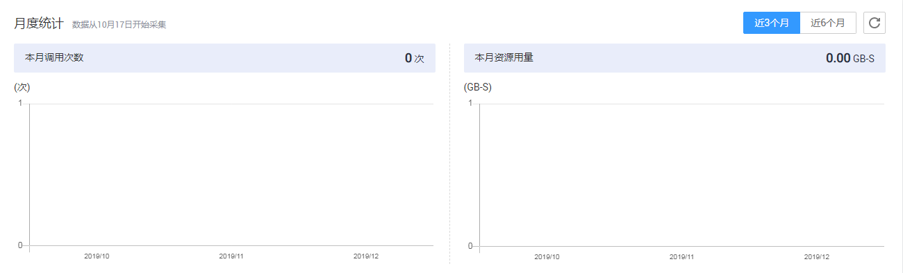
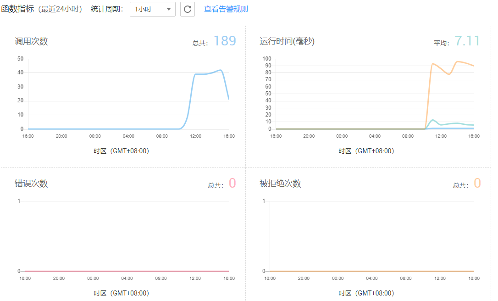

# 总览

总览界面图形展示函数相关的资源及配额信息，并提供租户层面的监控信息。

## 总览界面介绍

1.  用户登录FunctionGraph控制台，单击“总览”，进入“总览”界面。
2.  可以查看函数数量/配额信息、代码存储/配额信息。
3.  单击“创建函数”，进入创建函数界面，创建函数请参考[创建函数](创建并初始化函数.md)。
4.  单击相关云服务图标，进入相关云服务产品控制台。
5.  可以查看函数月度统计，如[图1](#fig18363545391)所示。

    **图 1**  月度统计  
    

    > **说明：**   
    >可以查看函数月度调用次数和月度资源用量。  

6.  可以查看租户层面的监控信息，如[图2](#fig107415138291)所示。

    **图 2**  监控信息  
    

    > **说明：**   
    >可以查看的指标有：调用次数、错误次数、运行时间、被拒绝次数。  

## 监控指标说明

运行监控指标说明如[表1](#table34086103152643)所示。

**表 1**  监控指标说明表

<table><thead align="left"><tr id="row45907106152643"><th class="cellrowborder" valign="top" width="13.525252525252524%" id="mcps1.2.4.1.1">
指标

</th>
<th class="cellrowborder" valign="top" width="9.646464646464645%" id="mcps1.2.4.1.2">
单位

</th>
<th class="cellrowborder" valign="top" width="76.82828282828284%" id="mcps1.2.4.1.3">
说明

</th>
</tr>
</thead>
<tbody><tr id="row66862752152643"><td class="cellrowborder" valign="top" width="13.525252525252524%" headers="mcps1.2.4.1.1 ">
调用次数

</td>
<td class="cellrowborder" valign="top" width="9.646464646464645%" headers="mcps1.2.4.1.2 ">
次

</td>
<td class="cellrowborder" valign="top" width="76.82828282828284%" headers="mcps1.2.4.1.3 ">
函数总的调用请求数，包含了错误和被拒绝的调用。异步调用在该请求实际被系统执行时才开始计数。

</td>
</tr>
<tr id="row66766826144056"><td class="cellrowborder" valign="top" width="13.525252525252524%" headers="mcps1.2.4.1.1 ">
运行时间

</td>
<td class="cellrowborder" valign="top" width="9.646464646464645%" headers="mcps1.2.4.1.2 ">
毫秒

</td>
<td class="cellrowborder" valign="top" width="76.82828282828284%" headers="mcps1.2.4.1.3 ">
最大运行时间为某统计粒度（周期）下，即某一时间段内所有函数单次执行最大的运行时间。

最小运行时间为某统计粒度（周期）下，即某一时间段内所有函数单次执行最小的运行时间。

平均运行时间为某统计粒度（周期）下，即某一时间段内所有函数单次执行平均的运行时间。

</td>
</tr>
<tr id="row13067190152643"><td class="cellrowborder" valign="top" width="13.525252525252524%" headers="mcps1.2.4.1.1 ">
错误次数

</td>
<td class="cellrowborder" valign="top" width="9.646464646464645%" headers="mcps1.2.4.1.2 ">
次

</td>
<td class="cellrowborder" valign="top" width="76.82828282828284%" headers="mcps1.2.4.1.3 ">
指发生异常请求的函数不能正确执行完并且返回200，都计入错误次数。函数自身的语法错误或自身执行错误也会计入该指标。

</td>
</tr>
<tr id="row19350802152643"><td class="cellrowborder" valign="top" width="13.525252525252524%" headers="mcps1.2.4.1.1 ">
被拒绝次数

</td>
<td class="cellrowborder" valign="top" width="9.646464646464645%" headers="mcps1.2.4.1.2 ">
次

</td>
<td class="cellrowborder" valign="top" width="76.82828282828284%" headers="mcps1.2.4.1.3 ">
由于并发请求太多，系统流控而被拒绝的请求次数。

</td>
</tr>
</tbody>
</table>

