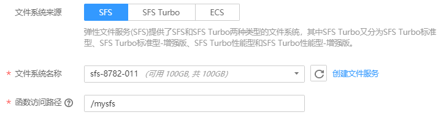
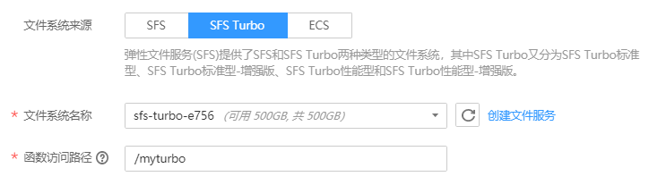
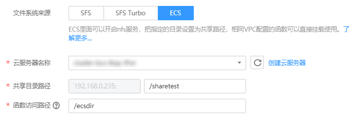

# 挂载文件系统

## 场景介绍

文件系统挂载功能为函数提供了按需扩展的文件存储，可为多个函数、多个实例提供共享访问，函数可以像访问本地文件系统一样对这些共享文件进行读写等操作。您只需要在函数上进行相关配置，如对应的文件系统，函数访问路径等信息。

目前FunctionGraph函数支持三种文件系统配置。

-   SFS文件系统

    弹性文件服务（Scalable File Service，SFS）提供按需扩展的高性能文件存储（NAS），可为云上多个弹性云服务器（Elastic Cloud Server，ECS），容器（CCE&CCI），裸金属服务器（BMS）提供共享访问。SFS为用户提供一个完全托管的共享文件存储，能够弹性伸缩至PB规模，具备高可用性和持久性，为海量数据、高带宽型应用提供有力支持。适用于多种应用场景，包括HPC、媒体处理、文件共享、内容管理和Web服务等。

-   SFS Turbo文件系统

    SFS Turbo分为SFS Turbo标准型、SFS Turbo标准型-增强版、SFS Turbo性能型和SFS Turbo性能型-增强版。SFS Turbo为用户提供一个完全托管的共享文件存储，能够弹性伸缩至320TB规模，具备高可用性和持久性，为海量的小文件、低延迟高IOPS型应用提供有力支持。适用于多种应用场景，包括高性能网站、日志存储、压缩解压、DevOps、企业办公、容器应用等。

-   ECS共享目录

    ECS共享目录是通过nfs服务，把ECS上的指定目录设置为共享文件系统（详情请参考[ECS创建nfs共享目录](ECS创建nfs共享目录.md)），函数（和ECS相同的VPC配置）可以挂载对应目录进行读写等操作，实现计算资源的动态扩展。此类型适合业务不太频繁的场景。

使用文件系统挂载功能具有以下优势：

-   函数执行空间不仅是之前/tmp的512M，可以极大扩展存储空间。
-   多个函数之间可以共享访问已经配置好的文件系统。
-   ECS计算资源动态扩展，利用ECS已有的存储能力实现更大的计算能力。

## 创建委托

为函数添加文件系统配置需要先给函数设置相关服务的委托。

创建委托时，委托类型选择云服务，云服务选择FunctionGraph，因为委托数目有限，而且目前界面上不支持修改，建议可以创建一个权限较大的委托（Tenant Adminitrator），可以支持在函数中操作当前区域内的所有资源，请参考[创建委托](创建委托.md)。

## 添加sfs文件系统

**设置委托**

进入需要进行挂载配置的函数详情页，在配置页选择已有的委托（委托需要拥有当前Region的sfs administrator或者是tenant administrator的权限）。

如果没有委托，需要创建新委托，创建完后回到此界面选择。

**添加挂载配置**

在函数详情页单击“挂载文件系统”页签，单击“添加挂载”，如果当前没有添加过文件系统配置，那么需要设置一下用户ID和组ID。

用户ID和组ID分别对应Linux系统中的uid和gid，作为函数在运行中访问文件系统的身份。

如果已经在云上的服务器挂载过sfs，有一个目录的属主是test-user，那么就可以用id test-user命令查询对应的uid和gid。

**图 1**  设置用户ID和用户组ID  

接下来要选择需要挂载的sfs文件系统，然后设置在函数中访问的目录，如下图所示：

**图 2**  添加挂载-sfs  

其中函数访问路径最多设置为两级，推荐以/mnt或者/home开头。

## 添加sfs turbo文件系统

**设置委托**

挂载sfs turbo文件系统需要给函数设置委托（至少拥有sfs administrator以及VPC adminstrator权限）。如果没有对应权限的委托，需要新创建。

**设置VPC**

sfs turbo涉及VPC内部网络访问，添加sfs turbo文件系统前需要给函数配置sfs turbo对应的VPC。

1.  在弹性文件服务中，获取需要挂载的文件系统的VPC和子网信息，具体操作请参考[管理文件系统](https://support.huaweicloud.com/usermanual-sfs/sfs_01_0034.html)。
2.  在FunctionGraph控制台的“配置”页签，开启VPC访问，输入[1](#li152661816111216)中获取的VPC和子网。

    **图 3**  设置VPC和子网  
    

**添加挂载-SFS Turbo**

添加sfs turbo和添加sfs过程相似，只要选好需要挂载的文件系统，设置好函数访问路径即可。

**图 4**  添加挂载-sfs turbo  

## 添加ECS共享目录

**添加委托**

挂载ECS共享目录需要给函数设置委托（至少拥有tenant guest以及VPC adminstrator权限），如果没有对应权限的委托，需要新创建。

**配置VPC**

添加ECS共享目录前，也需要给函数配置ECS对应的VPC，可以到ECS详情页的“基本信息”页签中查看“虚拟私有云”。单击虚拟私有云名称，进入虚拟私有云的详情页，查看子网。

获取到这两个信息后，可以在函数配置中配置对应的VPC。

**添加挂载-ECS**

需要在界面上输入ECS上的共享目录路径信息和函数访问路径，如下图所示。

**图 5**  添加ECS共享目录  

## 后续操作

当函数挂载了文件系统配置后，对函数访问路径的读写就相当于对相关文件系统的读写。

如果把日志路径配置为函数访问路径的子目录，就可以轻松实现函数日志的持久化。

可以参考使用函数统计web服务器访问情况（应用模板），对运行在云上的服务器进行日志分析。

**图 6**  函数模板  

