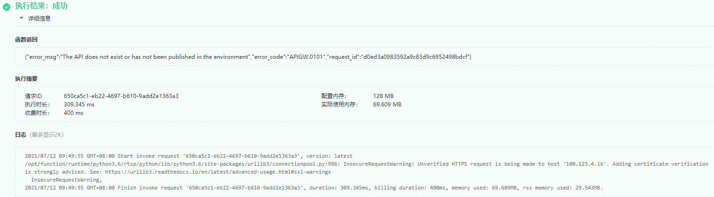
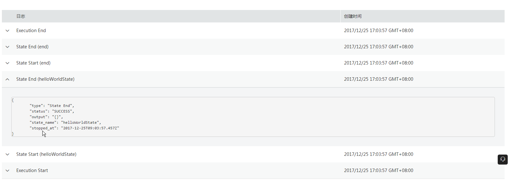

# 日志

FunctionGraph函数实现了与云日志服务的对接，用户无需任何配置，即可查询函数日志信息。

## 函数日志信息

在FunctionGraph函数控制台，可以通过以下两种方式查看函数日志。

-   在测试页签查看日志

    函数创建完成后，可以测试函数，在执行结果页，可以查看函数测试日志，如[图1](#fig20915128019)所示。操作步骤请参考[测试管理](测试管理.md)。

    此处最多显示4K字节日志，如果日志太多，可以去函数详情页日志页签查询日志。

    **图 1**  函数测试日志  
    

-   在日志页签查看日志

    在函数详情页日志页签，可以查询所有的日志信息，还可以查询日志的上下文信息，如[图2](#fig1879914368134)所示。操作步骤请参考[查询日志](函数监控.md#section1358342733911)。

    **图 2**  日志  
    

## 日志下载

日志支持下载，选择版本和时间范围，单击“下载”即可下载该时间范围内的所有日志。

> **说明：**   
>一次最多只能下载5000条日志，请合理选择时间范围，避免下载的日志缺失。  

## 工作流实例日志

在工作流实例详情页，可以查看工作流实例的日志，如图[图3](#fig18628155613328)。

**图 3**  函数工作流实例日志  

