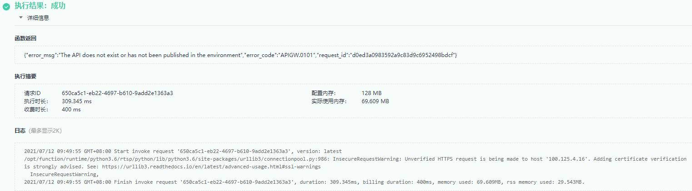
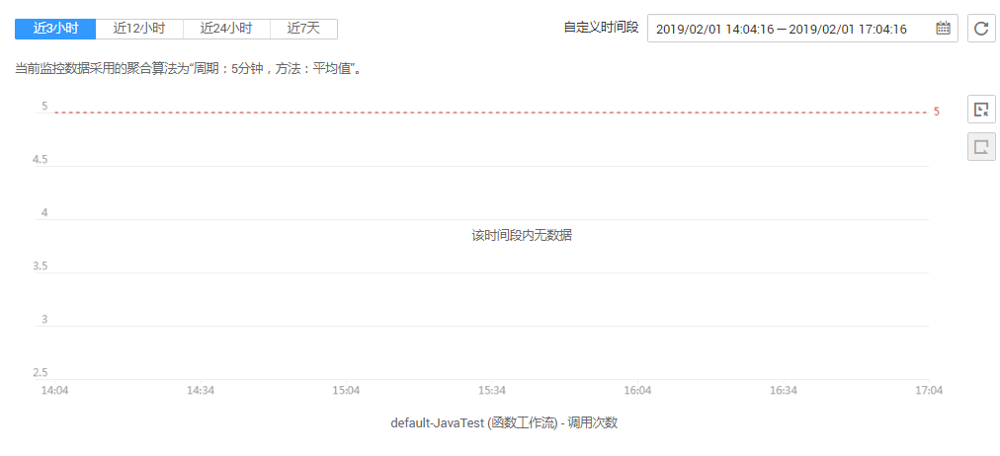

# 日志与监控

FunctionGraph函数实现了与云日志服务、云监控服务对接，用户无需任何配置，即可查询函数日志信息和监控信息。

## 函数日志信息

在FunctionGraph函数控制台，可以通过以下两种方式查看函数日志。

-   在测试页签查看日志

    函数创建完成后，可以测试函数，在执行结果页，可以查看函数测试日志，如[图1](#fig20915128019)所示。操作步骤请参考[测试管理](测试管理.md)。

    此处最多显示4K字节日志，如果日志太多，可以去函数详情页日志页签查询日志。

    **图 1**  函数测试日志  
    

-   在日志页签查看日志

    在函数详情页日志页签，可以查询所有的日志信息，还可以查询日志的上下文信息，如[图2](#fig1879914368134)所示。操作步骤请参考[查询日志](函数监控.md#section1358342733911)。

    **图 2**  日志  
    

## 日志下载

日志支持下载，选择时间范围，点击“下载”即可下载该时间范围内的所有日志。

> **说明：**   
>一次最多只能下载5000条日志，所以请合理选择时间范围，避免下载的日志缺失。  

## 函数监控信息

可以查看租户所有函数及单个函数的监控信息。

-   租户监控信息

    在总览界面，可以查看租户所有函数的监控信息，监控指标包括调用次数、运行时间（包括最大运行时间、最小运行时间、平均运行时间）、错误次数、被拒绝次数，如[图3](#fig44304183715)所示，详情请参考[总览](总览.md)。

    **图 3**  租户监控信息  
    

-   函数监控信息

    不同版本函数的监控信息做了区分，查询函数指标之前设置函数版本，可以查询不同版本对应的监控信息。

    在函数详情页“函数指标”页签，可以查看监控信息，监控指标包括调用次数、运行时间（包括最大运行时间、最小运行时间、平均运行时间）、错误次数、被拒绝次数，如[图4](#fig179401719161011)所示，详情请参考[监控函数](函数监控.md#section10908414121714)。

    **图 4**  函数指标  
    

    -   创建告警规则

    通过创建告警规则，函数上报云监控服务的监控指标。

    在函数详情页“函数指标”页签，单击“创建告警规则”，输入监控指标及策略等，然后点击“查看监控图表”，在云监控服务界面查看函数的监控指标，如[图5](#fig18767526123712)所示。

    **图 5**  查看监控图表  
    

## 工作流实例日志

在工作流实例详情页，可以查看工作流实例的日志，如图[图6](#fig18628155613328)。

**图 6**  函数工作流实例日志  

## 工作流监控信息

FunctionGraph实现了与华为云监控服务的对接，可以实时监控函数和工作流执行信息，详情请参考[函数监控](函数监控.md)和[工作流监控](工作流监控.md)。

