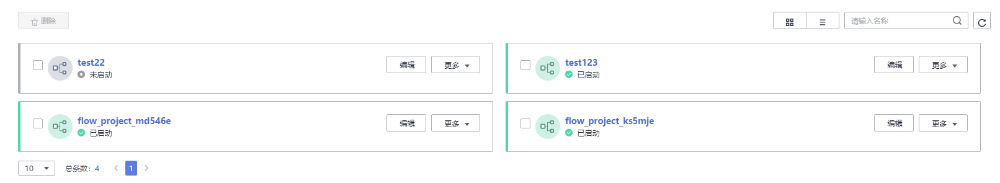
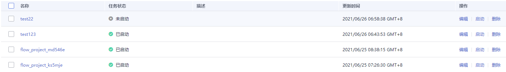

# 查看函数流任务

任务详情主要展示了函数流任务的基本信息、运行记录。

## 前提条件

函数流任务已创建且启动。

## 操作步骤

1.  登录FunctionGraph控制台，进入“函数流”界面。
2.  在函数流页面，支持通过页面右上角按钮设置函数流任务卡片显示和列表显示。

    **图 1**  页面右上角按钮  
    

    -   卡片显示

        **图 2**  卡片显示  
        

    -   列表显示

        **图 3**  列表显示  
        

3.  在函数流页面，可以查看所有已创建的函数流任务，您可以执行如[表1](#table6423167724)中的管理操作。

    **表 1**  操作说明

    
    <table><thead align="left"><tr id="row1142310712215"><th class="cellrowborder" valign="top" width="48.209999999999994%" id="mcps1.2.3.1.1">
操作项

    </th>
    <th class="cellrowborder" valign="top" width="51.790000000000006%" id="mcps1.2.3.1.2">
说明

    </th>
    </tr>
    </thead>
    <tbody><tr id="row74231573219"><td class="cellrowborder" valign="top" width="48.209999999999994%" headers="mcps1.2.3.1.1 ">
编辑

    </td>
    <td class="cellrowborder" valign="top" width="51.790000000000006%" headers="mcps1.2.3.1.2 ">
在函数流任务卡片中，单击“编辑”，进入函数流编辑页面，更新修改函数流任务信息。

    </td>
    </tr>
    <tr id="row126801356415"><td class="cellrowborder" valign="top" width="48.209999999999994%" headers="mcps1.2.3.1.1 ">
启动

    </td>
    <td class="cellrowborder" valign="top" width="51.790000000000006%" headers="mcps1.2.3.1.2 ">
在函数流任务卡片中，单击“更多 &gt; 启动”该函数流任务。

    </td>
    </tr>
    <tr id="row11994201317410"><td class="cellrowborder" valign="top" width="48.209999999999994%" headers="mcps1.2.3.1.1 ">
删除

    </td>
    <td class="cellrowborder" valign="top" width="51.790000000000006%" headers="mcps1.2.3.1.2 "><ul id="ul136646434127"><li>支持单个删除任务：在函数流任务卡片中，单击“更多 &gt; 删除”该函数流任务。</li><li>批量删除任务：勾选多个函数流任务，单击左上角的删除按钮，删除所选函数流任务。</li></ul>
    </td>
    </tr>
    </tbody>
    </table>

4.  单击某一个函数流任务名称，查看任务详情。
    -   查看任务基本信息

        在“基本信息”页签，查看任务名称、ID、更新时间和创建时间等信息。

    -   查看任务运行记录

        在“运行记录”页签，查看任务的执行历史记录、输入值、输出值、节点日志等信息。

        若需要修改任务信息，单击右上角的函数流设计，进入函数流编辑页面，更新修改任务。

