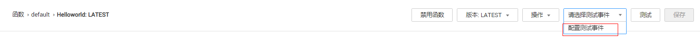
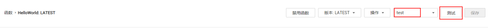
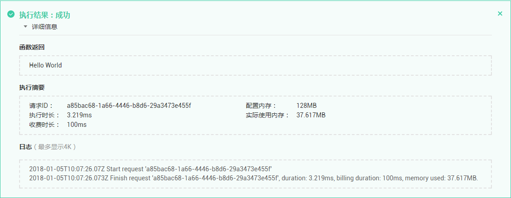

# 测试管理

## 注意事项

事件数据作为event参数传入入口函数，配置后保存可以持久化，以便下次测试使用。每个函数最多可配置10个测试事件。

## 创建测试事件

1.  用户登录FunctionGraph控制台，进入“函数”界面。
2.  选择“函数列表”，单击函数名称，进入函数详情界面。
3.  在函数详情页，选择函数版本，单击“请选择测试事件\>配置测试事件”，如[图1](#fig29004412344)所示，弹出“配置测试事件”页。

    **图 1**  配置测试事件  
    

4.  在“配置测试事件”界面填写测试信息，如[表1](#table187784018405)所示，带\*参数为必填项。

    **表 1**  测试信息

    
    <table><thead align="left"><tr id="row3778200154019"><th class="cellrowborder" valign="top" width="28.000000000000004%" id="mcps1.2.3.1.1">
参数

    </th>
    <th class="cellrowborder" valign="top" width="72%" id="mcps1.2.3.1.2">
说明

    </th>
    </tr>
    </thead>
    <tbody><tr id="row578616044017"><td class="cellrowborder" valign="top" width="28.000000000000004%" headers="mcps1.2.3.1.1 ">
请配置测试事件

    </td>
    <td class="cellrowborder" valign="top" width="72%" headers="mcps1.2.3.1.2 ">
可创建新的测试事件也可编辑已有的测试事件。

    
默认值为：“创建新的测试事件”。

    </td>
    </tr>
    <tr id="row2786110174012"><td class="cellrowborder" valign="top" width="28.000000000000004%" headers="mcps1.2.3.1.1 ">
事件模板

    </td>
    <td class="cellrowborder" valign="top" width="72%" headers="mcps1.2.3.1.2 ">
使用空白模板需要编辑测试事件。

    
使用已有模板会自动加载相对应的测试事件，事件模板说明如<a href="#table962582016058">表2</a>所示。

    
OBS模板obs-event-template可以模拟OBS事件，触发函数。

    </td>
    </tr>
    <tr id="row37861105408"><td class="cellrowborder" valign="top" width="28.000000000000004%" headers="mcps1.2.3.1.1 ">
*事件名称

    </td>
    <td class="cellrowborder" valign="top" width="72%" headers="mcps1.2.3.1.2 ">
事件名称必须仅包含字母和数字，且最大长度为 25 个字符。

    </td>
    </tr>
    <tr id="row1773914911554"><td class="cellrowborder" valign="top" width="28.000000000000004%" headers="mcps1.2.3.1.1 ">
测试事件

    </td>
    <td class="cellrowborder" valign="top" width="72%" headers="mcps1.2.3.1.2 ">
输入测试事件。

    </td>
    </tr>
    </tbody>
    </table>

    **表 2**  事件模板说明

    
    <table><thead align="left"><tr id="row4818099716058"><th class="cellrowborder" valign="top" width="50%" id="mcps1.2.3.1.1">
模板名称

    </th>
    <th class="cellrowborder" valign="top" width="50%" id="mcps1.2.3.1.2">
模板说明

    </th>
    </tr>
    </thead>
    <tbody><tr id="row1354153374519"><td class="cellrowborder" valign="top" width="50%" headers="mcps1.2.3.1.1 ">
空白模板

    </td>
    <td class="cellrowborder" valign="top" width="50%" headers="mcps1.2.3.1.2 ">
模板事件为：{"key": "value"}，可以根据需要修改。

    </td>
    </tr>
    <tr id="row3767595916058"><td class="cellrowborder" valign="top" width="50%" headers="mcps1.2.3.1.1 ">
apig-event-template

    </td>
    <td class="cellrowborder" valign="top" width="50%" headers="mcps1.2.3.1.2 ">
模拟APIG事件，触发函数。

    </td>
    </tr>
    <tr id="row179508316058"><td class="cellrowborder" valign="top" width="50%" headers="mcps1.2.3.1.1 ">
dms-event-template

    </td>
    <td class="cellrowborder" valign="top" width="50%" headers="mcps1.2.3.1.2 ">
模拟DMS事件，触发函数。

    </td>
    </tr>
    <tr id="row3300698116058"><td class="cellrowborder" valign="top" width="50%" headers="mcps1.2.3.1.1 ">
dis-event-template

    </td>
    <td class="cellrowborder" valign="top" width="50%" headers="mcps1.2.3.1.2 ">
模拟DIS事件，触发函数。

    </td>
    </tr>
    <tr id="row5359289616058"><td class="cellrowborder" valign="top" width="50%" headers="mcps1.2.3.1.1 ">
smn-event-template

    </td>
    <td class="cellrowborder" valign="top" width="50%" headers="mcps1.2.3.1.2 ">
模拟SMN事件，触发函数。

    </td>
    </tr>
    <tr id="row10990193810448"><td class="cellrowborder" valign="top" width="50%" headers="mcps1.2.3.1.1 ">
obs-event-template

    </td>
    <td class="cellrowborder" valign="top" width="50%" headers="mcps1.2.3.1.2 ">
模拟OBS事件，触发函数。

    </td>
    </tr>
    <tr id="row2134461016058"><td class="cellrowborder" valign="top" width="50%" headers="mcps1.2.3.1.1 ">
timer-event-template

    </td>
    <td class="cellrowborder" valign="top" width="50%" headers="mcps1.2.3.1.2 ">
模拟TIMER事件，触发函数。

    </td>
    </tr>
    <tr id="row52405810368"><td class="cellrowborder" valign="top" width="50%" headers="mcps1.2.3.1.1 ">
lts-event-template

    </td>
    <td class="cellrowborder" valign="top" width="50%" headers="mcps1.2.3.1.2 ">
模拟LTS事件，触发函数。

    </td>
    </tr>
    <tr id="row169556461765"><td class="cellrowborder" valign="top" width="50%" headers="mcps1.2.3.1.1 ">
cts-event-template

    </td>
    <td class="cellrowborder" valign="top" width="50%" headers="mcps1.2.3.1.2 ">
模拟CTS事件，触发函数。

    </td>
    </tr>
    <tr id="row465631911120"><td class="cellrowborder" valign="top" width="50%" headers="mcps1.2.3.1.1 ">
dds-event-template

    </td>
    <td class="cellrowborder" valign="top" width="50%" headers="mcps1.2.3.1.2 ">
模拟DDS事件，触发函数。

    </td>
    </tr>
    <tr id="row1556053251611"><td class="cellrowborder" valign="top" width="50%" headers="mcps1.2.3.1.1 ">
kafka-event-template

    </td>
    <td class="cellrowborder" valign="top" width="50%" headers="mcps1.2.3.1.2 ">
模拟Kafka事件，触发函数。

    </td>
    </tr>
    <tr id="row016145813126"><td class="cellrowborder" valign="top" width="50%" headers="mcps1.2.3.1.1 ">
login-security-template

    </td>
    <td class="cellrowborder" valign="top" width="50%" headers="mcps1.2.3.1.2 ">
可以作为“登录安全实时分析”函数模板的输入。

    </td>
    </tr>
    <tr id="row4660180154512"><td class="cellrowborder" valign="top" width="50%" headers="mcps1.2.3.1.1 ">
porn-image-analyse

    </td>
    <td class="cellrowborder" valign="top" width="50%" headers="mcps1.2.3.1.2 ">
可以作为“图片鉴黄（Node.js 6.10-APIG）”函数模板的输入。

    </td>
    </tr>
    <tr id="row17660404459"><td class="cellrowborder" valign="top" width="50%" headers="mcps1.2.3.1.1 ">
voice-analyse

    </td>
    <td class="cellrowborder" valign="top" width="50%" headers="mcps1.2.3.1.2 ">
可以作为“语音识别”函数模板的输入。

    </td>
    </tr>
    <tr id="row08334594512"><td class="cellrowborder" valign="top" width="50%" headers="mcps1.2.3.1.1 ">
image-tag

    </td>
    <td class="cellrowborder" valign="top" width="50%" headers="mcps1.2.3.1.2 ">
可以作为“实时图片分类（按图片内容）”、图片鉴黄（Node.js 6.10-OBS）等函数模板的输入。

    </td>
    </tr>
    </tbody>
    </table>

5.  单击“保存”，完成测试事件创建。

## 测试函数

函数创建以后，可以在线测试函数能否正常运行，验证能否实现预期功能。

1.  用户登录FunctionGraph控制台，进入“函数”界面。
2.  选择“函数列表”，单击函数名称，进入函数详情界面。
3.  在函数详情页，选择函数版本，选择测试事件，单击“测试”。

    **图 2**  测试  
    

4.  单击“测试”，可以得到函数运行结果，如[图3](#fig15201050182918)所示。

    **图 3**  函数测试结果  
    

    > **说明：**   
    >“日志”页签最多显示4K日志，如需查看完整日志，请参考[查询日志](函数监控.md#section1358342733911)的操作。  

## 修改测试事件

1.  用户登录FunctionGraph控制台，进入“函数”界面。
2.  选择“函数列表”，单击函数名称，进入函数详情界面。
3.  在函数详情页，选择函数版本，单击“请选择测试事件 \> 请配置测试事件”，弹出“配置测试事件”页。
4.  在“配置测试事件”界面修改测试信息，如[表3](#table182575018295)所示。

    **表 3**  测试信息

    
    <table><thead align="left"><tr id="row425165019291"><th class="cellrowborder" valign="top" width="28.000000000000004%" id="mcps1.2.3.1.1">
参数

    </th>
    <th class="cellrowborder" valign="top" width="72%" id="mcps1.2.3.1.2">
说明

    </th>
    </tr>
    </thead>
    <tbody><tr id="row1725350112914"><td class="cellrowborder" valign="top" width="28.000000000000004%" headers="mcps1.2.3.1.1 ">
请配置测试事件

    </td>
    <td class="cellrowborder" valign="top" width="72%" headers="mcps1.2.3.1.2 ">
选择“编辑已有的测试事件”。

    </td>
    </tr>
    <tr id="row72535092911"><td class="cellrowborder" valign="top" width="28.000000000000004%" headers="mcps1.2.3.1.1 ">
已保存测试事件

    </td>
    <td class="cellrowborder" valign="top" width="72%" headers="mcps1.2.3.1.2 ">
选择需要修改的测试事件。

    </td>
    </tr>
    <tr id="row162695019294"><td class="cellrowborder" valign="top" width="28.000000000000004%" headers="mcps1.2.3.1.1 ">
测试事件

    </td>
    <td class="cellrowborder" valign="top" width="72%" headers="mcps1.2.3.1.2 ">
修改测试事件代码。

    </td>
    </tr>
    </tbody>
    </table>

5.  单击“保存”，完成配置修改。

## 删除测试事件

1.  用户登录FunctionGraph控制台，进入“函数”界面。
2.  选择“函数列表”，单击函数名称，进入函数详情界面。
3.  在函数详情页，选择函数版本，单击“请选择测试事件 \> 请配置测试事件”，弹出“配置测试事件”页。
4.  在“配置测试事件”界面选择测试信息，如[表4](#table18291350112916)所示。

    **表 4**  测试信息

    
    <table><thead align="left"><tr id="row72945052910"><th class="cellrowborder" valign="top" width="28.000000000000004%" id="mcps1.2.3.1.1">
参数

    </th>
    <th class="cellrowborder" valign="top" width="72%" id="mcps1.2.3.1.2">
说明

    </th>
    </tr>
    </thead>
    <tbody><tr id="row430105092910"><td class="cellrowborder" valign="top" width="28.000000000000004%" headers="mcps1.2.3.1.1 ">
请配置测试事件

    </td>
    <td class="cellrowborder" valign="top" width="72%" headers="mcps1.2.3.1.2 ">
选择“编辑已有的测试事件”。

    </td>
    </tr>
    <tr id="row1530165013297"><td class="cellrowborder" valign="top" width="28.000000000000004%" headers="mcps1.2.3.1.1 ">
已保存测试事件

    </td>
    <td class="cellrowborder" valign="top" width="72%" headers="mcps1.2.3.1.2 ">
选择需要删除的测试事件。

    </td>
    </tr>
    </tbody>
    </table>

5.  单击“删除”，完成配置删除。

