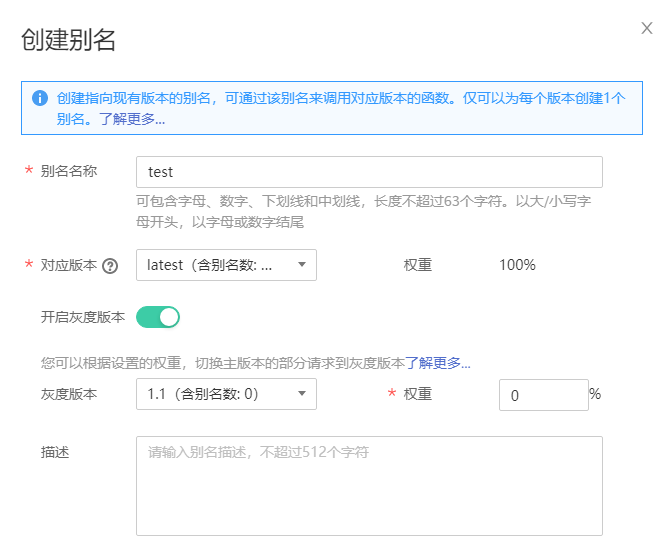

# 版本管理

## 管理版本

函数创建以后，默认版本为LATEST版本，每个函数都有一个LATEST版本。函数代码稳定后可以进行发布操作，一旦发布版本就不允许对该版本的信息（包括metadata以及函数代码）进行修改。

**发布版本**

1.  登录FunctionGraph控制台，在左侧导航栏选择“函数 \> 函数列表”，进入函数列表界面。
2.  单击函数名称，进入函数详情界面。
3.  选择LATEST版本，单击“操作 \> 发布新版本”，弹出“发布新版本”对话框。
4.  输入以下信息。
    -   版本号：您自定义的版本号，用于区分不同的版本。当您未设置时，系统以时间生成版本号，例如：v20170819-190658。
    -   描述：对于版本的描述信息，可以不填。

5.  单击“发布”，系统自动完成版本发布，并生成版本号。

    > **说明：**   
    >单个函数最多可以发布10个版本。  

**删除版本**

1.  登录FunctionGraph控制台，在左侧导航栏选择“函数 \> 函数列表”，进入函数列表界面。
2.  单击函数名称，进入函数详情界面。
3.  选择需要删除的函数版本，单击“操作 \> 删除版本”，弹出“删除版本”对话框。

    > **说明：**   
    >-   LATEST版本不能删除。  
    >-   如果函数版本关联了别名，则删除版本时会把关联的别名删除。  

4.  输入“DELETE”，单击“确定”，删除函数版本。

    > **警告：**   
    >删除操作无法恢复，请谨慎操作。  

## 管理别名

别名指向特定的函数版本，可通过别名来调用该版本的函数。

**创建别名**

1.  登录FunctionGraph控制台，在左侧导航栏选择“函数 \> 函数列表”，进入函数列表界面。
2.  单击函数名称，进入函数详情界面。
3.  通过以下任意一种方式，进入“创建别名”对话框。
    -   单击“操作 \> 创建别名”，弹出“创建别名”对话框。
    -   在“别名配置”页签，单击“创建别名”，弹出“创建别名”对话框。

4.  设置以下信息。

    -   别名名称：您自定义的别名名称，用于区分不同的别名。
    -   对应版本：选择需要关联的版本。
    -   开启灰度版本：选择是否开启灰度版本，开启灰度版本后，一个别名可以同时关联两个版本，根据设置的权重比例，函数切换部分主版本的请求到灰度版本运行。
    -   灰度版本：选择需要关联的灰度版本。
    -   权重：为灰度版本设置权重。
    -   描述：对于别名的描述信息。

    **图 1**  发布灰度版本  
    

5.  单击“确定”，完成别名的创建。

    > **说明：**   
    >单个函数最多可以创建10个别名。  

**修改别名**

1.  登录FunctionGraph控制台，在左侧导航栏选择“函数 \> 函数列表”，进入函数列表界面。
2.  单击函数名称，进入函数详情界面。
3.  选择需要修改别名的函数版本，单击“别名配置”，进入“别名配置”页签。
4.  在需要修改的别名所在行，单击“编辑”，修改别名信息。
5.  单击“确定”，完成函数别名修改。

**删除别名**

通过以下任意一种方法，删除别名。

方法一：

1.  登录FunctionGraph控制台，在左侧导航栏选择“函数 \> 函数列表”，进入函数列表界面。
2.  单击函数名称，进入函数详情界面。
3.  选择需要删除的别名，单击“操作 \> 删除别名”，弹出“删除别名”对话框。
4.  输入“DELETE”，单击“确定”，完成别名的删除。

方法二：

1.  登录FunctionGraph控制台，在左侧导航栏选择“函数 \> 函数列表”，进入函数列表界面。
2.  单击函数名称，进入函数详情界面。
3.  选择需要删除别名的版本号，单击“别名配置”，进入“别名配置”页签。
4.  在需要删除的别名所在行，单击“删除”，弹出“删除别名”对话框。
5.  输入“DELETE”，单击“确定”，完成别名的删除。

